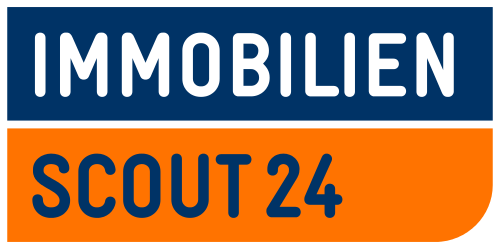
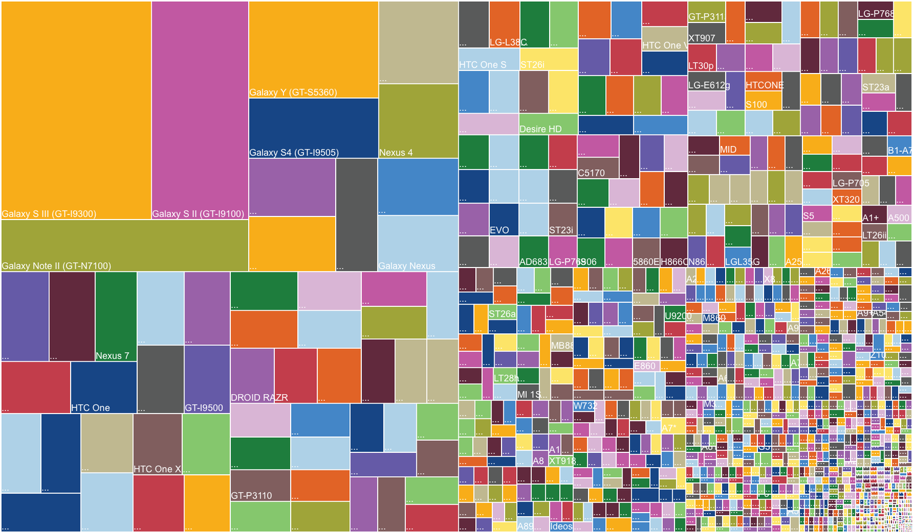
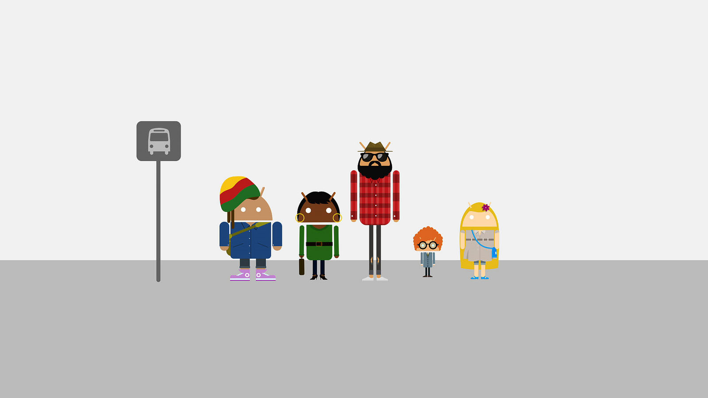

footer: ashdavies.io | scout24.com

# The Next Challenges for the EU Mobile Economy
## The Highs and Lows of Developing for a Digital Europe

---

^
Introduction

---

^
- At Scout we want to be there for the important decisions in life
- Buying a house, buying a car, finding a job, or taking a holiday
- Particularly real estate, from searching to moving.

---

# Developing for a digital Europe

^
Why has the European mobile economy become such a powerful industry driver?
- Use of inventive service based business models (Cloud, SAAS)
- My job didn’t exist ten years ago, but now part of a thriving community
- Easy and cost effective access for new developers and companies
- Boom of new service start-ups in technology capitals, etc. Berlin, Paris, London

---

# What are the challenges for developers?

^
- Simple features like location, or distribution needed multiple solutions
- Having to target different device platforms with unique caveats
- Web frameworks not able to provide native performance
- Cost implications of additional development costs

---

# [fit] How has the Android Platform Contributed?

^
- Android was unveiled in 2007 as a free, open-source mobile operating system
- Android needed to be scaled across a variety of manufacturers
- Open platform allows for innovation and ease of compliance
- Cost of development had been dramatically reduced
- Existing, and struggling vendors given a safe, secure platform to use
- Developers can write an app that works on over a billion different devices

---

# Why is (some) fragmentation important?

^
- Allowing manufacturers to influence the end product enables innovation
- Lack of any fragmentation results in anti-competitive and uninventive practices

---

### Ten years ago...

^
- Very little difference between the two devices besides the omission of YouTube

---

# The Next Challenges...

^
- Modern fragmentation is difference in OS versions, no longer difference in platforms
- Keeping devices up-to-date with the latest security updates (Project Treble)
- Android has progressed in leaps and bounds (Support library)
- Myriad of development tools to aid developers (Firebase)
- Increased diversity due to community and training programs

---

[.footer: Images Copyright of their respective owners.]

# Thank You

ashdavies.io
scout24.com
