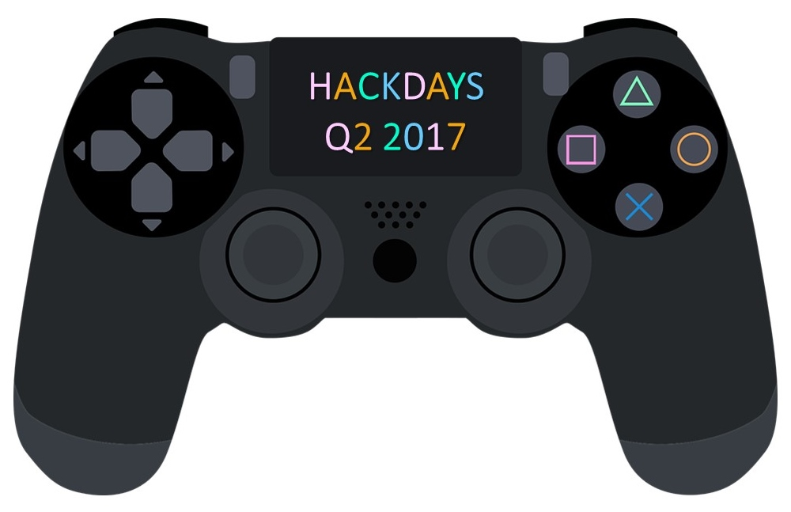
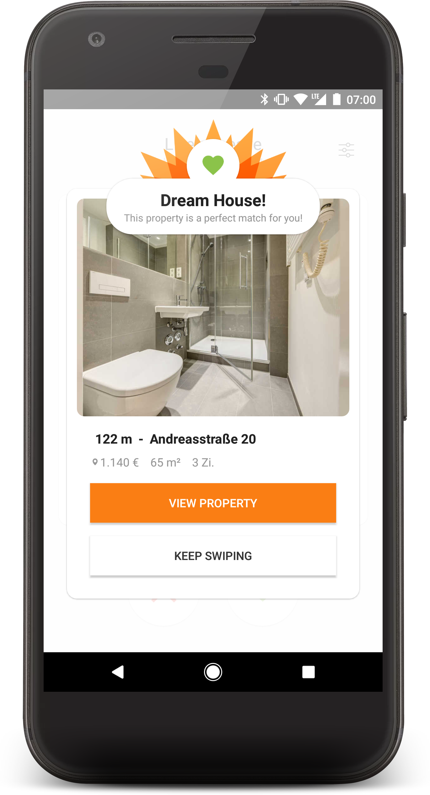
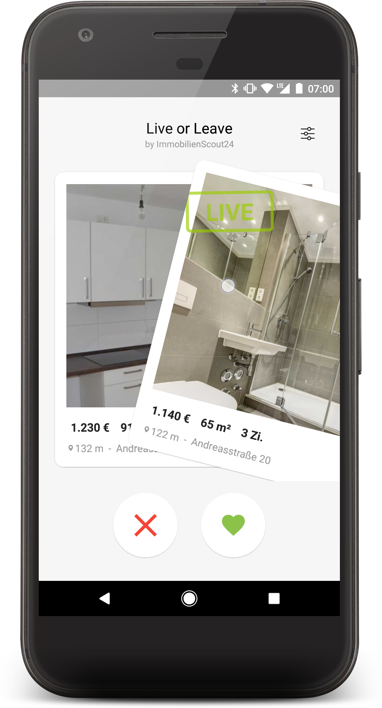
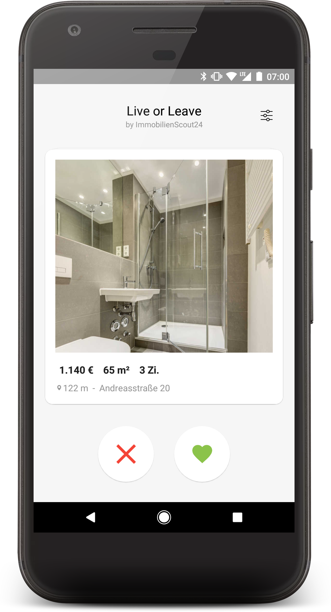
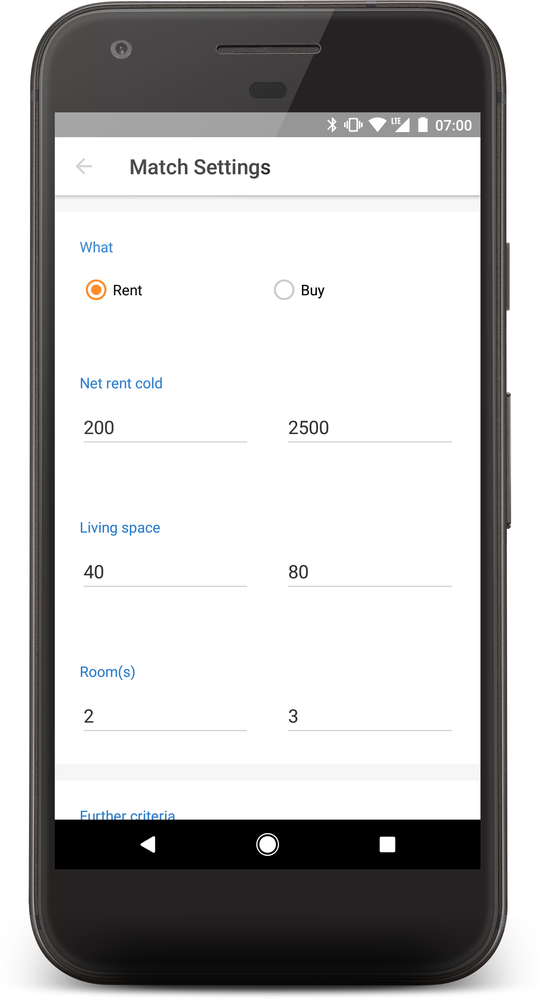
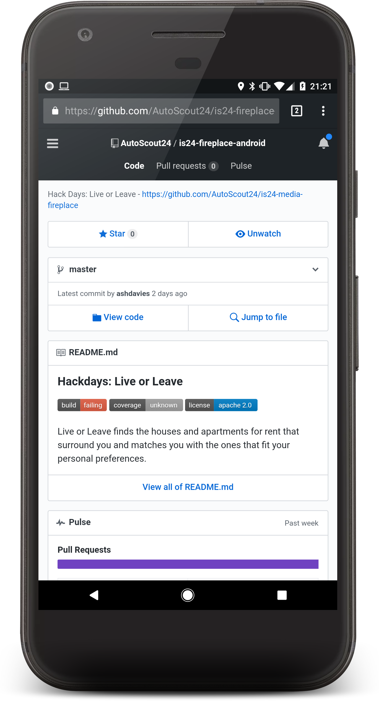

## Live or Leave

---

# HackDays: Gaming

^ Started at the hackdays gaming session
- We wanted to create a gamified real estate experience

---

# Tinder for 
# Real Estate

^ or as it became known as Tinder for real estate

---

^ Here's a video we prepared for the presentation

---

# Hack to the Future

^ After having so much fun with the idea we chose to continue with it
- and try and evolve it a little with more features and a cleaner UI

---

^ The second iteteration brough some design improvements
- and a revisited settings screen, your matches would 
- be as a result of these settings

---

# Demo Time!

---

---

# Outlook

- Feature parity iOS Release
- Stability and user experience improvements
- Data analysis and machine learning

---

# Google Play
## Available Now!

### goo.gl/kBQZNF

---

# GitHub
## Totally Open Source!

---

# We :heart: Feedback!

^ Use it, break it, love it, hate it
- We want to know what you think about it
- What features you would enjoy to see in it

---

# We :heart: Social!

^ Tell your friends, families, loved ones, even your enemies!

---

# Thank you!