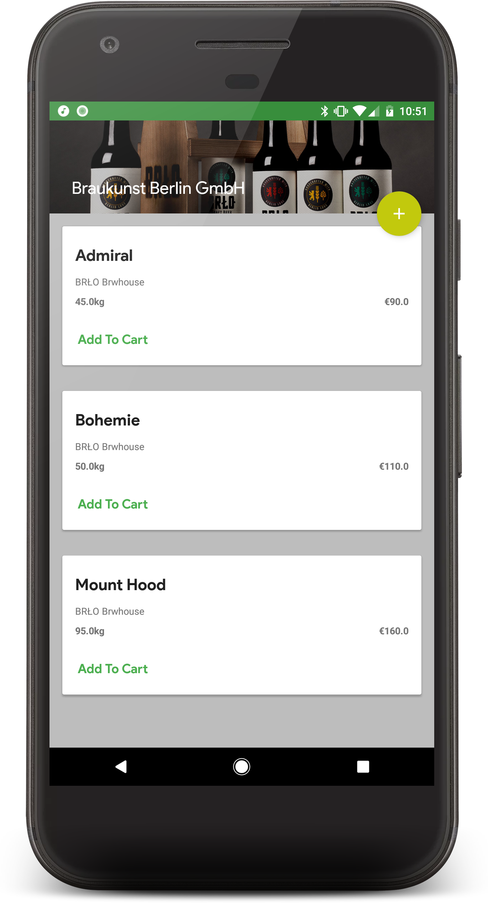
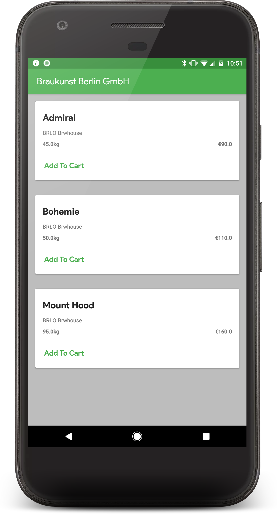

# Sustainability
- Inventory loses its efficacy over time
- Brewers would rather fresh hops and malt
- Seasonal hops are in demand
- High cost of storage and transportation

---

# Accessability
- Expensive purchasing costs for home brewers
- Hard for brewers to enter the market

---

# Solution?
- Distributed, open marketplace for brewers and breweries
- Ease of access for new brewers

---

# Implementation
- Android focused, ios potential
- Untappd API for brewer verification
- Google login also ;)

----

# Technologies
- Kotlin, open source
- Android architecture components
- Firebase realtime database

---

# Screenshots

---

---

---

# Future
- Open platform,
- Hops, Malt, Yeast, Spent Grains, Machinery