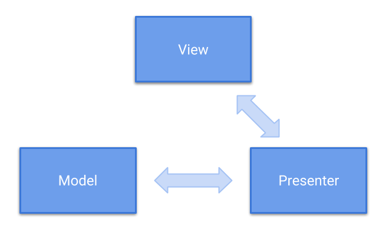

footer: ashdavies.io
autoscale: true


# Leveraging Android Databinding<br /> with Kotlin


^ Speaker introduction.

^ Avatar bemusement.

---

## Me
### 2014


^ Avatar bemusement.

---


## <- Glasshole

^ Cool hat though.

---

## Android Data Binding

^ What is Android Data binding?

^ Support lib binds UI components to data sources declaratively not programmatically.

^ Potentially powerful and complex, used effectively reduces presentation boilerplate.

---

## Data Binding Beta
### 2015

^ Google announced beta release of Android Data Binding.

^ Write declarative layouts, minimise glue code to bind application logic and layouts.

^ Support library can be used with Android 2.1 (API 7).

---

## Data Binding Sample


^ Eager to demonstrate this, I created a sample on GitHub and Google Play Store.

^ Application fetches GitHub repositories for a given user.

^ Received with monumental success.

---

## Data Binding Sample


^ Example of one of the many quality reviews.

^ Application received two, one star ratings.

---

## Data Binding Re-Sample
### github.com/ashdavies/data-binding


^ Updated project demonstrates techniques in this talk

^ Code is open source available on GitHub

---

## Data Binding Re-Sample

- Kotlin Coroutines

^ Coroutines is really enjoyable for asynchronous operations.

---

## Data Binding Re-Sample

- Kotlin Coroutines
- Constraint Layout

^ ConstraintLayout compliments simplicity of effective data binding expressions.

---

## Data Binding Re-Sample

- Kotlin Coroutines
- Constraint Layout
- Architecture Components

^ Data binding works very well with live data and view models.

---

## Data Binding Re-Sample

- Kotlin Coroutines
- Constraint Layout
- Architecture Components
- Moshi Codegen

^ Moshi now compatible with Kotlin data classes

---

## Data Binding Re-Sample

- Kotlin Coroutines
- Constraint Layout
- Architecture Components
- Moshi Codegen
- Blockchain

---

## Data Binding Re-Sample

- Kotlin Coroutines
- Constraint Layout
- Architecture Components
- Moshi Codegen
- Blockchain
- AR / VR


---

## Data Binding Re-Sample

- Kotlin Coroutines
- Constraint Layout
- Architecture Components
- Moshi Codegen
- ~~Blockchain~~
- ~~AR / VR~~  

^ Maybe not those last two.

---

## Setup

^ How can we start working with data binding?

---

## Setup

**build.gradle**

```groovy, [.highlight: 2-4]
android {
  dataBinding {
    enabled = true
  }
}
```

^ Should use the latest AGP version, but supported back to v1.5.0.

^ Annotation processor not necessary, AGP will inject the correct version.

---

## Data Binding v2

^ AGP 3.1.0 includes the new Data binding compiler to generate bindings

---

## Data Binding v2

### Incremental class generation ⚡

^ Incremental class generation to speed up your build times

---

## Data Binding v2

### Incremental class generation ⚡

### Pre-compilation class generation 💪

^ Generates abstract bindings prior to managed compiler build.

^ Classes available even if you bugger up your build.

---

## Setup

**gradle.properties**

```groovy
android.databinding.enableV2=true
```

^ Enabled by default as of AGP 3.2.

^ Include this for versions prior.

^ Binding class not backwards compatible.

---

## The Problem

^ Lets consider the current problem we are trying to solve.


---

## Model-View-Presenter

^ Derived from MVC, separates business logic from presentation.

---



^ Abstracting behaviour layers our application, making business logic testable.

^ Business logic no longer needs Android dependencies.

^ Create interface contract to be fulfilled by concrete implementation.

---

## Presenter


^ Presenter responsible for driving communication between view and model.

^ View becomes passive receiver of model data.

^ Presenter is a good analogy for data binding classes.

^ Update view properties from view state, invokes view event callbacks.

---

## Model-View-Presenter (Java)

```java
public interface RepoView {
  void setInProgress(Boolean inProgress);  
  void setItems(List<Repo> items);
}
```

```java
public interface RepoPresenter {
  void onResume();
  void onDestroy();
}
```

^ Consider simple view presenter interface contract.

^ View interface can display current state to user.

^ Presenter reacts to events, manages presentation.

---

## Model-View-Presenter (Java)

```java
public class RepoPresenterImpl implements RepoPresenter {
  private final RepoService service;
  private @Nullable RepoView view;
  
  RepoPresenterImpl(RepoService service) { /* ... */ }
  
  @Override
  public void onResume() {
    if (view != null) {
      view.setInProgress(true);
      service.fetch((List<Repo> items) -> {
        View copy = view;
        if (copy != null) {
          copy.setItems(items);
          copy.setInProgress(false);
        }
      });
    }
  }
  
  @Override
  public void onDestroy() { /* ... */ }
  
  public void setView(@Nullable RepoView view) { /* ... */ }
}
```

^ No dependencies on Android framework, easy to unit test.

^ Nullability ugly and verbose, we can improve this...

---

## Leveraging Android Data Binding<br /> with Kotlin

---


---

## Data Binding (Kotlin)

```kotlin
class RepoActivity : AppCompatActivity() {

  override fun onCreate(savedInstanceState: Bundle?) {
    super.onCreate(savedInstanceState)
    setContentView(R.layout.activity_repo)
  }

  override fun onResume() {
    super.onResume()
  }
}
```

^ Starting with basic activity

---

## Data Binding (Kotlin)

```kotlin, [.highlight: 3, 8]
class RepoActivity : AppCompatActivity() {

  private lateinit var binding: ActivityRepoBinding

  override fun onCreate(savedInstanceState: Bundle?) {
    super.onCreate(savedInstanceState)

    binding = DataBindingUtil.setContentView(this, R.layout.activity_repo)
  }

  override fun onResume() {
    super.onResume()
  }
}
```

^ Store replaced framework setContentView with data binding util

---

## Data Binding (Kotlin)

```kotlin, [.highlight: 9]
internal class RepoActivity : AppCompatActivity() {

  private lateinit var binding: ActivityRepoBinding

  override fun onCreate(savedInstanceState: Bundle?) {
    super.onCreate(savedInstanceState)

    binding = DataBindingUtil.setContentView(this, R.layout.activity_repo)
    binding.setLifecycleOwner(this)
  }

  override fun onResume() {
    super.onResume()
  }
}
```

^ From AGP 3.1 data binding is lifecycle aware, allowing lifecycle components.

^ Inform binding of lifecycle owner to manage lifecycle subscription.

---

## Data Binding (Kotlin)

```kotlin, [.highlight: 4, 12, 17]
internal class Repoactivity : AppCompatActivity() {

  private lateinit var binding: ActivityRepoBinding
  private lateinit var service: RepoService

  override fun onCreate(savedInstanceState: Bundle?) {
    super.onCreate(savedInstanceState)

    binding = DataBindingUtil.setContentView(this, R.layout.activity_repo)
    binding.setLifecycleOwner(this)

    service = RepoServiceFactory().get()
  }

  override fun onResume() {
    super.onResume()
    service.fetch { binding.items = it }
  }
}
```

^ Finally domain behaviour passes items to view binding

---

## Layout (XML 🤦‍♀️)

```xml
<layout xmlns:android="http://schemas.android.com/apk/res/android"
    xmlns:app="http://schemas.android.com/apk/res-auto">

  <data>

    <variable
        name="items"
        type="java.util.List&lt;io.ashdavies.databinding.Repo&gt;"/>

  </data>

  <androidx.coordinatorlayout.widget.CoordinatorLayout... />
</layout>
```

^ Data binding layouts require variables within data tags

^ Like string resources generic list type requires encoding of HTML entities

---

## Data Binding (Kotlin)

```kotlin
class RepoActivity : AppCompatActivity() {

  private lateinit var binding: ActivityRepoBinding
  private lateinit var service: RepoService

  override fun onCreate(savedInstanceState: Bundle?) {
    super.onCreate(savedInstanceState)

    binding = DataBindingUtil.setContentView(this, R.layout.activity_home)
    binding.setLifecycleOwner(this)

    service = RepoServiceFactory().get()
  }

  override fun onResume() {
    super.onResume()
    service.fetch { binding.items = it }
  }
}
```

^ Not yet an improvement, presentation behaviour contained in activity

^ How can we use Kotlin to improve it.

---

## Delegated Properties

^ Reduce boilerplate property accessors with delegated properties.

^ Create template for getter and setter to reuse elsewhere.

---

## Delegated Properties

```kotlin
val value: String by lazy {
  println("computed!")
  "Hello"
}
```

^ Kotlin Lazy delegate would compute the value once.

^ Delegate indicated with use of "by" keyword.

---

## Delegated Properties

```kotlin
interface ReadOnlyProperty<in R, out T> {
  operator fun getValue(thisRef: R, property: KProperty<*>): T
}

interface ReadWriteProperty<in R, T> {
  operator fun getValue(thisRef: R, property: KProperty<*>): T
  operator fun setValue(thisRef: R, property: KProperty<*>, value: T)
}
```

^ Two interfaces for delegated properties for val and var.

---

## Delegated Properties

```kotlin
class ActivityBindingProperty<out T : ViewDataBinding> : ReadOnlyProperty<Activity, T> {

  override operator fun getValue(thisRef: Activity, property: KProperty<*>): T {
    TODO("not implemented")
  }
}
```

^ Our binding property is an immutable value so we need ReadOnlyProperty.

---

## Delegated Properties

```kotlin, [.highlight: 2, 9-11]
class ActivityBindingProperty<out T : ViewDataBinding>(
  @LayoutRes private val resId: Int
) : ReadOnlyProperty<Activity, T> {

  override operator fun getValue(thisRef: Activity, property: KProperty<*>): T {
    TODO("not implemented")
  }

  private fun createBinding(activity: Activity): T { /* ... */ }
    return DataBindingUtil.setContentView(activity, resId)
  }
}
```

^ Require layout resource identifier to set content view

---

## Delegated Properties

```kotlin, [.highlight: 5, 8]
class ActivityBindingProperty<out T : ViewDataBinding>(
  @LayoutRes private val resId: Int
) : ReadOnlyProperty<Activity, T> {

  private var binding: T? = null

  override operator fun getValue(thisRef: Activity, property: KProperty<*>): T {
    return binding ?: createBinding(thisRef).also { binding = it }
  }

  private fun createBinding(activity: Activity): T {
    return DataBindingUtil.setContentView(activity, resId)
  }
}
```

^ Lazily instantiate the data binding when retrieving value.

---

## ProTip: Extension Function!
### Delegated Properties

```kotlin
fun <T : ViewDataBinding> FragmentActivity.activityBinding(
  @LayoutRes resId: Int
) = ActivityBindingProperty(resId)
```

^ Kotlin property delegates are provided via extension function.

^ Reads nicely when written from receiving class.

---

## Data Binding (Kotlin)

```kotlin, [.highlight: 3, 9]
class RepoActivity : AppCompatActivity() {

  private val binding by activityBinding<ActivityRepoBinding>(R.layout.activity_repo)

  private lateinit var service: RepoService

  override fun onCreate(savedInstanceState: Bundle?) {
    super.onCreate(savedInstanceState)
    binding.setLifecycleOwner(this)

    service = RepoServiceFactory().get()
  }

  override fun onResume() {
    super.onResume()
    service.fetch { binding.items = it }
  }
}
```

^ Binding must be referenced in onCreate otherwise layout will not be inflated.

^ Domain behaviour still not testable.

---

### Introducing
## Android Architecture Components


^ Google announced architecture components last year at Google IO.

^ Announced JetPack this year to quickly build framework applications.

---

## Model-View-ViewModel

^ Not an instruction to migrate application architecture.

^ Suggestion design pattern for fresh projects.

^ Data binding works well with MVVM, view state designed to be observed.

^ Lifecycle aware components react accordingly to presence of owner.

---


^ VM state bound to view by observation.

^ View notifies VM of UI events from user interaction.

^ VM responsible for business logic behaviour.

^ No Android dependencies.

---

## Model-View-ViewModel

```kotlin, [.highlight: 9-11]
class RepoActivity : AppCompatActivity() {

  private val binding by activityBinding<ActivityRepoBinding>(R.layout.activity_repo)

  override fun onCreate(savedInstanceState: Bundle?) {
    super.onCreate(savedInstanceState)
    binding.setLifecycleOwner(this)
  }
}
```

^ Domain behaviour now removed from activity

---

## Model-View-ViewModel

```kotlin, [.highlight: 9-11]
class RepoActivity : AppCompatActivity() {

  private val binding by activityBinding<ActivityRepoBinding>(R.layout.activity_repo)

  override fun onCreate(savedInstanceState: Bundle?) {
    super.onCreate(savedInstanceState)
    
    binding.setLifecycleOwner(this)
    binding.model = ViewModelProviders
        .of(this, RepoViewModelFactory())
        .get(RepoViewModel::class.java)
  }
}
```

^ View model retrieved from AppCompatActivity VM providers.

^ Activity VM store retrieved from non configuration instance in onCreate.

---

## Model-View-ViewModel

```xml, [.highlight: 6-8]
<layout xmlns:android="http://schemas.android.com/apk/res/android"
    xmlns:app="http://schemas.android.com/apk/res-auto">

  <data>

    <variable
        name="model"
        type="io.ashdavies.databinding.RepoViewModel"/>

  </data>

  <androidx.coordinatorlayout.widget.CoordinatorLayout... />
</layout>
```

^ Data binding layout now binds VM.

---

## ProTip: Extension Function!
## Model-View-ViewModel

```kotlin, [.highlight: 5-8]
fun <T : ViewDataBinding> FragmentActivity.activityBinding(@LayoutRes resId: Int) {
  return ActivityBindingProperty(resId)
}

inline fun <reified T : ViewModel> FragmentActivity.getViewModel(
  factory: ViewModelProvider.Factory = ViewModelProvider.NewInstanceFactory()
) = ViewModelProviders.of(this, factory).get(T::class.java)
```

^ Create an extension function to create VM from activity.

^ NewInstanceFactory attempts to invoke no-arg constructor.

---

## Model-View-ViewModel

```kotlin
class RepoActivity : AppCompatActivity() {

  private val binding by activityBinding<ActivityRepoBinding>(R.layout.activity_repo)
  private val model by lazy { getViewModel<RepoViewModel>(RepoViewModelFactory()) }

  override fun onCreate(savedInstanceState: Bundle?) {
    super.onCreate(savedInstanceState)

    binding.setLifecycleOwner(this)
    binding.model = model
  }
}
```

^ Combine with lazy instantiation to trim down activity.

^ Binding and VM created in onCreate function.

---

## ViewModel

```kotlin
class RepoViewModel(service: RepoService) : ViewModel {

  val items: ObservableField<List<String>> = ObservableField()

  init {
    service.fetch(items::set)
  }
}
```

^ 
The data binding library provides classes and methods to easily observe data for changes. You don't have to worry about refreshing the UI when the underlying data source changes. You can make your variables or their properties observable. The library allows you to make objects, fields, or collections observable.

^
Here we're using the observable field class, but the data binding library also provides base classes for many other primitive types if your view model isn't so complex, such as boolean, byte, char, short, int long, float, double and parcelable.

---

## Observable

^
All of these class implement the observable interface, which has a mechanism to add and remove listeners. You can extend from the BaseObservable class, which implements the listener registration mechanisms. But If you have a complex object, you can extend from this interface and decide when notifications are sent, this will become useful a little later.

---

## LiveData Data Binding

^
As mentioned previously as of version 3.1 of the Android gradle plugin, you can use LiveData with your data bindings, the use of LiveData is almost identical to that of the observable, however you have some more advantages that you can use in your code, I won't go too much into detail here, but you can find out more with many of the resources available online.

---

## LiveData Data Binding

**RepoViewModel.kt**

```kotlin, [.highlight: 3]
class RepoViewModel(private val service: RepoService) : ViewModel {

  val items = MutableLiveData<List<String>>()

  init {
    service.fetch(items::setValue)
  }
}
```

^
The behaviour of this is very similar to an observable field, except that it provides your application with all the benefits that come with the architecture components like observing from your lifecycle owner.

^
Here we use the mutable live data so that we can also post and set the value.

---

## ProTip!
### LiveData Data Binding

^
You can create an extension function on ViewModel to instantiate live data objects in a fashion similar to the Kotlin stdlib

---

## LiveData Data Binding

**ViewModel.kt**

```kotlin
fun <T> ViewModel.mutableLiveDataOf() = MutableLiveData<T>()
```

---

## LiveData Data Binding

**RepoViewModel.kt**

```kotlin, [.highlight: 3]
class RepoViewModel(private val service: RepoService) : ViewModel {

  val items = mutableLiveDataOf<List<String>>()

  init {
    service.fetch(items::setValue)
  }
}
```

^
Minor changes like this help make your code more consistent, and readable.

---

## RepoViewModel.kt

```kotlin
class RepoViewModel(private val service: RepoService) : ViewModel {

  val items = mutableLiveDataOf<List<String>>()
  val loading = mutableLiveDataOf<Boolean>()

  init {
    loading.value = true
    service.fetch {
      loading.value = false
      items.value = it
    }
  }
}

```

^
Lets assume a basic asynchronous operation that gets called with the appropriate background and UI threading, and we want to show to the user that the UI is loading.

---

## Layout Expressions

```xml, [.highlight: 6, 14-15]
<layout xmlns:android="http://schemas.android.com/apk/res/android"
    xmlns:app="http://schemas.android.com/apk/res-auto">

  <data>

    <import type="android.view.View"/>

    <variable
        name="model"
        type="io.ashdavies.databinding.RepoViewModel"/>

  </data>

  <ProgressBar...
      android:visibility="@{model.loading ? View.VISIBLE : View.GONE}"/>

</layout>
```

^
We can use data binding to subscribe to the value of loading on the view model, to update the visibility of our progress bar like so, since visibility has one of three possible states, we must tell data binding which two to use in the event of the value being either true or false.

---

## Layout Expressions

```xml, [.highlight: 6]
<layout xmlns:android="http://schemas.android.com/apk/res/android"
    xmlns:app="http://schemas.android.com/apk/res-auto">

  <data>

    <import type="android.view.View"/>

    <variable
        name="model"
        type="io.ashdavies.databinding.RepoViewModel"/>

  </data>

  <ProgressBar...
      android:visibility="@{model.loading ? View.VISIBLE : View.GONE}"/>

</layout>
```

^
Note that we must also import the view type in our data tag so that data binding can recognise the class we're using in the attribute binding.

---

## Layout Expressions

```xml, [.highlight: 14-15]
<layout xmlns:android="http://schemas.android.com/apk/res/android"
    xmlns:app="http://schemas.android.com/apk/res-auto">

  <data>

    <import type="android.view.View"/>

    <variable
        name="model"
        type="io.ashdavies.databinding.RepoViewModel"/>

  </data>

  <TextView...
      android:text="@string/activity_repo_empty"/>

  <ProgressBar...
      android:visibility="@{model.loading ? View.VISIBLE : View.GONE}"/>

</layout>
```

^
Lets say we want to show a message to our user when there are no items to display, how could we achieve this?

---

## Layout Expressions

```xml, [.highlight: 14-16]
<layout xmlns:android="http://schemas.android.com/apk/res/android"
    xmlns:app="http://schemas.android.com/apk/res-auto">

  <data>

    <import type="android.view.View"/>

    <variable
        name="model"
        type="io.ashdavies.databinding.RepoViewModel"/>

  </data>

  <TextView...
      android:text="@string/activity_repo_empty"
      android:visibility="@{model.items.count == 0 ? View.VISIBLE : View.GONE}"/>

  <ProgressBar...
      android:visibility="@{model.loading ? View.VISIBLE : View.GONE}"/>

</layout>
```

^
We can include rudimentary evaluation statements in our data binding statements to check for the properties of classes, such as the number of items in a list.

^
But that wouldn't be enough here, since we'd want to make sure that the empty text isn't shown to the user whilst the view is loading new data.

---

## Layout Expressions

```xml, [.highlight: 14-16]
<layout xmlns:android="http://schemas.android.com/apk/res/android"
    xmlns:app="http://schemas.android.com/apk/res-auto">

  <data>

    <import type="android.view.View"/>

    <variable
        name="model"
        type="io.ashdavies.databinding.RepoViewModel"/>

  </data>

  <TextView...
      android:text="@string/activity_repo_empty"
      android:visibility="@{model.items.count == 0 &amp;&amp; !model.loading ? View.VISIBLE : View.GONE}"/>

  <ProgressBar...
      android:visibility="@{model.loading ? View.VISIBLE : View.GONE}"/>

</layout>
```

^
We'd have to include the statement like so, again we have the issue with including html entities within binding expressions that we need to escape properly, but you can see the obvious problem here.

---

## Complex Layout Expressions

^
As you can see, it's very easy to find ourselves in the midst of overly complex binding statements, polluting our otherwise simple layouts with business logic, making it very difficult to maintain, and test.

^
This can make many developers apprehensive about using data binding, because they believe it can be too easily misused, and whilst this is true, like many toolsets, we can show constraint in using it carefully and effectively.

---

## Single Property Bindings

^
In our example, we saw that we were using multiple properties to build our binding statement, but we should avoid this an prefer to use a single property which can be managed by our view model, making the business behaviour easily testable.

---

```kotlin
class RepoViewModel(private val service: RepoService) {

  val items = mutableLiveDataOf<List<String>>()
  val loading = mutableLiveDataOf<Boolean>()
  val empty = mutableLiveDataOf<Boolean>()

  init {
    loading.value = true
    empty.value = false

    service.fetch {
      loading.value = false
      empty.value = it.isEmpty()

      items.value = it
    }
  }
}
```

^
Whilst you could argue that some of the logic is duplicitous, here we're ensuring that we have a single observable property that tells our view what we want it to do, which we could easily test.

---

```xml, [.highlight: 14-16]
<layout xmlns:android="http://schemas.android.com/apk/res/android"
    xmlns:app="http://schemas.android.com/apk/res-auto">

  <data>

    <import type="android.view.View"/>

    <variable
        name="model"
        type="io.ashdavies.databinding.RepoViewModel"/>

  </data>

  <TextView...
      android:text="@string/activity_repo_empty"
      android:visibility="@{model.empty ? View.VISIBLE : View.GONE}"/>

  <ProgressBar...
      android:visibility="@{model.loading ? View.VISIBLE : View.GONE}"/>

</layout>
```

^
Here we have an immediate improvement, but we've still got a bit of logic going on here that we can clean up.

---

## Simple Properties

^
In most cases, the data binding library will be able to recognise simple properties that match their Java bean access methods, and will automatically look for the correct matching types.

---

## Simple Properties

- `android:text="@{model.name}"`
  - `fun TextView.setText(value: String)`
  - `fun ViewModel.getName(): String`

^
For example, given the android text expression, the library looks for the set text method that accepts the type returned by the view model getName function.

---

## Simple Properties

- `android:text="@{model.name}"`
  - `fun TextView.setText(@StringRes resId: Int)`
  - `@StringRes fun ViewModel.getName(): Int`

^
If the expression returns an int instead, the library searches for a setText method that accepts an int argument. The same applies to set methods where the property doesn't exist, for example, setScrimColor or scrollColor attributes.

---

## `@BindingMethods`

^
When your property attributes do not match by name, you can use the binding methods annotation, or the inverse binding methods annotation for two way binding to indicate to the data binding library what method should be used.

---

## `@BindingAdapter`

^
but you can specify your own additional data binding adapters, to give some additional logic to your binding. The data binding library actually already uses a lot of binding adapters under the hood to help you use both common framework views, and views found in the support library.

---

## `@BindingAdapter`

```kotlin
@BindingAdapter("goneUnless")
fun goneUnless(view: View, visible: Boolean) {
  view.visibility = if (visible) View.VISIBLE else View.GONE
}
```

^
This binding, will allow us to remove the conditional statement from our layouts, with this example, there's much debate as to what to name the parameter, since "visible" ignores the invisible parameter, this one from the data binding documentation respects that.

^
Remember you don't need to declare a namespace for the attribute name if you are not using an android parameter.

---

## ProTip!
### `@BindingAdapter`

^
Binding adapters also work as extension properties, here's an example of a view extension property from the Android KTX library, with the binding adapter annotation applied.

---

## `@BindingAdapter`

```kotlin
@set:BindingAdapter("isVisible")
inline var View.isVisible: Boolean
  get() = visibility == View.VISIBLE
  set(value) {
    visibility = if (value) View.VISIBLE else View.GONE
  }
```

^
This allows us to set the visibility through both data binding and programatically.

---

```xml, [.highlight: 14-16, 18-19]
<layout xmlns:android="http://schemas.android.com/apk/res/android"
    xmlns:app="http://schemas.android.com/apk/res-auto">

  <data>

    <import type="android.view.View"/>

    <variable
        name="model"
        type="io.ashdavies.databinding.RepoViewModel"/>

  </data>

  <TextView...
      android:text="@string/activity_repo_empty"
      app:isVisible="@{model.empty}"/>

  <ProgressBar...
      app:isVisible="@{model.loading}"/>

</layout>
```

^
Much better, now we have really simple data binding expressions.

---

## `@Bindable`

^
Remember earlier, I mentioned that the ObservableField class implements BaseObservable which implements the listener registration mechanisms, well in addition to this you can make use of it directly with the bindable annotation.

^
The bindable annotation can be applied to any getter accessor or property of an observable class, this will result in the data binding library generating a field on the BR class to identify the field.

---

## `@Bindable`

**BR**

```java
public class BR {
  public static final int _all = 0;

  public static final int item = 1;

  public static final int model = 2;

  public static final int empty = 3;
}
```

^
The BR class, acts much like the R class, that is used to identify resources such as strings, identifiers, and layout resources, BR provides references to the binding properties, allowing us to notify the generated binding classes that a property has changed, and that the now "dirty" binding needs to be updated.

---

## `@Bindable`

### ObservableViewModel

^
In order to create bindable properties on our view model, our view model must in turn be an observable class, by looking into the implementation of BaseObservable, we can see what is necessary to fulfil this contract.

---

## `@Bindable`

### PropertyChangeRegistry

^
The data binding library provides us with the PropertyChangeRegistry that allows us the library to register notifications for properties using properties from BR that have been included by the bindable annotation.

---

## `@Bindable`

**BaseObservableViewModel.kt**

```kotlin
abstract class BaseObservableViewModel : ViewModel(), Observable {

  private val callbacks: PropertyChangeRegistry = PropertyChangeRegistry()

  override fun addOnPropertyChangedCallback(callback: Observable.OnPropertyChangedCallback) {
    callbacks.add(callback)
  }

  override fun removeOnPropertyChangedCallback(callback: Observable.OnPropertyChangedCallback) {
    callbacks.remove(callback)
  }

 fun notifyChange() {
    callbacks.notifyCallbacks(this, 0, null)
  }

 fun notifyPropertyChanged(fieldId: Int) {
    callbacks.notifyCallbacks(this, fieldId, null)
  }
}
```

^
By implementing the observable interface, we must be able to add and remove property changed callbacks, and invoke the notification on the callback registry, to inform the data binding library, that the property has changed and the binding needs updating.

---

## `@Bindable`

**RepoViewModel.kt**

```kotlin
class RepoViewModel(private val service: RepoService) : ViewModel {

  val items = mutableLifeDataOf<List<String>>()

  init {
    service.fetch(items::setValue)
  }
}
```

^
Coming back to our view model, we can change our mutable live data to be a bindable variable.

---

## `@Bindable`

**RepoViewModel.kt**

```kotlin, [.highlight: 3-8]
class RepoViewModel(private val service: RepoService) : ObservableViewModel {

  @get:Bindable
  var items: List<String> = emptyList()
    private set(value) {
      notifyPropertyChanged(BR.items)
      field = value
    }

  val items = mutableLifeDataOf<List<String>>()

  init {
    service.fetch(items::setValue)
  }
}
```

^
Here we can see the advantage of using an actual property rather than a wrapper class to manage the observation, as we can restrict the modification of the property to within the view model class. But imagine if we were to have many of these properties in a view model, our class would quickly get pretty large and difficult to maintain, it's a little too verbose.

^
Aiden McWilliams suggested a really nice technique of using delegated properties to reduce the amount of code required here, I'd really recommend checking out his blog article on it.

---

## `@Bindable`
### Delegated Properties

^
As mentione earlier, delegated properties allow us to template for the getter and setter methods, and then reuse this template for all properties with the same requirements, and reduce the amount of boilerplate in our code.

^
We need a property delegate that does two things — performs an inequality check before a new value is assigned, and calls notifyPropertyChanged if the check passes.

^
Kotlin provides us with a few useful delegated properties like the lazy instantiation delegate, to help reduce our boilerplate, the one we're going to extend from here is ObservableProperty which requires us to extend two methods, one before the change and one after the change.

---

## `@Bindable`

**BindableProperty.kt**

```kotlin, [.highlight: 3]
class BindableProperty<T>(initial: T, private val observable: ObservableViewModel, private val id: Int) : ObservableProperty<T>(initial) {

  override fun beforeChange(property: KProperty<*>, oldValue: T, newValue: T): Boolean = oldValue != newValue

  override fun afterChange(property: KProperty<*>, oldValue: T, newValue: T) {
    observable.notifyPropertyChanged(id)
  }
}
```

^
The first callback returns a boolean that indicates whether or not we want to allow the property to be changed, here we can perform an inequality check to ensure that we only invoke the property change notification, if the property has actually changed.

^
This is really useful to prevent infinite loops when using two-way binding, and simply prevent unnecessary property change notifications.

---

## `@Bindable`

**BindableProperty.kt**

```kotlin, [.highlight: 5-7]
class BindableProperty<T>(initial: T, private val observable: ObservableViewModel, private val id: Int) : ObservableProperty<T>(initial) {

  override fun beforeChange(property: KProperty<*>, oldValue: T, newValue: T): Boolean = oldValue != newValue

  override fun afterChange(property: KProperty<*>, oldValue: T, newValue: T) {
    observable.notifyPropertyChanged(id)
  }
}
```

^
The latter callback is where we will actually notify the property change registry of the changed property.

---

## `@Bindable`

**ObservableViewModel.kt**

```kotlin
fun <T> ObservableViewModel.bindable(initial: T, id: Int): BindableProperty<T> = BindableProperty(initial, this, id)
```

^
If we create an extension function on our observable view model class, we can provide the instance to the property to reduce the amount of repetition.

---

## `@Bindable`

**RepoViewModel.kt**

```kotlin, [.highlight: 3-4]
class RepoViewModel(private val service: RepoService) : ObservableViewModel() {

  @get:Bindable var items by bindable<List<String>>(emptyList(), BR.items)
    private set

  val items = mutableLifeDataOf<List<String>>()

  init {
    service.fetch(items::setValue)
  }
}
```

^
After creating an extension function on our view model like we did for mutable live data and the activity binding delegate, our view model looks like this, we have the same advantages afforded to us by an observable field, without an exposed set method.

^
In his article, Aiden takes this a step further with reflection to avoid having to provide the BR propety identifier, which gives the additional advantage of reducing compilation error noise when should your data binding expressions be incorrect or another annotation processor fails.

---

## TODO

- Introduce yourself, idjit
- Clearer on purpose for application and what it does
- Resample application demonstrates all sample code
- TED Talk on memory by stories mentioned by Florin
- Show clear difference between good and bad
- Highlight extension functions and protips
- Show Java comparisons for Kotlin files
- Explain delegate properties (by keyword)
- Start code un-highlighted

---

## TODO("Event Handling")

^ Data binding allows us to register callbacks for view events such as text changes to inform the view model that a change has occurred and we must for example fetch some data from a repository to update the view state.

---

## TODO("Generated Code")

^ An in-depth dive into the code generated by the data binding library, how it generates an abstract class before build time as of version two, and then an implementation at compile time allowing you to use the bindings before first compile. Additionally how data binding handles potential nullability of parameters, and how it identifies views in your layouts.

---

## TODO("Pitfalls")

^ Some common problems when using data binding, such as using binding adapters in companion objects, or why it's often not possible to use Kotlin's high order functions in inverse binding adapters.

---

## Additional Resources

---

- **Android Data Binding Library samples**
Google Samples - [bit.ly/2MK5GMb]
<br />

- **Make your view-model properties great again**
Aiden McWilliams - [bit.ly/2llVVHz]
<br />

- **MVVM, Viewmodel and architecture components**
Danny Preussler - [bit.ly/2yxvGay]
<br />

- **Android Data Binding: RecyclerView**
George Mount - [https://bit.ly/2IgwY9w]
<br />

^ - Google Two Way Binding samples

^ - Aiden mcwilliams bindable property delegates in view models

^ - Danny covered using architecture components

^ - George Mount on a unified adapter for RecyclerView with databinding

---

## Android Databinding with Kotlin
### bit.ly/coming-soon

^
Finally, all of these slides are available on GitHub

---

## Cheers! 🍻
