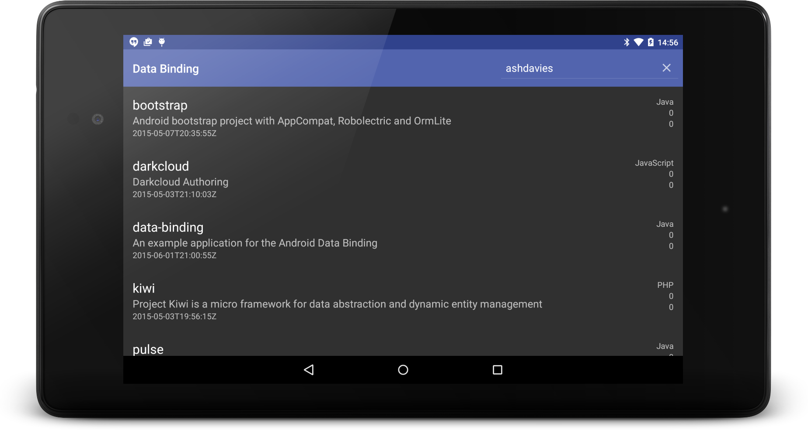
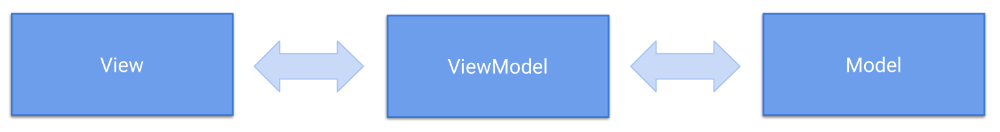

footer: ashdavies.io
slidenumbers: true
autoscale: true

<br />
<br />
<br />

# Leveraging Android Databinding with Kotlin


^
Android databinding is considered as both a powerful toolchain, empowering your views with access to view data without the necessity to build cumbersome presenters, and conversely as an overly complex, convoluted mess of binding statements opening the door to unnecessary, irresponsible domain logic in your view layouts.

^
Whilst the latter of these statements can be true, databinding offers a very powerful code generation syntax, allowing you to utilise the power of the compiler to ensure that your binding statements are runtime safe. Combining this with the concise syntax afforded by Kotlin allows us to dramatically cut down on boilerplate and build complex user interfaces with relative ease.

^
In this talk, you can learn how to utilise extension bindings and property delegates with your layouts, and manage your screen state transformations with true, and safe two-way binding, allowing you to build a fully reactive observable view layout.

---


^
When my talk was accepted and I saw my profile on the website next to my talk proposal, the first thing that came to my mind was, my god why did I choose that picture?! How could I be pictured with this archaic technology glued to my face?!

## Me

---


## <- Glasshole

^
But in my defence, that is an awesome hat.

---

## 2015

^
Whilst we're being nostalgic, lets go back to 2015, Ireland had just voted to legalise same-sex marriage, NASA's new horizon space craft performs a close fly-by of Pluto, and Google announces the beta release of data binding.

---

## Data Binding Beta
### [~~bit.ly/2JSKnJK~~](bit.ly/2JSKnJK)

^
The data binding library promised to allow us to write declarative layouts, and minimise the glue code necessary to bind your application logic and layouts. In addition to being a support library allowing it's use with the Android platform back to Android 2.1 (API 7).

---

## Data Binding Sample



^
Wanting to try out this new library, I created a sample project on GitHub to demonstrate how to use data binding, which would fetch a list of repositories from a given user, and published the resulting application on the Google Play store, it was well received with monumental success.

---

## Data Binding Sample


^
Here's an example of a quality review, one of the two one star ratings the app received.

^
Thanks!

---

## Data Binding Sample
### [bit.ly/2JLyMc8](bit.ly/2JLyMc8)

^
I figured that it would be a good idea to update this project, to demonstrate some various ways you can use the modern data binding libraries, so I give you, data binding sample version two.

---

## Data Binding Sample

- Kotlin Coroutines

^
Updated with Kotlin, and Kotlin coroutines, which I've found to be really enjoyable to use, and would recommend giving it a try.

---

## Data Binding Sample

- Kotlin Coroutines
- Constraint Layout

^
ConstraintLayout to simplify layouts

---

## Data Binding Sample

- Kotlin Coroutines
- Constraint Layout
- Architecture Components

^
Architecture components to demonstrate how you can use these with data binding.

---

## Data Binding Sample

- Kotlin Coroutines
- Constraint Layout
- Architecture Components
- Moshi Codegen

^
Moshi codegen, which can now recognise Kotlin class meta data.

---

## Data Binding Sample

- Kotlin Coroutines
- Constraint Layout
- Architecture Components
- Moshi Codegen
- Blockchain

---

## Data Binding Sample

- Kotlin Coroutines
- Constraint Layout
- Architecture Components
- Moshi Codegen
- Blockchain
- AR / VR

---


---

## Data Binding Sample

- Kotlin Coroutines
- Constraint Layout
- Architecture Components
- Moshi Codegen
- ~~Blockchain~~
- ~~AR / VR~~  

^
Ok maybe not those last two.

---

## Setup

^
How do we setup the current version of data binding?

---

## build.gradle

```groovy, [.highlight: 2-4]
android {
  dataBinding {
    enabled = true
  }
}
```

^
This is all that is required to enable data binding, and whilst the documentation advises you use the latest version of the Android gradle plugin, this is supported back to version 1.5.0.

^
It is not necessary to include the annotation processor in addition to enabling data binding, as the Android gradle plugin will inject the right version.

---

## Data Binding v2

^
From version 3.1.0-alpha06 of the Android Gradle plugin includes a new data binding compiler to generate binding classes.

---

## Data Binding v2

### - Incremental class generation

^
This new version includes incremental class generation to help speed up your build.

---

## Data Binding v2

### - Incremental class generation

### - Generated before compilation

^
Additionally the new version generates classes prior to the managed compiler building your application to ensure that your binding classes are still found if your managed code fails to compile.

---

## gradle.properties

```groovy
android.databinding.enableV2=true
```

^
As of the Android plugin version 3.2, this is enabled by default, but if you're using an older version you can include this in your gradle properties file, or pass the parameter as a gradle command.

^
In many cases, generated classes are not backwards compatible so you'll need to do a clean build.

^
Lets consider the problem we are trying to solve, and what patterns we currently use to do so.

---

## MVP

^
Lets consider the well known pattern of model view presenter, derived from the popular model view controller pattern, allows us to separate business logic away from the presentation.

---


^
Abstracting our behaviour allows us to create a layered application, making our business logic testable without the need for Android dependencies. This would usually be done by creating an interface contract, that could be fulfilled by a concrete implementation

---

## Presenter


^
The presenter is responsible for communication between the view and model, it will retrieve the data from the model and direct the view on how to display it, making the view as passive as possible.

^
I'm focusing mainly on the presenter here, because I feel it's a good analogy for how data binding classes behave, as they will often perform the necessary work required to update the view state from a provided data object.

^
Which involves fetching the required data, applying it to the view properties, and listening to view events in order to invoke the necessary callback.

---

## RepoView.kt

```kotlin
interface RepoView {
  var inProgress: Boolean
  var items: List<Repo>
}
```

## RepoPresenter.kt

```kotlin
interface RepoPresenter {
  fun onResume()
  fun onDestroy()
}
```

^
Consider a simple view presenter interface contract like so.

^
The view interface contains the necessary information to display the current state to the user, and the presenter is able to react to events and manage the presentation appropriately.

---

## RepoPresenterImpl.kt

```kotlin
class RepoPresenterImpl(
  private var view: RepoView?,
  private val service: RepoService
) : RepoPresenter {

  override fun onResume() {
    view?.inProgress = true
    service.fetch {
      view?.apply {
        items = it
        inProgress = false
      }
    }
  }

  override fun onDestroy() {
    view = null
  }
}
```

^
With no dependencies on Android framework types, an effective abstraction of interface contracts, this is pretty straight forward to unit test, though the nullability is fairly ugly in this example.

---

## Data Binding

^
Lets consider how we might implement this, utilising Android data binding with Kotlin.

---


---

## RepoActivity.kt

```kotlin
class RepoActivity : AppCompatActivity() {

  private lateinit var binding: ActivityRepoBinding
  private lateinit var service: RepoService

  override fun onCreate(savedInstanceState: Bundle?) {
    super.onCreate(savedInstanceState)

    binding = DataBindingUtil.setContentView(this, R.layout.activity_repo)
    binding.setLifecycleOwner(this)

    service = RepoServiceFactory().get()
  }

  override fun onResume() {
    super.onResume()
    service.fetch {
      binding.items = it
    }
  }
}
```

^
This is what the most basic implementation for data binding might look like.

---

## RepoActivity.kt

```kotlin, [.highlight: 3, 9]
class RepoActivity : AppCompatActivity() {

  private lateinit var binding: ActivityRepoBinding
  private lateinit var service: RepoService

  override fun onCreate(savedInstanceState: Bundle?) {
    super.onCreate(savedInstanceState)

    binding = DataBindingUtil.setContentView(this, R.layout.activity_repo)
    binding.setLifecycleOwner(this)

    service = RepoServiceFactory().get()
  }

  override fun onResume() {
    super.onResume()
    service.fetch {
      binding.items = it
    }
  }
}
```

^
Here we have our generated binding class which represents our interaction with the data bound view, and we use the method setContentView from the data binding utility instead of the framework method by the same name.

---

## RepoActivity.kt

```kotlin, [.highlight: 10]
class RepoActivity : AppCompatActivity() {

  private lateinit var binding: ActivityRepoBinding
  private lateinit var service: RepoService

  override fun onCreate(savedInstanceState: Bundle?) {
    super.onCreate(savedInstanceState)

    binding = DataBindingUtil.setContentView(this, R.layout.activity_repo)
    binding.setLifecycleOwner(this)

    service = RepoServiceFactory().get()
  }

  override fun onResume() {
    super.onResume()
    service.fetch {
      binding.items = it
    }
  }
}
```

^
As of Android Studio, and the Android gradle plugin 3.1, databinding is lifecycle aware, this means that you can use lifecycle components such as LiveData with your databinding set up, to take advantage of this you should inform it of the lifecycle owner by calling setLifecycleOwner on your binding class.

---

## RepoActivity.kt

```kotlin, [.highlight: 4, 12, 17-19]
class Repoactivity : AppCompatActivity() {

  private lateinit var binding: ActivityRepoBinding
  private lateinit var service: RepoService

  override fun onCreate(savedInstanceState: Bundle?) {
    super.onCreate(savedInstanceState)

    binding = DataBindingUtil.setContentView(this, R.layout.activity_repo)
    binding.setLifecycleOwner(this)

    service = RepoServiceFactory().get()
  }

  override fun onResume() {
    super.onResume()
    service.fetch {
      binding.items = it
    }
  }
}
```

^
Here is our behaviour, where we invoke a method on the service and pass the resulting value to the view binding.

---

## activity_repo.xml

```xml
<layout xmlns:android="http://schemas.android.com/apk/res/android"
    xmlns:app="http://schemas.android.com/apk/res-auto">

  <data>

    <variable
        name="items"
        type="java.util.List&lt;io.ashdavies.databinding.Repo&gt;"/>

  </data>

  <androidx.coordinatorlayout.widget.CoordinatorLayout... />
</layout>
```

^
In our xml layout file, we must also specify that the variable that we wish to set from the activity or fragment within a data tag, in order to let databinding know, it can use this for its bindings.

---

## activity_repo.xml

```xml, [.highlight: 6-8]
<layout xmlns:android="http://schemas.android.com/apk/res/android"
    xmlns:app="http://schemas.android.com/apk/res-auto">

  <data>

    <variable
        name="items"
        type="java.util.List&lt;io.ashdavies.databinding.Repo>"/>

  </data>

  <androidx.coordinatorlayout.widget.CoordinatorLayout... />
</layout>
```

^
You might notice here that I'm using the generic type List for the variable, whilst this is fine, XML doesn't recognise the angle bracket necessary, so in the same way you might need to do so for a link within a String resource, you must escape it to its html entity.

---

## RepoActivity.kt

```kotlin
class RepoActivity : AppCompatActivity() {

  private lateinit var binding: ActivityRepoBinding
  private lateinit var service: RepoService

  override fun onCreate(savedInstanceState: Bundle?) {
    super.onCreate(savedInstanceState)

    binding = DataBindingUtil.setContentView(this, R.layout.activity_home)
    binding.setLifecycleOwner(this)

    service = RepoServiceFactory().get()
  }

  override fun onResume() {
    super.onResume()
    service.fetch {
      binding.items = it
    }
  }
}
```

^
Coming back to our activity, we can see that this is not yet an improvement, we've lost all of our testability, since the presentation behaviour is entirely contained in the activity, so how can we use Kotlin to improve this.

---

## ActivityBindingProperty.kt

```kotlin
class ActivityBindingProperty<out T : ViewDataBinding>(
  @LayoutRes private val resId: Int
) : ReadOnlyProperty<Activity, T> {

  private var binding: T? = null

  override operator fun getValue(thisRef: Activity, property: KProperty<*>): T {
    return binding ?: createBinding(thisRef).also { binding = it }
  }

  private fun createBinding(activity: Activity): T {
    return DataBindingUtil.setContentView(activity, resId)
  }
}
```

^
Kotlin allows us to create delegated properies, that is basically a template for the getter and setter methods, dependent on whether the property is mutable, and we can then reuse this template for all properties with the same requirements.

^
We can use a delegated property to lazily instantiate our data binding

---

## ActivityBindingProperty.kt

```kotlin, [.highlight: 1-3]
class ActivityBindingProperty<out T : ViewDataBinding>(
  @LayoutRes private val resId: Int
) : ReadOnlyProperty<Activity, T> {

  private var binding: T? = null

  override operator fun getValue(thisRef: Activity, property: KProperty<*>): T {
    return binding ?: createBinding(thisRef).also { binding = it }
  }

  private fun createBinding(activity: Activity): T {
    return DataBindingUtil.setContentView(activity, resId)
  }
}
```

^
we take the layout resource identifier as a constructor parameter in order to correctly inflate the view, and the class is inferred by the generic type, note that we're extending the read only property interface, denoting that this is an immutable value property.

---

## ActivityBindingProperty.kt

```kotlin, [.highlight: 5-13]
class ActivityBindingProperty<out T : ViewDataBinding>(
  @LayoutRes private val resId: Int
) : ReadOnlyProperty<Activity, T> {

  private var binding: T? = null

  override operator fun getValue(thisRef: Activity, property: KProperty<*>): T {
    return binding ?: createBinding(thisRef).also { binding = it }
  }

  private fun createBinding(activity: Activity): T {
    return DataBindingUtil.setContentView(activity, resId)
  }
}
```

^
This behaviour is very similar to the standard lazy delegate provided to us in Kotlin, the activity reference specified as the property receiver allows us to lazily instantiate the data binding and inflate the layout view when the delegated property is first accessed, as we must not do so before on create.

---

## FragmentActivity.kt

```kotlin
fun <T : ViewDataBinding> FragmentActivity.activityBinding(
  @LayoutRes resId: Int
) = ActivityBindingProperty(resId)
```

^
We can then declare a nice extension function to create the delegate property in a fashion that is consistent with the provided Kotlin delegates.

---

## RepoActivity.kt

```kotlin
class RepoActivity : AppCompatActivity() {

  private lateinit var binding: ActivityRepoBinding
  private lateinit var service: RepoService

  override fun onCreate(savedInstanceState: Bundle?) {
    super.onCreate(savedInstanceState)

    binding = DataBindingUtil.setContentView(this, R.layout.activity_home)
    binding.setLifecycleOwner(this)

    service = RepoServiceFactory().get()
  }

  override fun onResume() {
    super.onResume()
    service.fetch {
      binding.items = it
    }
  }
}
```

^
Coming back to our activity, we can see how we can make it a little cleaner.

---

RepoActivity.kt

```kotlin, [.highlight: 3, 10]
class RepoActivity : AppCompatActivity() {

  private val binding by activityBinding<ActivityRepoBinding>(R.layout.activity_repo)

  private lateinit var service: RepoService

  override fun onCreate(savedInstanceState: Bundle?) {
    super.onCreate(savedInstanceState)
    service = RepoServiceFactory().get()
    binding.items = emptyList()
  }

  override fun onResume() {
    super.onResume()
    service.fetch {
      binding.items = it
    }
  }
}
```

^
This is much simpler, and we benefit now from immutability of the binding, but remember if you don't reference the binding property during onCreate, the delegate will not create the binding and therefore will not inflate the layout.

^
But we've still not improved the testability of the domain behaviour.

---

### Introducing
## Android Architecture Components


^
Google announced the Android architecture components last year at Google IO, giving developers a basic framework of components to build projects with. Their introduction wasn't an instruction to migrate your existing application structure, but it did provide a clear endorsement.

^
Furthermore, with the announcement of Jetpack this year, Google have continued to solidify the framework with which we can start building an application quickly and effectively.

---

## MVVM

^
Data binding works beautifully with the MVVM pattern, since the pattern is designed to expose the view state to the view as an observable property, without having to instruct the view explicitly, therefore it's nullability is irrelevant as it is a passive receiver.

^
Furthermore, this allows us to take advantage of lifecycle aware components, that can react accordingly to the presence or absence of a lifecycle owner such as an activity or fragment, and what state that activity or fragment might be in.

---



^
MVVM works by allowing the view to observe the view model and utilise data binding to bind the view state onto itself, it can also notify it of UI events as a result of user interaction.

^
The view model would then be responsible for the business logic behaviour of fetching, manipulating, and formatting the domain model ready for consumption by the view.

^
In many cases it makes sense to build upon this pattern with the inclusion of new types, such as formatters, or binding adapters to isolate responsibility and reduce the complexity of your view model.

^
Most importantly, your view model should not contain any Android dependencies, this allows for easier testing that we lost from moving away from the abstracted interfaces.

^
Lets extract the behaviour from the activity with a view model.

---

## RepoActivity.kt

```kotlin, [.highlight: 8-10]
class RepoActivity : AppCompatActivity() {

  private val binding by activityBinding<ActivityRepoBinding>(R.layout.activity_repo)

  override fun onCreate(savedInstanceState: Bundle?) {
    super.onCreate(savedInstanceState)

    binding.model = ViewModelProviders
        .of(this, RepoViewModelFactory())
        .get(RepoViewModel::class.java)
  }
}
```

^
Here we have the same activity, but fetching the view model from the view model providers implementation of the application compatibility activity. We're assigning the resulting view model directly on the binding, but you might choose to keep it as a value on the activity so that you can directly observe a property should you need to.

^
It's important to do this in or after onCreate otherwise the activity will have not yet retrieved the view model store from the non configuration instance.

---

## activity_repo.xml

```xml, [.highlight: 6-8]
<layout xmlns:android="http://schemas.android.com/apk/res/android"
    xmlns:app="http://schemas.android.com/apk/res-auto">

  <data>

    <variable
        name="model"
        type="io.ashdavies.databinding.RepoViewModel"/>

  </data>

  <androidx.coordinatorlayout.widget.CoordinatorLayout... />
</layout>
```

^
We'll need to update our layout file to represent the change in our activity.

---

## RepoActivity.kt

```kotlin, [.highlight: 8-10]
class RepoActivity : AppCompatActivity() {

  private val binding by activityBinding<ActivityRepoBinding>(R.layout.activity_repo)

  override fun onCreate(savedInstanceState: Bundle?) {
    super.onCreate(savedInstanceState)

    binding.model = ViewModelProviders
        .of(this, RepoViewModelFactory())
        .get(RepoViewModel::class.java)
  }
}
```

^
We can again make use of an extension function with lazy instantiation to keep our activity simple.

---

## FragmentActivity.kt

```kotlin, [.highlight: 5-8]
fun <T : ViewDataBinding> FragmentActivity.activityBinding(@LayoutRes resId: Int) {
  return ActivityBindingProperty(resId)
}

inline fun <reified T : ViewModel> FragmentActivity.getViewModel(
  factory: ViewModelProvider.Factory = ViewModelProvider.NewInstanceFactory()
) = ViewModelProviders.of(this, factory).get(T::class.java)
```

^
Here we are providing the same behaviour as we had seen on our activity, allowing the caller to pass in a factory to create the view model if it does not already exist.

^
Android architecture components providers a default instance factory that we can use here if your view model does not take any constructor parameters, but be careful with this.

---

## RepoActivity.kt

```kotlin
class RepoActivity : AppCompatActivity() {

  private val binding by activityBinding<ActivityRepoBinding>(R.layout.activity_repo)
  private val model by lazy { getViewModel<RepoViewModel>(RepoViewModelFactory()) }

  override fun onCreate(savedInstanceState: Bundle?) {
    super.onCreate(savedInstanceState)
    binding.model = model
  }
}
```

^
This is what our resulting activity looks like, there are a lot of things to take into consideration when using a view model, and I recommend you check out the resources available for them, but I'd like to focus on how we use them with data binding.

---

## RepoViewModel.kt

```kotlin
class RepoViewModel(private val service: RepoService) {

  val items: ObservableField<List<String>> = ObservableField()

  init {
    service.fetch(items::set)
  }
}
```

^
The data binding library provides classes and methods to easily observe data for changes. You don't have to worry about refreshing the UI when the underlying data source changes. You can make your variables or their properties observable. The library allows you to make objects, fields, or collections observable.

^
Here we're using the observable field class, but the data binding library also provides base classes for many other primitive types if your view model isn't so complex, such as boolean, byte, char, short, int long, float, double and parcelable.

---

## Observable

^
All of these class implement the observable interface, which has a mechanism to add and remove listeners. You can extend from the BaseObservable class, which implements the listener registration mechanisms. But If you have a complex object, you can extend from this interface and decide when notifications are sent, this will become useful a little later.

---

## LiveData Data Binding

^
As mentioned previously as of version 3.1 of the Android gradle plugin, you can use LiveData with your data bindings.

---

## RepoViewModel.kt

```kotlin
class RepoViewModel(private val service: RepoService) {

  val items = MutableLiveData<List<String>>()

  init {
    service.fetch(items::setValue)
  }
}
```

^
The behaviour of this is very similar to an observable field, except that it provides your application with all the benefits that come with the architecture components like observing from your lifecycle owner.

^
Here we use the mutable live data so that we can also post and set the value.

---

## RepoViewModel.kt

```kotlin
class RepoViewModel(private val service: RepoService) {

  val items = MutableLiveData<List<String>>()
  val loading = MutableLiveData<Boolean>()

  init {
    loading.value = true
    service.fetch {
      loading.value = false
      items.value = it
    }
  }
}

```

^
Lets assume a basic asynchronous operation that gets called with the appropriate background and UI threading, and we want to show to the user that the UI is loading.

---

## Layout Expressions

```xml, [.highlight: 6, 14-15]
<layout xmlns:android="http://schemas.android.com/apk/res/android"
    xmlns:app="http://schemas.android.com/apk/res-auto">

  <data>

    <import type="android.view.View"/>

    <variable
        name="model"
        type="io.ashdavies.databinding.RepoViewModel"/>

  </data>

  <ProgressBar...
      android:visibility="@{model.loading ? View.VISIBLE : View.GONE}"/>

</layout>
```

^
We can use data binding to subscribe to the value of loading on the view model, to update the visibility of our progress bar like so, since visibility has one of three possible states, we must tell data binding which two to use in the event of the value being either true or false.

---

## Layout Expressions

```xml, [.highlight: 6]
<layout xmlns:android="http://schemas.android.com/apk/res/android"
    xmlns:app="http://schemas.android.com/apk/res-auto">

  <data>

    <import type="android.view.View"/>

    <variable
        name="model"
        type="io.ashdavies.databinding.RepoViewModel"/>

  </data>

  <ProgressBar...
      android:visibility="@{model.loading ? View.VISIBLE : View.GONE}"/>

</layout>
```

^
Note that we must also import the view type in our data tag so that data binding can recognise the class we're using in the attribute binding.

---

## Layout Expressions

```xml, [.highlight: 14-15]
<layout xmlns:android="http://schemas.android.com/apk/res/android"
    xmlns:app="http://schemas.android.com/apk/res-auto">

  <data>

    <import type="android.view.View"/>

    <variable
        name="model"
        type="io.ashdavies.databinding.RepoViewModel"/>

  </data>

  <TextView...
      android:text="@string/activity_repo_empty"/>

  <ProgressBar...
      android:visibility="@{model.loading ? View.VISIBLE : View.GONE}"/>

</layout>
```

^
Lets say we want to show a message to our user when there are no items to display, how could we achieve this?

---

## Layout Expressions

```xml, [.highlight: 14-16]
<layout xmlns:android="http://schemas.android.com/apk/res/android"
    xmlns:app="http://schemas.android.com/apk/res-auto">

  <data>

    <import type="android.view.View"/>

    <variable
        name="model"
        type="io.ashdavies.databinding.RepoViewModel"/>

  </data>

  <TextView...
      android:text="@string/activity_repo_empty"
      android:visibility="@{model.items.count == 0 ? View.VISIBLE : View.GONE}"/>

  <ProgressBar...
      android:visibility="@{model.loading ? View.VISIBLE : View.GONE}"/>

</layout>
```

^
We can include rudimentary evaluation statements in our data binding statements to check for the properties of classes, such as the number of items in a list.

^
But that wouldn't be enough here, since we'd want to make sure that the empty text isn't shown to the user whilst the view is loading new data.

---

## Layout Expressions

```xml, [.highlight: 14-16]
<layout xmlns:android="http://schemas.android.com/apk/res/android"
    xmlns:app="http://schemas.android.com/apk/res-auto">

  <data>

    <import type="android.view.View"/>

    <variable
        name="model"
        type="io.ashdavies.databinding.RepoViewModel"/>

  </data>

  <TextView...
      android:text="@string/activity_repo_empty"
      android:visibility="@{model.items.count == 0 &amp;&amp; !model.loading ? View.VISIBLE : View.GONE}"/>

  <ProgressBar...
      android:visibility="@{model.loading ? View.VISIBLE : View.GONE}"/>

</layout>
```

^
We'd have to include the statement like so, again we have the issue with including html entities within binding expressions that we need to escape properly, but you can see the obvious problem here.

---

## Complex Layout Expressions

^
As you can see, it's very easy to find ourselves in the midst of overly complex binding statements, polluting our otherwise simple layouts with business logic, making it very difficult to maintain, and test.

^
This can make many developers apprehensive about using data binding, because they believe it can be too easily misused, and whilst this is true, like many toolsets, we can show constraint in using it carefully and effectively.

---

## Single Property Bindings

^
In our example, we saw that we were using multiple properties to build our binding statement, but we should avoid this an prefer to use a single property which can be managed by our view model, making the business behaviour easily testable.

---

```kotlin
class RepoViewModel(private val service: RepoService) {

  val items = MutableLiveData<List<String>>()
  val loading = MutableLiveData<Boolean>()
  val empty = MutableLiveData<Boolean>()

  init {
    loading.value = true
    empty.value = false

    service.fetch {
      loading.value = false
      empty.value = it.isEmpty()

      items.value = it
    }
  }
}

```

^
Whilst you could argue that some of the logic is duplicitous, here we're ensuring that we have a single observable property that tells our view what we want it to do, which we could easily test.

---

```xml, [.highlight: 14-16]
<layout xmlns:android="http://schemas.android.com/apk/res/android"
    xmlns:app="http://schemas.android.com/apk/res-auto">

  <data>

    <import type="android.view.View"/>

    <variable
        name="model"
        type="io.ashdavies.databinding.RepoViewModel"/>

  </data>

  <TextView...
      android:text="@string/activity_repo_empty"
      android:visibility="@{model.empty ? View.VISIBLE : View.GONE}"/>

  <ProgressBar...
      android:visibility="@{model.loading ? View.VISIBLE : View.GONE}"/>

</layout>
```

^
Here we have an immediate improvement, but we've still got a bit of logic going on here that we can clean up.

---

## Simple Properties

^
In most cases, the data binding library will be able to recognise simple properties that match their Java bean access methods, and will automatically look for the correct matching types.

---

## Simple Properties

- `android:text="@{model.name}"`
  - `fun TextView.setText(value: String)`
  - `fun ViewModel.getName(): String`

^
For example, given the android text expression, the library looks for the set text method that accepts the type returned by the view model getName function.

---

## Simple Properties

- `android:text="@{model.name}"`
  - `fun TextView.setText(@StringRes resId: Int)`
  - `@StringRes fun ViewModel.getName(): Int`

^
If the expression returns an int instead, the library searches for a setText method that accepts an int argument. The same applies to set methods where the property doesn't exist, for example, setScrimColor or scrollColor attributes.

---

## `@BindingMethods`

^
When your property attributes do not match by name, you can use the binding methods annotation, or the inverse binding methods annotation for two way binding to indicate to the data binding library what method should be used.

---

## `@BindingAdapter`

^
but you can specify your own additional data binding adapters, to give some additional logic to your binding. The data binding library actually already uses a lot of binding adapters under the hood to help you use both common framework views, and views found in the support library.

---

## `@BindingAdapter`

```kotlin
@BindingAdapter("goneUnless")
fun goneUnless(view: View, visible: Boolean) {
  view.visibility = if (visible) View.VISIBLE else View.GONE
}
```

^
This binding, will allow us to remove the conditional statement from our layouts, with this example, there's much debate as to what to name the parameter, since "visible" ignores the invisible parameter, this one from the data binding documentation respects that.

^
Remember you don't need to declare a namespace for the attribute name if you are not using an android parameter.

---

## ProTip!
### `@BindingAdapter`

^
Binding adapters also work as extension properties, here's an example of a view extension property from the Android KTX library, with the binding adapter annotation applied.

---

## `@BindingAdapter`

```kotlin
@set:BindingAdapter("isVisible")
inline var View.isVisible: Boolean
  get() = visibility == View.VISIBLE
  set(value) {
    visibility = if (value) View.VISIBLE else View.GONE
  }
```

^
This allows us to set the visibility through both data binding and programatically.

---

```xml, [.highlight: 14-16, 18-19]
<layout xmlns:android="http://schemas.android.com/apk/res/android"
    xmlns:app="http://schemas.android.com/apk/res-auto">

  <data>

    <import type="android.view.View"/>

    <variable
        name="model"
        type="io.ashdavies.databinding.RepoViewModel"/>

  </data>

  <TextView...
      android:text="@string/activity_repo_empty"
      app:isVisible="@{model.empty}"/>

  <ProgressBar...
      app:isVisible="@{model.loading}"/>

</layout>
```

^
Much better, now we have really simple data binding expressions.

---

## Single Live Data

```kotlin
class SingleLiveData<T> : MutableLiveData<T>() {

  private val pending = AtomicBoolean(false)

  override fun observe(owner: LifecycleOwner, observer: Observer<in T>) {
    super.observe(owner, Observer<T> {
      if (pending.compareAndSet(true, false)) {
        observer.onChanged(it)
      }
    })
  }

  override fun setValue(it: T?) {
    pending.set(true)
    super.setValue(it)
  }
}
```

^
Often you'll need to act upon an event triggered by your view in response to a user interaction, such an interaction might be navigating to a new activity, but without

---

## Single Layout Adapter

```kotlin
class SingleLayoutAdapter<T>(@LayoutRes private val resId: Int) : RecyclerView.Adapter<SingleLayoutAdapter.ViewHolder<T>>() {

  var items by observable<List<T>>(listOf()) { _, _, _ -> notifyDataSetChanged() }

  override fun getItemCount(): Int = items.size

  override fun onBindViewHolder(holder: ViewHolder<T>, position: Int) {
    return holder.bind(items[position])
  }

  override fun onCreateViewHolder(parent: ViewGroup, viewType: Int): ViewHolder<T> {
    val inflater = LayoutInflater.from(parent.context)
    val binding = DataBindingUtil.inflate<ViewDataBinding>(inflater, resId, parent, false)

    return ViewHolder(binding)
  }

  class ViewHolder<in T>(private val binding: ViewDataBinding) : RecyclerView.ViewHolder(binding.root) {

    fun bind(item: T) = with(binding) {
      setVariable(BR.item, item)
      executePendingBindings()
    }
  }
}
```

---

## TODO

- Two-way databinding

- Bindable annotation with notifyDataChanged
- ObservableViewModel notifyPropertyChanged

- Databinding in a multimodule project

- Static binding adapters / companion objects

- Scoping specific view binding properties on custom views

- InverseBindingAdapters listeners
- InverseBindingAdapters high order function

- Databinding generated code
- Generated databinding identifiers
- Generated code nullability
- Generated databinding after changing order of view classes

- Databinding executePendingBindings (recyclerview usage)

---

## Additional Resources

---

- **Android Data Binding Library samples**
Google Samples - [bit.ly/2MK5GMb]
<br />

- **Make your view-model properties great again**
Aiden McWilliams - [bit.ly/2llVVHz]
<br />

- **MVVM, Viewmodel and architecture components**
Danny Preussler - [bit.ly/2yxvGay]

^
Google provides some examples on how to use layout expressions, binding adapters, animations, and inverse converters.

^
Aiden mcwilliams wrote a great article covering the bindable property delegates which I covered in this talk, and I highly suggest you go check it out.

^
Finally, Danny had a cool talk last year covering the architecture components, which work really well with data binding.


---

## Android Databinding with Kotlin
[coming soon](Coming Soon)

^
Finally, all of these slides are available on GitHub

---

## Thanks
