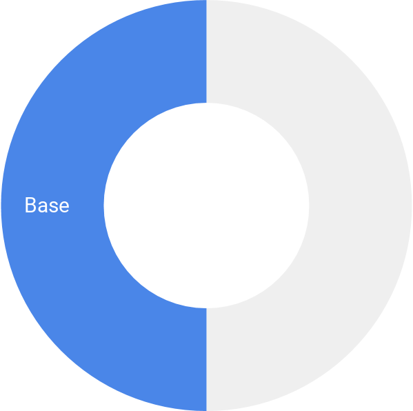
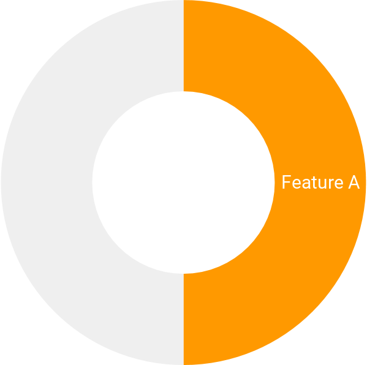
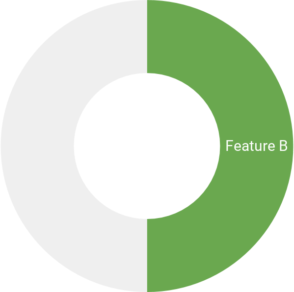

footer: 
autoscale: true
slidenumbers: true
header: Roboto
text: Roboto

[.footer: ashdavies.io - @askashdavies]

# Preparing your app
# for Google Play Instant

---

^ Mobile economy runs on apps

---

^ Mobile first business strategy

---

[.background-color: #ffffff]

^ Wherever the user journey starts

^ It inevitably ends up on Google Play

---

# 💪

^ Incredibly useful tool, reliable distribution

^ Guaranteed safety, brand identity, trust

---

# 🧗 Friction 

^ One more step to your app

---

^ This cat had no friction

---

^ Long installation times leading cause of cancellation

---

# 😡

---

# `< />`

^ Mobile optimised sites as solution

---

[.background-color: #ffffff]

---

# Performance

- Monolith
- Feature artifacts
- Parallel builds [Citation Needed]

---

[.background-color: #ffffff]
[.header: #333333]

## Security

^ Concern for instant security implications
^ Careful precautions have been taken

---

## 🔐 HTTPS

^ All network traffic must be secure

---

## Smart Lock

^ Smart lock for passwords on Android
^ Retrieve stored credentials from Credentials API 
^ Requires explicit user permission

---
 
## 💳 Play Billing Library

^ Payments via Play Billing Library
^ Fast and easy payments in over 135 countries

---
 
## Runtime Permissions

^ Must use runtime permissions

---

- `ACCESS_COURSE_LOCATION`
- `ACCESS_FINE_LOCATION`
- `ACCESS_NETWORK_STATE`
- `BILLING` (Deprecated as of Play Billing Library 1.0)
- `CAMERA`
- `INSTANT_APP_FOREGROUND_SERVICE` (Only in Android Oreo)
- `INTERNET`
- `READ_PHONE_NUMBERS` (Only in Android Oreo)
- `RECORD_AUDIO`
- `VIBRATE`

^ Limited to supported permissions

---

# Limitations

---

# ₿ ⛏️ 💰

^ Mine Bitcoin without users consent?

---

## ~~Background Services~~

^ No dice, background services are disabled!

---

## ~~External Storage~~

^ No access to external storage,
^ no sniffing for installed apps

---

## ~~Push Notifications~~

^ Like background services, no background notifications
^ Beta program available by application

---

## Bluetooth

^ Many hardware facilities limited

---

[.background-color: #FFFFFF]
[.header: #666666]

## Size Limit (4 Mb)

  

^ Instant Apps should be instant
^ Arbitrary size limit for fast download

---

[.background-color: #FFFFFF]
[.header: #666666]

## Size Limit (10 Mb) 💪

^ Size increased to 10 Mb to enable Try Now

  

---

# History

---

[.footer: ]

--- 

# Segmentation

--- 

# The Monolith

---

# Rearchitecting

--- 

# Dependencies

- Dagger Android Support
- Dagger Multi-Binding for alternative dependencies

---
 
# Gradle Modules

- Horizontal vs vertical / flat hierarchy vs structured hierarchy

---

---

# Analysis

- Which tools did you use for measuring APK size per package?
- Android Studio APK analyser
- Emulator support
- Refactoring tool

---

# Modularisation

- App Bundle
- Dynamic feature modules
- Independent feature modules
- How did you decide for your base module? 
- Separated finance dagger application component

---

# Optimisations

- Removing bloated images (SVG assets, avocado optimiser)
- RxMustDie in favour of Coroutines
- What was the biggest library/dependency to remove?

---

# Navigation

- App linking URL parameters
- Try Now Google Play button

---

# Topeka
# Plaid

---

# Current State

---

# Next Steps

---

# Misc
- Resources prefixing
- Feature module data binding

-  61,269 lines Java code
- 105,303 lines Kotlin code

---

