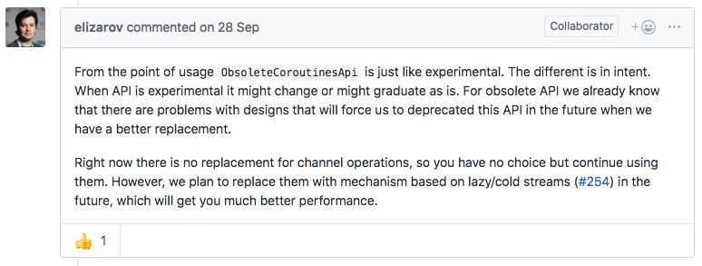

footer: 
autoscale: true
build-lists: true
header: Open Sans
text: Open Sans
slidenumbers: true
theme: Simple

[.footer: ashdavies.io - @askashdavies]


## RxJava & Coroutines: A Practical Analysis


^ Talk a culmination of discussions with developers in conferences these few months

^ Most people excited about coroutines, but have questions about its usage

^ What position does it sit in the Android ecosystem

---


^ Unveiled as project Kotlin in 2011

^ Open sourced under Apache license 2012

^ Version one stable release 2014

---


^ Already garnered support from development community

^ Android team announced first class support in 2017

---

# 🎉

^ Developers worldwide rejoiced, dreams had been realised

---

## Adoption

^ This year Pusher surveyed 2744 people from January to March

^ They found that Kotlin usage doubled year on year

---

## 7.7% (2015)

^ Starting at 7.7% in 2015

---

## 19.5% (2016)
### 7.7% (2015)

^ Spiking to 19.5 after the release of a document from JW advocating its use at Square

---

## 46.8% (2017)
### 19.5% (2016)
#### 7.7% (2015)

^ Exploding to 46.8 after Google's announcement at Google IO in 2017

---

[.footer: blog.jetbrains.com/kotlin/2016/02/kotlin-1-0-released-pragmatic-language-for-jvm-and-android/]


^ Stack Overflow speculated one of the fasted growing and least disliked

---

# Multi Platform


^ Popularity and success contributed to by continued evolution of Kotlin

^ Kotlin 1.2 announced in November 2017 with multi-platform support

---

##  Coroutines 

^ Coroutines available as experimental in Kotlin 1.1

^ Available in other languages, subroutines for non-preemptive (cooperative) multitasking

^ Allow us to write asynchronous code as if it were synchronous

---

```kotlin
fun main() {
    GlobalScope.launch {
        delay(1000L)
        println("World!")
    }
    println("Hello,")
    Thread.sleep(2000L)
}
```

^ Consider the following asynchronous code

^ Sequential by default, seemingly imperative

---

```kotlin, [.highlight: 3]
fun main() {
    GlobalScope.launch {
        delay(1000L)
        println("World!")
    }
    println("Hello,")
    Thread.sleep(2000L)
}
```

^ Delay is a suspended function, must be called from a Coroutine

---

```kotlin, [.highlight: 2, 5]
fun main() {
    GlobalScope.launch {
        delay(1000L)
        println("World!")
    }
    println("Hello,")
    Thread.sleep(2000L)
}
```

^ Calling launch on a Coroutine scope will build a coroutine context

^ Existing Coroutine scopes can be accessed or created 

---

## ⚖️ Stability

^ In the abstract I had mentioned "with coroutines approaching stability"

^ As of Kotlin 1.3 coroutines API graduated to stable

^ Much like stdlib require additional libraries

^ Required only to consume suspended functions

---

## `async` / `launch`

^ Coroutines library provides two coroutine builder functions on a scope

---

### `val deferred: Deferred<String> = async { "Hello" }`

^ Async returns a deferred result and must be awaited to return a result

---

### `val result: String = deferred.await()`

^ Much like Future, Deferred represents a promise that must be awaited

---

### `val job: Job = launch { "Hello" }`

^ Launch will return a job which will run in parallel until awaits

---

### `job.join()`

^ Join will suspend the coroutine until the job is finished

^ Much like disposable or subscription, a job can be cancelled

---

## Annotations

### [bit.ly/2BrxgKv](bit.ly/2BrxgKv)

^ Though coroutines are stable some API elements are still under development

^ Kotlin introduced annotations to manage these aspects

---

## 🐉 Here be dragons

^ Roughly speaking good chance these declarations will be deprecated

---

## `@ExperimentalCoroutinesApi`

^ Experimental API's design declarations may still change

^ Applies to some Rx conversion methods

^ Production of channels

---

## `@ObsoleteCoroutinesApi`

^ Obsolete API's will be deprecated in the future

^ Not yet known what will replace them

^ Consumption of channels

---

## `@InternalCoroutinesApi`

^ Should only be used internally by Kotlin coroutines

^ Can change without warning or migration aids

---



^ Roman explains difference between obsolete and experimental

^ Difference only in intent, `@Experimental` may graduate

^ Not yet known what will replace `@Obsolete`


---

## Coroutines

### 🍞 Best thing since sliced bread

^ Does this phrase exist in German?

^ Why do people say this?

---

## 💪 Coroutines

^ What makes Coroutines so great?

---

## 🥇 Native first-party library

^ First class support and documentation from JetBrains

^ Continued evolution and development of performance and features

^ Not relying on a third party implementation

^ Everything already awesome about Kotlin

---

## 😊 Easy-to-use

^ Learning curve for getting started is really simple

---

## 👌 `suspend fun`

^ Create async methods with suspend keyword

^ Consume existing suspend functions

---

## `Dispatchers.Main`

^ Logical handling of threads 

^ Support for Android and Swing

---

## 🕰️ History of Android

^ Handling asynchronous operations on Android has been really hard

^ Java 6 and lack of lambda support made code quite ugly

---

## Background Processes

^ Too many options for background tasks make it hard for beginners

---

## 🏛️️ `Runnable` / `Handler`

^ The de facto standard for Android and Java background tasks

---

## 🤢 `AsyncTask`

^ Beloved AsyncTask risks memory leaks and confuses UI/background logic

---

## 😕 `IntentService`

^ Intent service "work queue processor" pattern to offload tasks

---

## 🍯 `Loader<T>`

^ Lifecycle aware loaders introduced in Honeycomb and compatibility library

---

##  `WorkManager`

^ WorkManager released with JetPack, defers to JobScheduler, JobDispatcher or AlarmManager

---

## Background Processes

### `AlarmManager`, `AsyncTask`, `CountDownTimer`, `FutureTask<T>`, `GcmNetworkManager`, `Handler`, `HandlerThread`, `IntentService`, `JobDispatcher`, `JobScheduler`, `Loader<T>`, `ScheduledThreadPoolExecutor`, `Timer`, `Task<T>`, `WorkManager`

^ Not even a comprehensive list of background process options

^ Decision paralysis, which is best for my project

---


[.footer: https://xkcd.com/927/]

^ No single option seems to match most requirements

^ Leading to new standards for individual use cases

---

## RxJava to the rescue


---

## ⛓️ Chained operations

^ Allows us to compose chained operator sequences

---

## ↔️ Abstracted threading

^ Abstract away threading, synchronisation, concerns

---

## 😮 Reactive programming

^ Introduced the concept of reactive programming

^ This was a major turning point for architecture

---


^ But this quickly got out of hand

^ RxJava became the tool of choice

---


^ Started seeing libraries wrapping native API's

---


^ and more

---


^ and more

---


^ and more

---


^ Oops

---


^ One the plus side we learned that people really like readme badges

---

## 👍 Asynchronous API's

^ Many of these libraries do a good job of providing asynchronous API's

^ When everything uses the same framework it's easy to fit together

---

## 👎 Synchronous API's

^ Doesn't make sense to use a reactive framework for synchronous API's

---

## [fit] `Observable.fromIterable()`


^ This may have made sense before Kotlin streams

^ But it sure as shit does not make sense now

---

## `Flowable` / `Observable` / `Single` / `Completable` / `Maybe`

^ Additionally RxJava2 introduced four new types

^ Contract limits traditional Observable result

^ Sharing no common ancestor require conversion functions

---

[.background-color: #222222]


^ Conversion functions often hard to remember

---

## 🤦‍♀️

```java
Observable
  .fromIterable(resourceDraft.getResources())
  .flatMap(resourceServiceApiClient::createUploadContainer)
  .zipWith(Observable.fromIterable(resourceDraft.getResources()), Pair::create)
  .flatMap(uploadResources())
  .toList()
  .toObservable()
  .flatMapMaybe(resourceCache.getResourceCachedItem())
  .defaultIfEmpty(Resource.getDefaultItem())
  .flatMap(postResource(resourceId, resourceDraft.getText(), currentUser, resourceDraft.getIntent()))
  .observeOn(AndroidSchedulers.mainThread())
  .subscribeOn(Schedulers.io())
  .subscribe(
      resource -> repository.setResource(resourceId, resource, provisionalResourceId),
      resourceUploadError(resourceId, resourceDraft, provisionalResourceId)
  );
```

^ Operator chains can quickly escalate out of control

---


^ Well that escalated quickly

---

## ⚙️ Hidden complexity

^ Business behaviour can often be hidden behind difficult to understand operators

^ Go back to previous slide, many statements feel unnecessary

---

## 😭 Hidden gotchas

^ Behaviour often unpredictable when converting from Rx2 types

^ `Maybe` can be turned to `Completable` without completing

^ Combining operators behave differently if not all complete

^ Position of `observeOn` crucial to expected behaviour

---

## 💾 Memory footprint

^ RxJava objects take a lot of memory

^ Each operation large object allocation

---

## ⤴️ Steep learning curve

^ Steep learning curve for learning operator functions

^ Even after years of use still miss some behaviours

---


[.footer: http://explosm.net/comics/3185/]

^ Not the hero we wanted, or needed, or deserved.

---


^ Enough is enough

---

## #RxMustDie
### pca.st/7IJG


^ Discussion panel on RxJava at Droidcon Berlin

^ Started from a Twitter discussion on RxJava API

^ API obstructive, difficult, obtuse, and unnecessary

^ Podcast available via Pocket Casts

---

<br />
<br />
<br />

> "When all you have is a hammer, everything looks like a nail"

#### Ivan Morgillo (@hamen)

^ Previous iterations of Android limited developers

^ RxJava was the only feasible tool of choice

^ No longer the case, many tools at our disposal

---

## Reactive & Imperative programming

^ Also discussed reactive and imperative programming

^ Imperative code executed statement by statement

^ Imperative programming can be much clearer

^ Coroutines allow sequential operation of statements

^ Reactive paradigms still respected

---

## Coroutine Use Cases

^ Simple use cases can be achieved in Corouties

---

## Network Call Handling

```kotlin
// RxJava2
fun getUser(): Single<User> = Single.fromCallable { /* ... */ }

// Coroutine
suspend fun getUser(): User = /* ... */
```

^ Ignoring presence of Retrofit we return result of network request

^ Assume network retrieval with client inside comment block

^ Simply suspend network call in coroutine function

---

## Cache Retrieval

```kotlin
// RxJava2
fun getUser(): Maybe<User> = Maybe.fromCallable { /* ... */ }

// Coroutine
suspend fun getUser(): User? = /* ... */
```

^ Nullable value can be returned to represent empty

---

## Background Task Handling

```kotlin
// RxJava2
fun storeUser(user: User): Completable.fromCallable { /* ... */ }

// Coroutine
suspend fun storeUser(user: User) { /* ... */ }
```

---

## RxJava2 / Coroutines

### Single<T> / T
### Maybe<T> / T?
### Completable / Unit

^ These statements are pretty similar

^ Differ only by return type and suspend

^ Real beauty comes with consumption

---

## Thread Handling

```kotlin
// RxJava2
getUser()
  .subscribeOn(Schedulers.computation())
  .observeOn(AndroidSchedulers.mainThread())
  .subscribe { /* Do something */ }

// Coroutine
launch(Dispatchers.Main) {
  val user = getUser()
  /* Do something */
}
```

^ Key difference is sequential operation of values

^ Imperative code much more readable

^ Value accessible instead of callback

^ This also means flat mapping isnt necessary (👋 Ivan)

---

## 💪 ~~FlatMap~~

```kotlin
// RxJava2
getUser()
  .flatMap { doSomethingWithUser(it) }
  .subscribeOn(Schedulers.computation())
  .observeOn(AndroidSchedulers.mainThread())
  .subscribe { /* Do something else */ }

// Coroutine
launch(Dispatchers.Main) {
  val user = getUser()
  val smth = doSomethingWithUser(user)
  
  /* Do something else */
}
```


---

## Callback Consumption

```kotlin
// RxJava2
fun getSingle(): Single = Single.create<T> { emitter -> 
  doSomethingAsync(object: Callback<T> {
    override fun onComplete(result: T) = emitter.onSuccess(result)
    override fun onException(exception: Exception) = emitter.onError(exception)
  })
}

// Coroutine
suspend fun getCoroutine() : T = suspendCoroutine { continuation ->
  doSomethingAsync(object : Callback<Baz> {
    override fun onComplete(result: T) = continuation.resume(result)
    override fun onException(exception: Exception) = continuation.resumeWithException(exception)
  })
}
```

^ RxJava gives us `fromCallable` and `create` with an emitter to use callbacks

^ Coroutines has an almost identical approach using continuation instead of emitter

---

## Task Cancellation

```kotlin
// RxJava2
val disposable: Disposable = Single.create { /* Do something */ }
    .subscribe { /* Do something else */ }
disposable.dispose()

// Coroutine
val parent: Job = Job()
launch(Dispatchers.Main + parent) { /* Do something */ }
parent.cancelChildren()
```

^ Many times you may need to cancel a request in flight, eg. orientation change, change of input etc

^ Handled almost identically with Job, addition operator applies values right to left

^ Cancelling a job will cancel all other jobs, use cancel children or `SupervisorJob`

^ Coroutines also offers job hierarchy, jobs nested and structured, useful, but different from RxJava

---

## Lifecycle Task Cancellation

### [bit.ly/2POmNBJ](bit.ly/2POmNBJ)

^ Register lifecycle callback, invoke dispose of cancel manually

^ JetBrains and OSS community working on automatic lifecycle integration

---

## Lifecycle Task Cancellation

```kotlin
class MainActivity : AppCompatActivity {

  override fun onCreate(savedInstanceState: Bundle?) {
    super.onCreate(savedInstanceState)
    
    lifecycle.coroutineScope.launch {
      someSuspendFunction()
      someOtherSuspendFunction()
      someCancellableSuspendFunction()
    }
  }
}
```

^ Automatically cancelled `Activity.onDestroy`

---

## Value Streams

```kotlin
// RxJava2
val publisher = PublishSubject()
publisher.subscribe { /* Do something */ }
publisher.onNext("Hello")

// Coroutine
val channel = Channel<String>()
launch { channel.send("Hello") }
launch { channel.consumeEach { /* Do something */ } }
```

^ Value streams (Observable -> Channel)

^ Transformations (FlatMap -> 🤷‍♀️) Ivan happy

---

## 💪 Backpressure

^ RxJava Observables not originally backpressure aware

^ Support introduced after initial release

^ RxJava introduced `Flowable` for native support

^ Channels only accept from coroutine context

^ end will wait until value popped (like queue)

---

## ~~Channels~~

#### [bit.ly/2DQU7lb](bit.ly/2DQU7lb)

^ Channels obsolete as only produce a hot stream

^ Emitted value computed regardless of receiver

^ Use with care, abstract usage, not for fundamental usage

---

## RxJava Use Cases

---

## ↔️ Channels

^ Channel operations push/pull instead of transforming

^ Create new coroutine for each transformation

^ Behaviour not quite identical to observables

---

## ❄️ Cold Streams

^ Cold streams not yet available in Coroutines

---

## ⚙️ Complex Business Logic

^ Debouncing, distinct filtering, side-effects

^ Operators from RxJava intentionally not created

^ Complex business logic, merging streams, etc

^ Possible to achieve in Coroutines but arduous

^ Not going to show how to do it

---

## [fit] Coroutines & RxJava: An Asynchronicity Comparison

### Manuel Vivo (@manuelvicnt)

### [bit.ly/2R27stP](bit.ly/2R27stP)

^ Would like to go into more detail on these comparisons

^ Focus more on feasibility, practicality, and justification

^ Multi-part blog article, great comparison of the two frameworks
 
---

## Is Coroutines a replacement for RxJava?

---

### Maybe...

^ The answer isn't so clear... maybe, but not really

^ Some behaviour can be replaced, perform different functions

^ Different levels of abstraction, can complement each other

^ Even possible for RxJava to be built with Coroutines

---

## Should I migrate to Coroutines?

---

### Probably not...

^ If something is already working, it does not need to be migrated

---

<br />
<br />
<br />

> "Don't fix what ain't broke"

#### Some Guy

^ RxJava already provides a lot of worth for existing code

^ Coroutines perfect for new code or fresh projects

---


---

## Did "I" migrate to Coroutines?

---

# 😜 Yes!

^ Kotlin and Coroutines are fun and a joy to use

^ Better understanding of code behaviour

^ Code often becomes much clearer

---

## How could I migrate to Coroutines?

---

## 🤝 Migration Policy

^ Agree upon a migration policy with your team

^ Start with low-level implementations

---

## Retrofit Services

---

## [fit] Retrofit2 Coroutines Adapter [bit.ly/2TyGXOh](bit.ly/2TyGXOh)

### [fit] `com.jakewharton.retrofit:retrofit2-kotlin-coroutines-adapter:+`

^ Retrofit Coroutine adapter library from Jake Wharton

^ Not advocating dynamic versions with (+)

---

```kotlin
interface UserService {

  @GET("/user")
  fun getUser(): Deferred<User>
}

val retrofit = Retrofit.Builder()
    .baseUrl("https://example.com/")
    .addCallAdapterFactory(CoroutineCallAdapterFactory())
    .build()

GlobalScope.launch {
    val user = retrofit
        .create<UserService>() // >= 2.5.0
        .getUser()
        .await()
}
```

^ Reified type create call available from 2.5.0

---

```kotlin, [.highlight: 4]
interface UserService {

  @GET("/user")
  fun getUser(): Deferred<User>
}

val retrofit = Retrofit.Builder()
    .baseUrl("https://example.com/")
    .addCallAdapterFactory(CoroutineCallAdapterFactory())
    .build()

GlobalScope.launch {
    val user = retrofit
        .create<UserService>() // >= 2.5.0
        .getUser()
        .await()
}
```

^ Service should return Deferred instead of Single or Observable

^ Can also wrap Response or Result as normal

---

```kotlin, [.highlight: 9]
interface UserService {

  @GET("/user")
  fun getUser(): Deferred<User>
}

val retrofit = Retrofit.Builder()
    .baseUrl("https://example.com/")
    .addCallAdapterFactory(CoroutineCallAdapterFactory())
    .build()

GlobalScope.launch {
    val user = retrofit
        .create<UserService>() // >= 2.5.0
        .getUser()
        .await()
}
```

^ Use provided Coroutine call adapter factory when building retrofit client

---

```kotlin, [.highlight: 16]
interface UserService {

  @GET("/user")
  fun getUser(): Deferred<User>
}

val retrofit = Retrofit.Builder()
    .baseUrl("https://example.com/")
    .addCallAdapterFactory(CoroutineCallAdapterFactory())
    .build()

GlobalScope.launch {
    val user = retrofit
        .create<UserService>() // >= 2.5.0
        .getUser()
        .await()
}
```

^ Await the response of deferred type inside Coroutine context

---

## Coroutines RxJava2 [bit.ly/2DQ2ZYn](bit.ly/2DQ2ZYn)

### [fit] `org.jetbrains.kotlinx:kotlinx-coroutines-rx2:+`

^ Convert suspended functions seamlessly

^ RxJava builders provide scope to consume suspend functions

^ Allows awaiting observable streams as channels (obsolete)

---

| **Name**        | **Result**     | **Scope**        | **Description**
| --------------- | -------------- | ---------------- | ---------------
| [rxCompletable] | `Completable`  | [CoroutineScope] | Cold completable that starts coroutine on subscribe
| [rxMaybe]       | `Maybe`        | [CoroutineScope] | Cold maybe that starts coroutine on subscribe
| [rxSingle]      | `Single`       | [CoroutineScope] | Cold single that starts coroutine on subscribe
| [rxObservable]  | `Observable`   | [ProducerScope]  | Cold observable that starts coroutine on subscribe
| [rxFlowable]    | `Flowable`     | [ProducerScope]  | Cold observable that starts coroutine on subscribe with **backpressure** support 

^ Currently the only way to produce a cold stream with Coroutines

---

```kotlin
val service: UserService = /* ... */

GlobalScope.rxSingle { service.getUser() }
    .observeOn(AndroidSchedulers.mainThread())
    .subscribeOn(Schedulers.io())
    .subscribe(
        { /* Do something with user */ },
        { /* Handle error ... maybe */ }
    )
```

^ Take our user service from earlier

^ Handle threading with RxJava

^ Context is unconfined

---

## 😅 Conclusion

^ Good idea of when its appropriate to use RxJava or Coroutines

^ Most of the time fine to use both, frameworks are complementary

^ Many other times you don't need complicated architecture

^ Now you have more than a hammer you can pick the right tool for the job

---

[.background-color: #020202]


---

[.footer: ashdavies.io - @askashdavies]


<br /> 

# Cheers! 🍻


---


