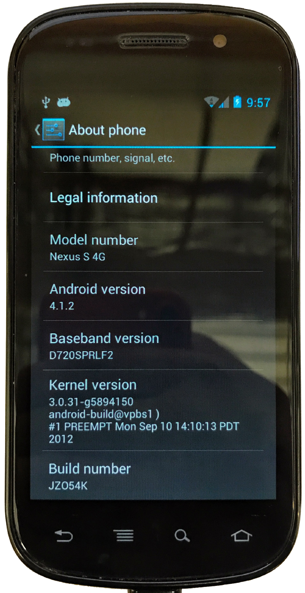

footer: 
autoscale: true
build-lists: true
header: Google Sans
text: #4a4a4a, Google Sans
theme: Simple

---

[.footer: ]

---

[.footer: ashdavies.io - @askashdavies]

## Diving into Flutter
### An Android Perspective

---

## ⚙️🎉

^ As developers we're heavily invested in tech trends and new technology

---

## 

^ Flutter introduced excited many people especially people here

^ Wanted to start using it in a professional facility

---

[.footer: ]

^ Started with Tomek at Droidcon Berlin

^ Create a showcase app to demonstrate

---

## 📱💰🏦

^ Finance segment with business partnerships

^ Money from banks, money for consumers

^ Many internal initiative experiments

---

[.background-color: #022555]

^ Opportunity to build showcase application

---

##  Flutter Blue Persuasion

^ Many reasons to use in a business

^ Lots of ammunition to persuade people with

---

## iOS and Android

^ Product Owners get pretty excited about being able to hire half as many developers

---

^ I'd heard about how quick Flutter was but didn't believe it until I used it

^ Hot reload.

^ It's fast.

---

^ Biggest hurdle for new developers is learning Dart

^ Actually, just the thought of learning Dart

---

^ Dart is really easy to get started with

^ Similarities with many other languages makes its really familiar

^ Doesn't come with many of the bells and whistles

^ Dart formatter (dartfmt) prevents dispute over code style

---

[.background-color: #1389FD]
[.text: #ffffff]

## Why Dart?

### [bit.ly/2APt2Lj](bit.ly/2APt2Lj)

^ Combines JIT and AOT compilers for fast development

^ Developer familiarity, and high speed, native performance

---

## [bit.ly/2FW8czK](bit.ly/2FW8czK)

^ Great article on why Flutter doesn't use OEM widgets

^ Incredibly fast performance like a game engine

---

## 🖕  🖕

^ My favourite reason for not using OEM widgets

---

^ iOS 11 on an old, single-core 1GHz Android phone before iOS 11 came out

---

---

---

[.background-color: #1389FD]
[.text: #ffffff]

## Private Investors Preview

### [bit.ly/2EgEBiw](bit.ly/2EgEBiw)

---

## 🤔 Caveats

^ Framework widget themes, one theme for both platforms

^ Persuading developers to learn yet another language

^ Architecture not as evolved as other platforms

---

[.background-color: #ffffff]
[.text: #333333]

[.footer: ashdavies.io - @askashdavies]

# Cheers! 🍻
