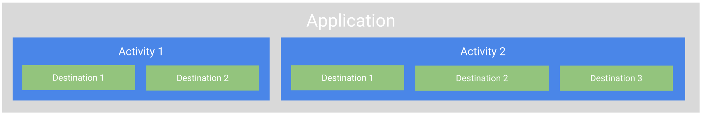

footer: @askashdavies
autoscale: true
build-lists: true
header: Open Sans
text: Open Sans
footer-style: Open Sans


## Android JetPack
### Navigation Component


---


^ Navigation is hard. Misnomer not start

^ Often a topic of confusion, difficult for new developers

^ Navigating from screen to screen being fundamental to your app

^ What makes navigation so confusing?

---

[.background-color: #ffffff]


^ Started with activities, Android level component

^ like content providers, services and broadcast receivers

^ Intent to navigate from one to the other.

^ quickly out of hand in larger projects.

---

## 😰

^ Activities knowing about other activity implementations

^ storing complex intent argument compositions

^ conditional navigation difficult to maintain

---

> ## "Once we have gotten in to this entry-point to your UI, we really don't care how you organise the flow inside."
-- Dianne Hackborn, Android Framework team

^ Controversial, framework not opinionated, does not care about app structure

^ Once activity started, you can handle the flow

---

## JetPack: Navigation


^ Introducing JetPack

^ JetPack is...

---

## JetPack: Navigation 

- Libraries 📚
- Plugin 🔌
- Tooling 🔧

^ a set of libraries, a plugin, and tooling for unifying and simplifying Android Navigation

---

- Fragment transactions
- Up and back actions
- Standardised transition resources
- Deep link implementation
- Easy navigation patterns
- Type safe arguments

^ Handles all the common parts of navigation patterns

^ Easy handing of patterns like drawers or bottom navigation

---

## Principles of Navigation

^ Navigation core part of UX, principles set a baseline for consistent and intuitive UX

^ Navigation component designed to implement principles of navigation by default

---

## JetPack: Navigation


^ JetPack built from three components

---

## Navigation Graph


^ Android Studio 3.3 introduces the new navigation editor

^ graphical editor to build your application navigation graph

---

[.background-color: #2d3032]
[.footer: ]


^ Destinations to the left showing the host and graph hierarchy

^ destinations can be an activity, fragment, or custom view

^ graph editor contains a visual representation showing how the destinations interact

^ the arrows indicate actions which can be invoked programmatically

^ each destination has attributes displayed on the right

^ attributes allow you to configure arguments and deeplinks

---

## NavHostFragment

```xml
<fragment
    android:id="@+id/nav_host_fragment"
    android:name="androidx.navigation.fragment.NavHostFragment"
    android:layout_width="match_parent"
    android:layout_height="match_parent"
    app:defaultNavHost="true"
    app:navGraph="@navigation/nav_graph" />
```

^ Fragment widget that will act as a host for your destinations,

^ compatible only with Fragments as the navigation

^ lifecycle, configuration, animations handled automatically.

---

## NavController

- `Fragment.findNavController()`

- `View.findNavController()`

- `Activity.findNavController(viewId: Int)`

^ Each NavHostFragment has controller that allows you to invoke navigation actions 

^ NavController can be retrieved from fragment, activity, or view.

^ Recommended mechanism is with navigate method

---

## 💪 SafeArgs

^ Plugin enables generation of type safe args from your nav graph,

^ Kotlin class, null safe, and provides defaults

^ Only use primitive or parcelable values

^ Mark with @Keep to keep after Proguard

---

## SafeArgs: Directions

### [fit] `MainFragmentDirections.mainToViewBalance()`

```xml
<fragment
  android:id="@+id/fragmentMain"
  android:name="com.google.sample.MainFragment"
  android:label="@string/main_title"
  tools:layout="@layout/main_fragment">

  <action
    android:id="@+id/mainToViewBalance"
    app:destination="@+id/fragmentViewBalance"/>

</fragment> 
```

^ Given this example, safe args will generate a direction class for destinations

^ MainFragment destination, action mainToViewBalance, recommended invocation

---

## SafeArgs: Directions

```xml
<fragment
  android:id="@+id/fragmentViewBalance"
  android:name="com.google.sample.ViewBalanceFragment"
  android:label="@string/view_balance_title"
  tools:layout="@layout/view_balance_fragment">
  
  <argument
    android:name="balanceAmount"
    app:argType="integer"/>

</fragment>
```

^ Lets add an argument to the view balance fragment

^ This will update the generated direction class to take the argument

^ Will also generate an args class on the destination to deserialise

---

## SafeArgs: Args

[.code-highlight: 7, 17-18]

```kotlin
class MainFragment: Fragment() {
  
  override fun onViewCreated(view: View, savedInstanceState: Bundle?) {
    super.onViewCreated(view, savedInstanceState)

    viewTransactionsButton.setOnClickListener { view ->
      MainFragmentDirections.mainToViewBalance(100)
    }
  }
}

class ViewBalanceFragment : Fragment() {
  
  override fun onViewCreated(view: View, savedInstanceState: Bundle?) {
    super.onViewCreated(view, savedInstanceState)

    val args = ViewBalanceFragmentArgs.fromBundle(arguments!!)
    balance.setText(String.format("%.2d", args.balanceAmount))
  }
}
```

^ Must now pass a parameter to the main fragment direction

^ can deserialise in the receiving balance fragment used the extras

^ Instantiate args directly for use with activity

---

## SafeArgs: Getting Started

```gradle
buildscript {
  repositories {
    google()
  }
  
  dependencies {
    classpath "androidx.navigation:navigation-safe-args-gradle-plugin:2.0.0"
  }
}

apply plugin: 'androidx.navigation.safeargs.kotlin'
```

---

## 🛠 Migrating

^ Making use of the navigation library might be difficult if you're already heavily using activities,

^ can already make use of safeargs to generate your activity arguments,

^ should probably decide whether you need to.

---

## 🛠 Migrating

- Move screen behaviour away from activities

- Create new activity for NavHostFragment

- Move existing activity logic to fragment

- Initialise fragment in host activity

- Pass arguments as necessary

- Create navigation graph

- Profit

^ Convert activity to fragment and include within navigation graph

^ Invoke navigation manually without using NavHost or NavController

^ Slowly move single activity/fragment pairs into larger navigation graph

---

## 🔍 Scoping

^ Remember earlier with the application scope being too large for a flow of activities?

---

[.background-color: #ffffff]


---

[.background-color: #ffffff]



^ Introducing destinations with our navigation graph means we can share data with activity view models

---

[.footer: ]

## Ian Lake: Single Activity: Why, When, and How 
### bit.ly/2Jo94x9


^ Ian goes covers the topic of the Single Activity and how you take advantage of that structure and migrate to it.

---

## Thanks!

### bit.ly/2V6HZk4


