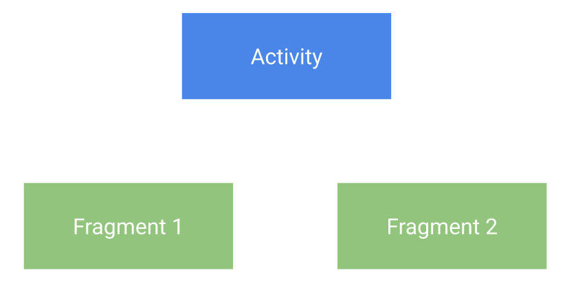

footer: @askashdavies
autoscale: true
build-lists: true
header: Open Sans
text: Open Sans
footer-style: Open Sans


## Android JetPack
### Navigation Component


---


^ Navigation is hard. Misnomer not great start to talk

^ Often a topic of confusion, difficult for new developers

^ Navigating from screen to screen being fundamental to your app

^ What makes navigation so confusing?

---

[.background-color: #ffffff]


^ Started with activities, Android level component

^ like content providers, services and broadcast receivers

---

```kotlin
class MainActivity : AppCompatActivity {

  private val message: EditText
    get() = findViewById(R.id.message)
    
  override fun onCreate(savedInstanceState: Bundle) {
    /* ... */
  }
  
  fun sendMessage() {
    val intent = Intent(this, DisplayMessageActivity::class.java)
    intent.putExtra(DisplayMessageActivity.EXTRA_MESSAGE, message.text.toString())
    startActivity(intent)
  }
}
```

^ Simplest form, use Intent to navigate

^ Quickly out of hand in larger projects
---

## 😰

^ Activities knowing about other activity implementations

^ Store complex intent argument compositions

^ Conditional navigation difficult to maintain

---

[.background-color: #ffffff]


^ Since you need to pass data from one activity to the next

^ Dependency graphs include resources only for a few screens

^ Survive for the entire duration in the application scope

---

> ## "Once we have gotten in to this entry-point to your UI, we really don't care how you organise the flow inside."
-- Dianne Hackborn, Android Framework team

^ Controversial, framework not opinionated, does not care about app structure

^ Once activity started, you can handle the flow
---

## 🍯 🐝

^ Honeycomb (14) breaks up screens into Fragments

^ Build richer, more interactive user interfaces

---

[.background-color: #ebebeb]
[.footer: ]


^ Demonstrated with a master / detail interface

^ Responsive layout for larger screens (tablets)

^ "also run properly on smaller screen devices"

---

```java
public class MainActivity extends FragmentActivity {

  @Override
  public void onCreate(Bundle savedInstanceState) {
    super.onCreate(savedInstanceState);
    setContentView(R.layout.news_articles);

    // Check that the activity is using the layout version with
    // the fragment_container FrameLayout
    if (findViewById(R.id.fragment_container) != null) {

      // However, if we're being restored from a previous state,
      // then we don't need to do anything and should return or else
      // we could end up with overlapping fragments.
      if (savedInstanceState != null) {
        return;
      }

      // Create a new Fragment to be placed in the activity layout
      HeadlinesFragment firstFragment = new HeadlinesFragment();
    
      // In case this activity was started with special instructions from an
      // Intent, pass the Intent's extras to the fragment as arguments
      firstFragment.setArguments(getIntent().getExtras());

      // Add the fragment to the 'fragment_container' FrameLayout
      getSupportFragmentManager()
        .beginTransaction()
        .add(R.id.fragment_container, firstFragment)
        .commit();
    }
  }
}
```

^ Sample from Android documentation, not yet in Kotlin

^ Fragments added / removed using fragment transactions

^ More complex than starting an Activity

---

[.footer: ]
[.background-color: #ffffff]


^ Introduced more complex lifecycle behaviour than with Activities

^ https://github.com/JoseAlcerreca/android-lifecycles/blob/a5dfd030a70989ad2496965f182e5fa296e6221a/cheatsheetfragments.pdf

---

## ➡️ ⬆️ ➡️ ⬅️ ➡️

^ Can mess up back stack if not implemented correctly

^ Invalid stack, unexpected behaviour on configuration change.

---



^ Communication between fragments is quite difficult

^ Previously check for interface onAttach or use event bus

---

## JetPack: Navigation


^ Introducing JetPack

^ JetPack is...

---

## JetPack: Navigation 

- Libraries 📚
- Plugin 🔌
- Tooling 🔧

^ a set of libraries, a plugin, and tooling for unifying and simplifying Android Navigation

---

- Fragment transactions
- Up and back actions
- Standardised transition resources
- Deep link implementation
- Easy navigation patterns
- Type safe arguments

^ Handles all the common parts of navigation patterns

^ Easy handing of patterns like drawers or bottom navigation

---

## Principles of Navigation

^ Navigation core part of UX, principles set consistent / intuitive UX

^ Designed to implement principles of navigation by default

---

[.background-color: #ffffff]

## Fixed Start Destination


^ Every app has a fixed start destination

^ First and last screen pressing the back button

---

## 🥞

^ Navigation state is represented as a stack of destinations

^ Representation history of the user flow

---

## ⬆️ ⬅️

^ Up and back are identical within your apps task

---

## ⬆️ 🙅‍♀️

^ Up never exist your application

---

[.background-color: #ffffff]

## Deep linking simulates manual navigation

 

^ Back stack will be created as though you had navigated there yourself

---

## JetPack: Navigation


^ JetPack built from three components

---

## Navigation Graph


^ Android Studio 3.3 introduces the new navigation editor

^ graphical editor to build your application navigation graph

---

[.background-color: #2d3032]
[.footer: ]


^ Destinations to the left showing the host and graph hierarchy

^ destinations can be an activity, fragment, or custom view

^ graph editor contains a visual representation showing how the destinations interact

^ the arrows indicate actions which can be invoked programmatically

^ each destination has attributes displayed on the right

^ attributes allow you to configure arguments and deeplinks

---

**nav_graph.xml**

```xml
<navigation xmlns:android="http://schemas.android.com/apk/res/android"
    xmlns:app="http://schemas.android.com/apk/res-auto"
    xmlns:tools="http://schemas.android.com/tools"
    android:id="@+id/navigation"
    app:startDestination="@+id/fragmentMain">

  <fragment
      android:id="@+id/fragmentMain"
      android:name="com.google.sample.MainFragment"
      android:label="@string/main_title"
      tools:layout="@layout/main_fragment">

    <action
        android:id="@+id/mainToViewBalance"
        app:destination="@+id/fragmentViewBalance"/>

  </fragment>

  <fragment
      android:id="@+id/fragmentViewBalance"
      android:name="com.google.sample.ViewBalanceFragment"
      android:label="@string/view_balance_title"
      tools:layout="@layout/view_balance_fragment" />

</navigation>
```

^ But if you're like me and prefer to hand code you can create your graph in xml too

---

## NavHostFragment

```xml
<fragment
    android:id="@+id/nav_host_fragment"
    android:name="androidx.navigation.fragment.NavHostFragment"
    android:layout_width="match_parent"
    android:layout_height="match_parent"
    app:defaultNavHost="true"
    app:navGraph="@navigation/nav_graph" />
```

^ Fragment widget that will act as a host for your destinations

^ Compatible only with Fragments as the navigation

^ Lifecycle, configuration, animations handled automatically

---

## NavController

- `Fragment.findNavController()`

- `View.findNavController()`

- `Activity.findNavController(viewId: Int)`

^ Each NavHostFragment has controller that allows you to invoke navigation actions 

^ NavController can be retrieved from fragment, activity, or view

^ Recommended mechanism is with navigate method

---

## Actions

```kotlin
viewTransactionsButton.setOnClickListener { view ->
   view.findNavController().navigate(R.id.viewTransactionsAction)
}
```

```kotlin
button.setOnClickListener(
    Navigation.createNavigateOnClickListener(R.id.next_fragment, null)
)
```

^ Recommended mechanism to navigate with `navigate` method and `@IdRes`

^ With controller, navigate to action defined in navigation graph

^ Alternatively create navigation listener to retrieve view controller

---

## 💪 SafeArgs

^ Plugin enables generation of type safe args from your nav graph

^ Kotlin class, null safe, and provides defaults

^ Only use primitive or parcelable values

^ Mark with @Keep to keep after Proguard

---

## SafeArgs: Directions

### [fit] `MainFragmentDirections.mainToViewBalance()`

```xml
<fragment
  android:id="@+id/fragmentMain"
  android:name="com.google.sample.MainFragment"
  android:label="@string/main_title"
  tools:layout="@layout/main_fragment">

  <action
    android:id="@+id/mainToViewBalance"
    app:destination="@+id/fragmentViewBalance"/>

</fragment> 
```

^ Given example, safe args generates direction class for destinations with an action

^ Includes necessary arguments, graph changes will break compilation

---

## SafeArgs: Directions

```xml
<fragment
  android:id="@+id/fragmentViewBalance"
  android:name="com.google.sample.ViewBalanceFragment"
  android:label="@string/view_balance_title"
  tools:layout="@layout/view_balance_fragment">
  
  <argument
    android:name="balanceAmount"
    app:argType="integer"/>

</fragment>
```

^ Lets add an argument to the view balance fragment

^ This will update the generated direction class to take the argument

^ Will also generate an args class on the destination to deserialise

---

## SafeArgs: Args

[.code-highlight: 7, 17-18]

```kotlin
class MainFragment: Fragment() {
  
  override fun onViewCreated(view: View, savedInstanceState: Bundle?) {
    super.onViewCreated(view, savedInstanceState)

    viewTransactionsButton.setOnClickListener { view ->
      MainFragmentDirections.mainToViewBalance(100)
    }
  }
}

class ViewBalanceFragment : Fragment() {
  
  override fun onViewCreated(view: View, savedInstanceState: Bundle?) {
    super.onViewCreated(view, savedInstanceState)

    val args = ViewBalanceFragmentArgs.fromBundle(arguments!!)
    balance.setText(String.format("%.2d", args.balanceAmount))
  }
}
```

^ Must now pass a parameter to the main fragment direction

^ Deserialise in the receiving balance fragment used the extras

---

## SafeArgs: Activities 🎉🍾

^ Also works with activity destinations

^ Can use plugin immediately

---

## SafeArgs: Activities

```kotlin
class MainActivity : Activity {

  override fun onCreate(savedInstanceState: Bundle) {
    super.onCreate(savedInstanceState)
    
    val args = ViewBalanceActivityArgs(100)
    val intent = Intent(this, ViewBalanceActivity::class.java)
    
    startActivity(intent, bundle.toBundle())
  }
}
```

^ Destinations class not generated for destinations without navigation host

^ Directly use args class for intent bundle

---

## SafeArgs: Getting Started

```gradle
buildscript {
  repositories {
    google()
  }
  
  dependencies {
    classpath "androidx.navigation:navigation-safe-args-gradle-plugin:2.0.0"
  }
}

apply plugin: 'androidx.navigation.safeargs.kotlin'
```

---

## 🛠 Migrating

^ May be Difficult with heavy use of activities

^ Use safeargs for activity arguments

^ Decide on benefit of migration

---

## 🛠 Migrating

- Move screen behaviour away from activities

- Create new activity for NavHostFragment

- Move existing activity logic to fragment

- Initialise fragment in host activity

- Pass arguments as necessary

- Create navigation graph

^ Convert activity to fragment and include within navigation graph

^ Invoke navigation manually without using NavHost or NavController

^ Slowly move single activity/fragment pairs into larger navigation graph

---

## 💰 Profit

---

## 🔍 Scoping

^ Remember application scope too large for activity flow?

---

[.background-color: #ffffff]


---

[.background-color: #ffffff]


^ Navigation graph destinations can easily share data with activity view models

---

[.footer: ]

## Ian Lake: Single Activity: Why, When, and How 
### bit.ly/2Jo94x9


^ Ian covers how to take advantage of single activity

^ How you take advantage of that structure and migrate to it

---

## Thanks!


