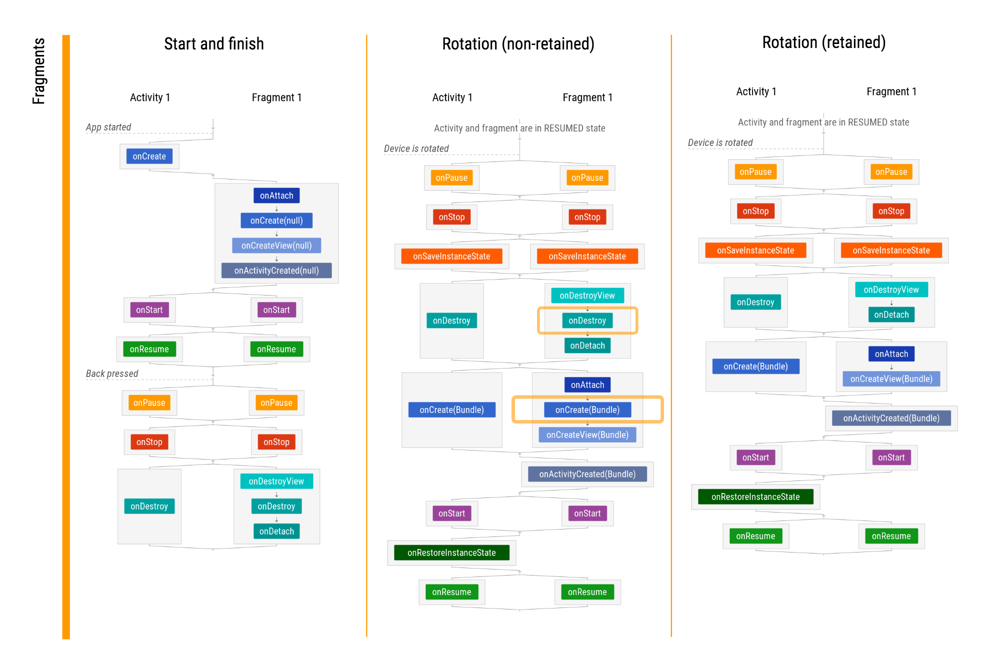

autoscale: true
build-lists: true
footer: @askashdavies
footer-style: Open Sans
header: Open Sans
slidenumbers: true
slide-transition: true
theme: Simple, 6
text: Open Sans


## Android JetPack
### Navigation Component


---


^ Navigation is hard. Misnomer not great start to talk

^ Often a topic of confusion, difficult for new developers

^ Navigating from screen to screen being fundamental to your app

^ What makes navigation so confusing?

---

[.background-color: #ffffff]


^ Started with activities, Android level component

^ like content providers, services and broadcast receivers

---

```kotlin
class MainActivity : AppCompatActivity {

  private val message: EditText
    get() = findViewById(R.id.message)
    
  override fun onCreate(savedInstanceState: Bundle) {
    /* ... */
  }
  
  fun sendMessage() {
    val intent = Intent(this, DisplayMessageActivity::class.java)
    intent.putExtra(DisplayMessageActivity.EXTRA_MESSAGE, message.text.toString())
    startActivity(intent)
  }
}
```

^ Simplest form, use Intent to navigate

^ Quickly out of hand in larger projects

---

## 😰

^ Activities dependent on other activity implementations

^ Store complex intent argument compositions

^ Conditional navigation difficult to maintain

---

> ### "Once we have gotten in to this entry-point to your UI, we really don't care how you organise the flow inside."
-- Dianne Hackborn, Android Framework team, 2016

^ 2016 back when Google Plus was still a thing

^ Controversial, framework not opinionated, does not care about app structure

^ Once activity started, you can handle the flow

---

## 🍯 🐝

^ Honeycomb (14) breaks up screens into Fragments

^ Build richer, more interactive user interfaces

^ Beginning of design orientated thinking

---

[.background-color: #ebebeb]
[.footer: ]


^ Demonstrated with a master / detail interface

^ Responsive layout for larger screens (tablets)

^ "also run properly on smaller screen devices"

---

```java
public class MainActivity extends FragmentActivity {

  @Override
  public void onCreate(Bundle savedInstanceState) {
    super.onCreate(savedInstanceState);
    setContentView(R.layout.news_articles);

    // Check that the activity is using the layout version with the fragment_container FrameLayout
    if (findViewById(R.id.fragment_container) != null) {

      // However, if we're being restored from a previous state, then we don't need to do anything,
      // and should return or else we could end up with overlapping fragments.
      if (savedInstanceState != null) {
        return;
      }

      // Create a new Fragment to be placed in the activity layout
      HeadlinesFragment firstFragment = new HeadlinesFragment();
    
      // In case this activity was started with special instructions from an
      // Intent, pass the Intent's extras to the fragment as arguments
      firstFragment.setArguments(getIntent().getExtras());

      // Add the fragment to the 'fragment_container' FrameLayout
      getSupportFragmentManager()
        .beginTransaction()
        .add(R.id.fragment_container, firstFragment)
        .commit();
    }
  }
}
```

^ Sample from Android documentation, not yet in Kotlin

---

```java, [.highlight: 18, 22, 25-28]
public class MainActivity extends FragmentActivity {

  @Override
  public void onCreate(Bundle savedInstanceState) {
    super.onCreate(savedInstanceState);
    setContentView(R.layout.news_articles);

    // Check that the activity is using the layout version with the fragment_container FrameLayout
    if (findViewById(R.id.fragment_container) != null) {

      // However, if we're being restored from a previous state, then we don't need to do anything,
      // and should return or else we could end up with overlapping fragments.
      if (savedInstanceState != null) {
        return;
      }

      // Create a new Fragment to be placed in the activity layout
      HeadlinesFragment firstFragment = new HeadlinesFragment();
    
      // In case this activity was started with special instructions from an
      // Intent, pass the Intent's extras to the fragment as arguments
      firstFragment.setArguments(getIntent().getExtras());

      // Add the fragment to the 'fragment_container' FrameLayout
      getSupportFragmentManager()
        .beginTransaction()
        .add(R.id.fragment_container, firstFragment)
        .commit();
    }
  }
}
```

^ Fragments added / removed using fragment transactions

^ More complex than starting an Activity

---

```java, [.highlight: 11-15]
public class MainActivity extends FragmentActivity {

  @Override
  public void onCreate(Bundle savedInstanceState) {
    super.onCreate(savedInstanceState);
    setContentView(R.layout.news_articles);

    // Check that the activity is using the layout version with the fragment_container FrameLayout
    if (findViewById(R.id.fragment_container) != null) {

      // However, if we're being restored from a previous state, then we don't need to do anything,
      // and should return or else we could end up with overlapping fragments.
      if (savedInstanceState != null) {
        return;
      }

      // Create a new Fragment to be placed in the activity layout
      HeadlinesFragment firstFragment = new HeadlinesFragment();
    
      // In case this activity was started with special instructions from an
      // Intent, pass the Intent's extras to the fragment as arguments
      firstFragment.setArguments(getIntent().getExtras());

      // Add the fragment to the 'fragment_container' FrameLayout
      getSupportFragmentManager()
        .beginTransaction()
        .add(R.id.fragment_container, firstFragment)
        .commit();
    }
  }
}
```

^ Additional state issues with checking for activity recreation

^ We can get overlapping fragments after configuration change.

---

## Activity Lifecycle != Fragment Lifecycle

^ Not just creation and use of fragments that included more complexity

^  Introduced more complex lifecycle behaviour than with Activities

---

[.footer: Jose Alcerreca | Lifecycles cheet sheet beta1 (AndroidP/Jetpack 1.0) ]
[.footer-style: #666666]
[.background-color: #ffffff]



^ Graph created by Jose Alcerreca

^ https://github.com/JoseAlcerreca/android-lifecycles/blob/a5dfd030a70989ad2496965f182e5fa296e6221a/cheatsheetfragments.pdf

---

## ➡️ ⬆️ ➡️ ⬅️ ➡️

^ Explicitly invoke addToBackStack or add on transactions

^ Can mess up back stack if not implemented correctly

^ Invalid stack, unexpected behaviour on configuration change.

---

### (supportFragmentManager || childFragmentManager)?

^ Fragments allow adding fragments inside fragments

^ Used for nested view pagers inside fragments

^ Former can leak context if used inside fragments

---


^ Communication between fragments is quite difficult

^ Previously check for interface onAttach or use event bus

---

## Bundles 📦

^ Like activities we must let the system manage instance

^ Serialisation of data provided through bundles

^ Don't use fragment constructors

---

## FragmentFactory
### androidx.fragment:fragment:1.1.0-beta01

^ As ov 1.1.0 you can set a FragmentFactory on any FragmentManager

^ Control how new Fragment instances are instantiated

---

## Fragments? 🙀

^ These are pretty compelling arguments to avoid Fragments in general

^ Tempted to use pure Activity sequences or other alternatives

^ Many alternative architecture options created, Mortar / Flow

---

## Fragments? 🤔

^ There may be some good reasons to use Fragments

---

## Activity Capabilities ⏳

^ Activity capabilities tied to API version, need to wait for new features

^ Activity features in new versions of Android cannot be backported

---

## Shared Element Transition (API 21+)


^ eg SharedElementTransitions only available on API 21 and above

^ Compat shims only provide graceful failure saving API checks

---

## CompatShims < Enough

^ Hidden gotchas, don't guarantee consistent user experience

---

## ~~android.app.Fragment~~
## `androidx.fragment.app.Fragment`

^ Native Android fragment deprecated in API 28

^ Fragments entirely in androidx can be updated per app

---

## Scopes 🔍

^ One of the real benefits comes in the form of scoping

---

[.background-color: #ffffff]
[.text: #666666]

## Scopes


^ Sharing instances or resources across different activities is difficult

^ Each activity exists in isolation without much of a larger scope

---

[.background-color: #ffffff]
[.text: #666666]

## Scopes


^ Dependency graphs include resources only for a few screens

^ Survive for the entire duration in the application scope

---

[.background-color: #ffffff]
[.text: #666666]

## Scopes


^ With usage of a third framework type scopes can be nested

^ Shared data can be provided by activity scope by ViewModel

---

#  🤔🧁

^ So how can we have our cake and eat it?

^ To benefit from the features available in fragments

^ Without suffering from the difficulties of using them

---


^ Last year Google introduced us to Android JetPack which included a variety of tools

^ Dedicated to helping us bootstrap Android development

^ Opinionted and clean implementations for common problems

^ With the additional of comparmentalising the support library fragment 

^ Renaming support dependencies to androidx and starting with independent versioning 

---

[.background-color: #ffffff]
[.text: #666666]

## Android JetPack 


^ Foundation picking up where the support library left off

^ Including ktx helpers, multidex and security

---

[.background-color: #ffffff]
[.text: #666666]

## Android JetPack 


^ Architecture encompassing the arch components like LiveData and ViewModel

^ Navigation, paging, and room persistence

---

[.background-color: #ffffff]
[.text: #666666]

## Android JetPack 


^ Media playback, notifications, permissions, and slices

---

[.background-color: #ffffff]
[.text: #666666]

## Android JetPack 


^ Finally UI, including Fragments, Transitions, Animations, and Emoji

---

## Android JetPack: Navigation 

^ Introducing JetPack

^ JetPack is...

---

## Android JetPack: Navigation 

- Libraries 📚
- Plugin 🔌
- Tooling 🔧

^ a set of libraries, a plugin, and tooling for unifying and simplifying Android Navigation

---

- Fragment transactions
- Up and back actions
- Standardised transition resources
- Deep link implementation
- Easy navigation patterns
- Type safe arguments

^ Handles all the common parts of navigation patterns

^ Easy handing of patterns like drawers or bottom navigation

---

## Principles of Navigation

^ Navigation core part of UX, principles set consistent / intuitive UX

^ Designed to implement principles of navigation by default

---

[.background-color: #ffffff]
[.text: #666666]

## Fixed Start Destination


^ Every app has a fixed start destination

^ First and last screen pressing the back button

---

## State as Stack 🥞

^ Navigation state is represented as a stack of destinations

^ Representation history of the user flow that can be reversable and replayable

---

## ⬆️ ⬅️

^ Up and back are identical within your apps task

---

## ⬆️ 🙅‍♀️

^ Up never exist your application

---

[.background-color: #ffffff]
[.text: #666666]

## Deep Link Simulates Manual Navigation

 

^ Back stack will be created as though you had navigated there yourself

---

## JetPack: Navigation


^ Primary ideal of Navigation is to use existing an accessible APIs

^ Not private or limited by library scope

^ Built from three components

---

## Navigation Graph


^ Android Studio 3.3 introduces the new navigation editor

^ graphical editor to build your application navigation graph

---

[.background-color: #2d3032]
[.footer: ]


^ Destinations to the left showing the host and graph hierarchy

^ destinations can be an activity, fragment, dialog, or custom view

^ graph editor contains a visual representation showing how the destinations interact

^ the arrows indicate actions which can be invoked programmatically

^ each destination has attributes displayed on the right

^ attributes allow you to configure arguments and deeplinks

---

## Destination Types

- Activity `<activity>`

- Fragment `<fragment>`

- Dialog `<dialog>` (2.1.0+)

^ Navigation destinations can be an activity

---

## Destination Types (Custom)
#### developer.android.com/guide/navigation/navigation-add-new

- Extend `Navigator<T>` with your type

- Provide `Destination` implementation

- Configure arguments after inflation

- Augment `NavController`

---

**nav_graph.xml**

```xml
<navigation xmlns:android="http://schemas.android.com/apk/res/android"
    xmlns:app="http://schemas.android.com/apk/res-auto"
    xmlns:tools="http://schemas.android.com/tools"
    android:id="@+id/navigation"
    app:startDestination="@+id/fragmentMain">

  <fragment
      android:id="@+id/fragmentMain"
      android:name="com.google.sample.MainFragment"
      android:label="@string/main_title"
      tools:layout="@layout/main_fragment">

    <action
        android:id="@+id/mainToViewBalance"
        app:destination="@+id/fragmentViewBalance"/>

  </fragment>

  <fragment
      android:id="@+id/fragmentViewBalance"
      android:name="com.google.sample.ViewBalanceFragment"
      android:label="@string/view_balance_title"
      tools:layout="@layout/view_balance_fragment" />

</navigation>
```

^ But if you're like me and prefer to hand code you can create your graph in xml too

---

## Resource Inflation 🎈

^ Due to the navigation resource being an XML document, this means that the navigation controller

^ Inflates the resource at runtime, thus resulting in graph errors at runtime not at compile time

^ Negligible inflation cost, part of your layouting

---

## NavHostFragment

```xml
<fragment
    android:id="@+id/nav_host_fragment"
    android:name="androidx.navigation.fragment.NavHostFragment"
    android:layout_width="match_parent"
    android:layout_height="match_parent"
    app:defaultNavHost="true"
    app:navGraph="@navigation/nav_graph" />
```

^ Fragment widget that will act as a host for your destinations

^ Compatible only with Fragments as the navigation

^ Lifecycle, configuration, animations handled automatically

^ Navigation hosts all movement and screens

---

## NavController

- `Fragment.findNavController()`

- `View.findNavController()`

- `Activity.findNavController(viewId: Int)`

^ Each NavHostFragment has controller that allows you to invoke navigation actions 

^ NavController can be retrieved from fragment, activity, or view

^ Recommended mechanism is with navigate method

---

## Actions

```kotlin
viewTransactionsButton.setOnClickListener { view ->
   view.findNavController().navigate(R.id.viewTransactionsAction)
}
```

```kotlin
button.setOnClickListener(
    Navigation.createNavigateOnClickListener(R.id.next_fragment, null)
)
```

^ Recommended mechanism to navigate with `navigate` method and `@IdRes`

^ With controller, navigate to action defined in navigation graph

^ Alternatively create navigation listener to retrieve view controller

---

## Deep Links 🔥

^ The navigation compoennt can generate deep link intent filters for you

^ Declare the relevant graph in your manifest

---

## Deep Links 🔥

```xml, [.highlight: 10]
<?xml version="1.0" encoding="utf-8"?>
<manifest xmlns:android="http://schemas.android.com/apk/res/android"
  package="com.example.myapplication">

  <application ... >

    <activity name=".ProfileActivity" ...>

        ...
        <nav-graph android:value="@navigation/main.xml" />
        ...
    </activity>
  </application>
</manifest>
```

---

## Deep Links 🔥

```kotlin
<fragment 
  android:id="@+id/profile"
  android:name=".ProfileActivity">

  <deepLink app:uri="www.example.com/profile/{userId}" />
</fragment>
```

---

## Navigation Styles 📐

---

[.background-color: #dfdfdf]
[.text: #666666]

## Navigation Styles 📐
### Toolbar


^ The familiar toolbar navigation style and it's contextual variant

---

[.background-color: #dfdfdf]
[.text: #666666]

## Navigation Styles 📐
### Bottom


^ The ever popular bottom navigation bar that has no become enshrined in Material design
^ The familiar toolbar navigation style and it's contextual variant

---

[.background-color: #dfdfdf]
[.text: #666666]

## Navigation Styles 📐
### Drawer


^ The historically relevant navigation drawer allowing for extensible navigation items

---

## NavigationUI
### `setupWithNavController()`

^ Configuration of your navigation structure is provided with an AppBarConfiguration

^ Responsible for configuring top-level destinations with navigation drawer

---

```kotlin
class AwesomeActivity : AppCompatActivity() {

  private val controller: NavController by lazy(NONE) { findNavController(this, R.id.host) }
  private val drawer: DrawerLayout by lazy(NONE) { findViewById<DrawerLayout>(R.id.drawer) }
  private val toolbar: Toolbar by lazy(NONE) { findViewById<Toolbar>(R.id.toolbar) }
  
  override fun onCreate(savedInstanceState: Bundle?) {
    super.onCreate(savedInstanceState)
    setContentView(R.layout.awesome_activity)

    toolbar.setupWithNavController(controller, drawer)
  }
}
```

^ In most cases this will be enough to configure a navigation drawer

^ Many other variations provided via NavigationUI and Kotlin extensions for other flavours

---

## NavigationUI

```kotlin
NavigationUI.setupActionBarWithNavController(
  activity: AppCompatActivity,
  controller: NavController,
  configuration: AppBarConfiguration
)

NavigationUI.setupWithNavController(
  toolbar: Toolbar,
  controller: NavController,
  configuration: AppBarConfiguration
)
```

^ Setup with actionBar retrieves ActionBar from Activity by getSupportActionBar

^ Both methods have variants for each different use case of DrawerLayout, CollapsingToolbar, Toolbar, and BottomSheet

^ Each variants constructs an appropriate `AppBarConfiguration` for use 

---

## Bundles 📦

^ Despite having a better scope hierarchy some parameters need to be serialised

^ No different from activities or traditional fragments

---

## Honourable Mention
### Eugenio Marletti: Android Extras Delegates
#### github.com/Takhion/android-extras-delegates

^ When starting off with Kotlin, this was our goto choice for serialising intent and bundle extras

---

## Android Extras Delegates 👍

```kotlin
class SomeActivity : Activity() {

  companion object : ActivityCompanion<IntentOptions>(
    intentOptions = IntentOptions, 
    kclass = SomeActivity::class
  )

  object IntentOptions {
  
    var Intent.someExtra by IntentExtra.String()
  }
}
```

^ This was nice because naming of the parameter could be taken care of in a single location

---

## SafeArgs 💪

^ Simple concept, plugin enables generation of type safe args from your nav graph

^ Kotlin class, null safe, and provides defaults

^ Only use primitive or parcelable values

^ Mark with @Keep to keep after Proguard

---

## SafeArgs: Directions

#### [fit] `MainFragmentDirections.mainToViewBalance()`

```xml
<fragment
  android:id="@+id/fragmentMain"
  android:name="com.google.sample.MainFragment"
  android:label="@string/main_title"
  tools:layout="@layout/main_fragment">

  <action
    android:id="@+id/mainToViewBalance"
    app:destination="@+id/fragmentViewBalance"/>

</fragment> 
```

^ Given example, safe args generates direction class for destinations with an action

^ Includes necessary arguments, graph changes will break compilation

---

## SafeArgs: Directions

```xml
<fragment
  android:id="@+id/fragmentViewBalance"
  android:name="com.google.sample.ViewBalanceFragment"
  android:label="@string/view_balance_title"
  tools:layout="@layout/view_balance_fragment">
  
  <argument
    android:name="balanceAmount"
    app:argType="integer"/>

</fragment>
```

^ Lets add an argument to the view balance fragment

^ This will update the generated direction class to take the argument

^ Will also generate an args class on the destination to deserialise

---

## SafeArgs: Args

[.code-highlight: 7, 17-18]

```kotlin
class MainFragment: Fragment() {
  
  override fun onViewCreated(view: View, savedInstanceState: Bundle?) {
    super.onViewCreated(view, savedInstanceState)

    viewTransactionsButton.setOnClickListener { view ->
      MainFragmentDirections.mainToViewBalance(100)
    }
  }
}

class ViewBalanceFragment : Fragment() {
  
  override fun onViewCreated(view: View, savedInstanceState: Bundle?) {
    super.onViewCreated(view, savedInstanceState)

    val args = ViewBalanceFragmentArgs.fromBundle(arguments!!)
    balance.setText(String.format("%.2d", args.balanceAmount))
  }
}
```

^ Must now pass a parameter to the main fragment direction

^ Deserialise in the receiving balance fragment used the extras

---

## SafeArgs: Generated Args 💻

```kotlin
data class ViewBalanceFragmentArgs(val balanceAmount: Int) : NavArgs {
    @Suppress("CAST_NEVER_SUCCEEDS")
    fun toBundle(): Bundle {
        val result = Bundle()
        result.putInt("balanceAmount", this.balanceAmount)
        return result
    }

    companion object {
        @JvmStatic
        fun fromBundle(bundle: Bundle): FinanceBorrowerFragmentArgs {
            bundle.setClassLoader(FinanceBorrowerFragmentArgs::class.java.classLoader)
            val __balanceAmount : Int
            if (bundle.containsKey("balanceAmount")) {
                __balanceAmount = bundle.getInt("balanceAmount")
            } else {
                throw IllegalArgumentException("Required argument \"balanceAmount\" is missing and does not have an android:defaultValue")
            }
            return FinanceBorrowerFragmentArgs(__balanceAmount)
        }
    }
}
```

^ As with most generated code, it's not always so pretty to look at, but it's consistent and reliable

^ Simple operations serialise the data correctly, and has support for enums, parcelables and other primitive types

^ Nothing magical here, except reliable and scalable

---

## SafeArgs: Generated Directions

```kotlin
class MainFragmentDirections private constructor() {
  private data class MainToViewBalance(val balanceAmount: Int) : NavDirections {
    override fun getActionId(): Int = R.id.mainToViewBalance

    @Suppress("CAST_NEVER_SUCCEEDS")
    override fun getArguments(): Bundle {
      val result = Bundle()
      result.putInt("balanceAmount", this.index)
      return result
    }
  }

  companion object {
    fun mainToViewBalance(balanceAmount: Int): NavDirections = BorrowerToBorrower(index, financeBorrower)
  }
}
```

^ Again not very exciting, but we can be certain that our serialisation will happen correctly

---

## Single Source of Truth

^ By defining your navigation graph as a resource

^ Resource acts as a single source of truth

^ Not open to interpretation by calling activities

---

## SafeArgs: Activities 🎉🍾

^ Also works with activity destinations

^ Can use plugin immediately

---

## SafeArgs: Activities

```kotlin
class MainActivity : Activity {

  override fun onCreate(savedInstanceState: Bundle) {
    super.onCreate(savedInstanceState)
    
    val args = ViewBalanceActivityArgs(100)
    val intent = Intent(this, ViewBalanceActivity::class.java)
    
    startActivity(intent, bundle.toBundle())
  }
}
```

^ Destinations class not generated for destinations without navigation host

^ Directly use args class for intent bundle

---

## SafeArgs: Getting Started

```gradle
buildscript {
  repositories {
    google()
  }
  
  dependencies {
    classpath "androidx.navigation:navigation-safe-args-gradle-plugin:2.0.0"
  }
}

apply plugin: 'androidx.navigation.safeargs.kotlin'
```

---

## 🛠 Migrating

^ May be Difficult with heavy use of activities

^ Use safeargs for activity arguments

^ Decide on benefit of migration

---

## 🛠 Migrating

- Move screen behaviour away from activities

- Create new activity for NavHostFragment

- Move existing activity logic to fragment

- Initialise fragment in host activity

- Pass arguments as necessary

- Create navigation graph

^ Convert activity to fragment and include within navigation graph

^ Invoke navigation manually without using NavHost or NavController

^ Slowly move single activity/fragment pairs into larger navigation graph

---

## 💰 Profit

---

[.background-color: #ffffff]
[.text: #666666]

## 🔍 Scoping


^ Navigation graph destinations can easily share data with activity view models

---

[.footer: ]

## Ian Lake: Single Activity: Why, When, and How 
### bit.ly/2Jo94x9


^ Ian covers how to take advantage of single activity

^ How you take advantage of that structure and migrate to it

---

## Thanks!


