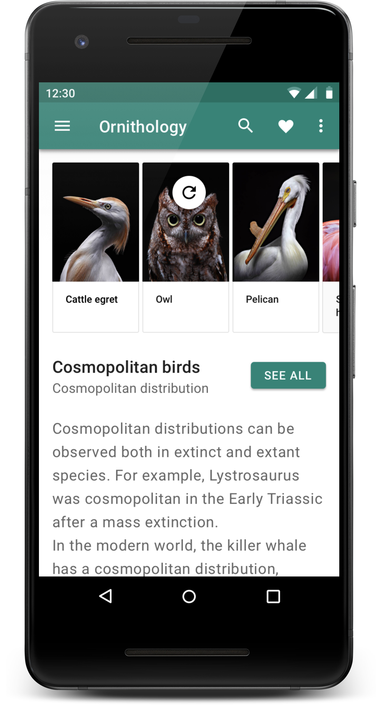
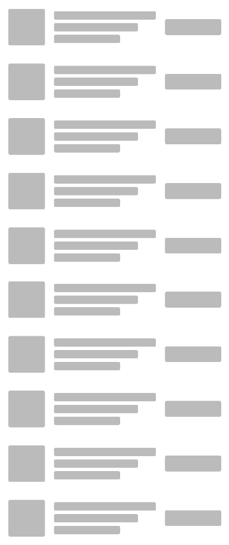

autoscale: true
build-lists: true
footer: @askashdavies
footer-style: Open Sans
header: Open Sans
slidenumbers: true
slide-transition: true
theme: Plain Jane, 3
text: Open Sans


## [fit] Implementing the Paging Library
### Droidcon NYC 🇺🇸


---

[.footer: ]

   

^ Nearly all applications display lists of data

^ Surprisingly hard to find SFW screenshots

^ Simple concept but many hidden complexities

---

# Up-To-Date



^ Ensure that you deliver the latest content

^ Should poll for updates or push notifications

^ How to animate these changes to delivery

^ Calculate difference in the background

---

[.background-color: #ffffff]
[.text: #666666]

# Large Data-Sets



^ Not to be confused with BigData, how to handle large data sets efficiently

^ Stream content, load data in snapshot chunks

^ Ensuring large amounts of data sit around in memory

---

# Offline


^ How should your content behave when offline

---

# State


^ How to accurately represent state to users

---

[.background-color: #eae9ea]
[.text: #666666]

# Progress


^ Indicate progress and network operations

---

# 🛠 🕰

^ How could we have handled this before paging?

---

# `ListView`

```xml
<ListView
    android:id="@+id/list_view"
    android:layout_width="match_parent"
    android:layout_height="match_parent" />
```

^ From Android API 1 we had the ListView for lists

^ Displays a vertically scrollable collection of views

---

# `ArrayAdapter`

```kotlin
// extends BaseAdapter>

list.adapter = ArrayAdapter<String>(
    context, 
    R.layout.simple_list_item_1, 
    arrayOf("Kotlin", "Java" /* ... */)
)
```

^ It was enough in most cases to use the ArrayAdapter

^ Extends BaseAdapter providing filtering comparator for Strings

---

# BaseAdapter

```kotlin
class ListAdapter : BaseAdapter() {

  override fun getView(position: Int, convertView: View, container: ViewGroup) {
    val view = convertView ?: layoutInflater.inflate(
        R.layout.simple_list_item_1, 
        container, 
        false
    )
        
    convertView
        .findViewById(R.id.text1)
        .text = getItem(position)
            
    return convertView
  }
}
```

^ More complex data types required extending the base adapter

^ Inflation of view and binding of types in same method

---

# BaseAdapter

```kotlin, [.highlight: 3-7, 9, 11]
class ListAdapter() : BaseAdapter() {

  var items: List<String> = emptyList()
    set(value) {
      field = value
      notifyDataSetChanged()
    }

  override fun getCount(): Int = items.size

  override fun getItem(position: Int): String = items[position]
    
  override fun getView(position: Int, convertView: View, container: ViewGroup) {
    /* ... */
  }
}
```

^ Additionally we would have to implement retrieval of items

^ Notification of data invalidation

---

# Paging 📄

^ How would you handle infinite scrolling with a list view?

---

# Paging 📄
## OnScrollListener

^ Attach a scroll listener to listen for scroll events

^ Detect if the user has scrolled sufficiently and load data

^ Really unreliable and blindly updating data

---

# BaseAdapter / ListView

- Manages list of it's own data
- Manages view inflation and configuration
- Notify entire data set of change
- Not capable of diffing items

^ What else do we have available

---

# RecyclerView


^ Now included in AndroidX, introduced with support library in April 2015

^ Independent of Android platform, though AndroidX requires 28

^ Previous artifacts available via Maven if you're really unlucky

---

# RecyclerView


^ `RecyclerView` more advanced and flexible version of `ListView`

^ Minimal implementation, focused primarily on recycling

^ Much more efficient, doesnt have to handle extras

^ Though OnClickListener, and item dividers handled manually

^ Still managing list of items via `RecyclerView.Adapter`

---

# Paging 📄
## `AsyncListUtil` 

^ Many early paging attempts achieved with Cursor to load chunks

^ Would avoid querying on the UI thread and keep memory overhead low

^ Optimised for low memory usage, raw cursor access, struggles with large datasets

^ No way of managing data invalidation, crash if previous items removed

---

# Diffing
## `DiffUtil` / `AsyncListDiffer`

^ Unlike `ListView`, `RecyclerView` allows more granular control of item invalidation

^ Now possible to invalidate specific items, and animate adding and removing accordingly

^ `DiffUtil` and async counterpart `AsyncListDiffer` added in support library December 2016

---

[.background-color: #ffffff]
[.text: #666666]

[.footer: medium.com/skyrise/the-myers-diff-algorithm-and-kotlin-observable-properties-69dfb18541b]

# DiffUtil
## Myers Diff Algorithm


^ `DiffUtil` uses Myers diff algorithm to detect the fewest amount of changes between data sets

^ Article from Adrian Defus explaining how the Myers diff algorithm works with DiffUtil

---

# ListAdapter 📜

^ Then came the `ListAdapter` introduced to support library in February 2018

^ Just a few months before the paging library in May indicates direction of ideal architecture

^ Represents fundamental bridge in migration to using the paging library

---

# ListAdapter 📜
## Immutability 💪

^ Utilises all the existing strengths of `RecyclerView`

^ Computes diff in background with animated updates

^ Most importantly takes immutable lists

---

# ListAdapter
## `submitList(...)`

^ Achieves immutability this by taking control of the list

^ Where previously an adapter would manage the list of items

^ Allowing you to focus on binding the `ViewHolder`

---

# Migration
## `ListAdapter<T>`

^ Since the `ListAdapter` plays such an important role as a precursor to the paging library

^ It's generally good idea to use it wherever possible if you're not already doing so

^ How could we migrate if we're already using the `RecyclerView.Adapter` 

---

# RecyclerView.Adapter

```kotlin
class UserAdapter : RecyclerView.Adapter<UserViewHolder>() {

  private var items: List<User> = emptyList()
  
  override fun getItemCount() = items.size
  
  override fun onBindViewHolder(holder: ViewHolder, position: Int) {
    holder.bind(items[position])
  }
  
  override fun onCreateViewHolder(parent: ViewGroup, viewType: Int): RecyclerView.ViewHolder {
    /* ... */
  }
  
  fun updateList(items: List<User>) {
    val result: DiffResult = DiffUtil.calculate(DiffCallback(this.items, items))
    result.dispatchUpdatesTo(this)
  }
    
  class ViewHolder(view: View) : RecyclerView.ViewHolder(view) {
    
    fun bind(item: User) {
      /* ... */
    }
  }
}
```

^ Naive implementation of a recycler view adapter

^ Already assuming a lot about your implementation

---

# RecyclerView.Adapter

```kotlin, [.highlight: 15-18]
class UserAdapter : RecyclerView.Adapter<UserViewHolder>() {

  private var items: List<User> = emptyList()
  
  override fun getItemCount() = items.size
  
  override fun onBindViewHolder(holder: ViewHolder, position: Int) {
    holder.bind(items[position])
  }
  
  override fun onCreateViewHolder(parent: ViewGroup, viewType: Int): RecyclerView.ViewHolder {
    /* ... */
  }
  
  fun updateList(items: List<User>) {
    val result: DiffResult = DiffUtil.calculate(UserComparator(this.items, items))
    result.dispatchUpdatesTo(this)
  }
    
  class UserViewHolder(view: View) : RecyclerView.ViewHolder(view) {
    
    fun bind(item: User) {
      /* ... */
    }
  }
}
```

^ Already using `DiffUtil` to dispatch updates on updating list

---

# DiffUtil.Callback

```kotlin
class UserComparator(
    private val oldItems: List<User>, 
    private val newItems: List<User>
) : DiffUtil.Callback() {

  override fun getOldListSize(): Int = oldItems.size

  override fun getNewListSize(): Int = newItems.size
  
  override fun areItemsTheSame(oldItemPosition: Int, newItemPosition: Int): Boolean {
    return oldItems[oldItemPosition].id == newItems[newItemPosition].id
  }

  override fun areContentsTheSame(oldItemPosition: Int, newItemPosition: Int): Boolean {
    return oldItems[oldItemPosition] == newItems[newItemPosition]
  }
}
```

^ Our `DiffUtil` callback might look like this

^ Returning the size of our item sets

^ Comparing items, and contents

---

# DiffUtil.Callback

```kotlin, [.highlight: 10-16]
class UserComparator(
    private val oldItems: List<User>, 
    private val newItems: List<User>
) : DiffUtil.Callback() {

  override fun getOldListSize(): Int = oldItems.size

  override fun getNewListSize(): Int = newItems.size
  
  override fun areItemsTheSame(oldItemPosition: Int, newItemPosition: Int): Boolean {
    return oldItems[oldItemPosition].id == newItems[newItemPosition].id
  }

  override fun areContentsTheSame(oldItemPosition: Int, newItemPosition: Int): Boolean {
    return oldItems[oldItemPosition] == newItems[newItemPosition]
  }
}
```

^ Since `ListAdapter` will take care of our item management

^ We no longer need to be concerned about the items

^ Only need the actual comparison functions

---

# DiffUtil.ItemCallback<User>

```kotlin
object UserComparator : DiffUtil.ItemCallback<User>() {

  override fun areItemsTheSame(oldItem: User, newItem: User): Boolean {
    return oldItem.id == newItem.id
  }

  override fun areContentsTheSame(oldItem: User, newItem: User): Boolean {
    return oldItem == newItem
  }
}
```

^ Extend `ItemCallback` instead allows us to use object instead of class

^ Performing only the two operations, comparing items, and contents

^ Here we're instructing the adapter the equality of items

^ So that it can apply the algorithm to accurately calculate the diff

^ Give us the buttery smooth animations our users love so much

---

# DiffUtil.ItemCallback<User>

```kotlin, [.highlight: 4, 8]
object UserComparator : DiffUtil.ItemCallback<User>() {

  override fun areItemsTheSame(oldItem: User, newItem: User): Boolean {
    return oldItem.id == newItem.id
  }

  override fun areContentsTheSame(oldItem: User, newItem: User): Boolean {
    return oldItem == newItem
  }
}
```

^ Null assumed to be the same and not equal to not null value

^ `areContentsTheSame` only called if areItemsTheSame returns true for both

^ `areItemsTheSame` used to compare unique identifiers

---

# RecyclerView.Adapter

```kotlin
class UserAdapter : RecyclerView.Adapter<UserViewHolder>() {

  private var items: List<User> = emptyList()
  
  override fun getItemCount() = items.size
  
  override fun onBindViewHolder(holder: ViewHolder, position: Int) {
    holder.bind(items[position])
  }
  
  override fun onCreateViewHolder(parent: ViewGroup, viewType: Int): RecyclerView.ViewHolder {
    /* ... */
  }
  
  fun updateList(items: List<User>) {
    /* ... */
  }
   
  class UserViewHolder(view: View) : RecyclerView.ViewHolder(view) {
    
    fun bind(item: User) {
      /* ... */
    }
  }
}
```

^ Now that we've migrated out comparator callback lets revisit our `RecyclerView`

---

# ListAdapter

```kotlin, [.highlight: 1]
class UserAdapter : ListAdapter<User, UserViewHolder>(UserComparator) {

  private var items: List<User> = emptyList()
  
  override fun getItemCount() = items.size
  
  override fun onBindViewHolder(holder: ViewHolder, position: Int) {
    holder.bind(items[position])
  }
  
  override fun onCreateViewHolder(parent: ViewGroup, viewType: Int): RecyclerView.ViewHolder {
    /* ... */
  }
  
  fun updateList(items: List<User>) {
    /* ... */
  }
   
  class ViewHolder(view: View) : RecyclerView.ViewHolder(view) {
    
    fun bind(item: User) {
      /* ... */
    }
  }
}
```

^ Changing the adapter to extend the list adapter with the type and view holder

^ Making sure to pas in our diff util callback to the adapter

---

# ListAdapter

```kotlin, [.highlight: 1, 7-9, 11-13, 19-24]
class UserAdapter : ListAdapter<User, UserViewHolder>(UserComparator) {

  private var items: List<User> = emptyList()
  
  override fun getItemCount() = items.size
  
  override fun onBindViewHolder(holder: ViewHolder, position: Int) {
    holder.bind(items[position])
  }
  
  override fun onCreateViewHolder(parent: ViewGroup, viewType: Int): RecyclerView.ViewHolder {
    /* ... */
  }
  
  fun updateList(items: List<User>) {
    /* ... */
  }
   
  class ViewHolder(view: View) : RecyclerView.ViewHolder(view) {
    
    fun bind(item: User) {
      /* ... */
    }
  }
}
```

^ Keeping our view holder behaviours we can then remove the item management

---

# ListAdapter

```kotlin
class UserAdapter : ListAdapter<User, UserViewHolder>(UserComparator) {

  override fun onBindViewHolder(holder: ViewHolder, position: Int) {
    holder.bind(items[position])
  }
  
  override fun onCreateViewHolder(parent: ViewGroup, viewType: Int): RecyclerView.ViewHolder {
    /* ... */
  }
  
  class ViewHolder(view: View) : RecyclerView.ViewHolder(view) {
    
    fun bind(item: User) {
      /* ... */
    }
  }
}
```

^ We can now drop the item management from the adapter handled by `ListAdapter`

^ Implementation much simpler and more lightweight

^ Allowing the `ListAdapter` to do the heavy lifting

---

# ListAdapter 💪

^ It already makes a lot of sense to use `ListAdapter` wherever possible

^ Migration is fairly straightforward from existing `RecyclerView.Adapter`'s

^ Makes moving to the paging library much simpler

---


^ Lets quickly review JetPack and the paging library

^ Last year Google introduced us to Android JetPack

^ Dedicated to helping us bootstrap Android development

^ Opinionated and clean implementations for common problems

---

[.background-color: #ffffff]
[.text: #666666]

# Android JetPack
## Foundation Components


^ Foundation picking up where the support library left off

^ Including ktx helpers, multidexing, and security

---

[.background-color: #ffffff]
[.text: #666666]

# Android JetPack
## Architecture Components


^ Architecture components like LiveData and ViewModel

^ Navigation, paging, and room persistence

---

[.background-color: #ffffff]
[.text: #666666]

# Android JetPack 
## Behaviour Components


^ Media playback, notifications, permissions, and slices

---

[.background-color: #ffffff]
[.text: #666666]

# Android JetPack
## UI Components


^ Finally UI, including Fragments, Transitions, Animations, and Emoji

---

# Android JetPack
## Paging Library


^ Introducing JetPack

^ JetPack is...

---

# Android JetPack 
## Paging Library

- `PagedListAdapter` ⚙️
- `PagedList` 📑
- `DataSource` / `DataSource.Factory` ⛲️
- `BoundaryCallback` 🏁

^ Like many of the JetPack components, paging built from three fundamental parts

^ `PagedListAdapter`as an adapter to present loaded data and manage diffing

^ `PagedList` implements list to manage loading of data from `DataSource`

^ `DataSource` and `DataSource.Factory` base class for loading data with relevant subclasses

^ `BoundaryCallback` to signal when a `PagedList` has reached the end of available data

---

[.background-color: #ffffff]
[.text: #666666]


^ If you check out the codelab you'll see the assumed architecture

^ Mainly making use of existing architecture components

^ Most notably the `ViewModel` between UI and repository and database

---

[.background-color: #ffffff]
[.text: #666666]


^ Include LiveData with this architecture for observability

^ Allowing the UI to observe a lifecycle aware source

^ Ensure data is not loading when the user not looking at the screen

---

[.background-color: #ffffff]
[.text: #666666]


^ The paging library introduces the concept of paged lists

^ Lists implementing the interface capable of loading data snapshots

^ Providing the repository with a builder it can produce `LiveData`

---

[.background-color: #ffffff]
[.text: #666666]


^ Adding the data elements from paging to retrieve data

^ Managing a single source of truth via database

^ Using the boundary callback to indicate data required

---

[.background-color: #ffffff]
[.text: #666666]


^ Finally including interaction cues from the codelab documentation

^ Makes it a little clearer on how these individual components interact

^ So hopefully you all have a clearer idea on how paging works

---

[.background-color: #000000]


---

[.background-color: #ffffff]
[.text: #666666]


^ Displaying lists of data will generally require you to traverse through each layer of your application architecture

^ From your database, and data service, through your repositories, interactors, view models, and UI

---

[.background-color: #ffffff]
[.text: #666666]


^ By using `LiveData` extensively we can ensure data is only loaded when user is looking at the screen

^ Data changes are lifecycle aware so you can be sure that your app behaves as expected

---

[.background-color: #ffffff]
[.text: #666666]


^ One of the first steps in migration is integrating the `PagedList`

^ The `PagedList` is propagated through our hierarchy to the UI

---

# `PagedList` ❔


^ But what is `PagedList` and where is it coming from? How is it building data?

^ `PagedList` is a pretty complex lazy loading list

---

# `PagedList`
## `PagedList<T> : List<T>`

^ Extending a list it is able to retrieve a potentially infinite list of data 

^ Manages executors and scheduling to asynchronously prepare data from data source

^ It's not so necessary to understand how it works besides the fact that it is basically a lazy list

---

# `PagedList`
## `PagedListBuilder` 🏗

- Data sources / cache management
- Page size / prefetch distance
- Offline characteristics
- Loading behaviour

^ But we cannot directly instantiate a `PagedList` as there are many complexities

^ As described previously we need to configure how paging should occur

^ How to ensure the data is up-to-date and relevant

^ How much data to load in one chunk and how much to preload

^ How to manage offline caching and data invalidation

^ What UX behaviour to display whilst loading

---


# `PagedList`
## `PagedListBuilder` 🏗

- `LiveDataPagedListBuilder`
- `RxPagedListBuilder`
- `FlowPagedListBuilder`[^1]

[^1]: github.com/chrisbanes/tivi/blob/master/data-android/src/main/java/app/tivi/data/FlowPagedListBuilder.kt

^ There are a couple of options for building paged lists

^ Each specific to the container type

---

# `PagedList`
## `LiveDataPagedListBuilder` 🏗

^ To get started lets take a look at the `LiveData` builder

^ This is the default builder used with Room

---

# `PagedList`
## `LiveDataPagedListBuilder` 🏗

```kotlin
class UserRepository(private val service: UserService) {

  fun users(): LiveData<PagedList<User>> {
    /* ... */
  }
}
```

^ Lets take our repository returning a `PagedList`

^ It's not so important where you build your `PagedList`

^ But to build a `PagedList` we need a `DataSource.Factory`

---


^ Bear with me

---

# `PagedList`
## `LiveDataPagedListBuilder` 🏗

```kotlin, [.highlight: 4-5, 10]
class UserRepository(private val service: UserService) {

  fun users(): LiveData<PagedList<User>> {
    val factory: DataSource.Factory = service.users()
    return LivePagedListBuilder(factory, PAGE_SIZE).build()
  }
  
  companion object {
  
    private const val PAGE_SIZE = 20
  }
}
```

^ Lets assume for now we can retrieve a `DataSource.Factory` from our service

^ Build a `LivePagedListBuilder` with the factory and page size

---

# `PagedList.Config`
## `LiveDataPagedListBuilder` 🏗

```kotlin, [.highlight: 4-9]
class UserRepository(private val service: UserService) {

  fun users(): LiveData<PagedList<User>> {
    val factory: DataSource.Factory = service.users()
    val config: PagedList.Config = PagedList.Config.Builder()
        .setPageSize(PAGE_SIZE)
        .build()
        
    return LivePagedListBuilder(factory, config).build()
  }
  
  companion object {
  
    private const val PAGE_SIZE = 20
  }
}
```

^ To make changes to our setup we can also provide a config instead of the page size

^ But we can add much more to this configuration

---

# `PagedList.Config`
## `LiveDataPagedListBuilder` 🏗

```kotlin, [.highlight: 7]
class UserRepository(private val service: UserService) {

  fun users(): LiveData<PagedList<User>> {
    val factory: DataSource.Factory = service.users()
    val config: PagedList.Config = PagedList.Config.Builder()
        .setPageSize(PAGE_SIZE)
        .setInitialLoadSizeHint(50)
        .build()
        
    return LivePagedListBuilder(factory, config).build()
  }
  
  companion object {
  
    private const val PAGE_SIZE = 20
  }
}
```

^ We can also specify the initial load size

^ Defaults to three times the page size

---

# `PagedList.Config`
## `LiveDataPagedListBuilder` 🏗

```kotlin, [.highlight: 8]
class UserRepository(private val service: UserService) {

  fun users(): LiveData<PagedList<User>> {
    val factory: DataSource.Factory = service.users()
    val config: PagedList.Config = PagedList.Config.Builder()
        .setPageSize(PAGE_SIZE)
        .setInitialLoadSizeHint(50)
        .setPrefetchDistance(10)
        .build()
        
    return LivePagedListBuilder(factory, config).build()
  }
  
  companion object {
  
    private const val PAGE_SIZE = 20
  }
}
```

^ We can also specify the prefetch distance
 
^ Useful if your API is unreliable or network unpredictable

^ Defaults to the page size

---

# `PagedList.Config`
## `LiveDataPagedListBuilder` 🏗

```kotlin, [.highlight: 9]
class UserRepository(private val service: UserService) {

  fun users(): LiveData<PagedList<User>> {
    val factory: DataSource.Factory = service.users()
    val config: PagedList.Config = PagedList.Config.Builder()
        .setPageSize(PAGE_SIZE)
        .setInitialLoadSizeHint(50)
        .setPrefetchDistance(10)
        .setEnablePlaceholders(false)
        .build()
        
    return LivePagedListBuilder(factory, config).build()
  }
  
  companion object {
  
    private const val PAGE_SIZE = 20
  }
}
```

---

# Placeholders
## Advantages


- Users can scroll past whats loaded
- Scrollbars look correct
- Don't need loading spinner

---

# Placeholders
## Disadvantages


- Items should be same size
- Adapter must handle null items
- DataSource must count items

---

# `PagedList.Config`
## `RxPagedListBuilder` 🏗

```kotlin, [.highlight: 3, 9-10]
class UserRepository(private val service: UserService) {

  fun users(): Observable<PagedList<User>> {
    val factory: DataSource.Factory = service.users()
    val config: PagedList.Config = PagedList.Config.Builder()
        .setPageSize(PAGE_SIZE)
        .build()
        
    return RxPagedListBuilder(factory, config)
        .buildObservable() // or buildFlowable()
  }
  
  companion object {
  
    private const val PAGE_SIZE = 20
  }
}
```

^ You can use RxPagedListBuilder to return Rx types

---

[.footer: github.com/chrisbanes/tivi/blob/master/data-android/src/main/java/app/tivi/data/FlowPagedListBuilder.kt]

# Coroutines
## `FlowPagedListBuilder` 💪

```kotlin, [.highlight: 3, 9]
class UserRepository(private val service: UserService) {

  fun users(): Flow<PagedList<User>> {
    val factory: DataSource.Factory = service.users()
    val config: PagedList.Config = PagedList.Config.Builder()
        .setPageSize(PAGE_SIZE)
        .build()
        
    return FlowPagedListBuilder(factory, config).buildFlow()
  }
  
  companion object {
  
    private const val PAGE_SIZE = 20
  }
}
```

^ Snippet from Chris Banes Tivi project

---

# DataSource.Factory

---

# Paging ❤ Room

^ In the code lab and in much of the documentation paging is written with Room in mind

^ Paging works really really well with room

---

# Paging ❤ Room

```kotlin
@Dao
interface UserDao {

  @Query("SELECT * FROM user")
  fun users(): DataSource.Factory<Int, User>
}

```

^ Room already works really well on it's own and with Kotlin

^ Android tooling allows for integration with SQL statements

^ Room able to build data sources factories automatically

---

# Paging ❤ Room

```kotlin, [.highlight: 5]
@Dao
interface UserDao {

  @Query("SELECT * FROM user")
  fun users(): DataSource.Factory<Int, User>
}
```

^ So when using room we simply replace `List` with `PagedList` in the service definition

---


^ All well and good if Room is your only data source, but this is most likely not the case

^ Will need data to insert into the database in the first place

^ You may not be using a database at all

---

# Remote Data Source
## Backend ☁️

^ Say we're working with a remote data source

^ Such as an our backend service or Firebase

---

# Remote Data Source
## Index 🗂

^ We need to then decide on how our remote data resource is indexed or keyed

^ Once we know this we can decide on the correct data source

---

# `DataSource<K, V>`

- `PositionalDataSource` 🏎

- `ItemKeyedDataSource` 🔑

- `PageKeyedDataSource` 🔢

^ Paging provides three different types of data sources by key

^ `PositionalDataSource` is ideal for a fixed-size countable data set

^ `ItemKeyedDataSource` when items are ordered and can be identified based on their contents

^ and `PageKeyedDataSource` to retrieve data by page number, quite common with remote API's

---

[.background-color: #ffffff]
[.text: #666666]

# [fit] `PositionalDataSource`
## [fit] `PositionalDataSource<User>`


 
- Able to scroll to different elements
- Load pages of requested sizes
- Load pages at arbitrary positions
- Assumed ordering by integer index
- Provide a fixed item count
 
^ Works well for apps similar to that of the contacts app

^ Allows scrolling through or jumping to a particular position

^ If you can load pages of a requested size at arbitrary positions

^ Assumes an integer as a key thus only requires one parameter

^ The data set should be a fixed-size countable data set

---

[.background-color: #ffffff]
[.text: #666666]

# [fit] `PositionalDataSource`
## [fit] `PositionalDataSource<User>`


 
- `loadInitial()`
 - `requestedStartPosition`
 - `requestedLoadSize`
 - `pageSize`
 - `placeholdersEnabled`

- `loadRange()`
 - `startPosition`
 - `loadSize`

^ `requestedStartPosition` will likely be zero on `loadInitial` 

^ But may be a different position if data is invalidated

^ Information necessary for you to decide what data to request

^ `loadRange` will be called every time the users scrolls to the boundary

^ Required only to load from position x with the given size

---
 
# [fit] `ItemKeyedDataSource`
## [fit] `ItemKeyedDataSource<String, User>`


 
- Great for ordered data sets
- Items can be uniquely identified
- Item key indicates position
- Detect items before or after

---
 
# [fit] `ItemKeyedDataSource`
## [fit] `ItemKeyedDataSource<String, User>`


 
- `getKey()`
 
- `loadInitial()`
 - `requestedInitialKey`
 - `requestedLoadSize`
 - `placeholdersEnabled`
 
- `loadAfter()`
 - `key`
 - `requestedLoadSize`
 
- `loadBefore()`
 - `key`
 - `requestedLoadSize`

^ Provide the key for each item so the paging library knows how to index your data

^ Instead of a position we receive a key on `loadInitial` to indicate the start position

^ As the user scrolls up or down the `loadAfter` and `loadBefore` methods will be called

---
 
# [fit] `PageKeyedDataSource`
## [fit] `PageKeyedDataSource<String, User>`


 
- Common for API responses
 - GitHub
 - Twitter
 - Reddit

^ Common of API responses like GitHub to provide a prev and next page

^ Similar to a LinkedList, items linked to previous and next items

---
 
# [fit] `PageKeyedDataSource`
## [fit] `PageKeyedDataSource<String, User>`


- `loadInitial()`
 - `requestedLoadSize`
 - `placeholdersEnabled`

- `loadAfter()`
 - `key`
 - `requestedLoadSize`
 
- `loadBefore()`
 - `key`
 - `requestedLoadSize`

^ No pointer available for `loadInitial`

^ Also when data is invalidated but user is usually already at the top

^ Provide page keys after data load

^ Key provided for `loadAfter` should return `adjacentPageKey`
 
---


^ That was quite a lot to take in

---

[.background-color: #ffffff]
[.text: #666666]


^ Dependent on your application architecture

---

# `BoundaryCallback`

---

# Source of truth

- Consistent data presentation
- Simple process - need more, load more
- Gracefully degrades on failure
- Optionally refresh on observe

---

# Database + Network

- Needs out of data signal from DB
- Triggers network load from DB
- Paging calls BoundaryCallback

---

# Further Reading 📖

- **Florina Muntenescu: Migrating to Paging Library**
    youtube.com/watch?v=8DPgwrV_9-g
- **Chris Craik & Yigit Boyar: Manage infinite lists with RecyclerView and Paging**
    youtube.com/watch?v=BE5bsyGGLf4
- **Android Paging Codelab**
    codelabs.developers.google.com/codelabs/android-paging/#0
- **Chris Banes: FlowPagedListBuilder**
    github.com/chrisbanes/tivi/blob/master/data-android/src/main/java/app/tivi/data/FlowPagedListBuilder.kt
    
---

# Slides
## bit.ly/paging-library

---

# Thanks!


