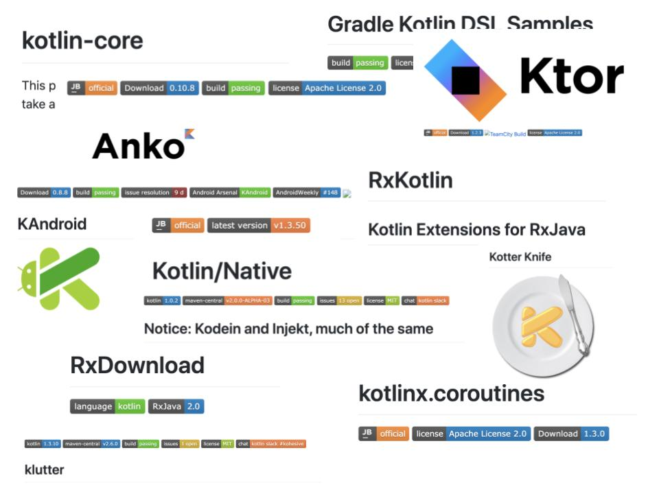
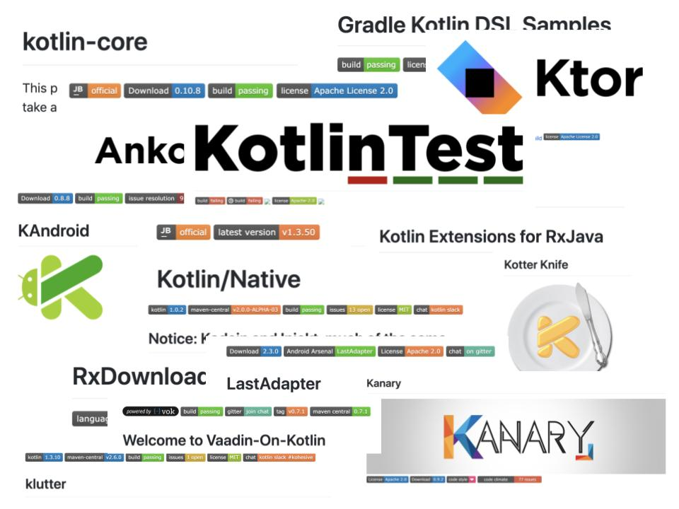

autoscale: true
build-lists: true
footer: @askashdavies | sli.do/Z169
footer-style: Open Sans
header: Open Sans
slide-transition: true
theme: Merriweather, 3
text: Google Sans


# [fit] Refactoring Legacy Code with Kotlin
## Kotlin Everywhere: Coimbra 🇵🇹


---

# Legacy

**adj.**

Denoting or relating to software or hardware that has been superseded but is difficult to replace because of its wide use.

^ How do we define legacy code?

^ Superseded but difficult to replace.

---

# Working Effectively with Legacy Code
### **Michael Feathers**


- Untested code

- Regression tests

- Lack of confidence

^ Michael Feathers defines legacy code as code without tests

^ Which due to lack of automated regression testing makes it difficult to work with.

^ I'm considering this to include anything that's Java

---

# !

^ The content of this talk comes mainly from the perspective on Android

^ Generic content can be applied to other platforms

---

# Java 

^ Though Android is built upon Java

^ Java has been out of our reach

---

# JVM != ART

^ Because the Java virtual machine uses bytecode different from Android Runtime

---

[.background-color: #ffffff]
[.footer: twitter.com/QuinnyPig/status/1174434046853599232]


^ Which has led to a large company disputing if an API can be copyrighted

---

# Java 8

- Lambda expressions
- Method references
- Default interfaces
- try-with-resources

^ Many Java 8 features only available with AGP 3.0

^ Many parts of the API only available with minSdk 24 or higher

---

# Streams ↝ 

^ Not available until Android Nougat

^ Not able to raise min sdk

---


^ But so what? Backend developers can use whatever version they like

---

# Kotlin 

^ Many arguments for Kotlin over Java

^ Code that looks consistently familiar

^ Code that behaves idiomatically

^ Code that looks terse and concise

^ Aggressive development including new features

---

# Null 💵 🔥

^ The million dollar mistake

^ Null has plagued developers for years

^ Null checks present in nearly all Java code

^ Unexpected behaviour, unpredictable output

---

```java
if (foo == null) {
  bar();
}
```

^ Seen littered everywhere

---

# Defensive Code <🛡>

^ This is considered defensive code

^ Code that is hardened to potential failure

^ Results in polymorphic behaviour with many execution paths

---

# Offensive Code <🖕>

^ Offensive code is similar to defensive in a way

^ Does not tolerate errors in the wrong places

^ If you've ever inspected an Rx stack trace...

^ Point of failure much easier to find and detect

---

# Urgency 🚨

^ Bugs treated as fatal demand immediate attention

^ Sounds bad but results in finding bugs much quicker

^ Codebase much less error prone

---

# Kotlin?

^ So should we all start using Kotlin?
 
--- 

# Kotlin 💪

^ Yes! Go! Start!
 
---

[.background-color: #ffffff]


^ What did that mean for our green robot friend?

---

# Google IO 2018 🥇

^ In Google IO 2018 Google announced first class support for Koltin

---

# 🎉 👼 😊

^ Heavens opened, angels sang, prayers were answers

^ Developers worldwide wept for joy

^ Their prayers had been answered

---

# Google IO 2019 🥇 🎖

^ Furthermore in Google IO 2019

^ Google announced that Kotlin was the preferred language

---


# Kotlin 

^ This was a major turning point for architecture

^ We lost our shit, and we quickly started seeing changes

---

# Libraries

^ We started seeing libraries for every different type 

---

[.background-color: #ffffff]


^ We started producing Kotlin libraries

---

[.background-color: #ffffff]


^ And more

---

[.background-color: #ffffff]



^ And more

---

[.background-color: #ffffff]



^ And more

---

[.background-color: #ffffff]


^ One the plus side we learned that people really like readme badges

---

[.footer: Rick and Morty, Adult Swim]


^ Its ok, it was the same with Rx, people adopting Kotlin

---

# Kotlin 🤔
 
^ What makes Kotlin so elusive

---

# Idiomacy

---


^ Not to be confused with the 2006 film Idiocracy

---

# Idiomatic

**adj.**

Using, containing, or denoting expressions that are natural to a native speaker

^ Definition of idiomatic

---

[.footer: kotlinlang.org/docs/reference/coding-conventions.html#idiomatic-use-of-language-features]

## Idiomatic use of Language Features

^ When it comes to programming this means usage of idioms specific to that language

---

# Idiomatic Code

- Consistent, easier to read
- Less cognitive load
- Less ambiguity
- Function > Style

^ - Less ambiguity for new contributors

^ - Time better spent reviewing code for functionality rather than style.

---

# Code Style

- kotlinlang.org/docs/reference/coding-conventions.html

- android.github.io/kotlin-guides/style.html

^ Android and Jetbrains both define a common code style

---

# Refactoring Legacy Code

^ How does this relate to refactoring legacy code

^ How can I start converting my Java to Kotlin

---

# ⌃⌥⇧K

---


^ Job done lets go home

---


^ Please don't do this

^ Let me explain why

---

```java
public class BadJavaActivity extends Activity {

  @Inject Dependency dependency;
}
```

^ Public for common dependency injection library

^ Auto formatting makes a lot of general assumptions

---

[.footer: How I Met Your Mother, CBS]


# General Assumptions 👮‍♂️

---

```kotlin
class BadKotlinActivity : Activity() {

  @Inject var dependency: Dependency? = null
}
```

^ Availability of `internal` keyword ignored

^ Parameters are assumed to be null if not directly instantiated

^ Double bang used to reference variables

---

```kotlin
class SlightlyLessBadKotlinActivity : Activity() {

  @Inject internal lateinit var dependency: Dependency
}
```

^ Opting for a lateinit variable allows you to configure the property

^ Needs to be a var to make setting property visible

---

# [fit] UninitializedPropertyAccessException!

^ Throws a generic exception on property access

---

```kotlin
lateinit var file: File    

if (::file.isInitialized) { /* ... */ }
```

---

# Nullability 💵 🔥

^ Back to our million dollar mistake

---

# !!

^ Any nullable types will use the double bang operator to force non-null

^ Ensures same behaviour but can be improved

---

```kotlin
requireNotNull(myNullableVal)
```

---

```java
if (foo == null) {
  bar();
}
```

---

# Data Classes

---

```java
public class User {

  private String firstName;
  private String lastName;

  public User(String firstName, String lastName) {
    this.firstName = firstName;
    this.lastName = lastName;
  }

  public String getFirstName() {
    return firstName;
  }

  public void setFirstName(String firstName) {
    this.firstName = firstName;
  }

  public String getLastName() {
    return lastName;
  }

  public void setLastName(String lastName) {
    this.lastName = lastName;
  }

  @Override
  public boolean equals(Object o) {
    if (this == o) {
      return true;
    }
    if (o == null || getClass() != o.getClass()) {
      return false;
    }
    User user = (User) o;
    return Objects.equals(firstName, user.firstName) &&
        Objects.equals(lastName, user.lastName);
  }

  @Override
  public int hashCode() {
    return Objects.hash(firstName, lastName);
  }
}
```

^ Pojos contribute to a lot of the boilerplate in Java code

^ Dont properly represent nullable values

---

```kotlin
class User(var firstName: String?, var lastName: String?) {

  override fun equals(o: Any?): Boolean {
    if (this === o) {
      return true
    }
    if (o == null || javaClass != o.javaClass) {
      return false
    }
    val user = o as User?
    return firstName == user!!.firstName && lastName == user.lastName
  }

  override fun hashCode(): Int {
    return Objects.hash(firstName, lastName)
  }
}
```

^ Direct conversion with the IntelliJ won't use a data class automatically

^ Results in left over equals and hashcode methods

---

```kotlin
data class User(val firstName: String, val lastName: String)
```

^ Not only more concise and easier to read

^ Introduces immutability and non null members

---

```kotlin
data class User(val firstName: String, val lastName: String? = null)
```

^ This also works for default parameters and nullable properties

---

```java
@NotNull
public final User copy(@Nullable String firstName, @Nullable String lastName) {
  return new User(firstName, lastName);
}
```

^ Also includes copy function for modification

^ Removing the necessity for builder and factories

---

# Kotlin

- Singleton objects
- String interpolation
- Elvis operator 🕺
- Destructuring
- Extension functions
- Scoping functions

^ Kotlin offers a variety of other niceties

---

# Maintaining History

^ One of the main frustration about migrating to Kotlin is retaining VCS history

^ A few tricks can achieve this

---

# Maintaining History

- Change extension `.java` -> `.kt` 
- First commit
- Apply Kotlin conversion
- Second commit

^ Whilst this will technically work

^ Some reasoning and change history will still be lost

^ Commit purpose doesn't hold business value

---

# Maintaining History
## Refactoring

^ Better to migrate to Kotlin through abstraction and refactoring

^ Apply single responsibility principle to complex classes

---

# Refactoring

^ Better to migrate to Kotlin through abstraction and refactoring

^ Apply single responsibility principle to complex classes

---

# Refactoring
## SOLID

- Single-responsibility
- Open-closed
- Liskov substitution
- Interface segregation
- Dependency inversion

^ We should all be familiar with solid design

---

# Refactoring
## Single Responsibility

^ Identifying when a class has too much responsibility allows abstraction

^ Creating new classes also reveals intent can be better tracked

---

# Perspective 🔭

^ Solving the same problem in a different way results in a better understanding of the requirements

^ Same reason we perform Kata exercises to hone our skills

---

# Static 🙅‍♂️

^ The nice thing about Kotlin is that is helps us away from static

^ Static operations are not much better than procedural code

^ Difficult to test, static call can't be mocked

---

# Asynchronicity

^ Which brings us to asynchronicity, many tasks don't immediately return a value

^ Need to perform background operations or computation

^ Especially important in UI environments

---

# Concurrency is Hard 🚄

^ When managing multiple threads we can run into issues

^ Race conditions a problem with a shared mutable state

---

# Thread

```java
new Thread(() -> {
  foo();
}).start();
```

^ The simplest of these operations is a new thread

^ Not very efficient, resource intensive

^ Result not encapsulated, not easily cancellable

---

# CompletableFuture

```java
CompletableFuture.supplyAsync(this::findSomeData)
  .thenApply(this:: intReturningMethod)
  .thenAccept(this::notify);
```

^ Bit more useful, only available in Java 8

---

# RxJava

```java
Observable
  .fromIterable(resourceDraft.getResources())
  .flatMap(resourceServiceApiClient::createUploadContainer)
  .zipWith(Observable.fromIterable(resourceDraft.getResources()), Pair::create)
  .flatMap(uploadResources())
  .toList()
  .toObservable()
  .flatMapMaybe(resourceCache.getResourceCachedItem())
  .defaultIfEmpty(Resource.getDefaultItem())
  .flatMap(postResource(resourceId, resourceDraft.getText(), currentUser, resourceDraft.getIntent()))
  .observeOn(AndroidSchedulers.mainThread())
  .subscribeOn(Schedulers.io())
  .subscribe(
      resource -> repository.setResource(resourceId, resource, provisionalResourceId),
      resourceUploadError(resourceId, resourceDraft, provisionalResourceId)
  );
```

---


^ That escalated quickly

---

# What If? 🤔

^ But what if we could write asynchronous code in a synchronous imperitive fashion

^ Whilst retaining reactive state and managing a hierarchy of concurrency?

---

#  Coroutines 

^ Coroutines available as experimental in Kotlin 1.1 stable in 1.3 (Oct '18)

^ Available in other languages, subroutines for non-preemptive (cooperative) multitasking

^ Allow us to write asynchronous code as if it were synchronous

---

```kotlin
fun main() {
    GlobalScope.launch {
        delay(1000L)
        println("World!")
    }
    println("Hello,")
    Thread.sleep(2000L)
}

// Hello,
// World!
```

^ Consider the following asynchronous code

^ Sequential by default, seemingly imperative

---

```kotlin, [.highlight: 3]
fun main() {
    GlobalScope.launch {
        delay(1000L)
        println("World!")
    }
    println("Hello,")
    Thread.sleep(2000L)
}

// Hello,
// World!
```

^ Delay is a suspended function, must be called from a Coroutine

---

```kotlin, [.highlight: 2, 5]
fun main() {
    GlobalScope.launch {
        delay(1000L)
        println("World!")
    }
    println("Hello,")
    Thread.sleep(2000L)
}

// Hello,
// World!
```

^ Calling launch on a Coroutine scope will build a coroutine context

^ Global scope applied unconfined context

^ Scope can be created with dispatchers based on use case

---

# ⚖️ Stability

^ In the abstract I had mentioned "with coroutines approaching stability"

^ As of Kotlin 1.3 (Oct '18) coroutines API graduated to "fully" stable

---

[.footer-style: #ffffff]


^ That wasn't completely true, but lets cover the basics

---

# @Annotations

## (🐉 Here be dragons)

^ Though coroutines are stable some API elements are still under development

^ Kotlin introduced annotations to manage these aspects

---

# Annotations

```kotlin
@ExperimentalCoroutinesApi // ⚠️
```

^ Experimental API's design declarations may still change

^ Applies to Rx conversion, and channel production

---

# Annotations

```kotlin
@ExperimentalCoroutinesApi // ⚠️

@FlowPreview // ⚠️
```

^ Flow is a newer architectural model that attempts to model chaining behaviour

^ Much like a sequence that is only consumed on a terminal operator

^ Cold observable easily replayed and reusable

---

# Annotations

```kotlin
@ExperimentalCoroutinesApi // ⚠️

@FlowPreview // ⚠️

@ObsoleteCoroutinesApi // ⚠️
```

^ Obsolete API's will be deprecated in the future but not yet known what will replace them

^ Difference between obsolete and experimental is intent, @Experimental may graduate, @Obsolete unknown

^ Applies to channel consumptions, actors, Rx conversion functions

---

# Annotations

```kotlin
@ExperimentalCoroutinesApi // ⚠️

@FlowPreview // ⚠️

@ObsoleteCoroutinesApi // ⚠️

@InternalCoroutinesApi // ☠️
```

^ Should only be used internally by Kotlin coroutines

^ Can change without warning or migration aids

---

# Annotations
## `@Experimental`

^ All of these are annotated with experimental

^ Sometimes causing an error, and sometimes a warning

^ Can be extended with your own annotations 

---

# 💪 Coroutines 💪

^ What makes everybody want to jump on the Coroutine bandwagon?

---

# 🥇 Native first-party library

^ First class support and documentation from JetBrains

^ Continued evolution and development of performance and features

^ Not relying on a third party implementation

^ Everything already awesome about Kotlin

---

# Efficient 🌮

^ Coroutines are fast and memory efficient

^ Leaning on the compiler to perform thread optimisations

^ Launch hundreds of thousands of threads without any performance issues

---

# 😊 Easy-to-use

^ Learning curve for getting started is really simple

---

# 👌 `suspend fun`

^ Create suspended methods with the suspend operations

^ Methods need not care about scheduling

^ Suspended functions are easy to refactor

---

# 👌 Suspend

```kotlin
fun main() {
    GlobalScope.launch {
        delay(1000L)
        println("World!")
    }
    println("Hello,")
    Thread.sleep(2000L)
}

// Hello,
// World!
```

^ Lets take our suspend example from earlier

---

# 👌 Suspend

```kotlin, [.highlight: 3, 8-11]
fun main() {
  GlobalScope.launch {
    doWorld()
    println("Hello,")
  }
  Thread.sleep(2000L)
}

suspend fun doWorld() {
  delay(1000L)
  println("World!")
}

// Hello,
// World!
```

^ The extracted function is simply marked as suspend

^ Allows called to manage execution context

^ But what if I need a different context?

---

# 👌 Suspend

```kotlin, [.highlight: 10-13]
fun main() {
  GlobalScope.launch {
    launch { doWorld() }
    println("Hello,")
  }
  Thread.sleep(2000L)
}

suspend fun doWorld() {
  withContext(Dispatchers.IO) {
    delay(1000L)
    println("World!")
  }
}

// Hello,
// World!
```

^ Call `withContext` providing a dispatcher or context

---

# `Dispatchers`

^ Dispatchers provided by the framework for common use cases

---

# `Dispatchers`

- Default
- IO
- Main
 - Android (Main Thread Dispatcher)
 - JavaFx (Application Thread Dispatcher)
 - Swing (Event Dispatcher Thread)
- Unconfined

^ - Default: Default for builders like launch, async, etc if neither a dispatcher or interceptor is specified

^ - IO: Designed for offloading blocking IO tasks to a shared pool of threads.

^ - Main: Confined to the Main thread operating with UI objects. Usually single-threaded.

^ - Unconfined: A coroutine dispatcher that is not confined to any specific thread

---

# Testing

```kotlin
@Test
fun testFoo() = runBlockingTest {
  val actual = foo() 
  // ...
}

suspend fun foo() {
  delay(1_000)
  // ...
}
```

^ Simply use the Coroutine builder `runBlockingTest` to build a testable context

^ Suspended operations in `runBlockingTest` will be auto-advanced virtual time

---

# Further Reading 📖

- **Google Codelab: Refactoring to Kotlin**
    codelabs.developers.google.com/codelabs/java-to-kotlin/
- **KotlinX Coroutine Test**
    github.com/Kotlin/kotlinx.coroutines/tree/master/kotlinx-coroutines-test
- **Sean McQuillan: Coroutines + Testing = ❤️**
    droidcon.com/media-detail?video=352671106
- **Ash Davies: RxJava & Coroutines: A Practical Analysis v3**
    speakerdeck.com/ashdavies/rxjava-and-coroutines-a-practical-analysis-v3

---

# Thanks!


