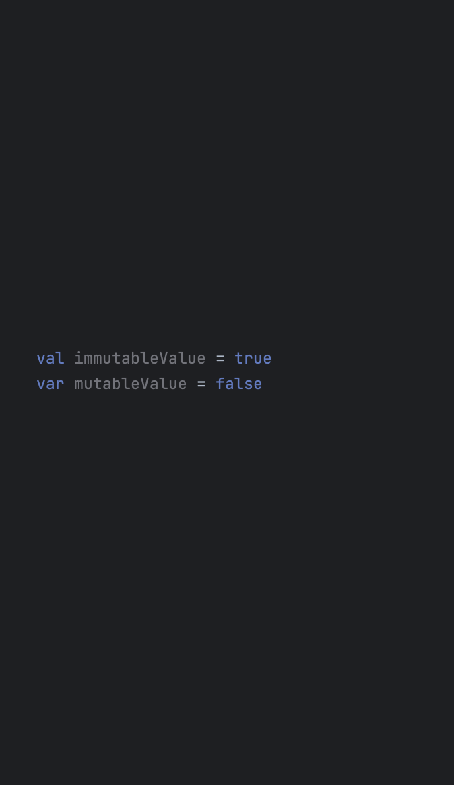
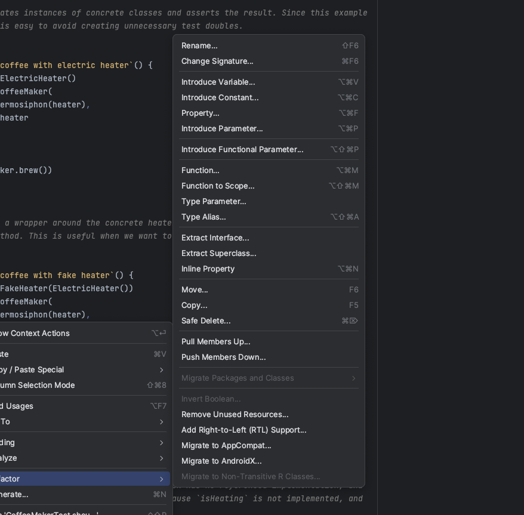
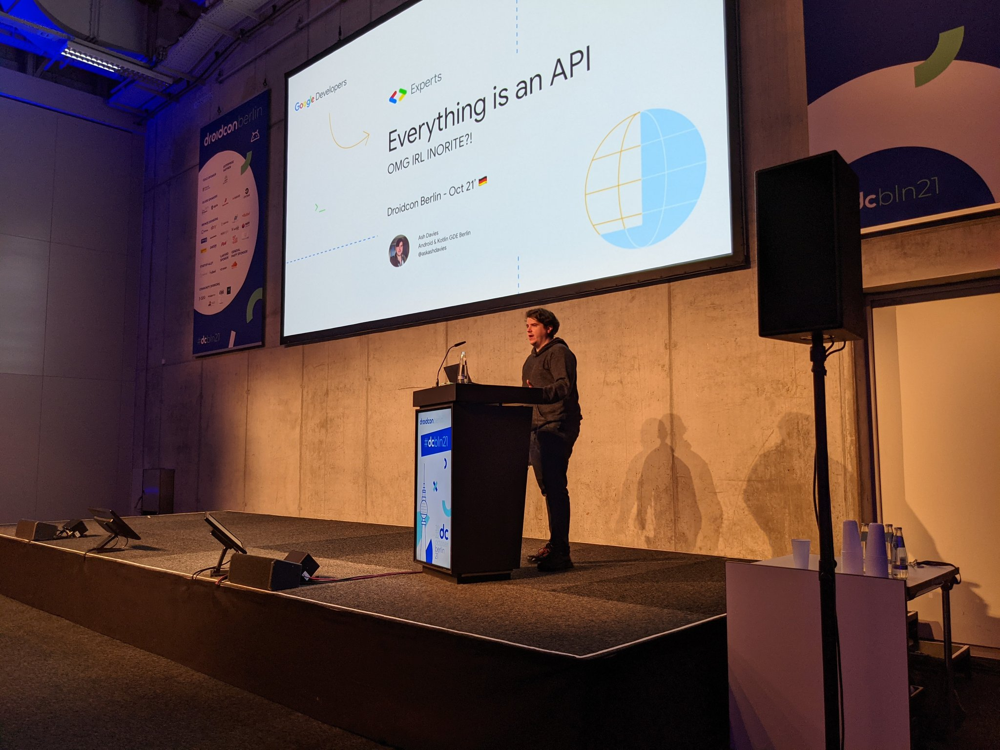
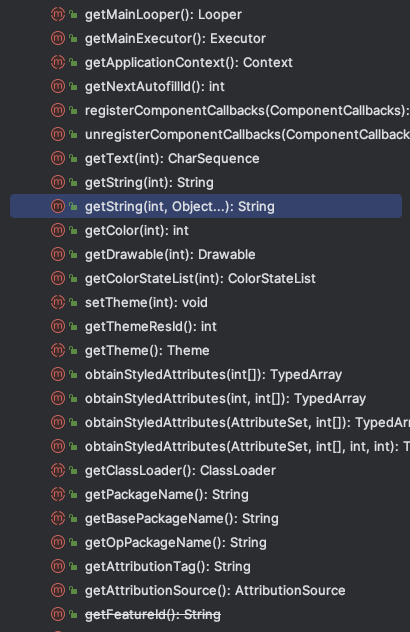

autoscale: true
build-lists: true
footer: ashdavies.dev | ashdavies@androiddev.social
footer-style: Product Sans
header: Product Sans
slide-transition: true
slidenumbers: true
text-strong: Google Sans 18pt
text: Google Sans 18pt
theme: Plex, 1

<!--

Test code is just production code that doesn't ship
Dynamic shared mutable state

There is always a way!
This is the way.

Use Case: Verifying functions without a return type
Solution: Verify domain state, or use a fake.

Scenarios:
Change of method signature
Change of interface contract
Narrowing type inheritance
Mockito type safety
Default return types
Mocks delegate to concretion

Forces interface segregation
Alternatives to mocking?
Fakes, Stubs, Concretions

Fake, concrete implementation of interface, written with the production code, provides better documentation, insight, into the purpose of behaviour.

Oxford vs Chicago school of testing
RETURNS_DEEP_STUBS

---

Introduction (5 minutes)

Overview of the talk's objective: Exploring the limitations of mocks and advocating for the use of fakes and in-memory implementations.

Understanding the limitations of mocks, including their potential to create brittle tests.
Exploring how mocks can slow down development by introducing dependencies on external systems.
Discussing how mocks can hinder code refactoring efforts, making them difficult to maintain.
Introduction to Fakes and In-Memory Implementations (5 minutes)

Introduction to fakes and in-memory implementations as alternatives to mocks.
Explanation of how these alternatives provide faster feedback and increase confidence in code.
Advantages of Fakes and In-Memory Implementations (10 minutes)

Demonstrating how fakes and in-memory implementations offer more robust testing.
Discussing how they can be used to provide faster feedback loops during development.
Exploring how these alternatives improve code maintainability, especially as the codebase evolves.
Implementing Fakes and In-Memory Implementations (10 minutes)

Step-by-step examples of implementing fakes and in-memory implementations in Kotlin.
Providing simple, easy-to-understand code examples to showcase the practical application of these alternatives.
Demonstrating their usefulness in different testing scenarios, including unit testing and integration testing.
Conclusion (5 minutes)

Recap of the drawbacks of mocks and the advantages of fakes and in-memory implementations.
Encouragement to embrace these alternatives for more effective and maintainable testing in Kotlin.
Q&A session to address any remaining doubts or questions from the audience.

---
-->

# Beyond the Mockery
## Ash Davies

^ Speaker introduction...

---

# Legacy (adj.)

Denoting or relating to software or hardware that has been superseded but is difficult to replace because of its wide use.

^ Can be tough to know where to start with legacy projects.

---

# Change

^ Nothing is permanent, at some point, and you'll need to change something.

^ Can mean adding a new feature, fixing a bug, or refactoring some code.

^ How can you be confident about your changes?

---

# Testing

^ Covering your code with tests can give confidence your changes don't break anything.

^ Michael Feathers describes this as "Cover and Modify" instead of "Edit and Pray".

---

# Testing: Awareness 👀

^ Writing test code at the same time as production code gives you a better perspective of edge cases.

---

# Testing: Architecture 🏗

^ Poor code is often synonymous with poor architecture, and poor testability.

---

# Testing: Confidence 💪

^ Confidence in your tests, means confidence in your code, and confidence in refactoring.

---

# Testing: Documentation 📖

^ Tests documentation often provides better insight into the purpose of domain behaviour.

---

# Testing: Stability 💯

^ Well written unit tests provide robust protection, and early feedback, against regressions.

---

# Testing

^ Not my goal to convince you to write tests, but to to write better tests.

^ If you're not interested in writing tests, this talk may not be for you.

---

# Testing


- Unit
- Instrumentation
- Integration
- End-to-End
- Monkey
- Smoke

^ Focus on unit testing, important to understand types of tests.

^ Diverse suite of tests, provides more robust regression protection.

---

[.background-color: #fff]


^ Fixing unit tests, feels like navigating a minefield, in the dark, with a blindfold.

^ History, difficult to follow; code, difficult to understand.

^ Tests, difficult to run; results, difficult to interpret.

---

# Anti-Patterns and Code Smell

^ It's not until we start writing tests that we realise how difficult it is to test our code.

^ This is often a sign that our code is not structured well.

---

# Extreme Programming 🤘
## Test-Driven Development

^ Tested code is more structured, with lower cognitive load, and easier to understand.

^ Led to "extreme" programming practices like test driven development.

^ Writing tests before writing code.

---

> Debugging is like being the detective in a crime movie where you are also the murderer.
-- Filipe Fortes

^ Git blame will always reveal you the suspect.

---

# Kotlin
## noun

Awesome.

^ Guiding principle of Kotlin is to make it easy to write good code.

^ Primary tenet of that is the concept of mutability.

---

# Kotlin: Mutability
## Risks of Mutation

^ What is mutability, and what are the risks of mutation?

---

# Kotlin: Mutability
## Risks of Mutation

```kotlin
fun sumAbsolute(list: MutableList<Int>): Int {
  for (i in list.indices) list[i] = abs(list[i])
  return list.sum()
}
```

^ Impure, in-place mutations, non-deterministic state, hard to predict.

---

# Kotlin: Mutability
## Risks of Mutation

```kotlin
private val GROUNDHOG_DAY = TODO("java.util.Date()")
fun startOfSpring(): java.util.Date = GROUNDHOG_DAY

val partyDate = startOfSpring()
partyDate.month = partyDate.month + 1

// Date is mutable 🤦‍♂️
```

^ Date class returned by function is mutable, consumers can modify upstream value.

---

# Kotlin: Mutability
## Shared Mutable State ⚠️

^ Shared mutable state, causes race conditions, non-deterministic behaviour.

^ Thread-safe confinement, mutex, semaphores, help mitigate this risk.

---

# Kotlin: Immutability
## Unidirectional Data Flow 🏆

^ Ensures predictable state, easier to find bugs, replay events, predict application state.

---

# Kotlin: Immutability
## Collections

```kotlin
fun List<T>.toMutableList(): MutableList<T>

fun Map<K, V>.toMutableMap(): MutableMap<K, V>

fun Set<T>.toMutableSet(): MutableSet<T>
```

^ Kotlin provides immutable collections types, converting to mutable, creates new instance.

---

# Kotlin: Immutability
## IntelliJ IDEA



^ IntelliJ formats code to highlight mutable variables as underlined.

^ Subconscious "encouragement" makes the variable look out-of-place.

---

# Kotlin: Immutability
## Final Concretions 🧱

By default, Kotlin classes are final – they can't be inherited

^ Finally, classes final by default; encourages composition over inheritance.

---

# Kotlin: Immutability
## Final Concretions 🧱

```kotlin
open class Base // Class is open for inheritance
```

^ Kotlin classes can be made open, but this is a conscious decision.

---

# Kotlin: Immutability
## All-Open Compiler Plugin

`org.jetbrains.kotlin.plugin.allopen`

^ All-Open plugin for open classes as required for frameworks such as Spring AOP.

---

# Anti-Patterns and Code Smell
## Refactoring: Seams 🧵

^ Large clusters hard to break into testable units.

^ Seams used to separate behaviour, without editing.

---

# Refactoring: Seams 🧵
## Preprocessing

- Kotlin Symbol Processing
- Kotlin Compiler Plugins

^ Supported in Kotlin with KSP and Compiler Plugins, it is rarely used for this purpose.

^ Poor code clarity, but allows for sensing without modifying code.

---

# Refactoring: Seams 🧵
## Linking: Classpath

```kotlin
import fit.Parser

internal class FitFilter {
  private val parser: Parser =
    Parser.newInstance()
}
```

^ JVM takes classpath as an argument to load classes.

^ Can override with custom implementations.

---

# Refactoring: Seams 🧵
## Linking: Classpath

```kotlin
buildscript {
    dependencies {
        val googleServicesVersion = libs.versions.google.services.get()
        classpath("com.google.gms:google-services:$googleServicesVersion")
    }
}
```

^ You will have already configured the classpath in your project using plugins

---

# Refactoring: Seams 🧵
## Objects

```kotlin
internal class FitFilter {
  private val parser: Parser =
    Parser.newInstance()
}
```

^ Objects most useful, allow for replacement of behaviour without modifying implementation.

^ Most common type of refactoring, utilises existing compiler configuration.

---

# Refactoring: Seams 🧵
## Objects: Refactoring



[.code-highlight: 9-15]

```diff
===================================================================
diff --git a/FitFilter.kt b/FitFilter.kt

- internal class FitFilter {
-   private val parser: Parser =
-     Parser.newInstance()
- }
- 
+ internal fun interface FitFilter {
+   fun filter(input: String): String
+ }
+
+ internal fun FitFilter(parser: Parser) = FitFilter { input ->
+   parser.parse(input)
+ }
```

^ Requires modern refactoring techniques, good understanding of idiomatic code.

^ IntelliJ assists with these techniques in a few clicks.

---

# Everything is an API
## [fit]ashdavies.dev/talks/everything-is-an-api-berlin-droidcon/

Build versatile and scalable applications with careful API decisions.



^ Everything is an API, and APIs are everywhere.

^ Talk at Berlin, London, and Chicago.

---

# Refactoring: Dependencies

^ Biggest problem with refactoring is dependencies.

---

# Refactoring: Dependencies

[.code-highlight: 8-12]

```diff
===================================================================
diff --git a/CoffeeMaker.kt b/CoffeeMaker.kt

- internal class CoffeeMaker {
-   private val heater: Heater = ElectricHeater()
-   private val pump: Pump = Thermosiphon(heater)
- }

+ internal class CoffeeMaker(
+   private val heater: Heater,
+   private val pump: Pump,
+ )
```

^ Common refactor to invert control, requires caller to provide dependencies. 

---

# Refactoring: Dependencies

[.code-highlight: 4-5, 7-13, 15]

```diff
===================================================================
diff --git a/CoffeeMaker.kt b/CoffeeMaker.kt

+ internal class CoffeeMaker(
+   private val heater: Heater,
-   private val thermosiphon: Thermosiphon,
+   private val pump: Pump,
+ )
+
+ internal interface Pump {
+   fun pump()
+ }
+
- internal class Thermosiphon {
+ internal class Thermosiphon : Pump {
```

^ Reduce dependency scope by narrowing type or interface.

---

# Testing: Dependencies
## Dependency Injection

```kotlin
internal class CoffeeMaker(
  private val heater: Heater,
  private val pump: Pump,
)
```

^ Dependencies injected into class constructor.

^ With a seam we can start testing.

---

# Testing: Dependencies
## Dependency Injection

```kotlin
val heater = NuclearFusionHeater() // Expensive!

val maker = CoffeeMaker(
  pump = Thermosiphon(heater),
  heater = heater,
)

assertTrue(maker.brew())
```

^ Unit tests should be fast, should run in milliseconds.

^ Expensive dependencies should be replaced.

---

# Testing: Dependencies
## Dependency Injection

[.code-highlight: 1]

```kotlin
val heater = DiskCachedHeater() // Stateful!

val maker = CoffeeMaker(
  pump = Thermosiphon(heater),
  heater = heater,
)

assertTrue(maker.brew())
```

^ Not just performance, tests should be idempotent.

^ Disk operations are stateful, can change.

---

# Testing: Dependencies
## Dependency Injection

[.code-highlight: 1]

```kotlin
val heater = UnbalancedHeater() // Error prone!

val maker = CoffeeMaker(
  pump = Thermosiphon(heater),
  heater = heater,
)

assertTrue(maker.brew())
```

^ Further, may want to isolate error prone dependencies.

^ Test single unit in isolation.

---

# Testing: Dependencies
## Test Doubles

^ Test doubles are a common technique to replace dependencies.

^ Offer isolation, simplicity, isolation, and control.

---

# Testing: Dependencies
## Test Doubles: Mockito

"Tasty mocking framework for unit tests in Java".

^ Mockito is a popular mocking framework for Java.

---

# Testing: Dependencies
## Test Doubles: Mockito

```kotlin
val heater = mock<Heater>()
val pump = mock<Pump>()

val maker = CoffeeMaker(
  heater = heater,
  pump = pump,
)

assertTrue(maker.brew())
```

^ Provide class under test with mocks.

^ Cross fingers, run test.

---

# Testing: Dependencies
## Test Doubles: Mockito

```kotlin
val heater = mock<Heater>()
val pump = mock<Pump>()

val maker = CoffeeMaker(
  heater = heater,
  pump = pump,
)

assertTrue(maker.brew()) // ⚠ Fails!
```

^ Of course this fails, mocks don't do anything.

---

# Testing: Dependencies
## Test Doubles: Mockito

[.code-highlight: 1-7]

```kotlin
val heater = mock<Heater> {
  on { isHeating } doAnswer { true }
}

val pump = mock<Pump> {
  on { pump() } doAnswer { true }
}

val maker = CoffeeMaker(
  heater = heater,
  pump = pump,
)

assertTrue(maker.brew())
```

^ Configuring the mocks with an implementation.

^ Mockito provides an extensive DSL for building mocks.

---

# Testing: Dependencies
## Mockito DSL

javadoc.io/doc/
  org.mockito/mockito-core/latest/
  org/mockito/Mockito.html

^ Mockito DSL is extensive, and can be used to build complex mocks.

^ Also a bit verbose, and can be difficult to read.

^ What also has an extensive DSL for building classes? Kotlin.

---

# Testing: Android
## Legacy Inheritance


^ Like many frameworks and platforms, Android has a long history of legacy code.

^ Advances in Jetpack, AndroidX, and Project Mainline have improved this.

^ Still framework code to deal with.

---

# android.content.Context



^ The Android context is considered by many to be a "god object"

---

# God Objects 🪽

^ God objects often reference a large number of distinct types, and/or unrelated methods.

^ Since they command so much, it's difficult to provide alternative implementations.

---

[.footer: Image: dribbble.com/shots/3251806-Interface-Segregation-Principle]

# Interface Segregation Principle

No code should be forced to depend on methods it does not use.


---

# Ravioli Code 🥟 🤌

^ The antithesis of the god principle is apparently referred to as Ravioli code.

^ Either the Italians have a high opinion of themselves, or they've got it figured out.

^ Ravioli code is not considers a good thing, but it's better than the alternative.

---

# Mocks

^ Mocks are a type of test double, which are used to replace dependencies in tests.

---

# Stubs

^ Stubs are a type of test double, which are used to replace dependencies in tests.

---

# Fakes

^ Fakes are a type of test double, which are used to replace dependencies in tests.

---

# Conclusion

- Don’t mock classes you don’t own.
- Don’t mock classes you do own.
- Don’t mock classes.

---

> Every existing thing is born without reason, prolongs itself out of weakness, and dies by chance.
-- Jean-Paul Sartre

^ Popularised in programming with the mis-attribution of the paraphrased quote.

^ Every line of code is written without reason, maintained out of weakness, and deleted by chance

---

# Thanks!

github.com/ashdavies/playground.ashdavies.dev/
  blob/feature/beyond-the-mockery/
  app-launcher/common/src/jvmTest/
  kotlin/io/ashdavies/playground/
  CoffeeMakerTest.kt

^ Short links in progress

---

# Further Reading

**Martin Flower: Mocks Aren't Stubs**
martinfowler.com/articles/mocksArentStubs.html

**Martin Fowler: Practical Test Pyramid**
martinfowler.com/articles/practical-test-pyramid.html

**Michael Feathers: Working Effectively with Legacy Code**
ISBN: 978-0-13117-705-5

**Testing on the Toilet: Don't mock Types You Don't Own**
testing.googleblog.com/2020/07/testing-on-toilet-dont-mock-types-you.html
