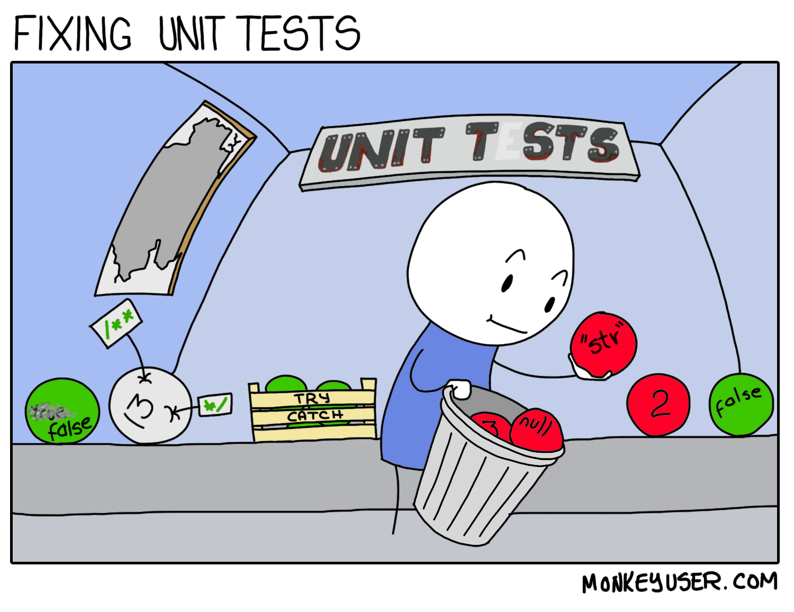

autoscale: true
build-lists: true
footer: ashdavies.dev | ashdavies@androiddev.social
footer-style: Product Sans
header: Product Sans
slide-transition: true
text-strong: Google Sans 18pt
text: Google Sans 18pt
theme: Plex, 1

# Beyond the Mockery
## Ash Davies

---

# Legacy 
## adj.

Denoting or relating to software or hardware that has been superseded but is difficult to replace because of its wide use.

^ When inheriting a legacy project, it can be tough to know where to start.

---

# Seam

---

# Testing

## ⛳️ Unit Tests
## 📱 Instrumentation Tests
## 🖇️ Integration Tests
## ↔ E2E Tests
## 🙈 Monkey Tests
## 🔥 Smoke Tests

---

[.background-color: #fff]

^ Fixing unit tests can often feel like navigating a minefield, in the dark, with a blindfold on.

^ The history of a test can be difficult to follow, and the code can be difficult to understand.

^ The tests themselves can be difficult to run, and the results can be difficult to interpret.

---

> Debugging is like being the detective in a crime movie where you are also the murderer.
-- Filipe Fortes

^ Often git blame will reveal the suspect, which is quite often me.

---

# Everything is an API
## [fit]ashdavies.dev/talks/everything-is-an-api-berlin-droidcon/

---

# Test Tools

- Espresso
- Robolectric
- Mockito
- JUnit
- Hamcrest

---

# Test SDKs

- Coroutines
- Androidx

---

# android.content.Context

^ The Android context is considered by many to be a "god object"

---

# 🪽 God Objects

^ God objects often reference a large number of distinct types, and/or unrelated methods.

^ Since they command so much, it's difficult to provide alternative implementations.

---

# Interface Segregation Principle

^ No code should be forced to depend on methods it does not use.

---

# 🥟 Ravioli Code

^ The antithesis of the god principle is apparently referred to as Ravioli code.

^ Either the Italians have a high opinion of themselves, or they've got it figured out.

---

# Mocks

---

# Stubs

---

# Fakes

---

# Conclusion

- Don’t mock classes you don’t own.
- Don’t mock classes you do own.
- Don’t mock classes.

---

Testing approaches, benefits of unit tests

Mechanisms for getting familiar with a codebase.
Working Effectively with Legacy Code
Unit tests for stability, structured code.
Importance of unit testing

Scenarios:
Change of method signature
Change of interface contract
Narrowing type inheritance
Mockito type safety
Default return types

Forces interface segregation
Alternatives to mocking?
Fakes, Stubs, Concretions

Fake, concrete implementation of interface, written with the production code, provides better documentation, insight, into the purpose of behaviour.

Oxford vs Chicago school of testing

---

Introduction (5 minutes)

Software development challenges and the role of mocking in simulating dependencies and testing behavior.
Overview of the talk's objective: Exploring the limitations of mocks and advocating for the use of fakes and in-memory implementations.
Drawbacks of Mocking (10 minutes)

Understanding the limitations of mocks, including their potential to create brittle tests.
Exploring how mocks can slow down development by introducing dependencies on external systems.
Discussing how mocks can hinder code refactoring efforts, making them difficult to maintain.
Introduction to Fakes and In-Memory Implementations (5 minutes)

Introduction to fakes and in-memory implementations as alternatives to mocks.
Explanation of how these alternatives provide faster feedback and increase confidence in code.
Advantages of Fakes and In-Memory Implementations (10 minutes)

Demonstrating how fakes and in-memory implementations offer more robust testing.
Discussing how they can be used to provide faster feedback loops during development.
Exploring how these alternatives improve code maintainability, especially as the codebase evolves.
Implementing Fakes and In-Memory Implementations (10 minutes)

Step-by-step examples of implementing fakes and in-memory implementations in Kotlin.
Providing simple, easy-to-understand code examples to showcase the practical application of these alternatives.
Demonstrating their usefulness in different testing scenarios, including unit testing and integration testing.
Conclusion (5 minutes)

Recap of the drawbacks of mocks and the advantages of fakes and in-memory implementations.
Encouragement to embrace these alternatives for more effective and maintainable testing in Kotlin.
Q&A session to address any remaining doubts or questions from the audience.

---

# Thanks!

---

# Further Reading

**Michael Feathers: Working Effectively with Legacy Code**
ISBN-13: 978-0-13117-705-5

**Testing on the Toilet: Don't mock Types You Don't Own**
testing.googleblog.com/2020/07/testing-on-toilet-dont-mock-types-you.html

**Martin Fowler: Practical Test Pyramid**
martinfowler.com/articles/practical-test-pyramid.html

**Filipe Fortes: One Good Tweet**
fortes.com/2017/one-good-tweet/
