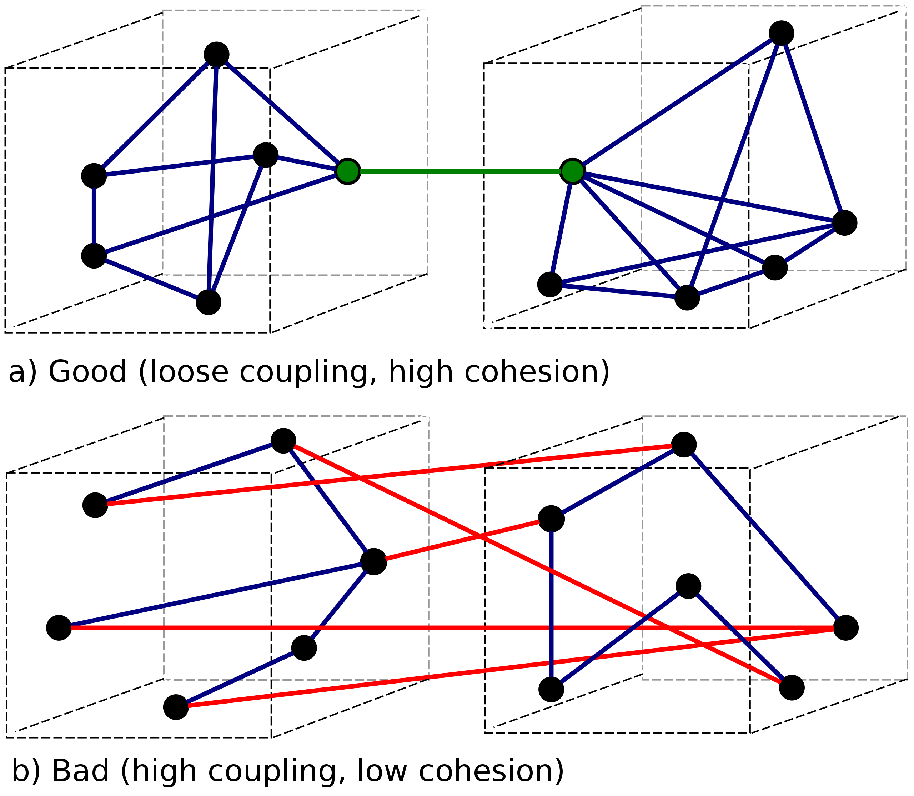
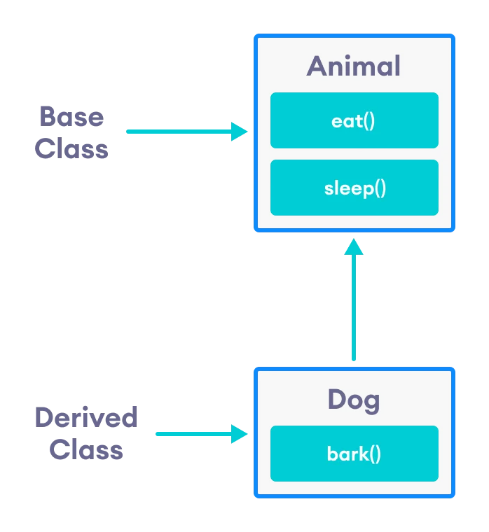
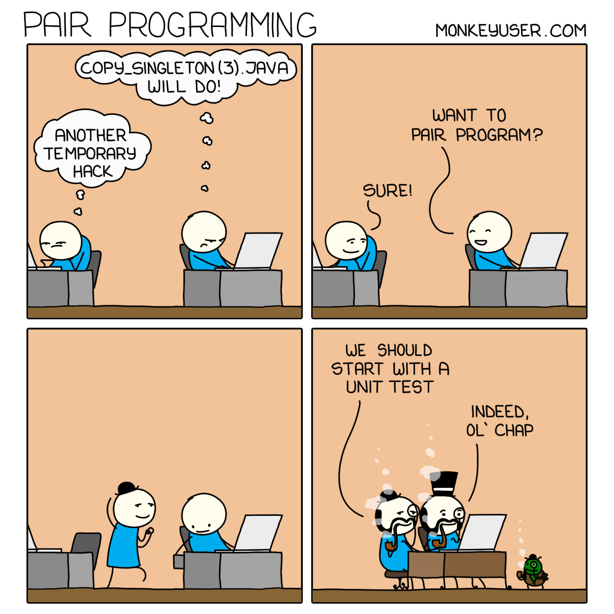
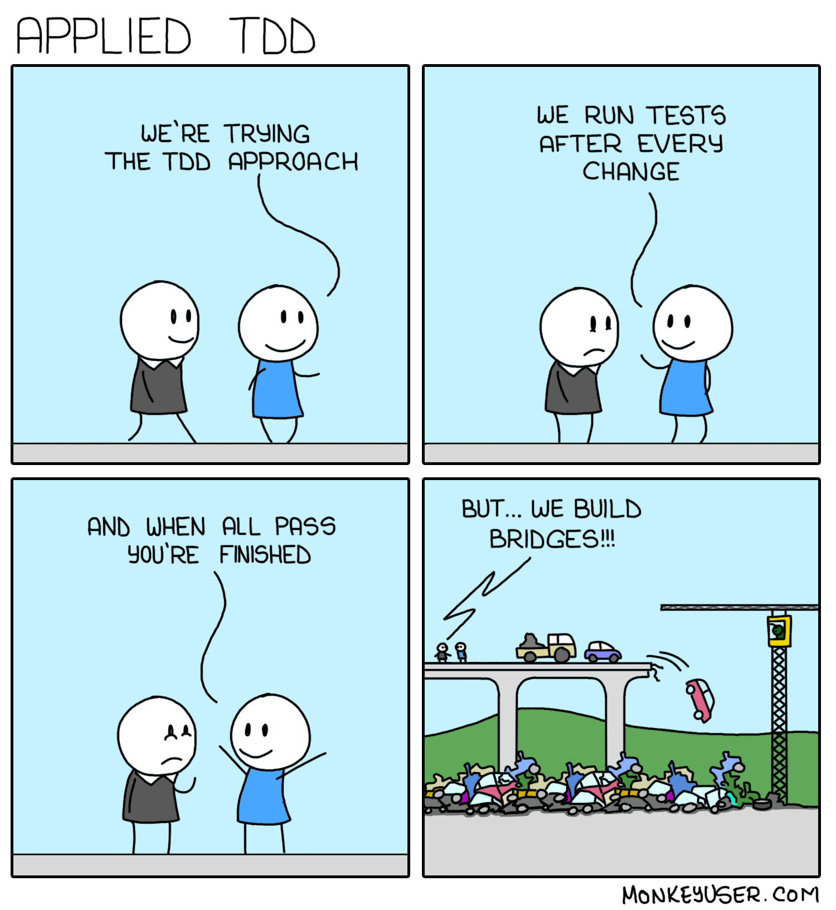
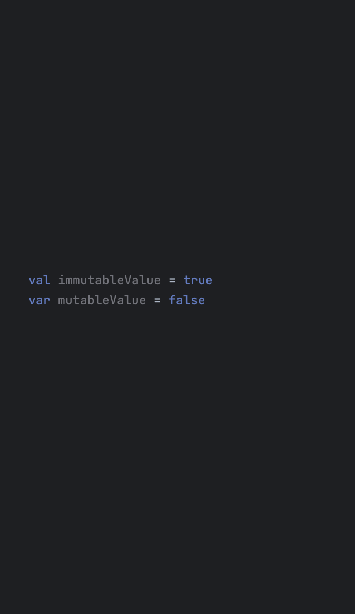

autoscale: true
build-lists: true
footer: ashdavies.dev
footer-style: Product Sans
header: Product Sans
slide-transition: true
text-strong: Google Sans 18pt
text: Google Sans 18pt
theme: Simple, 1

[.footer: ]


---

[.footer: Photo by Nubelson Fernandes on Unsplash]
[.footer-style: #CCC]


^ You've just landed a new job, new computer, swag, fancy coffee maker

^ Sit down with your new team, ready to start working

^ Thats when you see your new project...

---

[.background-color: #fff]


^ The reality is, we don't always have luxury of working in green fields

^ Production projects are complicated, often with a backlog of tech debt

---

# Legacy (adj.)

Denoting or relating to software or hardware that has been superseded but is difficult to replace because of its wide use.

^ Can be tough to know where to start with legacy projects.

^ Legacy code, topic most common to developers.

---

# Uncertainty


^ How to proceed with an existing project with certainty

---

# Coupling 🔌



^ Coupling describes how inter-connected modules are, often compared with cohesion

^ Highly coupled code is difficult to separate, makes it hard to find a seam

^ Loosely coupled code is easier to structure

---

# Inheritance



^ Complex hierarchy of inheritance with unclear responsibilities, invisible behaviour

^ Often from an attempt to reuse code, shared code is moved to an abstract class

^ Further adds to the unpredictable nature of our system

---

[.footer: Photo by Richard Horvath on Unsplash]
[.footer-style: #CCC]

# Mutability


^ Unnecessary mutability introduces change into our system

^ Undetermined change causes unpredictably and unreliability

^ Makes it more difficult to assert an expected state

---

# Unpredictability


^ Unpredictable code is by definition difficult to predict, difficult to assert expectations

^ Uncertainty caused by polymorphism, behaves differently

^ Backup code, unnecessary checks

---

# ?

^ Many approaches to manage these issues available to us

^ Ultimately means choosing the right tool for the job

---

# Extreme Programming 🤘

^ Extreme coding practices intentionally takes best practices to an extreme level

^ Some consider it to be a poor use of time, need to go quick and fix later (shortsighted)

^ Even if not used all the time, very helpful to practice and improve your ability as an engineer

---

# Pair Programming



^ Most commonly includes approaches like pair programming

^ Working closely with a colleague for a single task

^ Intense scrutiny useful for difficult tasks

---

# Test Driven Development



^ Test driven development focuses on writing tests before the implementation

^ Helps reframe your understanding of requirements, often leading to leaner solutions

---

# Offensive Programming <🖕>

^ Another approach embraces errors as a behaviour to disprove developer assumptions

^ Removes unnecessary checks, polymorphisms, and fallback behaviour sometimes

^ Source of errors are no longer obscured, can be resolved much easier

---


^ Guiding principle of Kotlin is to make it easy to write good code.

^ Primary tenet of that is the concept of mutability.

---

# Kotlin: Mutability

^ What is mutability, and what are the risks of mutation?

---

# Kotlin: Mutability

```kotlin
fun sumAbsolute(list: MutableList<Int>): Int {
  for (i in list.indices) list[i] = abs(list[i])
  return list.sum()
}
```

^ Impure, in-place mutations, non-deterministic state, hard to predict.

---

# Kotlin: Mutability

```kotlin
private val GROUNDHOG_DAY = TODO("java.util.Date()")
fun startOfSpring(): java.util.Date = GROUNDHOG_DAY

val partyDate = startOfSpring()
partyDate.month = partyDate.month + 1

// Date is mutable 🤦‍♂️
```

^ Date class returned by function is mutable, consumers can modify upstream value.

---

# Kotlin: Mutability
## Shared Mutable State ⚠️

^ Shared mutable state, causes race conditions, non-deterministic behaviour.

^ Thread-safe confinement, mutex, semaphores, help mitigate this risk.

---

# Kotlin: Immutability
## Unidirectional Data Flow 🏆

^ Ensures predictable state, easier to find bugs, replay events, predict application state.

---

# Kotlin: Immutability
## Collections

```kotlin
fun List<T>.toMutableList(): MutableList<T>

fun Map<K, V>.toMutableMap(): MutableMap<K, V>

fun Set<T>.toMutableSet(): MutableSet<T>
```

^ Kotlin provides immutable collections types, converting to mutable, creates new instance.

^ Kotlin collection interfaces may still be backed by a mutable Java implementation

---

# [fit] org.jetbrains.kotlinx:kotlinx-collections-immutable

```kotlin
fun Iterable<T>.toPersistentList(): PersistentList<T>

fun Iterable<T>.toPersistentSet(): PersistentSet<T>
```

^ Jetbrains provide an immutable collection library, highly advised

^ Helpful with Compose, no longer need to annotate stable

---

# Kotlin: Immutability
## IntelliJ IDEA



^ IntelliJ formats code to highlight mutable variables as underlined.

^ Subconscious "encouragement" makes the variable look out-of-place.

---

# Kotlin: Immutability
## Final Concretions 🧱

By default, Kotlin classes are final – they can't be inherited

^ Finally, classes final by default; encourages composition over inheritance.

---

# Kotlin: Immutability
## Final Concretions 🧱

```kotlin
open class Base // Class is open for inheritance
```

^ Kotlin classes can be made open, but this is a conscious decision.

---

[.footer: Photo by DiEGO MüLLER on Unsplash]
[.footer-style: #CCC]

# Testing


^ Automated tests can act as a safety harness to give you confidence when changing code

^ Well written unit tests provide robust protection, and early feedback, against regressions

^ Poor code is often synonymous with poor architecture, and poor testability

^ Not my goal to convince you to write tests...

---

[.footer: Photos by Daniel Romero, Taylor Vick on Unsplash]
[.footer-style: #CCC]


^ Testing approaches come in many forms, chiefly manual or automatic

^ Manual tests by QA engineers, developers verify or reproduce errors

^ Automated tests run on a CI, take the form of unit or integrated tests

---

[.build-lists: true]

# Testing


^ Best to complement test setup with a comprehensive test suite for robust regression protection

^ Unit tests provide most fine-grained coverage

---

# Anti-Patterns and Code Smell

^ It's not until we start writing tests that we realise how difficult it is to test our code.

^ This is often a sign that our code is not structured well.

^ Most established code bases have a long and colourful history with changing requirements

^ Accumulated tech debt composed of anti-patterns, code smells, poor decisions

---

# Refactoring

^ Because of this it is necessary to refactor to make the code testable in the first place

^ In a dead lock between our requirement on automated tests to refactor with confidence

^ Find a compromise by refactoring without changing behaviour

---

[.footer: Photo by Jackson David on Unsplash]
[.footer-style: #CCC]

# Seams


^ A seam is the place where two pieces of fabric meet

^ This translates similarly in programming

^ Logical separation point between two units of code

^ The separation allows you to adjust the behaviour without changing the code

---

# Refactoring: Seams

```kotlin
internal class FitFilter {
  private val parser: Parser = Parser.newInstance()
}
```

^ Objects most useful, allow for replacement of behaviour without modifying implementation.

^ Most common type of refactoring, utilises existing compiler configuration.

---

# Refactoring: Seams

[.code-highlight: 8-15]

```diff
===================================================================
diff --git a/FitFilter.kt b/FitFilter.kt

- internal class FitFilter {
-   private val parser: Parser = Parser.newInstance()
- }
-
+ internal fun interface FitFilter {
+   fun filter(input: String): String
+ }
+
+ internal fun FitFilter(parser: Parser) = FitFilter { input ->
+   parser.parse(input)
+ }
```

^ Requires modern refactoring techniques, good understanding of idiomatic code.

---

# Refactoring: Seams


^ IntelliJ assists with these techniques in a few clicks.

---

# Refactoring
## Dependency Injection

^ Not to be confused with dependency frameworks such as Dagger

^ Dependency injection is a coding paradigm

---

# Refactoring
## Dependency Injection

[.code-highlight: 8-12]

```diff
===================================================================
diff --git a/CoffeeMaker.kt b/CoffeeMaker.kt

- internal class CoffeeMaker {
-   private val heater: Heater = ElectricHeater()
-   private val pump: Pump = Thermosiphon(heater)
- }

+ internal class CoffeeMaker(
+   private val heater: Heater,
+   private val pump: Pump,
+ )
```

^ Common refactor to invert control, requires caller to provide dependencies. 

^ Enjoyable using "thermosiphon", universally hated sample.

---

# Refactoring
## Dependency Injection

[.code-highlight: 4-5, 7-13, 15]

```diff
===================================================================
diff --git a/CoffeeMaker.kt b/CoffeeMaker.kt

+ internal class CoffeeMaker(
+   private val heater: Heater,
-   private val thermosiphon: Thermosiphon,
+   private val pump: Pump,
+ )
+
+ internal interface Pump {
+   fun pump()
+ }
+
- internal class Thermosiphon {
+ internal class Thermosiphon : Pump {
```

^ Reducing the behaviour of Thermosiphon by better defining its requirements

^ Thereby reduce dependency scope by narrowing type

---

# Testing: Dependencies
## Dependency Injection

```kotlin
internal class CoffeeMaker(
  private val heater: Heater,
  private val pump: Pump,
)
```

^ Dependencies injected into class constructor.

^ With a seam we can start testing.

^ Why do we replace depenendices?

---

# Testing: Dependencies
## Dependency Injection

[.code-highlight: 1]

```kotlin
val heater = NuclearFusionHeater() // Expensive!

val maker = CoffeeMaker(
  pump = Thermosiphon(heater),
  heater = heater,
)

assertTrue(maker.brew())
```

^ Unit tests should be fast, should run in milliseconds.

^ Expensive dependencies should be replaced.

^ Achieving nuclear fusion is probably overkill for a unit test

---

# Testing: Dependencies
## Dependency Injection

[.code-highlight: 1]

```kotlin
val heater = DiskCachedHeater() // Stateful!

val maker = CoffeeMaker(
  pump = Thermosiphon(heater),
  heater = heater,
)

assertTrue(maker.brew())
```

^ Not just performance, tests should be stateless (or idempotent [eye-dem-potent]).

^ Disk operations are stateful, can change.

---

# Testing: Dependencies
## Dependency Injection

[.code-highlight: 1]

```kotlin
val heater = UnbalancedHeater() // Error prone!

val maker = CoffeeMaker(
  pump = Thermosiphon(heater),
  heater = heater,
)

assertTrue(maker.brew())
```

^ Further, may want to isolate error prone dependencies.

^ Test single unit in isolation.

---

# Testing: Dependencies
## Test Doubles

^ Test doubles are a common technique to replace dependencies.

^ Offer isolation, simplicity, isolation, and control.

---

# Test Doubles
## Mocks

^ Mocks are a type of test double that allow you to specify expectations.

^ Often used to verify interactions with dependencies

---

# Test Doubles: Mocks

```kotlin
val heater = mock<Heater>()
val pump = mock<Pump>()

val maker = CoffeeMaker(
  heater = heater,
  pump = pump,
)

assertTrue(maker.brew())
```

^ Provide class under test with mocks.

^ Cross fingers, run test.

---

# Test Doubles: Mocks

```kotlin
val heater = mock<Heater>()
val pump = mock<Pump>()

val maker = CoffeeMaker(
  heater = heater,
  pump = pump,
)

assertTrue(maker.brew()) // ⚠ Fails!
```

^ Of course this fails, mocks don't do anything.

---

# Test Doubles: Mocks

[.code-highlight: 1-7]

```kotlin
val heater = mock<Heater> {
  on { isHeating } doAnswer { true }
}

val pump = mock<Pump> {
  on { pump() } doAnswer { true }
}

val maker = CoffeeMaker(
  heater = heater,
  pump = pump,
)

assertTrue(maker.brew())
```

^ Configuring the mocks with an implementation

^ Mocking libraries provide extensive DSLs for building mocks

---

# Test Doubles: Mocks
## Footguns 🦶🔫

^ Mocks are a powerful tool, easy to shoot yourself in the foot

^ Declaring a mock implementation at runtime is complicated

---

# Test Doubles: Mocks
## Accidental Invocation

```kotlin
spy(emptyList<String>()) {
  on { get(0) } doAnswer { "foo" } // throws IndexOutOfBoundsException
}
```

^ When constructing mocks, and spying objects, mocks will actually invoke the method

^ Goes unnoticed if method has no implementation, returns null

^ When spying actual implementations will throw

---

# Test Doubles: Mocks
## API Sensitivity

```kotlin
internal interface Heater {
  val isHeating: Boolean
}

val heater = mock<Heater> {
  on { isHeating } doAnswer { true }
}
```

^ Creating a runtime implementation is rarely type safe.

^ If the API changes, the mock may still compile.

---

# Test Doubles: Mocks
## API Sensitivity

[.code-highlight: 2]

```diff
  internal interface Heater {
+   fun <T : Any> heat(body: () -> T): T
    val isHeating: Boolean
  }
  
  val heater = mock<Heater> {
    on { isHeating } doAnswer { true }
  }
```

^ Mock already compiled without stubbing.

^ Further changes are ignored.

---

# Test Doubles: Mocks
## Data Classes

^ Some might be tempted to mock data classes

---

# Test Doubles: Mocks
## ~~Data Classes~~
### Just Don't.

^ Data classes should never be mocked

---

# Test Doubles: Mocks
## Default Answers

[.code-highlight: 5-8]

```diff
===================================================================
diff --git a/PumpTest.kt b/PumpTest.kt

- val heater: Heater = mock()
+ val heater: Heater = mock(defaultAnswer = RETURNS_SMART_NULLS)
+
+ val isHeating: Boolean = heater.isHeating // false
```

^ By default mocks returns null for all methods without stubbing

^ Unexpected nulls throw deep in the execution stack

^ Default answers adjust this behaviour

^ Seek help

---

# Test Doubles: Mocks
## Performance

Expensive real implementations replaced by expensive mocks.

- Runtime code generation
- Bytecode manipulation
- Reflection 😱

^ Ironically, mocks are expensive to create, and expensive to execute.

^ Mocks stores every interaction with mocks, small aggregations accumulate quickly.

^ Authors have optimized well, but expensive due to nature of operation.

---

# Test Doubles: Mocks
## Dynamic Mutability

[.code-highlight: 12-15]

```kotlin
internal class CoffeeMakerTest {
  
  private lateinit var heater: Heater
  
  @Before
  fun setUp() {
    heater = mock {
      on { isHeating } doAnswer { true }
    }
  }
  
  @Test
  fun `should brew coffee`() {
    // heater already has state!
  }
}
```

^ Minimal impact here, but on a larger scale is a nightmare.

^ Unpredictable state, hard to people to understand.

---

# Test Doubles: Mocks
## Dynamic Mutability


Framework generated mocks introduce a shared, mutable, dynamic, runtime declaration. 

^ Shared mutable state should feel uncomfortably bad.

^ Dynamic runtime declarations should feel equally uncomfortable.

^ Test code is production code that don't ship.

^ Kotti knows it's wrong, and so should you.

---

# Unpredictability
## Costs

^ Predictability is a underrated metric.

^ Although hard to quantify.

---

# Unpredictability: Costs
## Learning Curve

^ Most evident when onboarding new colleagues

---

# [fit] Unpredictability: Costs
## Peer Review


^ Hard to review code that is unpredictable.

^ PRs remain open longer, sad, alone.

---

[.background-color: #fff]

# [fit] Unpredictability: Costs
## Risk of Bugs


^ Unpredictability means you cannot predict the edge cases.

---

# Unpredictability: Costs
## Slowed Feature Delivery ~~💰💰💰~~

^ Technical debt must be repaid.

^ Slows feature delivery.

---

[.background-color: #fff]

# Unpredictability
## Victims


- Junior developers
- New team members
- Future you

^ Unpredictable state is a nightmare for people to understand.

^ Not just junior developers, but new team members, and future you.

---

# Test Doubles: Mocks

## Don't Mock Classes You Don't Own

### [fit] testing.googleblog.com/2020/07/testing-on-toilet-dont-mock-types-you.html

^ Google Testing Blog: Don't Mock Types You Don't Own

^ Mocked classes may change in ways you don't expect.

^ Not exclusive to classes you don't own.

---

# You Don't Own Your Code!

## Your code belongs to your team.

### Be considerate.

^ Naive developers may assume because they understand it, others will too.

^ If your code introduces cognitive complexity, it's not good code.

^ Keep It Simple Stupid.

---

# Test Doubles: Mocks
## Interaction Verification 👎

^ Biggest problem with mocks, they verify the interaction, not the outcome

^ Doesn't matter if invocation is correct, if the outcome is wrong

^ At some point, you're testing the language

^ This point deserves its own talk

---

# Test Doubles: Mocks
## What Now?


^ Mockito has an extensive DSL for building runtime declarations.

^ What also has an extensive DSL for building classes? Kotlin.

---

# Test Doubles: Stubs

^ You may have already encountered stubs.

^ Simple implementation only meant to compile.

---

# Test Doubles: Stubs
## Simple

```kotlin
internal interface Pump {
  fun pump(): Boolean
}

internal object StubPump : Pump {
  override fun pump(): Boolean = true
}
```

^ Stub can be the most simplest implementation.

^ No verification logic.

---

# Test Doubles: Stubs
## Idiomatic

```kotlin
internal fun interface Pump {
  fun pump(): Boolean
}

val stub = Pump { true }
```

^ Stubs implementations can be a bit more idiomatic.

^ Kotlin functional interfaces make mocks redundant.

---

# Testing: Stubs
## API Sensitive

[.code-highlight: 1-2, 4, 6-7]

```diff
+ private const val DEFAULT_AMOUNT = 250 // ml
+ 
- internal fun interface Pump {
+ internal interface Pump {
-   fun pump(): Boolean
+   fun pump(amount: Int = DEFAULT_AMOUNT): Boolean
+ }
```

^ Classes declared in Kotlin are sensitive to interface changes.

---

# Testing: Stubs
## API Sensitive

[.code-highlight: 7]

```kotlin
private const val DEFAULT_AMOUNT = 250 // ml

internal interface Pump {
  fun pump(amount: Int = DEFAULT_AMOUNT): Boolean
}

val stub = Pump { true } // Compilation failure...
```

^ This change will not compile because the functional interfaces are no longer supported.

^ We know this, because we wrote it, not reliant on a framework.

---

# Testing: Fakes 🏆

^ But what if you need more than a stub?

^ Still need to verify outcome.

---

# Testing: Fakes

```kotlin
public class FakePump(private val onPump: (Boolean) -> Boolean) : Pump {

  public val pumped = mutableListOf<Pair<Boolean, Boolean>>()

  override fun pump(full: Boolean): Boolean = onPump(full).also {
    pumped += full to it
  }
}
```

^ Pass lambda to control outcome, similar to functional interface.

^ Additionally keeps list of inputs, and outcomes.

---

# Testing: Fakes
## Additional Behaviour

```kotlin
private class DelegatingHeater(
  private val delegate: Heater,
) : Heater by delegate {

  private val _drinks = mutableListOf<Any>()
  val drinks: List<Any> by ::_drinks

  override fun <T : Any> heat(body: () -> T): T {
    return delegate.heat(body).also { _drinks += it }
  }
}
```

^ Full control over behaviour.

^ Delegates to provided instance.

---

# Testing: Fakes
## Authoring

^ Fakes ideal because you define the behaviour.

^ Who is responsible for writing fakes?

---

[.background-color: #fff]

# Testing: Fakes
## Responsibility


^ Yep, you.

---

[.background-color: #fff]

# Testing: Fakes
## Qualifications


Those who wrote the code are the most uniquely qualified to write the tests.

^ Because you are the person most uniquely qualified.

^ At the time of authoring, you had the most context.

^ Goes for library authors too

---

# Testing: In Memory

```kotlin
internal fun interface CoffeeStore {
  fun has(type: CoffeeType): Boolean
}

internal enum class CoffeeType {
  CAPPUCCINO,
  ESPRESSO,
  LATTE,
}
```

^ Many circumstances an in-memory implementation is sufficient.

^ Given a simple store interface, we can implement in-memory.

---

# Testing: In Memory

```kotlin
internal class InMemoryCoffeeStore : CoffeeStore {

  private val _stock = mutableMapOf<CoffeeType, Int>()
  val stock: Map<CoffeeType, Int> by ::_stock

  override fun has(type: CoffeeType): Boolean {
    return (_stock[type] ?: 0) > 0
  }

  fun add(type: CoffeeType, amount: Int = 1) {
    _stock[type] = (_stock[type] ?: 0) + amount
  }
}
```

^ Basic in-memory implementation also useful for debugging

---

# Be Better

^ Like Kotlin encourages us to use better practices by making poor practices uncomfortable

^ Better practices encourage us to write smaller interfaces

---

[.background-color: #64b6a8]
[.text: #fff]
[.footer: Image: dribbble.com/shots/3251806-Interface-Segregation-Principle]

# Interface Segregation


No code should be forced to depend on methods it does not use.

^ Solid design principles are a tired trope but this remains true

^ Keep your interfaces lean, without assigning too much responsibility

---

# Testing: Android
## Legacy Inheritance


^ Like many frameworks and platforms, Android has a long history of legacy code.

^ Advances in Jetpack, AndroidX, and Project Mainline have improved this.

^ Still framework code to deal with.

---

# [fit] android.content.Context


^ The Android context is considered by many to be a "god object"

^ God objects often reference a large number of distinct types, and/or unrelated methods.

^ Since they command so much, it's difficult to provide alternative implementations.

---

# Recap
## Extreme Programming

^ It's important to consider this as another extreme coding approach

^ Like code katas, tdd or offensive code, good to practice

^ Choose when is most appropriate, but consider all options!

---

# Recap
## Shared Mutable State

^ Avoid like the plague, shared mutable state, rely upon immutability

^ Your goal is to achieve an immutable unidirectonal data flow

---

# Recap
## Test Doubles

^ Mocks are designed with APIs to verify interactions, black magic voodoo, Java reflection

^ Spies are mocks on a real object

^ Stubs perform bare minimum to allow your tests to pass

^ Fakes are hand coded implementations use for testing

---

# Thanks!

^ Slides available on my website ashdavies.dev

^ This Year in Android tomorrow same room at 11:40

---

# Further Reading

- **Martin Flower: Mocks Aren't Stubs**
martinfowler.com/articles/mocksArentStubs.html
- **Martin Fowler: Practical Test Pyramid**
martinfowler.com/articles/practical-test-pyramid.html
- **Images: Monkey User**
monkeyuser.com
- **Michael Feathers: Working Effectively with Legacy Code**
ISBN: 978-0-13117-705-5
- **Sam Edwards: Wrapping Mockito Mocks for Reusability**
handstandsam.com/2020/06/08/wrapping-mockito-mocks-for-reusability
- **Steve Freeman, Nat Pryce: Growing Object-Oriented Software, Guided by Tests**
ISBN: 978-0-32150-362-6
- **Testing on the Toilet: Don't mock Types You Don't Own**
testing.googleblog.com/2020/07/testing-on-toilet-dont-mock-types-you.html
- **Testing on the Toilet: Know Your Test Doubles**
testing.googleblog.com/2013/07/testing-on-toilet-know-your-test-doubles.html
- **Marcello Galhardo: No Mocks Allowed**
marcellogalhardo.dev/posts/no-mocks-allowed

