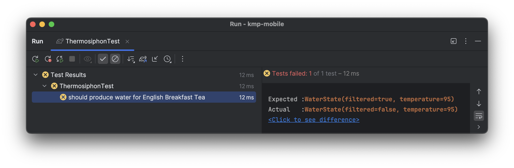

autoscale: true
build-lists: true
footer: ashdavies.dev
slide-transition: true
slidenumbers: true
theme: Olive Green, 9

[.text: line-height(2), text-scale(0.5)]
[.footer: ]

# Testing in Practice

## Keeping Your Tests Concise and Declarative

### Droidcon Berlin - July '24 🇩🇪

Ash Davies - SumUp
Android / Kotlin GDE Berlin
ashdavies.dev

^ Testing isn't always everybody's favourite task, but that doesn't need to be the case! Writing tests can be an enjoyable way to practice your coding techniques!

^ But with conflicting opinions on writing test code that is declarative, explicit, terse, concise, and isolated, it can be tough to know how to satisfy all of these whilst still retaining your will to live.

^ I'll be covering a few techniques, and mechanisms, for writing idiomatic Kotlin code that leaves you with a beautiful test case that not only fulfils all this but gives you accurate code documentation for your project.

---

[.background-color: #fff]
[.header: #000]
[.footer-style: #000]

# Why Test?

^ Why test in the first place?

^ Everybody says you should

^ Is it even beneficial?

---

[.footer: Photos by Daniel Romero, Taylor Vick on Unsplash]
[.footer-style: #CCC]


^ Many different test approaches

^ Manual or otherwise

^ QA tests to find unexpected behaviour

^ Either in the wild or internal distribution

^ Gathered quotes from people...

---

> "Hey, I hope you had a relaxing weekend..."

> -- QA Enginner (8:47 Monday morning)

^ Nothing fills you with more dread

^ Thanks Ronaldo

^ How to avoid this...

---


^ Automated tests run on a CI

^ Automatically, on commit, PR, per configuration

^ Robust protection, early feedback

^ Help prevent regressions

---

# Testing

- Monkey
- End-to-End
- Acceptance
- Instrumentation
- Integration
- Regression
- Unit

^ === LIST ===

^ Many different types of testing

^ Slow!

---


^ Compose screenshot testing

^ Low code, automatic generation

---

[.footer: Photo by DiEGO MüLLER on Unsplash]
[.footer-style: #CCC]

# Testing


^ Act as a safety harness

^ Confidence when changing code

^ Useful for refactoring...

---

# 🥱


^ Despite this

^ Many find tests tedious

^ Not an appropriate use of time

---

# ⏱️

^ Just didn't have the time

^ Under pressure to meet deadlines

^ Not prioritised

---

> "Can we skip the unit tests, just for this feature?"

> -- PM

^ Maybe by request

^ Shortcuts taken

---

Developer: "I'll get back to it later..."

Narrator: "They never got back to it."

^ I'll get back to it later...

^ Situation changed

---

[.footer: youtu.be/8QvXErxv9qw]

> "Tests Saved My Ass"

> -- Ben Kadel

^ Automated tests are an investment

^ May or may not save your ass

---

> "Our OKR is 100% Code Coverage"

> -- Former CTO

^ Not useful if not respected

^ Need to be used properly

---

[.background-color: #fff]
[.footer-style: #000]


^ Important to remember unit tests shouldn't exist alone

^ Not only is test coverage is not an indicative metric

^ Unit tests alone will not give you needed certainty

^ Units may function independently

---

> Tests test design as well as logic

> -- Michael Feathers

^ Favourite thing about unit tests

^ They are testing code architecture

---

# Architecture

### Anti-Patterns and Code Smell

^ Unit tests can highlight architecture improvements

^ If it's hard to test, structure can be improved

^ Useful even if you throw away the tests

---


# Architecture

- Coupling
- Inheritance
- Mutability
- Polymorphism

^ === LIST ===

^ Each introduce unpredictability

^ Difficult to test

^ Needs refactoring

^ Might seem difficult

---

[.background-color: #fff]
[.footer-style: #000]
[.header: #000]

# Problem Solving


^ Engineering is often problem solving

^ Balancing problems with solutions

---

[.background-color: #fff]
[.footer-style: #000]
[.header: #000]

# Solutions Looking for a Problem


^ Be ware of solutions looking for a problem

^ Not relevant to Gen AI, neither solution, nor problem

---

[.background-color: #0D0E21]

# Problem Solving


^ Perhaps why we see coding exercises like Advent of Code

^ Coding should be fun

---

[.background-color: #fff]
[.footer-style: #000]


^ Programming exercises help us be better engineers

^ Think of new ways to solve problems

^ To progress, consider different perspectives

---

// Let's Code

^ Some of this code might not compile...

^ It may look hastily strung together only minutes before this talk...

^ But let me assure you, it was

---

```kotlin
class ThermosiphonTest {

  @Mock
  var heater: Heater

  @Mock
  var logger: Logger

  @InjectMocks
  lateinit var sut: Thermosiphon

  @SetUp
  fun setup() {
    MockAnnotations.init(this)
  }

  @Test
  fun `should heat water`() {
    thermosiphon.pump()

    assertTrue(heater.isHot())
  }
}
```

^ Random test from previous codebase

^ Indicative of many test cases

^ Unnecessary annotations

^ Noise obfuscates behaviour

^ Unnecessary immutability

^ Stuck in Java land

---

# Test Doubles

### Mocks

#### (╯°□°)╯︵ ┻━┻

^ Spoken already about mocks

^ Overused, abused, absurd

---

# Test Doubles

### Mocks

- Behaviour Verification 👎
- API Insensitivity 😤
- Scale Poorly 📉

^ === List ===

^ Verify interaction, not outcome.

^ Irrelevant if correct behaviour correct if state is wrong

^ Not sensitive to API changes, prone to runtime failures

^ Create noise and verbosity in configuration

^ At some point, you're testing the language.

---

```kotlin
class ThermosiphonTest {

  @Mock
  var heater: Heater

  @Mock
  var logger: Logger

  @InjectMocks
  lateinit var sut: Thermosiphon

  @SetUp
  fun setup() {
    MockAnnotations.init(this)

    whenever(heater.heat(any())).thenReturn(/* ... */

    whenever(logger.log(any())).thenAnswer {
      /* ... */
  }

  @Test
  fun `should heat water`() {
    thermosiphon.pump()

    val argumentCaptor = argumentCaptor()

    verify(heater).heat(argumentCapture.capture())

    assertTrue(argumentCaptor.values[0])
  }
}
```

^ Mutability on mock configuration

^ Exponential noise to setup

^ Vendor API misleading in code

^ Different mocking frameworks

^ There is a better way...

---

# Factory Functions

^ Favourite coding convention in Kotlin

---

# Factory Functions

```kotlin
interface Pump {
 fun pump()
}

class Thermosiphon(
  private val heater: Heater,
) : Pump
```

^ Typical class constructor

^ Linked to implementation

^ Constructur is just a function

---

# Factory Functions

```kotlin
interface Pump {
  fun pump()
}

fun Pump(heater: Heater): Pump {
  return Thermosiphon(heater)
}

private class Thermosiphon(
  private val heater: Heater,
)
```

^ Factory functions can abstract concretion from the interface

^ Make use of the capitalisation to mimic construcot

^ Additional layer of abstraction can refactor without changing call-site

---

# Factory Functions

`CoroutineScope()`

`CompletableDeferred()`

`Channel()`

`MutableStateFlow()`

`List()`

^ Factory functions widely used in Kotlin and Coroutines

---

# Factory Functions

```kotlin
public actual fun <T> lazy(mode: LazyThreadSafetyMode, initializer: () -> T): Lazy<T> =
    when (mode) {
        LazyThreadSafetyMode.SYNCHRONIZED -> SynchronizedLazyImpl(initializer)
        LazyThreadSafetyMode.PUBLICATION -> SafePublicationLazyImpl(initializer)
        LazyThreadSafetyMode.NONE -> UnsafeLazyImpl(initializer)
    }
```

^ May not always use same capitalisation

^ Additional behaviour innappropriate for a constructor

---

# Functional Interfaces

^ Another favourite feature

^ Originally used for Java interop

^ Added SAM behaviour to Kotlin

---

[.code-highlight: 1]

# Functional Interfaces

```kotlin
fun interface Pump {
  fun pump()
}

fun Pump(heater: Heater): Pump {
  return Thermosiphon(heater)
}

private class Thermosiphon(
  private val heater: Heater,
)
```

^ Simply add the fun keyword

---

# Functional Interfaces

```kotlin
fun interface Pump {
  fun pump()
}

fun Pump(heater: Heater) = Pump {
  /* ... */
}
```

^ Simple easy-to-use implementation

^ Can be created easily in test

---

# Functional Interfaces

```kotlin
fun interface Pump {
  fun pump(): Boolean
}

- val pump = mock<Pump> {
-   whenever(heat()).thenReturn(true)
- }

+ val pump = Pump { true }
```

^ Replacing even the most well written mock with a simple lambda

---

```kotlin
class ThermosiphonTest {

  @Test
  fun `should heat water`() {
    var isHot = false

    val heater = Heater { isHot = true }
    val thermosiphon = Thermosiphon(heater)

    thermosiphon.pump()

    assertTrue(isHot)
  }
}
```

^ Cost is much more concise

^ Self contained in a test

^ Low cognitive load

---

```kotlin
class ThermosiphonTest {

  @Test
  fun `should heat water`() {
    var isHot = false

    val heater = Heater { isHot = true }
    val thermosiphon = Thermosiphon(heater)

    thermosiphon.pump()

    assertTrue(isHot)
  }

  @Test
  fun `should cool down after heating`() {
    /** ... */
  }
}
```

^ But you're likely to have more than one test...

---

```kotlin
class ThermosiphonTest {

  @Test
  fun `should heat water`() {
    var isHot = false

    val heater = Heater { isHot = true }
    val thermosiphon = Thermosiphon(heater)

    thermosiphon.pump()

    assertTrue(isHot)
  }

  @Test
  fun `should cool down after heating`() {
    /** ... */
  }

  @Test
  fun `should not catch fire when flying`() {
    /** ... */
  }
}
```

^ As your requirements develop

^ Tests become more complex

---

```kotlin
class ThermosiphonTest {

  @Test
  fun `should heat water`() {
    var isHot = false

    val heater = Heater { isHot = true }
    val thermosiphon = Thermosiphon(heater)

    thermosiphon.pump()

    assertTrue(isHot)
  }

  @Test
  fun `should cool down after heating`() {
    /** ... */
  }

  @Test
  fun `should not catch fire when flying`() {
    /** ... */
  }

  @Test
  fun `should not become sentient`() {
    /** ... */
  }
}
```

^ So it might be tempting to reuse code

---

```kotlin
class ThermosiphonTest {

  val heater = Heater { isHot = true }
  val thermosiphon = Thermosiphon(heater)

  var isSentient = false
  var hasExploded = false
  var isHot = false
  
  @Test
  fun `should heat water`() {
    /* ... */
  }

  @Test
  fun `should cool down after heating`() {
    /** ... */
  }

  @Test
  fun `should not catch fire when flying`() {
    /** ... */
  }

  @Test
  fun `should not become sentient`() {
    /** ... */
  }
}
```

^ Extracting values to class members

---

```kotlin
class ThermosiphonTest {

  val heater = Heater { isHot = true }

  val thermosiphon = Thermosiphon(
    overflow = SmallOverflowTank(),
    heater = heater,
  )

  var isSentient = false
  var hasExploded = false
  var isHot = false
  
  @Test
  fun `should heat water`() {
    /* ... */
  }

  @Test
  fun `should cool down after heating`() {
    /** ... */
  }

  @Test
  fun `should not catch fire when flying`() {
    /** ... */
  }

  @Test
  fun `should not become sentient`() {
    /** ... */
  }
}
```

^ May seem like it makes sense as your system gets more complex

^ Requires more configuration

---

```kotlin
class ThermosiphonTest {

  val heater = Heater { isHot = true }

  val thermosiphon = Thermosiphon(
    overflow = SmallOverflowTank(),
    aiEngine = GeminiEngine(),
    heater = heater,
  )

  var isSentient = false
  var hasExploded = false
  var isHot = false
  
  @Test
  fun `should heat water`() {
    /* ... */
  }

  @Test
  fun `should cool down after heating`() {
    /** ... */
  }

  @Test
  fun `should not catch fire when flying`() {
    /** ... */
  }

  @Test
  fun `should not become sentient`() {
    /** ... */
  }
}
```

^ Fairly heavy constructor with configuration

^ Customisation required for each test case

---

```kotlin
class ThermosiphonTest {

  val heater = Heater { isHot = true }

  val thermosiphon = Thermosiphon(
    overflow = SmallOverflowTank(),
    aiEngine = GeminiEngine(),
    heater = heater,
    launchCodes = emptyList(),
  )

  var isSentient = false
  var hasExploded = false
  var isHot = false
  
  @Test
  fun `should heat water`() {
    /* ... */
  }

  @Test
  fun `should cool down after heating`() {
    /** ... */
  }

  @Test
  fun `should not catch fire when flying`() {
    /** ... */
  }

  @Test
  fun `should not become sentient`() {
    /** ... */
  }
}
```

^ Test frameworks destroy and create class per test

^ Whilst theroetically fine for safety

^ Misleading state

^ Entire configuration prepared for each test

---

```kotlin
class ThermosiphonTest {
  
  @Test
  fun `should heat water`() {
    var isHot = false
    val thermosiphon = thermosiphon(
      onHeat = { isHot = true },
    )

    thermosiphon.pump()

    assertTrue(isHot)
  }
}

fun thermosiphon(
  onHeat: () -> Unit
) = Thermosiphon(
  overflow = SmallOverflowTank(),
  aiEngine = GeminiEngine(),
  heater = Heater(onHeat),
  launchCodes = emptyList(),
)
```

^ Simplify behaviour with factory functions

^ Member variables are avoided

^ Isolated behaviour

---

# DRY

### Don't Repeat Yourself

- Remove duplication
- High code reusability
- Isolating change

^ === LIST ===

^ Demonstrate DRY principle

^ Remove duplication

^ High code reusability

^ Must cater to many scenarios

---

# DAMP

### Descriptive AND Meaningful Phrases

- Some duplication permitted
- Declarative syntax
- Meaningful naming

^ === LIST ===

^ Because developers seemingly love acronyms

^ Duplication permitted to help readability

^ DAMP prefers a more forgiving syntax

^ Emphasis on meaningul naming

---

# DRY vs DAMP

^ Not mutually exclusive

^ Balance duplication / descriptiveness

^ Tests test multiple scenarios

^ Helpful to be more readable

^ DRY in production, DAMP in test

^ Speaking of descriptiveness...

---

# Documentation

^ Programming is hard, sometimes weird errors occur

^ Your code may not always behave as expected

^ May spend hours, or days debugging

^ Document to prevent the same mistake

---

# Documentation

```kotlin
/**
 * Make sure not to change this thing back to the previous implementation,
 * because it breaks on that one specific device in production,
 * when opening the user profile in France using a German locale.
 **/
fun doMyThing() {
  /* ... */
}
```

^ Documentation is fragile

^ Expires faster than the code it documents

---

# Documentation

```kotlin
/**
 * Make sure not to change this thing back to the previous implementation,
 * because it breaks on that one specific device in production,
 * when opening the user profile in France using a German locale.
 *
 * Update: We changed this to be a remote resolution, this shouldn't happen?
 * We haven't seen it happen in production anymore, but just leave this
 * comment here, incase it occurs again...
 **/
fun doMyThingRefactoredV63() {
  /* ... */
}
```

^ You may end up with conflicting stories

^ Misleading or innappropriate information

---

# Documentation

```kotlin
/**
 * Make sure not to change this thing back to the previous implementation,
 * because it breaks on that one specific device in production,
 * when opening the user profile in France using a German locale.
 *
 * Update: We changed this to be a remote resolution, this shouldn't happen?
 * We haven't seen it happen in production anymore, but just leave this
 * comment here, incase it occurs again...
 *
 * Update: It's happening again, but for Italian uses in Australia,
 * I really hope our Italian QA enginner doesn't go on vacation to Melbourne again...
 **/
fun doMyThingRefactoredToBeMoreSafeIHopeV91() {
  if (user.locale == Locale.ITALY) {
    /* Hacky hack McHackFace */
  }
}
```

^ Best outcome is it can be ignored

^ Mostly is misleading can hide issues

---

# Documentation

^ Ideally code should serve as it's own documentation

^ Sometimes needs more context

---

# Documentation: Tests

```kotlin
fun `should store in user specific locale when device is in another country()
```

^ Test names can be written in human readable language

---

# Documentation: Tests

```kotlin
fun `should store in user specific locale when device is in another country() {
  val intendedTarget = ...
  val expectedLocale = ...

  val actualLocale = doMyThing()

  assertEquals(expectedLocale, actualLocal)
}
```

^ Simple uses of naming builds a narrative, tells a story in code

---

```bash
commit d4c2d156e78cd579662ac7a658b00ca5aa17fd5d (HEAD -> main, origin/main, origin/HEAD)
Author: Ash Davies <1892070+ashdavies@users.noreply.github.com>
Date:   Sun Jun 23 19:19:44 2024 +0200
```

^ Immutable commit message with time and attribution

---

[.background-color: #fff]
[.footer-style: #000]


^ Remember documentation not just important for new developers

^ Find yourself forgetting what your code did

---


```kotlin
class ThermosiphonTest {

  @Test
  fun `should heat water`() {
    var isHot = false
    val thermosiphon = thermosiphon(
      onHeat = { isHot = true },
    )

    thermosiphon.pump()

    assertTrue(isHot)
  }
}

fun thermosiphon(
  onHeat: () -> Unit
) = Thermosiphon(
  overflow = SmallOverflowTank(),
  aiEngine = GeminiEngine(),
  heater = Heater(onHeat),
  launchCodes = emptyList(),
)
```

^ Trying to demonstrate how to achieve maximum descriptiveness with minimal duplication

^ Making use of idiomatic Kotlin features

---

> What about `Context`?!

^ Many discussions about test fakes

---

# Test Doubles

### Mocks

```kotlin
fun Context(checkSelfPermission: (String) -> Int): Context = mock {
    whenever(it.checkSelfPermission(any())).thenAnswer { invocation ->
        checkSelfPermission(invocation.arguments[0] as String)
    }
}

val context = Context { PackageManager.PERMISSION_GRANTED }
```

^ Some platform classes are difficult to fake

^ Encapsulate behaviour if you absolutely need to mock

^ Ugly framework mocking code hidden in function

^ Same appearance as functional interface

---

# Refactoring

### Interface Segregation

^ Better than mocking would be to encapsulate implementation

^ Preferred if you own the class

---

# Refactoring

### Interface Segregation

```kotlin
class MenuProvider(
  private val navStateStore: NavStateStore = NavStateStore(),
) {

  fun get() = combine(navStateStore.isEnabled, /* ... */) {
    /* ... */
  }
}

class NavStateStore {

  val isEnabled: Flow<Boolean> = /* ... */

  fun setIsEnabled(value: Boolean) { /* ... */ }

  fun getLastSet(): Long { /* ... */ }
}
```

^ This example shows only concrete classes

^ Menu provider builds upon nav state

---

[.code-highlight: 2, 5, 13]

# Refactoring

### Interface Segregation

```kotlin
class MenuProvider(
  private val navStateStore: NavStateStore = NavStateStore(),
) {

  fun get() = combine(navStateStore.isEnabled, /* ... */) {
    /* ... */
  }
}

class NavStateStore {

  val isEnabled: Flow<Boolean> = /* ... */

  fun setIsEnabled(value: Boolean) { /* ... */ }

  fun getLastSet(): Long { /* ... */ }
}
```

^ Notice MenuProvider only uses one property

^ We must implement or mock every function to test

---

[.code-highlight: 1-3, 5, 7]

# Refactoring

### Interface Segregation

```kotlin
interface NavStateStore {
  val isEnabled: Flow<Boolean>
}

class InMemoryNavStateStore : NavStateStore {

  override val isEnabled: Flow<Boolean> = /* ... */

  fun setIsEnabled(value: Boolean) { /* ... */ }

  fun getLastSet(): Long { /* ... */ }
}
```

^ With only a few lines, state is abstracted

^ Responsibility is reduced, fakes become easy

^ Implementation can be backed by an in-memory map

---

[.code-highlight: 5]

# Refactoring

### Interface Segregation

```kotlin
interface NavStateStore {
  val isEnabled: Flow<Boolean>
}

class PreferencesNavStateStore : NavStateStore {

  override val isEnabled: Flow<Boolean> = /* ... */

  fun setIsEnabled(value: Boolean) { /* ... */ }

  fun getLastSet(): Long { /* ... */ }
}
```

^ Could be backed by a shared preferences or data store implementation

---

[.code-highlight: 5]

# Refactoring

### Interface Segregation ✨

```kotlin
interface NavStateStore {
  val isEnabled: Flow<Boolean>
}

class SentientNavStateStore : NavStateStore {

  override val isEnabled: Flow<Boolean> = /* ... */

  fun setIsEnabled(value: Boolean) { /* ... */ }

  fun getLastSet(): Long { /* ... */ }
}
```

^ Could even be backed by machine learning AI

^ Obligated to troll AI

---

[.code-highlight: 5]

# Refactoring

### Interface Segregation

```kotlin
interface NavStateStore {
  val isEnabled: Flow<Boolean>
}

class NavStateStoreImpl : NavStateStore {

  override val isEnabled: Flow<Boolean> = /* ... */

  fun setIsEnabled(value: Boolean) { /* ... */ }

  fun getLastSet(): Long { /* ... */ }
}
```

^ One thing it is not, is an Impl

^ No information about it's behaviour

^ Only informs me author didn't know how to name it

---

# Refactoring

### Objects

```kotlin
class MenuProvider(
  private val menuDefaults: MenuStateDefaults = MenuStateDefaults,
) {
  /* ... */
}

object MenuStateDefaults {
  val iconWidth = 24
}
```

^ What if your dependency is a Kotlin object?

^ Might seem more difficult to refactor

---

# Refactoring

### Objects

```kotlin
class MenuProvider(
  private val menuProperties: MenuStateProperties = MenuStateProperties.Default,
) {
  /* ... */
}

interface MenuStateProperties {

  val iconWidth: Int

  companion object Default : MenuStateProperties {
    override val iconWidth = 24
  }
}
```

^ Utilise a companion object to provide a default implementation

---

# Refactoring

### Objects 🔥

```kotlin
class MenuProvider(
  private val menuProperties: MenuStateProperties = MenuStateProperties(),
) {
  /* ... */
}

interface MenuStateProperties {

  val iconWidth: Int

  companion object {

    operator fun invoke(): MenuStateProperties {
      /* ... */
    }
  }
}
```

^ Often extended into the operator invoke function

^ Bordering on language abuse, playing with fire

---

# Refactoring

### Factory Function

```kotlin
private object MenuStateDefaults {
  val iconWidth = 24
}

class MenuProvider(
  private val menuProperties: MenuStateProperties = MenuStateProperties(),
) {
  /* ... */
}

fun interface MenuStateProperties {
  val iconWidth: Int
}

fun MenuStateProperties(
  iconWidth: Int = MenuStateDefaults.iconWidth,
) = object : MenuStateProperties {
  override val iconWidth = iconWidth
}
```

^ Top level factory functions are better

^ Simple easy to read

---

# Testing

### Assertions

```kotlin
data class WaterState(
  val temperature: Int,
)

fun interface Heater {
  fun heat(water: WaterState): WaterState
}

@Test
fun `should produce water for English Breakfast Tea`() {
  val heater = Heater { it.copy(temperature = 95) }
  val thermosiphon = Thermosiphon(heater)
  val initial = WaterState(21)

  val state = thermosiphon.pump(initial)

  assertTrue(state.temperature >= 95)
}
```

^ It may be tempting to test class properties

^ Tests may pass but they are brittle

---

# Testing

### Assertions

```kotlin
 data class WaterState(
   val temperature: Int,
+  val filtered: Boolean,
 )

fun interface Heater {
  fun heat(water: WaterState): WaterState
}

@Test
fun `should produce water for English Breakfast Tea`() {
  val heater = Heater { it.copy(temperature = 95) }
  val thermosiphon = Thermosiphon(heater)
  val initial = WaterState(21, false)

  val state = thermosiphon.pump(initial)

  assertTrue(state.temperature >= 95)
}
```

^ Our water can now be filtered

^ Test no longer verifies good tea

---

# Testing

### Assertions

```kotlin
data class WaterState(
  val filtered: Boolean,
  val temperature: Int,
)

fun interface Heater {
  fun heat(water: WaterState): WaterState
}

@Test
fun `should produce water for English Breakfast Tea`() {
  val heater = Heater { it.copy(temperature = 95) }
  val thermosiphon = Thermosiphon(heater)
  val initial = WaterState(21, true)

  val expected = WaterState(
    filtered = true,
    temperature = 95,
  )

  assertEquals(expected, thermosiphon.pump(initial))
}
```

^ Asserting equality against an expected state is more complete

^ assertEquals provides a more informative failure message

^ Sensitive to API changes, ensures tests stay up-to-date

---

# Testing

### Assertions



```kotlin
data class WaterState(
  val filtered: Boolean,
  val temperature: Int,
)

fun interface Heater {
  fun heat(water: WaterState): WaterState
}

@Test
fun `should produce water for English Breakfast Tea`() {
  val heater = Heater { it.copy(temperature = 95) }
  val thermosiphon = Thermosiphon(heater)
  val initial = WaterState(21, true)

  val expected = WaterState(
    filtered = true,
    temperature = 95,
  )

  assertEquals(expected, thermosiphon.pump(initial))
}
```

^ Most importantly complete failure messages

^ Helpful information about what is wrong

---

# Conclusion

## General

- Prefer functional interfaces wherever possible
- Utilise factory functions to isolate behaviour
- Segregate behaviour into smaller interfaces

^ === LIST ===

---

# Conclusion

## Testing

- Avoid using mocks unless absolutely necessary
- Restrict test behaviour to function body
- Keep individual tests idempotent
- It's OK to repeat yourself

^ === LIST ===

---

# But wait, there's more!

### Out-Takes

^ Usually extra content

---

# Out-Takes: Flaky the Little Flake

android-review.googlesource.com/c/platform/frameworks/support/+/2776638


^ Commit message from Romain Guy

^ Story of flaky the little flake

---

# Out-Takes: TDD


```kotlin
private fun isEven(number: Int): Boolean {
  // Added to pass unit test
  if (number == 11) {
    return false
  }

  // Added to pass unit test
  if (number == 11) {
    return false
  }

  // Fix for Ticket 12846
  if (number == 11407) {
    return false
  }

  // Fix for Ticket 14336
  if (number == 9) {
    return false
  }

  return true
}
```

---

# Out-Takes: Unreachable State


---

[.text: line-height(2), text-scale(0.5)]
[.footer: ]

# Thank You!

Ash Davies - SumUp
Android / Kotlin GDE Berlin
ashdavies.dev

---

# Additional

- blog.kotlin-academy.com/item-30-consider-factory-functions-instead-of-constructors-e1c747fc475
- medium.com/@june.pravin/mocking-is-not-practical-use-fakes-e30cc6eaaf4e
- testing.googleblog.com/2024/02/increase-test-fidelity-by-avoiding-mocks.html
- handstandsam.com/2020/06/08/wrapping-mockito-mocks-for-reusability/

^ Simplifying factory function with parameter mapping
^ Create function aliases for delegating behaviour
