autoscale: true
build-lists: true
footer: ashdavies.dev
slide-transition: fade(0.5)
slidenumbers: true
theme: Next, 8

[.text: line-height(2), text-scale(0.5)]
[.footer: ]

# [fit] Navigation in a Multiplatform World

## [fit] Choosing the Right Framework for your App

#### Droidcon NYC - September '24 🇺🇸

Ash Davies - SumUp
Android & Kotlin GDE Berlin
ashdavies.dev

---

[.background-color: #fff]
[.footer-style: #000]

[.footer: blog.google/products/chrome/help-me-out-how-to-organize-chrome-tabs]

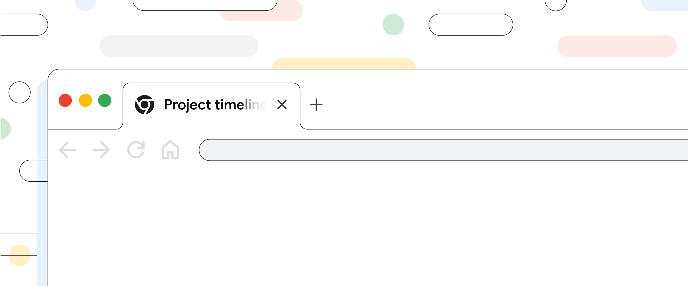

^ We use it every day for a number of different purposes

---

# 📲

^ Navigation in simple terms, process of going from one screen to the next

---

```kotlin
val history = ArrayDeque<Screen>()

history.addLast(ForwardScreen)

history.removeLast()
```

^ If navigation were so simple, surely we could just use a deque

^ We could... in theory

---

# 🤦

^ Complications come in many forms, mostly human

---

# ↔

^ More than just forward/backward navigation

^ More than just a history

---

[.footer: m3.material.io/components/navigation-bar/overview]

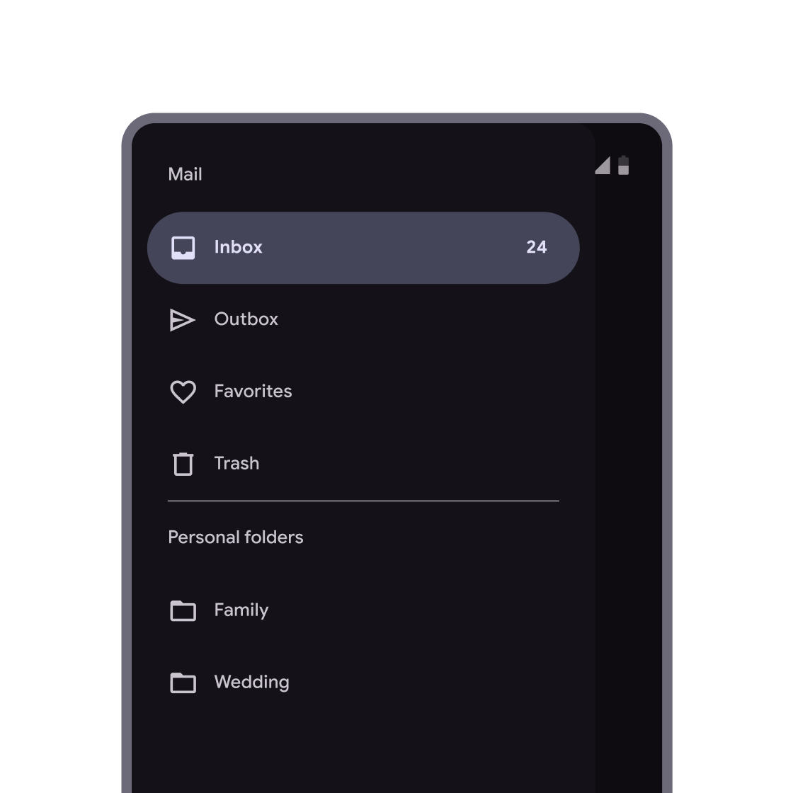

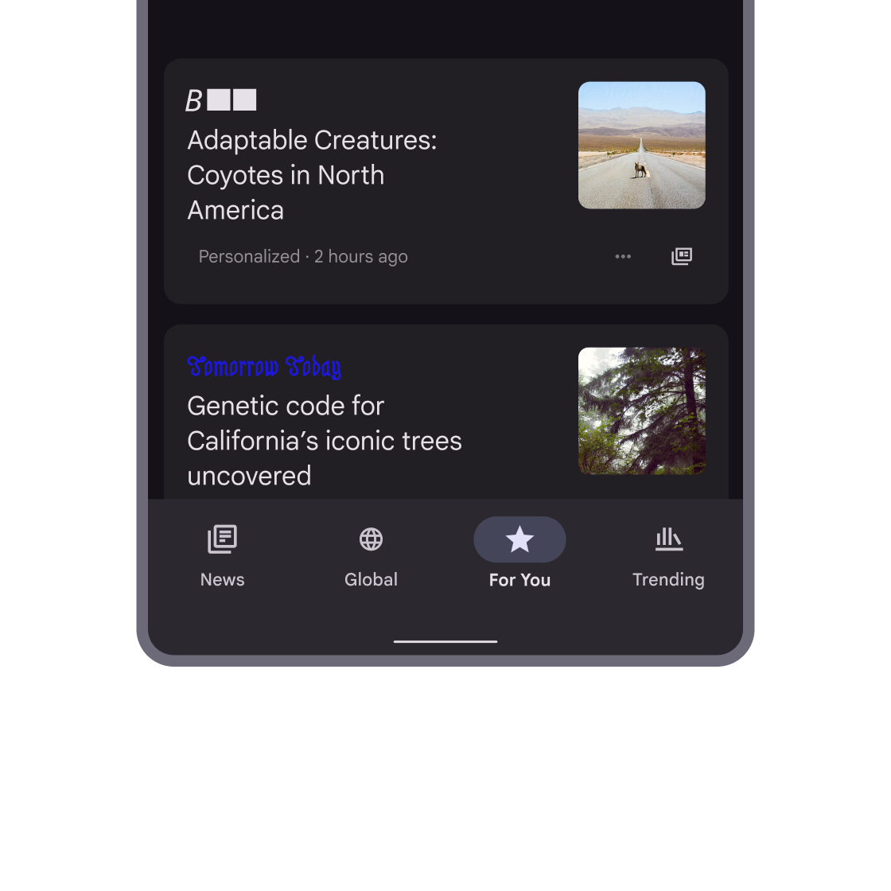

^ Navigation concepts like the rail or bottom bar introduce parallel navigation

^ Horizontal in addition to vertical

---

[.footer: satukyrolainen.com/affordances]


^ Affordance is how a user expects to interact with something

---

# 🤖 🍏 🖥️

^ Behaviour should be consistent with platform expectation

---

[.footer: android-developers.googleblog.com/2022/05/form-factors-google-io-22.html]


^ Different form factors on the same platform will change how the user expects to navigate

---

[.footer-style: #666]

[.footer: learn.microsoft.com/en-us/windows/apps/design/basics/navigation-history-and-backwards-navigation]

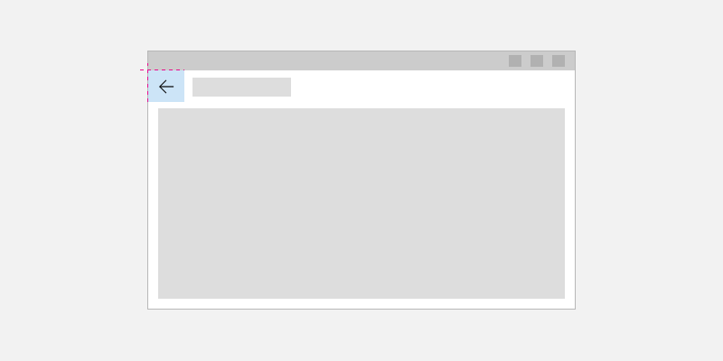

^ Even something as simple as back navigation differs significantly

^ Desktop apps might not even show a back button relying upon shortcuts

^ What is the expected behaviour?

---

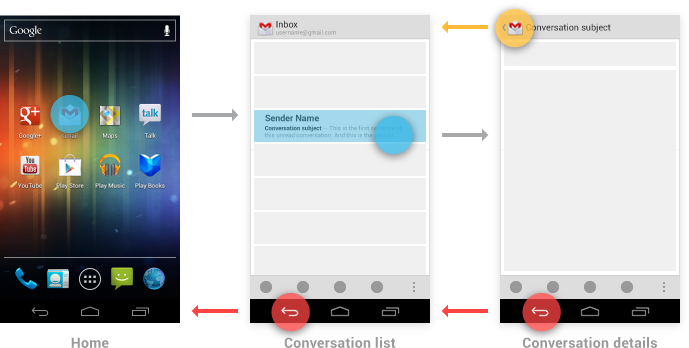

# ↑ ←

^ Android has both up and back which are not the same

^ Screenshot blast from the past

---

#  ⃕ 🔥

^ Maintaining a stack through configuration change

---

[.background-color: #fff]
[.footer-style: #999]

[.footer: medium.com/androiddevelopers/the-deep-links-crash-course-part2-deep-links-from-zero-to-hero-37f94cc8fb88]

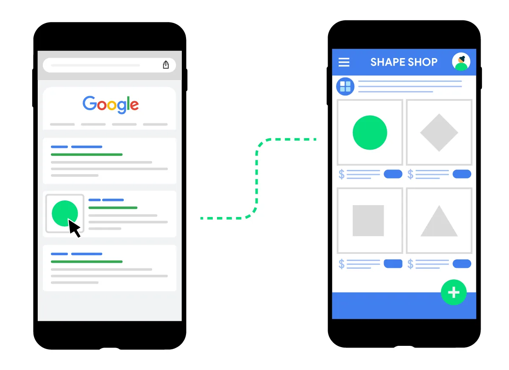

^ Handling deep links requires specific navigation behaviour

---


^ Navigation is hard. Often a topic of confusion, difficult for new developers

^ Navigating from screen to screen being fundamental to your app

---

[.footer: ashdavies.dev/talks/navigation-and-the-single-activity-berlin]

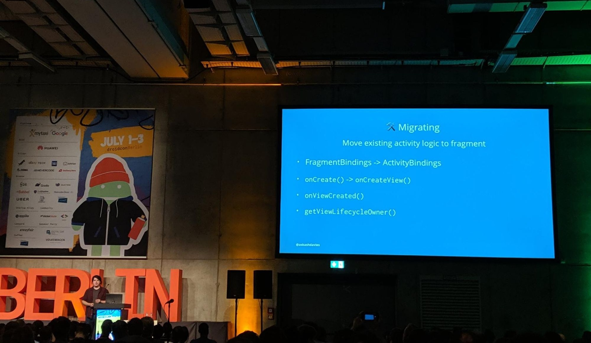

^ We've actually been there, 2019 Berlin talk on navigation

---

> ### "Once we have gotten in to this entry-point to your UI, we really don't care how you organise the flow inside."
-- Dianne Hackborn, Android Framework team, 2016

^ Controversial, framework not opinionated, does not care about app structure

---


# Jetpack Navigation

^ Google introduced Jetpack navigation

^ Tools for easy implementation of type safe navigation

^ Android only, XML based navigation graph

---

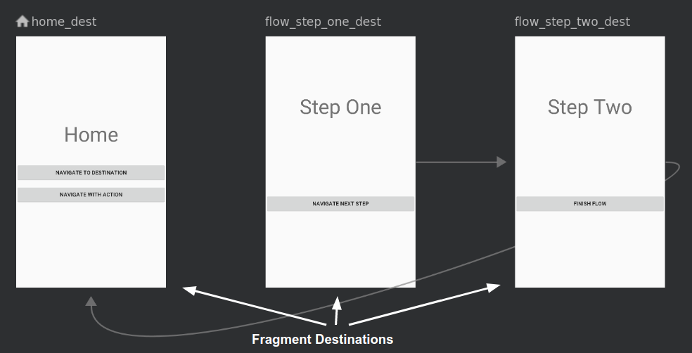

# Fragments

^ Before then Fragments had been considered the worst thing ever

^ Plagued by lifecycle issues and weird back stack management

^ Despite alternative usage activities remained the most popular choice

---

[.footer: en.wikipedia.org/wiki/2019]


# 2019

^ Five years ago, almost a whole Billy Joel song of things have happened since

---

[.footer: developer.squareup.com/blog/simpler-android-apps-with-flow-and-mortar]

## mortar & flow
### github.com/square/mortar

^ The idea of a more molecular UI structure had been entertained before

^ The folks at Square at created Mortar and Flow back in 2014

^ Mortar implemented screens with view layouts handling presenter detachment

^ Flow handled the navigation with a backstack model

---

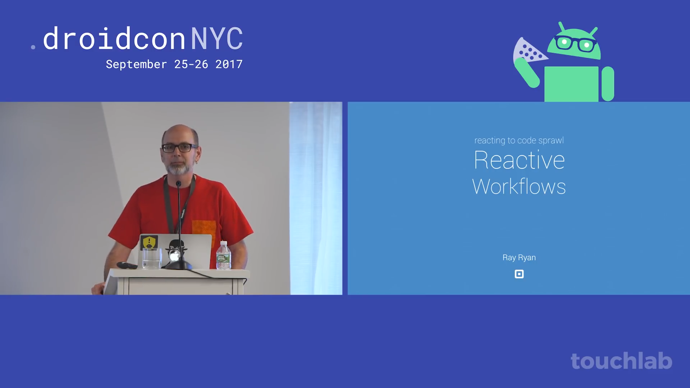

^ Square continued development of flow to it's development of workflows

^ Entertained reactive ideas, like immutability, separation of UI and state

---

## square/workflow
### square.github.io/workflow

^ Went on to develop Workflow, open source, released to production

^ Employs unidirection data flow, encouraging declarative syntax

^ Quite comprehensive as an architectural paradigm

^ Doesn't handle navigation in the traditional sense

^ Hierarchy of parent/child workflows react to state changes

^ Still under active development, docs currently stale

^ Elaborate

---

[.footer: square.github.io/workflow/historical/]


---


[.footer: uber.com/en-GB/blog/new-rider-app-architecture]

## uber/ribs
### github.com/uber/RIBs

^ Uber completely rebuilt their app in 2016 using "VIPER"

^ Still under active development, mostly Kotlin (Java tests & tutorials)

^ Shared code between Android & iOS

---

##  Moving On...

^ Besides a few outlyers, Jetpack Navigation was enough for most projects

^ Given the recommendation from Google, gave confidence

---

# Compose UI
### github.com/androidx/androidx/tree/androidx-main/compose/ui

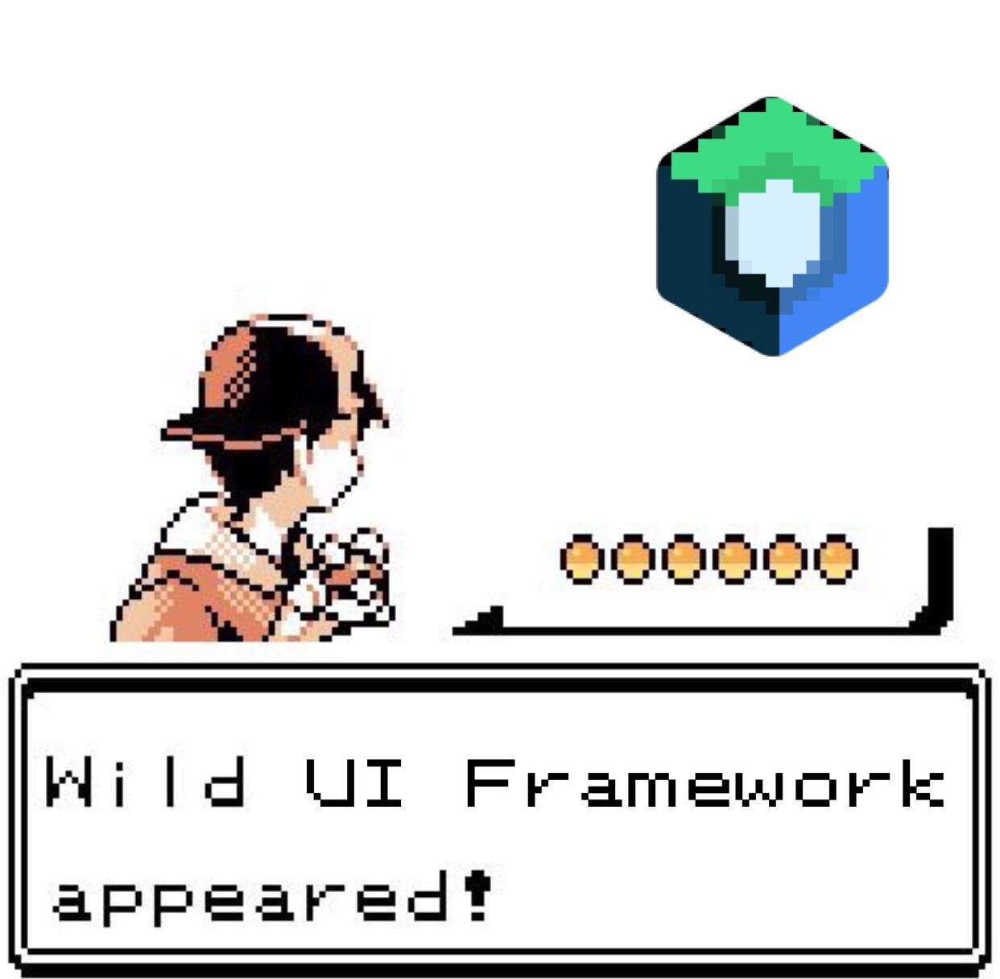

^ Though Compose UI was announced at Google IO 2019

^ Didn't reach stable release until 2021

---

# Compose UI

- Declarative UI Framework
- Open Source Kotlin
- Accelerate UI development
- Intuitive Idiomatic API

---

## Obligatory Notice ⚠️
### Compose != Compose UI

^ Important to know the difference between Compose and Compose UI

---

[.footer: jakewharton.com/a-jetpack-compose-by-any-other-name]

> Compose is, at its core, a general-purpose tool for managing a tree of nodes of any type ... a “tree of nodes” describes just about anything, and as a result Compose can target just about anything.
-- Jake Wharton

^ Compose runtime and compiler for tree and property manipulation

^ Part of androidx repo managed by Google

^ Compose UI toolkit built upon that, projects need not include

---

## Jetpack Navigation Compose
### v2.4.0 (2021)

- Build a navigation graph with a `@Composable` Kotlin DSL
- Compose `viewModel()` scoped to navigation destination
- Desintation level scope for `rememberSaveable()`
- Automatic back handling support

^ Development continued with Jetpack Navigation in 2021 v1

^ Adding preliminary Compose support

---

### Jetpack Navigation Compose < v2.8.0

```kotlin
private const val HOME_ROUTE = "home"

NavHost(
    navController = navController,
    startDestination = HOME_ROUTE,
) {
    composable(route = HOME_ROUTE) {
        HomeScreen(
            onBackClick = navController::popBackStack,
            /* ... */
        )
    }
}
```

^ NavHost Composable DSL with creation of screens

^ Simple hierarchy, no separation of concerns

^ Fine for simple apps, does not scale

---

### Jetpack Navigation Compose < v2.8.0

```kotlin
private const val DETAIL_ID_KEY = "detailId"
private const val DETAIL_ROUTE = "detail"

NavHost(
    navController = navController,
    startDestination = DETAIL_ROUTE,
) {
    composable(
        route = DETAIL_ROUTE,
        arguments = listOf(
            navArgument(DETAIL_ID_KEY) {
                type = NavType.StringType
                defaultValue = null
                nullable = true
            }
        )
    ) {
        DetailScreen(/* ... */)
    }
}
```

^ Arguments would need to be registered into the declaration

^ With type information explicitly typed

---

### Jetpack Navigation Compose < v2.8.0

```kotlin
private const val DETAIL_ID_KEY = "detailId"

fun NavController.navigateToDetail(detailId: String) {
  navigate("detail?$DETAIL_ID_KEY=$detailId")
}

savedStateHandle.getStateFlow(DETAIL_ID_KEY, null)
```

^ Parameters would need to be encoded as strings

^ Retrieved from navController back stack or saved state handle

^ Implemented tightly with platform `SavedInstanceState`

---

### Jetpack Navigation Compose v2.8.0 (04.09.2024)

```kotlin
@Serializable
data class DetailRoute(val id: String)

NavHost(
    navController = navController,
    startDestination = "detail",
) {
    composable<DetailRoute> {
        DetailScreen(/* ... */)
    }
}

val route = savedStateHandle.toRoute<DetailRoute>()
```

^ That was until earlier this month when type safety was added

^ Using KotlinX serialization, the type is encoded into the route

---

[.background-color: #4ca854]

[.footer: medium.com/androiddevelopers/type-safe-navigation-for-compose-105325a97657]


^ More information about type save navigation on the androiddevelopers blog

---

# [fit] Navigation in a Multiplatform World

## [fit] Choosing the Right Framework for your App

**~~Android Only Basic Navigation~~**
~~by Some Dude~~

^ That's all well and good, but this talk is on multiplatform

^ Other talk was declined

---


# Kotlin Multiplatform
## Stable (1.9.20)

^ Kotlin Multiplatform, relatively new kid on the block

^ Stable from release 1.9.20 released on 1st Nov last year

^ But multiplatform isn’t a new concept…

---


^ There have been many attempts at multiplatform frameworks

^ Each demonstrating advantages and disadvantages

^ Some with limited success, some with even less

^ Some integrating the underlying OS some not

---


^ Each framework specifying its own language and development / build environment

^ Whilst each of these languages have their own ecosystem of libraries etc

^ Not languages typically familiar to Android or mobile developers

^ Unless life has been particularly cruel to you

---


^ KMP starts small, doesn’t require sharing everything

^ Build components in a way that makes sense for you

^ Language already familiar to Android and backend developers

^ Strong community, public backing (JetBrains, Google)

---

[.background-color: #000]
[.footer-style: #fff]

[.footer: blog.jetbrains.com/kotlin/2023/04/kotlinconf-2023-opening-keynote/]

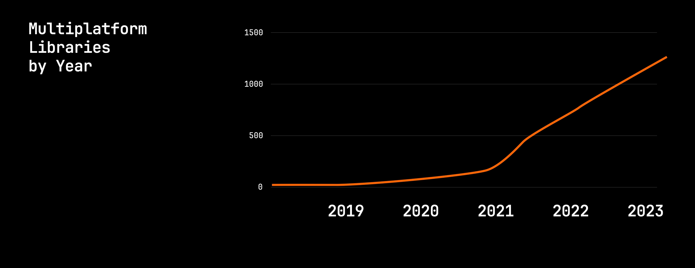

^ KotlinConf 2023 Multiplatform libraries available for Kotlin increase to 1200

---

[.background-color: #537ff0]


^ Google announced Kotlin Multiplatform support at IO this year

---

[.footer: developer.android.com/kotlin/multiplatform | As of 15.09.2024]

| Maven Group ID |	Latest Update |	Stable Release | Alpha Release |
| --- | --- | --- | --- | --- |
| annotation | 04.09.2024 | 1.8.2 | 1.9.0-alpha03 |
| collection | 04.09.2024 | 1.4.3 | 1.5.0-alpha01 |
| datastore | 01.05.2024 | 1.1.1 | - |
| lifecycle | 04.09.2024 | 2.8.5 | 2.9.0-alpha02 |
| paging | 07.08.2024 | 3.3.2 | - |
| room | 21.08.2024 | 2.6.1 | 2.7.0-alpha07 |
| sqlite | 21.08.2024 | 2.4.0 | 2.5.0-alpha07 |

^ Current multiplatform support time of writing 15.09.2024

---

[.footer: cs.android.com/androidx/platform/frameworks/support/+/androidx-main:lifecycle/lifecycle-viewmodel/src/commonMain/kotlin/androidx/lifecycle/ViewModel.kt]

```kotlin
kotlin {
  sourceSets.commonMain.dependencies {
    implementation("androidx.lifecycle:lifecycle-viewmodel-ktx:2.8.5")
  }
}

// Backed by ViewModelImpl
public expect abstract class ViewModel
```

# 🤷‍♂️

^ For better or for worse, ViewModel is now multiplatform.

^ TODO Kotti unhappy face

---

# Multiplatform Architecture

^ Whilst there are some components from androidx becoming available

^ We may not want to use them, or may want something fully fledged

---

## Decompose & Essenty
### arkivanov.github.io/Decompose

^ Decompose focusses on the lifecycle awareness aspect with navigation included

^ Providing abstraction of platform lifecycle configuration changes and navigation

^ In the absence of ViewModel or LifecycleOwner did a good job of management

---

```kotlin
import com.arkivanov.decompose.ComponentContext

class DefaultRootComponent(
    componentContext: ComponentContext,
) : RootComponent, ComponentContext by componentContext {

    init {
        lifecycle... // Access the Lifecycle
        stateKeeper... // Access the StateKeeper
        instanceKeeper... // Access the InstanceKeeper
        backHandler... // Access the BackHandler
    }
}
```

^ Core principle of decompose is to provide multiplatform functionality through ComponentContext

^ Many functions here should be familiar to platfroms

^ Provides observability and value storage with lifecycle persistance

---

```kotlin
class RootComponent(context: ComponentContext) : Root, ComponentContext {
  private val navigation = StackNavigation<Config>()
  override val childStack = childStack(/* ... */)

  fun createChild(config: Config, context: ComponentContext): Child = when (config) {
    is Config.List -> Child.List(itemList(context))
    is Config.Details -> /* ... */
  }

  private fun itemList(context: ComponentContext): ItemList =
    ItemListComponent(context) { navigation.push(Config.Details(itemId = it)) }
}

private sealed class Config : Parcelable {
  @Parcelize object List : Config()
  @Parcelize data class Details(val itemId: Long) : Config()
}
```

^ For navigation it employs the concept of child stacks

^ Screen is created from the provided config

^ Not inherently compose, compose provided through extensions

---

# Decompose

- `com.arkivanov.decompose:extensions-compose`
- `com.arkivanov.decompose:extensions-android`
- `com.arkivanov.essenty:state-keeper`

^ Platform hosting capability exist in compose and android extensions

^ State keeper on darwin

---


# Compose Multiplatform
### v1.0 | 2021

^ Compose Multiplatform builds upon Kotlin multiplatform

^ Became ready for production with v1.0 at the end of 2021 (December)

^ Has since recategorised stability declarations

---

| Platform | Stability level |
| --- | --- |
| Android | Stable |
| iOS | Stable |
| Desktop (JVM) | Stable |
| Server-side (JVM) | Stable |
| Web based on Kotlin/Wasm | Alpha |
| Web based on Kotlin/JS | Stable |
| watchOS | Best effort |
| tvOS | Best effort |

^ Android by nature of being backed by JetPack is stable

^ Alpha under active development

^ Most platforms stable

---

| Compose Multiplatform | Jetpack Compose |
| --- | --- |
| 1.6.11 | 1.6.7 |
| 1.6.10 | 1.6.7 |
| 1.6.2 | 1.6.4 |
...

^ The downside to this is that development is staggered

^ Features can take some time to appear in multiplatform

^ Documentation often out-dated or hard to find since tracked on older version

---

[.footer: github.com/JetBrains/compose-multiplatform-core]

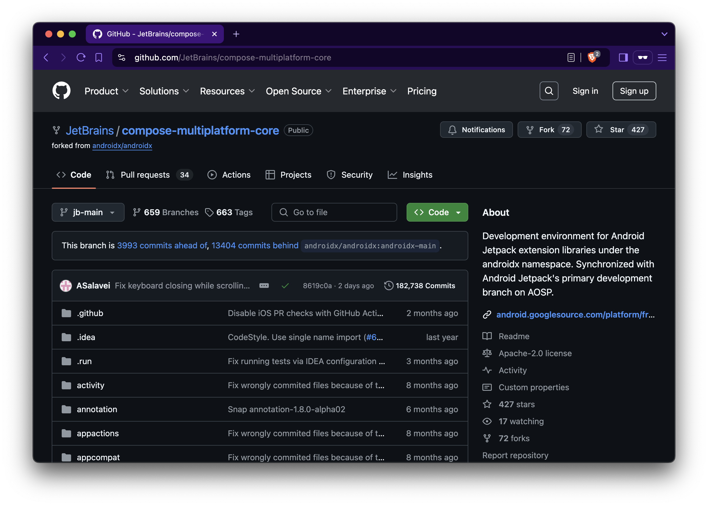

^ Imaged some very clever repackaging of androidx releases

^ Actually a forked repo with the JetBrains team adapting libraries

^ Constant huge amount of work, incredible effort

---

```kotlin
kotlin {
    sourceSets.commonMain.dependencies {
        implementation("org.jetbrains.androidx.navigation:navigation-compose:2.8.0-alpha10")
    }
}

@Serializable
data object HomeRoute

NavHost(navController, HomeRoute) {
    composable<HomeRoute> {
        HomeScreen()
    }
}

val route = savedStateHandle.toRoute<HomeRoute>()
```

^ Navigation is currently available as an alpha artifact

^ Should you wish to migrate to multiplatform

---

[.footer: jetbrains.com/help/kotlin-multiplatform-dev/compose-navigation-routing.html]

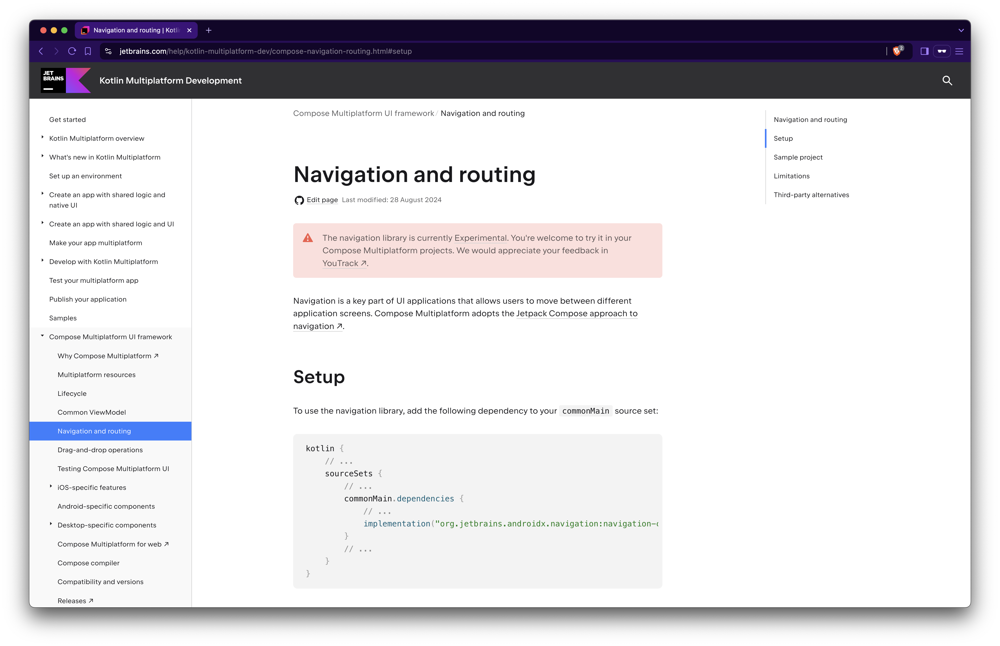

^ More details on JetBrains Compose site

---

# Compose Multiplatform Migration

- Change artifact coordinates
- Do nothing
- Profit

^ If you're migrating from androidx navigation project

^ You've waited long enough to have androidx available

^ Congrats

---

> The early bird gets the worm ... but the second mouse gets the cheese

---

## Reactive Architecture

- Push (not pull)
- Unidirectional Data Flow
- Declarative
- Idempotent

^ Consider our architecture goals and how we can use tooling to achieve them

---

## Architecture
### Callbacks

```kotlin
downloadManager.downloadFile("https://.../") { result ->
  fileManager.saveFile("storage/file", result) { success ->
    if (success) println("Downloaded file successfully")
  }
}
```

^ Back in the day, we had callbacks, to execute code "after"

^ We still have this in a lot of places, which can be ok

^ Can quickly end up in callback hell

---

## Architecture
### Observables

```kotlin
downloadManager.downloadFile("https://.../")
  .flatMap { result -> fileManager.saveFile("storage/file", result) }
  .observe { success -> if (success) println("Downloaded file successfully") }
```

^ Which then evolved into an observable chain

^ Everything is a stream, and it's observable

^ Can quickly become unmanagable with Rx operators

---

## Architecture
### Coroutines

```kotlin
val file = downloadFile("https://.../")
val success = fileManager.saveFile("storage/file", file)
if (success) println("Downloaded file successfully")
```

^ Coroutines turned this into an imperative style

^ Get to enjoy Kotlin and structured concurrency

---

## Architecture
### Coroutines (Again)

```kotlin
downloadManager.downloadFile("https://.../")
  .flatMapLatest { state ->
    when (state) {
      is State.Loaded -> stateFileManager.saveFile("storage/file", state.value)
      else -> state
    }
  }
  .collect { state ->
    when (state) {
      is State.Loading -> /* ... */
      is State.Saved -> println("Downloaded file successfully")
    }
  }
```

^ Consider though that we wish to model our state through a reactive flow

^ Which through Coroutines looks similar to observables

---

## Architecture
### Compose

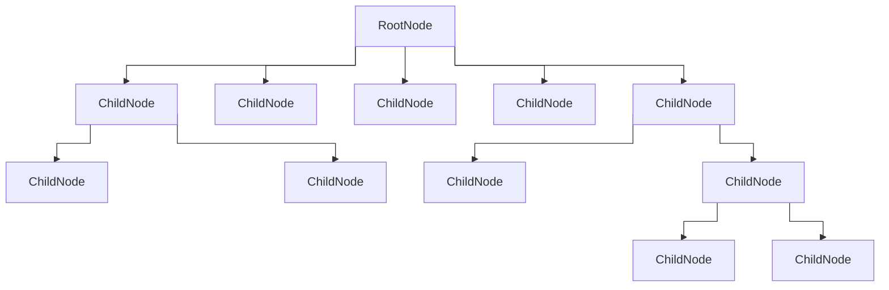

^ Remembering that Compose is a tree of nodes means we can restructure our architecture

---

## Architecture
### Compose

```kotlin
val downloadState = downloadManager
    .downloadFile("https://.../")
    .collectAsState(State.Loading)

val fileState = when(downloadState) {
  is State.Loaded -> stateFileManager.saveFile("storage/file", state.value)
  else -> state
}

when (fileState) {
  is State.Loading -> /* ... */
  is State.Saved -> LaunchedEffect(fileState) {
    println("Downloaded file successfully")
  }
}
```

^ Means we've moved changed the react operators into a more readable sequence of declarations

---

## cashapp/molecule

^ Molecule built by the folks at Square explores this further

^ Being able to use Compose runtime to build a state

---

## Molecule

```kotlin
fun CoroutineScope.launchCounter(): StateFlow<Int> {
  return launchMolecule(mode = ContextClock) {
    var count by remember { mutableStateOf(0) }

    LaunchedEffect(Unit) {
      while (true) {
        delay(1_000)
        count++
      }
    }

    count
  }
}
```

^ Utilising Compose Runtime to build state flow

---

[.footer: ashdavies.dev/talks/demystifying-molecule-nyc]

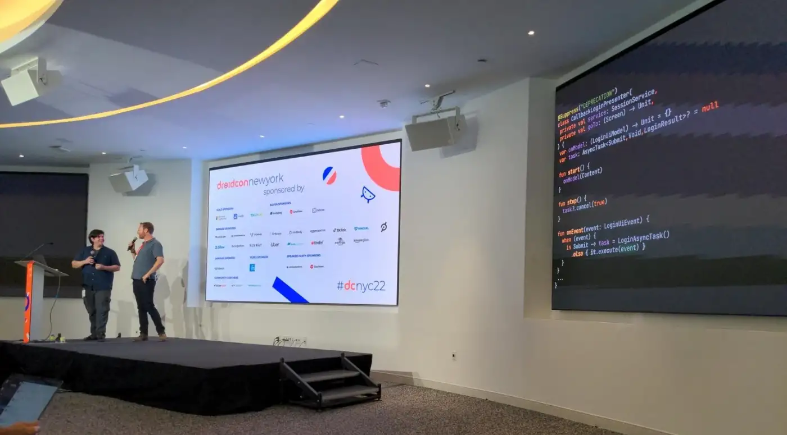

## Demystifying Molecule
### Droidcon NYC 2022

---

## Role of Architecture

^ Knowing that Compose runtime is capable of managing a tree of nodes

^ Means we can exploit this as an architecture

---

## Pre-Compose Era

^ Taking frameworks and applying them to compose works fine

^ But if it seems a little un-idiomatic

^ Consider Compose first architectures

---

## slackhq/circuit
### github.com/slackhq/circuit

^ Circuit is a community contributed library for multiplatform

^ Takes inspiration from existing approaches, cashapp broadway, workflow etc

^ Driven by Zac, Kieran and the rest of the folks at Slack

---

## Circuit

- Supports most supported KMP platforms
- Compose first architecture
- Presenter & UI separation
- Unidirectional Data Flow

^ Designed with Compose in mind, powered with the compose runtime

^ Same principal tenet, separation of presenter and ui

^ UDF all the way through, no mutability

---

## Circuit
### State

```kotlin
@Parcelize
data object HomeScreen : Screen {
  data class State(
    val title: String,
  ): CircuitUiState
}
```

^ Screens are keyed by an appropriately named screen class

^ UDP Concept revolves around your state

^ Needs to be Parcelable so that it can be saved to the back stack on Android

^ If you see Zac, ask him if we can make it Serializable instead

---

## Circuit
### Presenter

```kotlin
class HomePresenter : Presenter<HomeScreen.State> {
  @Composable
  override fun present(): HomeScreen.State {
    return HomeScreen.State("Hello World")
  }
}
```

^ Presenters, separated from UI, responsible for creation of state

---

## Circuit
### UI

```kotlin
@Composable
fun HomeScreen(
  state: HomeScreen.State,
  modifier: Modifier = Modifier,
) {
  Text(
    text = state.title,
    modifier = modifier,
  )
}
```

^ Basic UI to receive and render the provided state

^ Take a modifier as a good citizen

---

## Circuit

```kotlin
val circuit = Circuit.Builder()
  .addPresenter<HomeScreen, HomeScreen.State>(HomePresenter())
  .addUi<LauncherScreen, LauncherScreen.State> { _, _ -> HomeScreen(state, modifier) }
  .build()

CircuitCompositionLocals(circuit) {
    val backStack = rememberSaveableBackStack(HomeScreen)

    NavigableCircuitContent(
        navigator = rememberCircuitNavigator(backStack),
        backStack = backStack,
    )
}
```

^ Wire up circuit with the presenter and UI

^ Provide composition locals

^ Create a back stack with an initial screen

---

[.code-highlight: 5, 8-11]

## Circuit
### Navigation

```kotlin
@Parcelize
data object HomeScreen : Screen {
  data class State(
    val title: String,
    val eventSink: (Event) -> Unit
  ): CircuitUiState

  sealed interface Event {
    data class DetailClicked(
      val id: String,
    ): Event
}
```

^ Interestingly navigation is handled through simply event propagation through the screen state

^ Which can be invoked from the UI then handled by the presenter

---

## Circuit
### Navigation

```kotlin
class HomePresenter(private val navigator: Navigator) : Presenter<HomeScreen.State> {

@Composable
  override fun present(): HomeScreen.State {
    return HomeScreen.State("Hello World") { event ->
      when (event) {
        is HomeScreen.Event.DetailClicked -> navigator.goTo(DetailScreen(event.id))
      }
    }
  }
}
```

---

[.footer: youtube.com/watch?v=ZIr_uuN8FEw]


^ Zac and Kieran go into much more depth

---

## CircuitX

- com.slack.circuit:circuitx-android
- com.slack.circuit:circuitx-effects
- com.slack.circuit:circuitx-gesture-navigation
- com.slack.circuit:circuitx-overlays

^ Android extensions for other activities or custom tabs

^ Effects for logging and analytics

^ Gesture navigation with support for predictive back

^ Overlay support for bottom sheet navigation

---


[.footer: chrisbanes.me/posts/retaining-beyond-viewmodels]

## `rememberRetained()`

^ Circuit is mainly refreshing because it moves away from the mess of lifecycles

^ Presenters live as long as the UI is being composed

^ Remember retained stores value in memory after composition

^ Similar to rememberSaveable but isn't parcelized

---

## Circuit
### Examples

- **Chris Banes: Tivi**
    github.com/chrisbanes/tivi
- **Zac Sweers: CatchUp**
    github.com/ZacSweers/CatchUp
- **Zac Sweers: FieldSpottr**
    github.com/zacsweers/fieldspottr
- **Ash Davies: Playground**
    github.com/ashdavies/playground.ashdavies.dev

---

## Full Disclosure
### Bias

^ Full disclosure, I've covered circuit here a lot because I really enyjoy using it

^ That doesn't mean it'll be a perfect fit for you

^ Other libraries I didn't have time to cover properly

---


## adrielcafe/voyager
### voyager.adriel.cafe

---

# Voyager 

```kotlin
class PostListScreen : Screen {

    @Composable
    override fun Content() {
        // ...
    }

    @Composable
    private fun PostCard(post: Post) {
        val navigator = LocalNavigator.currentOrThrow

        Card(
            modifier = Modifier.clickable {
                navigator.push(PostDetailsScreen(post.id))
            }
        ) {
            // ...
        }
    }
}
```

^ Voyager takes a more simpler approach with Navigator provided as a CompositionLocal

^ Keys again keyed by a Screen class, simply added or removed from the back stack

---

# Voyager 

```kotlin
interface ParcelableScreen : Screen, Parcelable

// Compile
@Parcelize
data class Post(/*...*/) : Parcelable

@Parcelize
data class ValidScreen(
    val post: Post
) : ParcelableScreen {
    // ...
}

// Not compile
data class Post(/*...*/)

@Parcelize
data class ValidScreen(
    val post: Post
) : ParcelableScreen {
    // ...
}
```

^ Still expects Parcelable for Android, but allows consumer to enforce this

---

## appyx
### bumble-tech.github.io/appyx

^ Another compose first navigation library more focussed on gesture control

---

## PreCompose
### github.com/Tlaster/PreCompose

^ Similar to Jetpack Navigation with some tweaks

---

# Comparison

| | androidx | circuit | decompose | voyager | workflow |
| --- | --- | --- | --- | --- | --- |
| Multiplatform | ✅ | ✅ | ✅ | ✅ | ✅ |
| Compose 1st | ❌ | ✅ | ❌ | ✅ | ❌ |
| Documented* | ❌ | ✅ | ✅ | ✅ | ❌ |
| Ease-of-Use** | ❌ | ✅ | / | ✅ | ❌ |
| Opinionated*** | ❌ | ✅ | ❌ | ❌ | ✅ |

```
* Documentation exists, but is outdated or hard to find
** Subjective, how quick to get started
*** Additional API surface
```

---

## Y Tho?

^ What are the features we look for in libraries?

^ Pass off between configuration and ease-of-use

^ No need to migrate if you have a solution

---

[.text: line-height(2), text-scale(0.5)]
[.footer: ]

# Thank You!

Ash Davies - SumUp
Android / Kotlin GDE Berlin
ashdavies.dev

^ Coroutines: Prefer suspend fun over event emission

---

## Don't Forget to Vote! 🇺🇸 🫏
