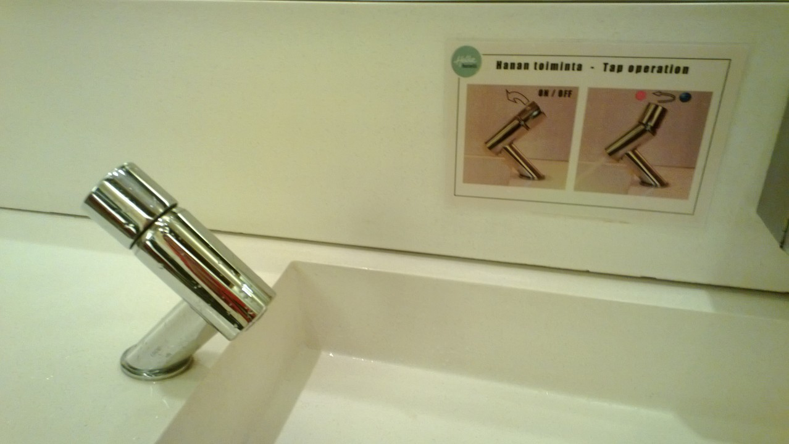

autoscale: true
build-lists: true
footer: ashdavies.dev
slide-transition: fade(0.5)
slidenumbers: true
theme: Next, 8

[.text: line-height(2), text-scale(0.5)]
[.footer: ]

# [fit] Navigation in a Multiplatform World

## [fit] Choosing the Right Framework for your App

### Droidcon NYC - September '24 🇺🇸

Ash Davies - SumUp
Android & Kotlin GDE Berlin
ashdavies.dev

---

[.background-color: #fff]
[.footer-style: #000]

[.footer: blog.google/products/chrome/help-me-out-how-to-organize-chrome-tabs]


^ We use it every day for a number of different purposes

---

# 📲

^ Navigation in simple terms, process of going from one screen to the next

---

```kotlin
val history = ArrayDeque<Screen>()

history.addLast(ForwardScreen)

history.removeLast()
```

^ If navigation were so simple, surely we could just use a deque

^ We could... in theory

---

# 🤦

^ Complications come in many forms, mostly human

---

# ↔

^ More than just forward/backward navigation

^ More than just a history

---

[.footer: m3.material.io/components/navigation-bar/overview]


^ Navigation concepts like the rail or bottom bar introduce parallel navigation

^ Horizontal in addition to vertical

---

[.footer: satukyrolainen.com/affordances]



^ Affordance is how a user expects to interact with something

---

# 🤖 🍏 🖥️

^ Behaviour should be consistent with platform expectation

---

[.footer: android-developers.googleblog.com/2022/05/form-factors-google-io-22.html]


^ Different form factors on the same platform will change how the user expects to navigate

---

[.footer-style: #666]

[.footer: learn.microsoft.com/en-us/windows/apps/design/basics/navigation-history-and-backwards-navigation]


^ Even something as simple as back navigation differs significantly

^ Desktop apps might not even show a back button relying upon shortcuts

^ What is the expected behaviour?

---

# ↑ ←

^ Android has both up and back which are not the same

---

#  ⃕ 🔥

^ Maintaining a stack through configuration change

---

[.background-color: #fff]
[.footer-style: #999]

[.footer: medium.com/androiddevelopers/the-deep-links-crash-course-part2-deep-links-from-zero-to-hero-37f94cc8fb88]


^ Handling deep links requires specific navigation behaviour

---


^ Navigation is hard. Often a topic of confusion, difficult for new developers

^ Navigating from screen to screen being fundamental to your app

---


^ We've actually been there, 2019 Berlin talk on navigation

---

> ### "Once we have gotten in to this entry-point to your UI, we really don't care how you organise the flow inside."
-- Dianne Hackborn, Android Framework team, 2016

^ Controversial, framework not opinionated, does not care about app structure

---


# Jetpack Navigation

^ Google introduced Jetpack navigation

^ Tools for easy implementation of type safe navigation

^ Android only, XML based navigation graph

---


# Fragments

^ Before then Fragments had been considered the worst thing ever

^ Plagued by lifecycle issues and weird back stack management

^ Despite alternative usage activities remained the most popular choice

---

[.footer: en.wikipedia.org/wiki/2019]


# 2019

^ Five years ago, almost a whole Billy Joel song of things have happened since

---

[.footer: developer.squareup.com/blog/simpler-android-apps-with-flow-and-mortar]

# Square
## mortar & flow
### 2014

^ The idea of a more molecular UI structure had been entertained before

^ The folks at Square at created Mortar and Flow back in 2014

^ Mortar implemented screens with view layouts handling presenter detachment

^ Flow handled the navigation with a backstack model

---

[.footer: uber.com/en-GB/blog/new-rider-app-architecture]

## uber/ribs
### 2016

^ Continues in that vein of using view groups and presenters (VIPER)

^ Still under active development, mostly Kotlin (Java tests & tutorials)

^ Shared code between Android & iOS

---


^ Square continued development of flow to it's development of workflows

^ Entertained reactive ideas, like immutability, separation of UI and state

---

[.footer: square.github.io/workflow]

## square/workflow
### 2019

^ Went on to develop Workflow, open source, released to production

^ Employs unidirection data flow, encouraging declarative syntax

^ Quite comprehensive as an architectural paradigm

^ Doesn't handle navigation in the traditional sense

^ Hierarchy of parent/child workflows react to state changes

^ Still under active development, docs currently stale

^ Elaborate

---

[.footer: square.github.io/workflow/historical/]


---

##  Moving On...

^ Besides a few outlyers, Jetpack Navigation was enough for most projects

^ Given the recommendation from Google, gave confidence

---

# Compose UI
### 2021


^ Though Compose UI was announced at Google IO 2019

^ Didn't reach stable release until 2021

---

# Compose UI

- Declarative UI Framework
- Open Source Kotlin

---

## Obligatory Notice ⚠️
### Compose != Compose UI

^ Important to know the difference between Compose and Compose UI

---

[.footer: jakewharton.com/a-jetpack-compose-by-any-other-name]

> Compose is, at its core, a general-purpose tool for managing a tree of nodes of any type ... a “tree of nodes” describes just about anything, and as a result Compose can target just about anything.
-- Jake Wharton

^ Compose runtime and compiler for tree and property manipulation

^ Part of androidx repo managed by Google

^ Compose UI toolkit built upon that, projects need not include

---

## Jetpack Navigation Compose
### v2.4.0 (2021)

- Build a navigation graph with a `@Composable` Kotlin DSL
- Compose `viewModel()` scoped to navigation destination
- Desintation level scope for `rememberSaveable()`
- Automatic back handling support

^ Development continued with Jetpack Navigation in 2021 v1

^ Adding preliminary Compose support

---

### Jetpack Navigation Compose < v2.8.0

```kotlin
private const val HOME_ROUTE = "home"

NavHost(
    navController = navController,
    startDestination = ,
) {
    composable(route = HOME_ROUTE) {
        HomeScreen(
            onBackClick = navController::popBackStack,
            /* ... */
        )
    }
}
```

^ NavHost Composable DSL with creation of screens

^ Simple hierarchy, no separation of concerns

^ Fine for simple apps, does not scale

---

### Jetpack Navigation Compose < v2.8.0

```kotlin
private const val DETAIL_ID_KEY = "detailId"
private const val DETAIL_ROUTE = "detail"

NavHost(
    navController = navController,
    startDestination = DETAIL_ROUTE",
) {
    composable(
        route = DETAIL_ROUTE",
        arguments = listOf(
            navArgument(DETAIL_ID_KEY) {
                type = NavType.StringType
                defaultValue = null
                nullable = true
            }
        )
    ) {
        DetailScreen(/* ... */)
    }
}
```

^ Arguments would need to be registered into the declaration

^ With type information explicitly typed

---

### Jetpack Navigation Compose < v2.8.0

```kotlin
private const val DETAIL_ID_KEY = "detailId"

fun NavController.navigateToDetail(detailId: String) {
  navigate("detail?$DETAIL_ID_KEY=$detailId")
}

savedStateHandle.getStateFlow(DETAIL_ID_KEY, null)
```

^ Parameters would need to be encoded as strings

^ Retrieved from navController back stack or saved state handle

^ Implemented tightly with platform `SavedInstanceState`

---

### Jetpack Navigation Compose v2.8.0 (04.09.2024)

```kotlin
@Serializable
data class DetailRoute(val id: String)

NavHost(
    navController = navController,
    startDestination = "detail",
) {
    composable<DetailRoute> {
        DetailScreen(/* ... */)
    }
}

val route = savedStateHandle.toRoute<DetailRoute>()
```

^ That was until earlier this month when type safety was added

^ Using KotlinX serialization, the type is encoded into the route

---

# [fit] Navigation in a Multiplatform World

## [fit] Choosing the Right Framework for your App

**~~Android Only Basic Navigation~~**
~~by Some Dude~~

^ That's all well and good, but this talk is on multiplatform

^ Other talk was declined

---


# Kotlin Multiplatform
## Stable (1.9.20)

^ Kotlin Multiplatform, relatively new kid on the block

^ Stable from release 1.9.20 released on 1st Nov last year

^ But multiplatform isn’t a new concept…

---


^ There have been many attempts at multiplatform frameworks

^ Each demonstrating advantages and disadvantages

^ Some with limited success, some with even less

^ Some integrating the underlying OS some not

---


^ Each framework specifying its own language and development / build environment

^ Whilst each of these languages have their own ecosystem of libraries etc

^ Not languages typically familiar to Android or mobile developers

^ Unless life has been particularly cruel to you

---


^ KMP starts small, doesn’t require sharing everything

^ Build components in a way that makes sense for you

^ Language already familiar to Android and backend developers

^ Strong community, public backing (JetBrains, Google)

---

[.background-color: #000]
[.footer-style: #fff]

[.footer: blog.jetbrains.com/kotlin/2023/04/kotlinconf-2023-opening-keynote/]


^ KotlinConf 2023 Multiplatform libraries available for Kotlin increase to 1200

---

[.background-color: #537ff0]


^ Google announced Kotlin Multiplatform support at IO this year

---

[.footer: developer.android.com/kotlin/multiplatform | As of 15.09.2024]

| Maven Group ID |	Latest Update |	Stable Release | Alpha Release |
| --- | --- | --- | --- | --- |
| annotation (*) | 04.09.2024 | 1.8.2 | 1.9.0-alpha03 |
| collection | 04.09.2024 | 1.4.3 | 1.5.0-alpha01 |
| datastore | 01.05.2024 | 1.1.1 | - |
| lifecycle (*) | 04.09.2024 | 2.8.5 | 2.9.0-alpha02 |
| paging (*) | 07.08.2024 | 3.3.2 | - |
| room | 21.08.2024 | 2.6.1 | 2.7.0-alpha07 |
| sqlite | 21.08.2024 | 2.4.0 | 2.5.0-alpha07 |

^ Current multiplatform support time of writing 15.09.2024

---

[.footer: cs.android.com/androidx/platform/frameworks/support/+/androidx-main:lifecycle/lifecycle-viewmodel/src/commonMain/kotlin/androidx/lifecycle/ViewModel.kt]

```kotlin
kotlin {
  sourceSets.commonMain.dependencies {
    implementation("androidx.lifecycle:lifecycle-viewmodel-ktx:2.8.5")
  }
}

// Backed by ViewModelImpl
public expect abstract class ViewModel
```

# 🤷‍♂️

^ For better or for worse, ViewModel is now multiplatform.

---

# Multiplatform Architecture

^ Whilst there are some components from androidx becoming available

^ We may not want to use them, or may want something fully fledged

---

[.footer: arkivanov.github.io/Decompose]

## Decompose & Essenty
### 2021

^ Decompose focusses on the lifecycle awareness aspect with navigation included

^ Providing abstraction of platform lifecycle configuration changes and navigation

^ In the absence of ViewModel or LifecycleOwner did a good job of management

---

```kotlin
import com.arkivanov.decompose.ComponentContext

class DefaultRootComponent(
    componentContext: ComponentContext,
) : RootComponent, ComponentContext by componentContext {

    init {
        lifecycle... // Access the Lifecycle
        stateKeeper... // Access the StateKeeper
        instanceKeeper... // Access the InstanceKeeper
        backHandler... // Access the BackHandler
    }
}
```

^ Core principle of decompose is to provide multiplatform functionality through ComponentContext

^ Many functions here should be familiar to platfroms

^ Provides observability and value storage with lifecycle persistance

---

```kotlin
class RootComponent(context: ComponentContext) : Root, ComponentContext {
  private val navigation = StackNavigation<Config>()
  override val childStack = childStack(/* ... */)

  fun createChild(config: Config, context: ComponentContext): Child = when (config) {
    is Config.List -> Child.List(itemList(context))
    is Config.Details -> /* ... */
  }

  private fun itemList(context: ComponentContext): ItemList =
    ItemListComponent(context) { navigation.push(Config.Details(itemId = it)) }
}

private sealed class Config : Parcelable {
  @Parcelize object List : Config()
  @Parcelize data class Details(val itemId: Long) : Config()
}
```

^ For navigation it employs the concept of child stacks

^ Screen is created from the provided config

^ Not inherently compose, compose provided through extensions

---

# Decompose

- `com.arkivanov.decompose:extensions-compose`
- `com.arkivanov.decompose:extensions-android`
- `com.arkivanov.essenty:state-keeper`

^ Platform hosting capability exist in compose and android extensions

^ State keeper on darwin

---

Compose Multiplatform

^ Used to think Compose Multiplatform was doing some very clever repackaging of androidx releases

^ Actually a forked repo with the JetBrains team adapting libraries

^ Constant huge amount of work, incredible effort

---

Introduction of third party libraries with Compose or Multiplatform first ideology, inherit idiomatic style.

---

## Role of Architecture

^ Knowing that Compose runtime is capable of managing a tree of nodes

^ Means we can exploit this as an architecture

---

[.footer: github.com/slackhq/circuit]

## slackhq/circuit
### 2022

^ Circuit is a new Compose driven architecture for Android apps written by Zac and the folks at Slack

^ It’s a mechanism for handling navigation with @Parcelizable screens

---

- support for most KMP platforms now
- circuit-retained has become really powerful and sort of it's secret sauce. Works as a wormhole for managing state across the back stack and can even layer in with saveable
- https://chrisbanes.me/posts/retaining-beyond-viewmodels/
- CB has contributed a lot of clever features
- Lots of padded out functionality and features like multiple back stacks, navigation with results, expanded code gen support, circuitx artifacts

---

[.footer: voyager.adriel.cafe/]

## adriel/voyager
### 2021

---

Multiplatform issues with Android state management, parcelization/bundling of state parameters needs to be handled. Modern approaches should use Kotlin serialization.

---

Google recently made multiplatform a priority with moving a lot of dependencies to common, navigation included.

---

As of the time of writing, Jetpack Navigation is not yet multiplatform however it is offered as a JetBrains Compose Multiplatform artifact

---

Compose Multiplatform is usually quite delayed, JetBrains works hard on maintaining compatibility, but does not yet offer serialized destinations

---

Multiplatform documentation is difficult as it's out-of-date

---

Early adopters employed third party solutions, late adopters can migrate android navigation to multiplatform. The early bird got the worm, but the second mouse got the cheese.

---

```
* JetBrains Compose Multiplatform
```

---

# Resources

- jetbrains.com/help/kotlin-multiplatform-dev/compose-navigation-routing.html
- johnbuhanan.dev/android-at-scale-with-circuit
- zacsweers.dev/writing-a-kotlin-multiplatform-app-from-start-to-store
- ashdavies.dev/talks/navigation-and-the-single-activity-berlin/
- jetbrains.com/help/kotlin-multiplatform-dev/whats-new-compose-170.html
- medium.com/androiddevelopers/type-safe-navigation-for-compose-105325a97657
- jetbrains.com/help/kotlin-multiplatform-dev/compose-navigation-routing.html
- developer.squareup.com/blog/simpler-android-apps-with-flow-and-mortar/
- chrisbanes.me/posts/retaining-beyond-viewmodels/

---

[.text: line-height(2), text-scale(0.5)]
[.footer: ]

# Thank You!

Ash Davies - SumUp
Android / Kotlin GDE Berlin
ashdavies.dev

^ Jetpack Navigation: Introduces static “lock and key” parameter mechanism with XML and “safe-args” code generation.

^ Coroutines: Prefer suspend fun over event emission

---

## Don't Forget to Vote! 🇺🇸 🫏
