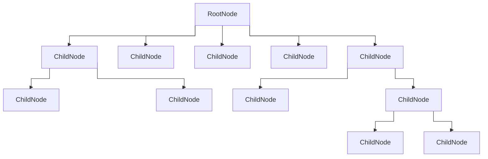

autoscale: true
build-lists: true
footer: ashdavies.dev
slide-transition: fade(0.5)
theme: Work, 8

[.text: line-height(2), text-scale(0.5)]
[.footer: ]

# [fit] Beyond the UI

## [fit]Compose as a Foundation for Multiplatform Apps

#### mDevCamp - June '25 🇨🇿

Ash Davies
Android GDE Berlin
ashdavies.dev

^ Much in the same way that Coroutines revolutionized reactive architecture, Compose challenges us to rethink how we design applications. 

^ While traditionally seen as a UI toolkit, Compose — and specifically Compose Multiplatform — can play a much larger role in our applications.

^ By leveraging its declarative and state-driven nature, we can build, model, and manage application state in a way that is consistent, scalable, and platform-agnostic.

---

^ What is Jetpack Compose UI

---

^ When was Compose UI introduced?

---

- History of XML layouts in Android
- Android developers unhappy with XML

^ What problem was it trying to solve?

---

- DataBinding & ViewBinding
- Community libraries (Anko, Splitties)

^ What projects suggested a problem with the status quo?

---

Widespread adoption of Kotlin on Android

^ What prompted a rethink of Android UI tooling?

---

- Declarative
- Open Source
- Idiomatic

^ What are the principles of Compose?

---

- Kotlin compiler plugin
- Cooperation with Jetbrains
- Manipulates method signatures

^ How does it work?

---

```kotlin
@Composable
fun Counter() {
    var count by remember { mutableStateOf(0) }

    Button(onClick = { count += 1 }) {
        Text("Count: $count")
    }
}
```

^ What does it look like?

---

[.code-highlight: 1]

```kotlin
fun Counter($composer: Composer) { 
    $composer.startRestartGroup(-1913267612)
    
    /* ... */
    
    $composer.endRestartGroup()
}
```

^ What does this code remind us of?

---

```kotlin
fun counter($completion: Continuation) {
    /* ... */
}
```

^ How is the KotlinX Coroutine code manipulation similar?

---

[.background-color: #fff]
[.footer-style: #000]


^ What tree structure does the Compose runtime output?

---

[.text: text-scale(0.75)]
[.footer: jakewharton.com/a-jetpack-compose-by-any-other-name]

> Compose is, at its core, a general-purpose tool for managing a tree of nodes of any type ... a “tree of nodes” describes just about anything, and as a result Compose can target just about anything.
-- Jake Wharton

^ What is Compose, at its core?

---

# [fit] ⚠️ Compose != Compose UI

^ What is Compose, not?

---

[.code-highlight: 1]

```kotlin
fun Counter($composer: Composer) { 
    $composer.startRestartGroup(-1913267612)
    
    /* ... */
    
    $composer.endRestartGroup()
}
```

^ How does this look similar to Coroutines?

---

```kotlin
fun counter($completion: Continuation) {
    /* ... */
}
```

^ How does coroutines also manipulate a method signature?

---

- Reactive pipelines
- Explicit thread handling
- Inline error-handling
- Lifecycle awareness

^ Remember the problems coroutines were meant to solve?

---

- Native library
- Imperative syntax
- `suspend fun`

^ What did Coroutines bring to the table?

---

# Reactive Architecture

- Push (not pull)
- Unidirectional Data Flow
- Declarative
- Idempotent

^ Consider our architecture goals and how we can use tooling to achieve them

---

```kotlin
downloadManager.downloadFile("https://.../") { result ->
  fileManager.saveFile("storage/file", result) { success ->
    if (success) println("Downloaded file successfully")
  }
}
```

^ Back in the day, we had callbacks, to execute code "after"

^ We still have this in a lot of places, which can be ok

^ Can quickly end up in callback hell

---

```kotlin
downloadManager.downloadFile("https://.../")
  .flatMap { result -> fileManager.saveFile("storage/file", result) }
  .observe { success -> if (success) println("Downloaded file successfully") }
```

^ Which then evolved into an observable chain

^ Everything is a stream, and it's observable

^ Can quickly become unmanagable with Rx operators

---

```kotlin
val file = downloadFile("https://.../")
val success = fileManager.saveFile("storage/file", file)
if (success) println("Downloaded file successfully")
```

^ Coroutines turned this into an imperative style

^ Get to enjoy Kotlin and structured concurrency

---

```kotlin
downloadManager.downloadFile("https://.../")
  .flatMapLatest { state ->
    when (state) {
      is State.Loaded -> stateFileManager.saveFile("storage/file", state.value)
      else -> state
    }
  }
  .collect { state ->
    when (state) {
      is State.Loading -> /* ... */
      is State.Saved -> println("Downloaded file successfully")
    }
  }
```

^ Consider though that we wish to model our state through a reactive flow

^ Which through Coroutines looks similar to observables

---



^ Remembering that Compose is a tree of nodes means we can restructure our architecture

---

```kotlin
val downloadState = downloadManager
    .downloadFile("https://.../")
    .collectAsState(State.Loading)

val fileState = when(downloadState) {
  is State.Loaded -> stateFileManager.saveFile("storage/file", state.value)
  else -> state
}

when (fileState) {
  is State.Loading -> /* ... */
  is State.Saved -> LaunchedEffect(fileState) {
    println("Downloaded file successfully")
  }
}
```

^ Means we've moved changed the react operators into a more readable sequence of declarations

---

[.text: line-height(2), text-scale(0.5)]
[.footer: ]

# Thank You!

Ash Davies
Android GDE Berlin
