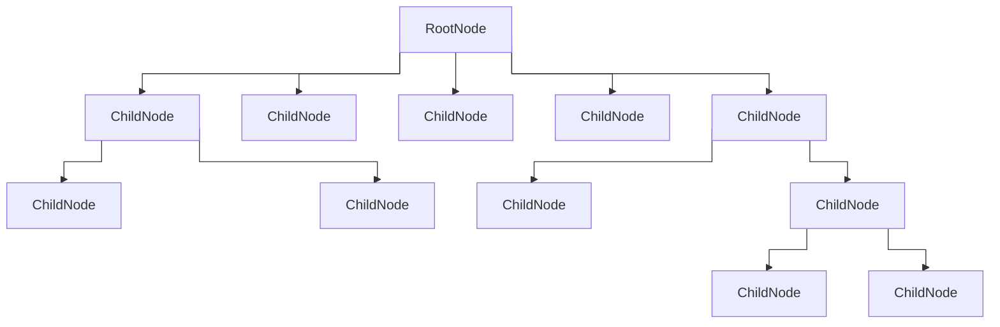

autoscale: true
build-lists: true
footer: ashdavies.dev
slide-transition: fade(0.5)
theme: Work, 8

[.text: line-height(2), text-scale(0.5)]
[.footer: ]

# [fit] Beyond the UI

## [fit]Compose as a Foundation for Multiplatform Apps

#### mDevCamp - June '25 🇨🇿

Ash Davies
Android GDE Berlin
Cat Person 😸

ashdavies.dev

^ Much in the same way that Coroutines revolutionized reactive architecture, Compose challenges us to rethink how we design applications. 

^ While traditionally seen as a UI toolkit, Compose — and specifically Compose Multiplatform — can play a much larger role in our applications.

^ By leveraging its declarative and state-driven nature, we can build, model, and manage application state in a way that is consistent, scalable, and platform-agnostic.

---

# Jetpack Compose UI
### github.com/androidx/androidx/tree/androidx-main/compose/ui


^ What is Jetpack Compose UI, if unfamiliar to Android

---

[.background-color: ##2b2b2b]
[.footer-style: #333]

```kotlin
@Composable
fun JetpackCompose() {
    Card {
        var expanded by remember { mutableStateOf(false) }
        Column(Modifier.clickable { expanded = !expanded }) {
            Image(painterResource(R.drawable.jetpack_compose))
            AnimatedVisibility(expanded) {
                Text(
                    text = "Jetpack Compose",
                    style = MaterialTheme.typography.bodyLarge,
                )
            }
        }
    }
}
```

^ Though Compose UI was announced at Google IO 2019

^ Didn't reach stable release until 2021

---

# Compose UI

- Declarative UI Framework
- Open Source Kotlin
- Accelerate UI development
- Intuitive Idiomatic API

^ Exploit Kotlin DSL language idioms

---

# Android Layouts

```xml
<?xml version="1.0" encoding="utf-8"?>
<LinearLayout xmlns:android=
"http://schemas.android.com/apk/res/android"
  android:layout_width="match_parent"
  android:layout_height="match_parent"
android:orientation="vertical" >

  <TextView android:id="@+id/text"
  android:layout_width="wrap_content"
  android:layout_height="wrap_content"
  android:text="Hello, I am a TextView" />
  
<Button android:id="@+id/button"
  android:layout_width="wrap_content"
  android:layout_height="wrap_content"
  android:text="Hello, I am a Button" />

</LinearLayout>
```


^ Android has a rich a colourful history with layouts

^ Views written in XML, painful to structure

^ Inflated at runtime, poor attribute attestation

^ Years of optimisations, performance acceptable

---

# Android Layouts
### Lifecycle


^ Also introduced the problem of lifecycle management

^ The bane of every Android developers existence

---

# Tooling


^ Additional tooling developed by Google and OS community

^ Made some aspects bearable

---

# XML?!


^ Kotlin has spoilt us, nobody wants to use XML anymore

---

# Android Layouts and Compose

- Widespread adoption of Kotlin on Android
- Idiomatic Kotlin language features

^ Kotlin language features, lambdas, immutability, extension functions

^ Kotlin DSLs apply naturally to the view hierarchy

---

# Jetpack Compose UI 
## Principles

- Composition > Inheritance
- Declarative Syntax
- Immutable State
- Recomposition

---

[.footer: medium.com/androiddevelopers/under-the-hood-of-jetpack-compose-part-2-of-2-37b2c20c6cdd]

# Jetpack Compose UI
## Under-the-hood


- Kotlin compiler plugin
- Gap buffer data structure

^ Collaborating with JetBrains to exploit the Kotlin Compiler Plugin API

^ Transforms method signatures to inject a composer

^ Composer uses gap buffer to build a node structure

---

# Jetpack Compose UI
## Talk is Cheap

```kotlin
@Composable
fun Counter() {
    var count by remember { mutableStateOf(0) }

    Button(onClick = { count += 1 }) {
        Text("Count: $count")
    }
}
```

---

[.background-color: #fff]
[.footer-style: #000]

# What tree structure does the Compose runtime output?


---

[.text: text-scale(0.75)]
[.footer: jakewharton.com/a-jetpack-compose-by-any-other-name]

> Compose is, at its core, a general-purpose tool for managing a tree of nodes of any type ... a “tree of nodes” describes just about anything, and as a result Compose can target just about anything.
-- Jake Wharton

^ What is Compose, at its core?

---

# [fit] ⚠️ Compose != Compose UI

---

# Kotlin Multiplatform
## Stable (1.9.20)

^ Kotlin Multiplatform, relatively new kid on the block

^ Stable from release 1.9.20 released on 1st Nov last year

^ But multiplatform isn’t a new concept…

---

# The Before Times


^ There have been many attempts at multiplatform frameworks

^ Each demonstrating advantages and disadvantages

^ Some with limited success, some with even less

^ Some integrating the underlying OS some not

---

# The Before Times


^ Each framework specifying its own language and development / build environment

^ Whilst each of these languages have their own ecosystem of libraries etc

^ Not languages typically familiar to Android or mobile developers

^ Unless life has been particularly cruel to you

---


^ KMP starts small, doesn’t require sharing everything

^ Build components in a way that makes sense for you

^ Language already familiar to Android and backend developers

^ Strong community, public backing (JetBrains, Google)

---


# Compose Multiplatform
### v1.0 | 2021

^ Compose Multiplatform builds upon Kotlin multiplatform

^ Became ready for production with v1.0 at the end of 2021 (December)

^ Has since recategorised stability declarations

---

[.footer: github.com/JetBrains/compose-multiplatform-core]


^ Imagined some very clever repackaging of androidx releases

^ Actually a forked repo with the JetBrains team adapting libraries

^ Constant huge amount of work, incredible effort

---

# Compose Multiplatform Migration

- Change artifact coordinates
- Do nothing
- Profit

^ If you're migrating from androidx navigation project

^ You've waited long enough to have androidx available

^ Congrats

---

[.code-highlight: 3, 13]

```kotlin
// Compiled Compose code

fun Counter($composer: Composer) { 
    $composer.startRestartGroup(-1913267612)
    
    /* ... */
    
    $composer.endRestartGroup()
}

// Compiled Coroutines code

fun counter($completion: Continuation) {
    /* ... */
}
```

^ Similarities between code manipulation

^ Consider how this can be used architecturally

---

# Remember the problems coroutines were meant to solve?

- Reactive pipelines
- Explicit thread handling
- Inline error-handling
- Lifecycle awareness

---

- Native library
- Imperative syntax
- `suspend fun`

^ What did Coroutines bring to the table?

---

# Reactive Architecture

- Push (not pull)
- Unidirectional Data Flow
- Declarative
- Idempotent

^ Consider our architecture goals and how we can use tooling to achieve them

---

```kotlin
downloadManager.downloadFile("https://.../") { result ->
  fileManager.saveFile("storage/file", result) { success ->
    if (success) println("Downloaded file successfully")
  }
}
```

^ Back in the day, we had callbacks, to execute code "after"

^ We still have this in a lot of places, which can be ok

^ Can quickly end up in callback hell

---

```kotlin
downloadManager.downloadFile("https://.../")
  .flatMap { result -> fileManager.saveFile("storage/file", result) }
  .observe { success -> if (success) println("Downloaded file successfully") }
```

^ Which then evolved into an observable chain

^ Everything is a stream, and it's observable

^ Can quickly become unmanagable with Rx operators

---

```kotlin
val file = downloadFile("https://.../")
val success = fileManager.saveFile("storage/file", file)
if (success) println("Downloaded file successfully")
```

^ Coroutines turned this into an imperative style

^ Get to enjoy Kotlin and structured concurrency

---

```kotlin
downloadManager.downloadFile("https://.../")
  .flatMapLatest { state ->
    when (state) {
      is State.Loaded -> stateFileManager.saveFile("storage/file", state.value)
      else -> state
    }
  }
  .collect { state ->
    when (state) {
      is State.Loading -> /* ... */
      is State.Saved -> println("Downloaded file successfully")
    }
  }
```

^ TODO Expand on these code segments link each better

^ Consider though that we wish to model our state through a reactive flow

^ Which through Coroutines looks similar to observables

---



^ Remembering that Compose is a tree of nodes means we can restructure our architecture

---

```kotlin
val downloadState = downloadManager
    .downloadFile("https://.../")
    .collectAsState(State.Loading)

val fileState = when(downloadState) {
  is State.Loaded -> stateFileManager.saveFile("storage/file", state.value)
  else -> state
}

when (fileState) {
  is State.Loading -> /* ... */
  is State.Saved -> LaunchedEffect(fileState) {
    println("Downloaded file successfully")
  }
}
```

^ Means we've moved changed the react operators into a more readable sequence of declarations

---

[.footer: github.com/cashapp/molecule]


^ Molecule built by the folks at Square explores this further

^ Being able to use Compose runtime to build a state

---

## Molecule

```kotlin
fun CoroutineScope.launchCounter(): StateFlow<Int> {
  return launchMolecule(mode = ContextClock) {
    var count by remember { mutableStateOf(0) }

    LaunchedEffect(Unit) {
      while (true) {
        delay(1_000)
        count++
      }
    }

    count
  }
}
```

^ Utilising Compose Runtime to build state flow

---

# Testing

```kotlin
@Test 
fun counter() = runTest {
  moleculeFlow(RecompositionMode.Immediate) {
    Counter()
  }.test {
    assertEquals(0, awaitItem())
    assertEquals(1, awaitItem())
    assertEquals(2, awaitItem())
    cancel()
  }
}
```

^ Combine molecule with Turbine to test a composable as a flow

---

# Turbine
## `app.cash.turbine:turbine:1.2.0`

---

# Turbine

```kotlin
flowOf("one", "two").test {
  assertEquals("one", awaitItem())
  assertEquals("two", awaitItem())
  awaitComplete()
}
```

---

## Role of Architecture

^ Knowing that Compose runtime is capable of managing a tree of nodes

^ Means we can exploit this as an architecture

^ TODO: Importance of navigation and architecture

---

## Pre-Compose Era

^ Taking frameworks and applying them to compose works fine

^ But if it seems a little un-idiomatic

^ Consider Compose first architectures

---

# Tooling in Compose MPP

- 🔧 Decompose (Navigation, Lifecycle)
- 🧬 Molecule (State modeling)
- ⚡️ Circuit (Navigation, State management)
- 🪞 Voyager / Appyx (Navigation alternatives)
- 🌈 Kamel (Image loading)
- 🧪 Paparazzi / Snapshot testing (UI validation)

---

# Navigation with Decompose

- Declarative component hierarchy
- State hoisting via ViewModels (multiplatform-friendly)
- Back stack management without fragments
- Integration with Compose UI and Compose for Web/Desktop

^ TODO Example Diagram or snippet optional

---

[.footer: github.com/slackhq/circuit]


^ Circuit is a community contributed library for multiplatform

^ Takes inspiration from existing approaches, cashapp broadway, workflow etc

---

## Circuit

- Supports most supported KMP platforms
- Compose first architecture
- Presenter & UI separation
- Unidirectional Data Flow

^ Designed with Compose in mind, powered with the compose runtime

^ Same principal tenet, separation of presenter and ui

^ UDF all the way through, no mutability

---

# Why Compose Multiplatform?

^ Let’s explore what makes Compose Multiplatform a compelling option.

^ TODO Recomposition, strong skipping, automatic invalidation

^ TODO Downsides: remember not default, must consider expensive computations

^ TODO rememberSaveable()

---

## Shared UI Logic

- Write once, run on Android, Desktop, iOS, Web
- Avoid duplicating presentation logic

^ Compose MPP lets you reuse your UI structure and state logic across platforms — not just styles or themes.

---

## Unified State Handling

- Share ViewModels or Presenters across platforms
- Keep logic and state in sync across UIs

^ This makes platform-specific behaviour easier to isolate, and core app logic easier to test.

---

## Fast Prototyping

- Quickly ship UI to multiple form factors
- Desktop becomes a testbed for mobile UIs

^ You can validate ideas on desktop or Android before touching iOS — great for iteration and feedback.

---

## Compose Beyond Visual UI

- Not just visual layout
- Great for business logic and reactive workflows

^ Composables can manage more than what’s on screen — think domain state, user flows, or FSMs.

---

# What Compose MPP Enables

^ Let’s go one level deeper — what Compose Multiplatform *unlocks* for your architecture.

---

## Consistent State Patterns

- Hoisting, unidirectional data flow
- Shared reactive state handling

^ Patterns like UDF become even more powerful when applied the same way across every platform.

---

## Shared Design System

- Material components
- Typography, spacing, theming — once

^ You can maintain a consistent design language across all platforms without custom wrappers.

---

## IDE-First Experience

- JetBrains tools tightly integrated
- Live previews and navigation supported

^ With JetBrains behind Compose for Desktop and IntelliJ, tooling is first-class.

---

## Kotlin Multiplatform Ecosystem

- Compose integrates easily with:
  - `Ktor` for networking
  - `Kotlinx.serialization` for models
  - `Decompose`, `Essenty` for navigation/state

^ Compose fits naturally into the Kotlin Multiplatform world — no hacks or bridges needed.

---

# Compose Runtime Beyond UI

^ The power of Compose isn’t limited to visuals — it’s a reactive runtime at heart.

---

## Composables Are Reactive Functions

- Input = State
- Output = UI + Side-effects

^ This pure functional approach makes Composables ideal for modeling any stateful behaviour.

---

## Ideal Use Cases

- Finite State Machines
- Flow Orchestration
- Deterministic State Testing

^ If you’ve got a flow or state machine, Compose can represent and drive it — testably and predictably.
  
---

# Wrap-Up: Why This Matters

✅ Compose is more than a UI toolkit  
✅ Enables scalable, shared architecture  
✅ Designed for Kotlin-first developers  
✅ Multiplatform is no longer just business logic

→ Start rethinking how you architect apps, not just how you render them.

---

[.text: line-height(2), text-scale(0.5)]
[.footer: ]

# Thank You!

Ash Davies
Android GDE Berlin
