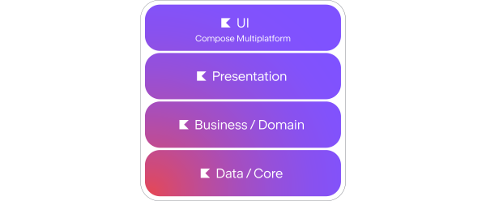

autoscale: true
build-lists: true
footer: ashdavies.dev
slide-transition: fade(0.5)
theme: Work, 8

[.text: line-height(2), text-scale(0.5)]
[.footer: ]

# [fit] Beyond the UI

### [fit] Compose as a Foundation for Multiplatform Apps

#### Berlindroid - July '25 🇩🇪

Ash Davies | ashdavies.dev
Android GDE Berlin


^ Talk background, Compose in unconventional places

^ Started with Compose in a GCP function

---

# Jetpack Compose UI
### github.com/androidx/androidx/tree/androidx-main/compose/ui


^ What is Jetpack Compose UI, if unfamiliar with Android

^ Recommended modern toolkit for UI development

---

[.background-color: ##2b2b2b]
[.footer-style: #333]

```kotlin
@Composable
fun JetpackCompose() {
    Card {
        var expanded by remember { mutableStateOf(false) }
        
        Column(Modifier.clickable { expanded = !expanded }) {
            Image(painterResource(R.drawable.jetpack_compose))
            
            AnimatedVisibility(expanded) {
                Text(
                    text = "Jetpack Compose",
                    style = MaterialTheme.typography.bodyLarge,
                )
            }
        }
    }
}
```

^ Designed for Kotlin langauge features

^ Build intuitive, declarative UI

---

# Jetpack Compose UI
### github.com/androidx/androidx/tree/androidx-main/compose/ui


^ Years of collaboration with Google and JetBrains

^ Overhaul of Kotlin compiler for plugins

^ What prompted this?

---

# Android Layouts

```xml
<?xml version="1.0" encoding="utf-8"?>
<LinearLayout xmlns:android=
"http://schemas.android.com/apk/res/android"
  android:layout_width="match_parent"
  android:layout_height="match_parent" 
  android:orientation="vertical">

  <TextView android:id="@+id/text"
  android:layout_width="wrap_content"
  android:layout_height="wrap_content"
  android:text="Hello, I am a TextView" />
  
<Button android:id="@+id/button"
  android:layout_width="wrap_content"
  android:layout_height="wrap_content"
  android:text="Hello, I am a Button" />

</LinearLayout>
```


^ Technically declarative, requires mutable configuration in code

^ Years of optimisations, performance acceptable

---

# Android Layouts
### Lifecycle


^ Introduced lifecycle management

^ Bane of existence

---

# Android Layouts
### Lifecycle Abstraction


^ Idea of a more granular UI not new

^ Mortar for screens with view presentation

^ Flow handled the navigation and backstack

---

# Android Layouts
### Lifecycle Abstraction


^ Evolved into Workflow, comprehensive, opinionated, open source, production ready

^ Uber completely rebuilt their app in 2016 using "VIPER"

^ Both use UDP, declarative syntax

---

# Android Layouts
### Kotlin Interop


^ Additional tooling developed by Google and OS community

^ Mostly served as a approachable API for Kotlin

^ Since layout inflation is still very Java-esque

---

# XML?!


^ Kotlin has spoilt us, nobody wants to use XML anymore

---

# Jetpack Compose UI 🚀
### 1.0 (July 2021)


^ Google already announced first-class support in 2017

^ Kotlin the fastest growing language on GitHub in 2018

^ Google later announced Kotlin as preferred in 2019

^ So it was time for Kotlin-based UI toolkit

^ Jetpack Compose preview released October 2019

^ Hitting 1.0 production ready in July 2021

---

# Declarative UI Framework
### Compose UI

^ Focuses more on the "what" than the "how"

^ Layout is a stateful declaration

^ Antithesis of imperative usage, listeners and adding or removing views

^ Better representation of state in UI

---

# Intelligent Recomposition 🧠
### Compose UI

```kotlin
@Composable
fun ClickCounter(clicks: Int, onClick: () -> Unit) {
    Button(onClick = onClick) {
        Text("I've been clicked $clicks times")
    }
}
```

^ Where previously the entire button hierarchy would been to be redrawn

^ When clicks changed, only the text is redrawn by recomposition

---

# Kotlin Language Features 💪
### Compose UI

- Default parameters
- Higher order functions
- Trailing lambdas
- Scopes / Receivers
- Delegated properties
- ...

^ Kotlin langauge features allow developers to write declarative code

^ DSLs apply naturally to the view hierarchy

^ Promoting immutability

---

[.footer: medium.com/androiddevelopers/under-the-hood-of-jetpack-compose-part-2-of-2-37b2c20c6cdd]

# Jetpack Compose UI
### Under-the-hood


^ Composer uses gap buffer to build a node structure

^ Flat array to store group objects

---

[.background-color: #fff]
[.footer-style: #000]

# What tree structure does the Compose runtime output?


^ Node structure as UI tree

---

[.text: text-scale(0.75)]
[.footer: jakewharton.com/a-jetpack-compose-by-any-other-name]

> Compose is, at its core, a general-purpose tool for managing a tree of nodes of any type ... a “tree of nodes” describes just about anything, and as a result Compose can target just about anything.
-- Jake Wharton

^ What is Compose, at its core?

---

# [fit] ⚠️ Compose != Compose UI

---

# Kotlin Multiplatform
### Stable (1.9.20)

^ Kotlin Multiplatform, relatively new kid on the block

^ Stable from release 1.9.20 released on Nov 2023

^ But multiplatform isn’t a new concept…

---

# The Before Times


^ There have been many attempts at multiplatform frameworks

^ Each demonstrating advantages and disadvantages

^ Some with limited success, some with even less

^ Some integrating the underlying OS some not

---

# The Before Times


^ Each framework specifying its own language and development / build environment

^ Whilst each of these languages have their own ecosystem of libraries etc

^ Not languages typically familiar to Android or mobile developers

^ Unless life has been particularly cruel to you

---


^ KMP starts small, doesn’t require sharing everything

^ Build components in a way that makes sense for you

^ Language already familiar to Android and backend developers

^ Strong community, public backing (JetBrains, Google)

---



# Compose Multiplatform
### v1.0 | 2021

^ Compose Multiplatform builds upon Kotlin multiplatform

^ Became ready for production with v1.0 at the end of 2021 (December)

^ Has since recategorised stability declarations

---

[.footer: github.com/JetBrains/compose-multiplatform-core]


^ Imagined some very clever repackaging of androidx releases

^ Actually a forked repo with the JetBrains team adapting libraries

^ Constant huge amount of work, incredible effort

---

# Compose Multiplatform Migration

- Change artifact coordinates
- Do nothing
- Profit

^ If you're migrating from an android only project

^ You've waited long enough to have androidx available

^ Congrats

---


---

[.footer: ashdavies.dev/talks/hype-driven-development-berlin-devfest/]

# Hype Driven Development


^ Started from putting Compose into a cloud function

^ Prime example of solutions looking for problems

---

> “I suppose it is tempting, if the only tool you have is a hammer, to treat everything as if it were a nail.”

> -- Abraham Maslow


^ Also known as the law of the instrument, or "Birmingham screwdriver"

^ Playing with tech in ways unintended, may result in new insights

---

[.code-highlight: 3, 13]

```kotlin
// Compiled Compose code

fun Counter($composer: Composer) { 
    $composer.startRestartGroup(-1913267612)
    
    /* ... */
    
    $composer.endRestartGroup()
}

// Compiled Coroutines code

fun counter($completion: Continuation) {
    /* ... */
}
```

^ Similarities between code manipulation

^ Consider how this can be used architecturally

---

# KotlinX Coroutines

^ Remember the problems coroutines were meant to solve?

---

[.footer: speakerdeck.com/ashdavies/droidcon-nyc-demystifying-molecule?slide=27]

```kotlin
@Suppress("DEPRECATION")
class CallbackLoginPresenter(
  private val service: SessionService,
  private val goTo: (Screen) -> Unit,
) {
  /* ... */

  inner class LoginAsyncTask : AsyncTask<Submit,Void,LoginResult>() {
    private var username: String = ""

    override fun doInBackground(vararg events: Submit?): LoginResult {
      val event = events[0]!!
      username = event.username
      return runBlocking { service.login(event.username, event.password) }
    }

    override fun onPostExecute(result: LoginResult?) {
      when (result) {
        is Success -> goTo(LoggedInScreen(username))
        is Failure -> goTo(ErrorScreen(result.throwable?.message ?: ""))
        else -> {}
      }
    }
  }
}
```

^ Much like layouts, Android has a troubled past with asynchronous operations

---

[.footer: proandroiddev.com/how-rxjava-chain-actually-works-2800692f7e13]

```kotlin
Observable.just("Hey")
    .subscribeOn(Schedulers.io())
    .map(String::length)
    .subscribeOn(Schedulers.computation())
    .observeOn(AndroidSchedulers.mainThread())
    .doOnSubscribe { doAction() }
    .flatMap {
        doAction()

        Observable.timer(1, TimeUnit.SECONDS)
            .subscribeOn(Schedulers.single())
            .doOnSubscribe { doAction() }
    }
    .subscribe { doAction() }
```

^ Introduction of reactive libraries

^ Over-utilisation of mapping operations increases cognitive load

^ Much like Maslows Hammer, employed in areas that don't need it

^ Requiring intimate knowledge of the framework to be productive

---

# KotlinX Coroutines

- Lightweight memory usage
- Structured concurrency
- Cancellation propagation
- Lifecycle aware

^ - A single thread can support many Coroutines

^ - Structured concurrency scopes resources and helps prevent leaks

^ - Built in cancellation support propagates through the hierarchy

^ - Lifecycle aware operation through JetPack extensions

^ TODO Break up slides

---

# KotlinX Coroutines

- Native library
- Imperative syntax
- `suspend fun`

^ Furthermore being a native library was able to exploit Kotlin langauge functions

^ Write imperative code that behaves as reactive

---

# Reactive Architecture

- Push (not pull)
- Unidirectional Data Flow
- Declarative
- Idempotent

^ Consider our architecture goals and how we can use tooling to achieve them

---

```kotlin
downloadManager
    .downloadFile("https://.../")
    .addOnCompletionListener { result ->
        fileManager
            .saveFile("storage/file", result)
            .addOnCompletionListener { success ->
                if (success) {
                    println("Downloaded file successfully")
                }
            }
    }
}
```

^ Back in the day, we had callbacks, to execute code "after"

^ We still have this in a lot of places, which can be ok

^ Can quickly end up in callback hell

---

[.code-highlight: 3-10]

```kotlin
downloadManager
    .downloadFile("https://.../")
    .flatMap { result -> 
        fileManager.saveFile("storage/file", result)
    }
    .observe { success ->
        if (success) {
            println("Downloaded file successfully")
        }
    }
```

^ Which then evolved into an observable chain

^ Everything is a stream, and it's observable

^ Can quickly become unmanagable with Rx operators

---

```kotlin
val file = downloadFile("https://.../")
val success = fileManager.saveFile("storage/file", file)

if (success) {
    println("Downloaded file successfully")
}
```

^ Coroutines turned this into an imperative style

^ Get to enjoy Kotlin and structured concurrency

^ Reduces complexity to top level

---

[.code-highlight: 12-31]


```kotlin
- downloadManager
-   .downloadFile("https://.../")
-   .flatMap { result ->
-     fileManager.saveFile("storage/file", result)
-   }
-   .observe { success ->
-     if (success) {
-       println("Downloaded file successfully")
-     }
-   }

+ downloadManager.
+     downloadFile("https://.../")
+     .flatMapLatest { state ->
+         when (state) {
+             is State.Loaded -> 
+                 stateFileManager
+                     .saveFile("storage/file", state.value)
+             
+           else -> state
+         }
+     }
+     .collect { state ->
+         when (state) {
+           is State.Saved -> 
+               println("Downloaded file successfully")
+           
+           is State.Loading ->
+               /* ... */
+         }
+     }
```

^ Suspended functions are one shot operations, sometimes you need a reactive flow

^ Besides an improved sealed class event structure, pretty much the same as Rx

---


^ Remembering that Compose is a tree of nodes means we can restructure our architecture

---

```kotlin
val downloadState = downloadManager
    .downloadFile("https://.../")
    .collectAsState(State.Downloading)

val fileState = when(downloadState) {
    is State.Loaded -> 
        stateFileManager
            .saveFile("storage/file", downloadState.value)
    else -> downloadState
}

when (fileState) {
    is State.Loading -> /* ... */
        
    is State.Saved -> LaunchedEffect(fileState) {
        println("Downloaded file successfully")
    }
}
```


^ Now we've done the same as with coroutines one shot operators

^ Operations are idiomatic, readable, low cognitive load

---

[.footer: github.com/cashapp/molecule]


^ Molecule built by the folks at Square explores this further

^ Being able to use Compose runtime to build a state

---

# Molecule

```kotlin
fun CoroutineScope.launchCounter(): StateFlow<Int> {
  return launchMolecule(mode = ContextClock) {
    var count by remember { mutableStateOf(0) }

    LaunchedEffect(Unit) {
      while (true) {
        delay(1_000)
        count++
      }
    }

    count
  }
}
```

^ Utilising Compose Runtime to build state flow

---

# Testing

```kotlin
@Test 
fun counter() = runTest {
  moleculeFlow(RecompositionMode.Immediate) {
    Counter()
  }.test {
    assertEquals(0, awaitItem())
    assertEquals(1, awaitItem())
    assertEquals(2, awaitItem())
    cancel()
  }
}
```

^ Combine molecule with Turbine to test a composable as a flow

---


---

# Turbine

```kotlin
flowOf("one", "two").test {
  assertEquals("one", awaitItem())
  assertEquals("two", awaitItem())
  awaitComplete()
}
```

---

# [fit] Architecture 🏗️

^ Knowing that Compose runtime is capable of managing a tree of nodes

^ Means we can exploit this as an architecture

---

# [fit] Navigation 🗺️


^ Worth noting how similar navigation and architecture is

^ Navigation is such an essential part of the structure

---

[.footer: android-developers.googleblog.com/2025/05/announcing-jetpack-navigation-3-for-compose.html]

# [fit] Jetpack Navigation 3


^ Earlier this month Google announced Jetpack Navigation 3

^ Promising to solve problems with canonical layouts

^ Compose first design, let's see...

---

# [fit] Pre-Compose Era 🪨

^ Taking frameworks and applying them to compose works fine

^ But if it seems a little un-idiomatic

^ Consider Compose first architectures

---

# [fit] Tooling in Compose Multiplatform

^ Again being a good engineer is knowing what tools you have available

^ How to utilise those tools appropriately

---

# Decompose & Essenty
### arkivanov.github.io/Decompose

^ Decompose focusses on the lifecycle awareness aspect with navigation included

^ Providing abstraction of platform lifecycle configuration changes and navigation

^ In the absence of ViewModel or LifecycleOwner did a good job of management

---

```kotlin
import com.arkivanov.decompose.ComponentContext

class DefaultRootComponent(
    componentContext: ComponentContext,
) : RootComponent, ComponentContext by componentContext {

    init {
        lifecycle... // Access the Lifecycle
        stateKeeper... // Access the StateKeeper
        instanceKeeper... // Access the InstanceKeeper
        backHandler... // Access the BackHandler
    }
}
```

^ Core principle of decompose is to provide multiplatform functionality through ComponentContext

^ Many functions here should be familiar to platforms

^ Provides observability and value storage with lifecycle persistence

---


## adrielcafe/voyager
### voyager.adriel.cafe

---

# Voyager 

```kotlin
class PostListScreen : Screen {

    @Composable
    override fun Content() {
        // ...
    }

    @Composable
    private fun PostCard(post: Post) {
        val navigator = LocalNavigator.currentOrThrow

        Card(
            modifier = Modifier.clickable {
                navigator.push(PostDetailsScreen(post.id))
            }
        ) {
            // ...
        }
    }
}
```

^ Voyager takes a more simpler approach with Navigator provided as a CompositionLocal

^ Keys again keyed by a Screen class, simply added or removed from the back stack

---

## appyx
### bumble-tech.github.io/appyx

^ Another compose first navigation library more focussed on gesture control

---

## PreCompose
### github.com/Tlaster/PreCompose

^ Similar to Jetpack Navigation with some tweaks

---

[.footer: github.com/cashapp/molecule]


^ Already briefly covered molecule

---

[.footer: github.com/slackhq/circuit]


^ Circuit is a community-contributed library for multiplatform

^ Takes inspiration from existing approaches, cashapp broadway, workflow etc

^ Designed with Compose in mind, powered with the compose runtime

^ Same principal tenet, separation of presenter and ui

^ UDF all the way through, no mutability

---
## Circuit
### State

```kotlin
@Parcelize
data object HomeScreen : Screen {
  data class State(
    val title: String,
  ): CircuitUiState
}
```

^ Screens are keyed by an appropriately named screen class

^ UDP Concept revolves around your state

^ Needs to be Parcelable so that it can be saved to the back stack on Android

^ If you see Zac, ask him if we can make it Serializable instead

---

## Circuit
### Presenter

```kotlin
class HomePresenter : Presenter<HomeScreen.State> {
  @Composable
  override fun present(): HomeScreen.State {
    return HomeScreen.State("Hello World")
  }
}
```

^ Presenters, separated from UI, responsible for creation of state

---

## Circuit
### UI

```kotlin
@Composable
fun HomeScreen(
  state: HomeScreen.State,
  modifier: Modifier = Modifier,
) {
  Text(
    text = state.title,
    modifier = modifier,
  )
}
```

^ Basic UI to receive and render the provided state

^ Take a modifier as a good citizen

---

## Circuit

```kotlin
val circuit = Circuit.Builder()
  .addPresenter<HomeScreen, HomeScreen.State>(HomePresenter())
  .addUi<LauncherScreen, LauncherScreen.State> { _, _ -> HomeScreen(state, modifier) }
  .build()

CircuitCompositionLocals(circuit) {
    val backStack = rememberSaveableBackStack(HomeScreen)

    NavigableCircuitContent(
        navigator = rememberCircuitNavigator(backStack),
        backStack = backStack,
    )
}
```

^ Wire up circuit with the presenter and UI

^ Provide composition locals

^ Create a back stack with an initial screen

---

[.code-highlight: 5, 8-11]

## Circuit
### Navigation

```kotlin
@Parcelize
data object HomeScreen : Screen {
  data class State(
    val title: String,
    val eventSink: (Event) -> Unit
  ): CircuitUiState

  sealed interface Event {
    data class DetailClicked(
      val id: String,
    ): Event
}
```

^ Interestingly navigation is handled through simply event propagation through the screen state

^ Which can be invoked from the UI then handled by the presenter

---

## Circuit
### Navigation

```kotlin
class HomePresenter(private val navigator: Navigator) : Presenter<HomeScreen.State> {

@Composable
  override fun present(): HomeScreen.State {
    return HomeScreen.State("Hello World") { event ->
      when (event) {
        is HomeScreen.Event.DetailClicked -> navigator.goTo(DetailScreen(event.id))
      }
    }
  }
}
```

---

[.footer: youtube.com/watch?v=ZIr_uuN8FEw]


^ Zac and Kieran go into much more depth

---

[.footer: github.com/zacsweers/metro]


---

# RIP Anvil

---

# But Why?

^ As engineers it's our job to know what tools are available

^ Benefits and drawbacks to each solution

^ What may or may not fit with our existing landscape

---

[.background-color:#fff]


^ Write once, run on Android, Desktop, iOS, Web

^ Avoid duplicating presentation logic

^ Keep logic and state in sync across UIs

^ Compiles natively

---

# Prototyping 🚀

^ Quickly ship UI to multiple form factors

^ Desktop becomes a testbed for mobile UIs

---

[.footer: github.com/JetBrains/compose-hot-reload]


^ With minimal setup you can use Compose Hot Reload

^ Near instantaneous UI feedback

---

# Recomposition 🔄

^ Compose skips execution where it's not necessary

^ Performance is improved when state is unchanged

^ TODO Strong skipping, stability management

---

[.footer: developer.android.com/develop/ui/compose/performance/stability]

# Stability ⚖️

- `org.jetbrains.kotlinx:kotlinx-collections-immutable`
- `composeCompiler.stabilityConfigurationFile`
- `@Immutable`
- `@Stable`

^ Consider Compose parameter stability

^ Must be immutable, val, concretion

---

# Remember 🧠

^ Compose remember introduced as a concept

^ Whilst allowing fine grained control

^ Requires some forethought

---

# Remember 🧠

```kotlin
var path by remember { mutableStateOf("https://.../") }
val file = remember(path) {
    downloadManager.downloadFile(path)
}
```

^ When the value of path changes, the file will be downloaded

^ This won't be retained through configuration change or process death

^ Not a novel problem, we have this problem already

---

# Remember 🧠

```kotlin
var path by remember { mutableStateOf("https://.../") }
val file = rememberSaveable(path) {
    // Must be Parcelable on Android!
    downloadManager.downloadFile(path)
}
```

^ Value must be primitive or Parcelable

---

# Circuit

# `rememberRetained()`

^ Circuit introduces the concept of retained state

^ Retained stored in memory, persists configuration change

---

[.footer: chrisbanes.me/posts/retaining-beyond-viewmodels]


# [fit] `rememberRetainedCoroutineScope()`

### Retaining Beyond ViewModels

^ Chris covers this in detail with retaining a CoroutineScope

^ Perform long running operations

---

# Consistent State Patterns

- Hoisting, unidirectional data flow
- Shared reactive state handling

^ Patterns like UDF become even more powerful when applied the same way across every platform.

---

# Compose Multiplatform
### Material Theming

```kotlin
MaterialTheme(
    colorScheme = /* ... */,
    typography = /* ... */,
    shapes = /* ... */,
) {
    // M3 app content
}
```

^ You can maintain typography, spacing, and theming with a consistent design language across all platforms

---


^ If iOS design is more your cup of tea

^ iOS style components can be applied with compose cupertino

---

```kotlin
@Composable
fun AppTheme(
    theme: Theme,
    content: @Composable () -> Unit
) {
    AdaptiveTheme(
        material = {
            // Tweak this for your Material design
            MaterialTheme(content = it)
        },
        cupertino = {
            // Tweak this for your iOS design
            CupertinoTheme(content = it)

        },
        target = theme,
        content = content
    )
}
```


---

# IDE-First Experience

- JetBrains tools tightly integrated
- Live previews and navigation supported

^ With JetBrains behind Compose for Desktop and IntelliJ, tooling is first-class.

---

# Beyond the UI
### Wrap-Up

✅ Compose is more than a UI toolkit  
✅ Enables scalable, shared architecture  
✅ Designed for Kotlin-first developers  
✅ Multiplatform not just business logic

^ Start rethinking how you architect apps, not just how you render them.

---

[.text: line-height(2), text-scale(0.5)]
[.footer: ]


# [fit] Thank You!

Ash Davies | ashdavies.dev
Android GDE Berlin

^ Ask me for cat stickers!
