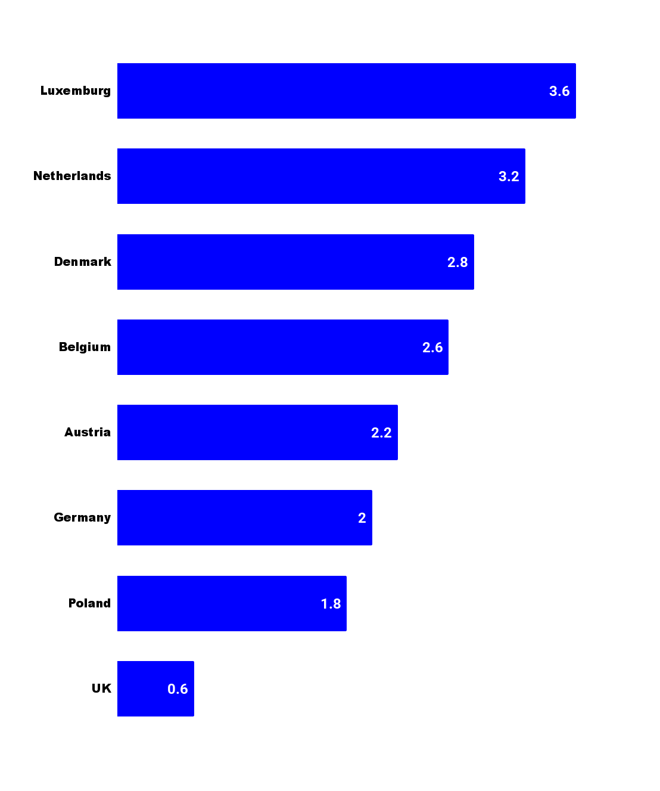

autoscale: true
build-lists: true
footer: ashdavies.dev
slide-transition: fade(0.5)
theme: Work, 8

[.text: line-height(2)]

# [fit] Crafting Idiomatic APIs with Kotlin and Compose

## Droidcon Berlin - September '25 🇩🇪


---

# What is an API?

```shell
curl --request GET \
  --url "https://api.github.com/octocat" \
  --header "Authorization: Bearer YOUR-TOKEN" \
  --header "X-GitHub-Api-Version: 2022-11-28"
```

^ May think API is exclusively retrieving data

^ Familiar to most developers

---

# Protocols?

- SOAP
- Rest
- GraphQL
- gRPC

^ Protocols define a mechanism for communication, are they APIs?

---

# SDKs?

^ SDKs often built upon public APIs to assist developers

^ Are they considered APIs?

---

# "Ordinary" Code?

^ Code that you might produce in your day job

---

# Unit Tests?

^ Unit tests are production code that doesn't ship

^ Tests verify Production code, need to be understandable

---

# Temporary Code?

^ Under pressure, time constraints, should temporary code by considered an API?

---

> There is nothing more permanent than a temporary solution

^ Perhaps short lived code doesn't need to be perfect?

---


# Everything is an API
### Droidcon Berlin - Oct 21'

---

# Who is your API for?

^ API design is fundamentally a consideration to the consumer

---

# Consumers?

^ Maybe you're an SDK or framework developer

^ Your code is used by other developers

^ Consider their requirements

---

# Colleagues?

^ Your code will likely be peer-reviewed

^ Once you push, your code is no longer yours

---

# Future Self?

^ No scenario where your code will not be used by someone else

^ Even if that somebody else is you

---

# Language 🗣️

^ Over 7k languages being spoken today, with dialects, hundreds of thousands

^ Countless languages to program with, kindly the Americans have offered theirs...

---

# 🇺🇸


^ Worlds first programming languages written by American mathematicians and scientists, in English.

^ Grace Hopper, arguably the mother of modern programming languages.

---

# colo~~u~~r

^ To this day programming is written in Simplified English, much to my chagrin

---

[.background-color: #fff]
[.footer-style: #000]



^ Average European speaks two or more languages

^ Not to mention business-specific terminology

---

```kotlin
fun showCancelBookingAndBackToVerbindungsuebersichtDialog()

fun handleLoadBuchungskundenDatenOrOpenRechnungFailure()

fun getAngebotsKonditionIconAndContentDescription()
```

^ Not uncommon for code to include words from other languages

^ eg. "Bahnhof", "Betriebstelle", "Zug storniert wegen Signalstörung"

---

[.footer: fiber-space.de/EasyExtend/doc/teuton/teuton.htm]

# Teuton: Eine Deutsche Programmiersprache

```python
# -*- coding: iso-8859-1 -*-

schön = Wahr
häßlich = Falsch

für bäh in [schön, häßlich]:
    drucke bäh

def sovielwiemöglich():
    "gib"
    zurück "was mir gehört"
```

^ Not to say that all programming languages should be English

---

[.text: line-height(2), text-scale(0.5)]


# Thank You!
