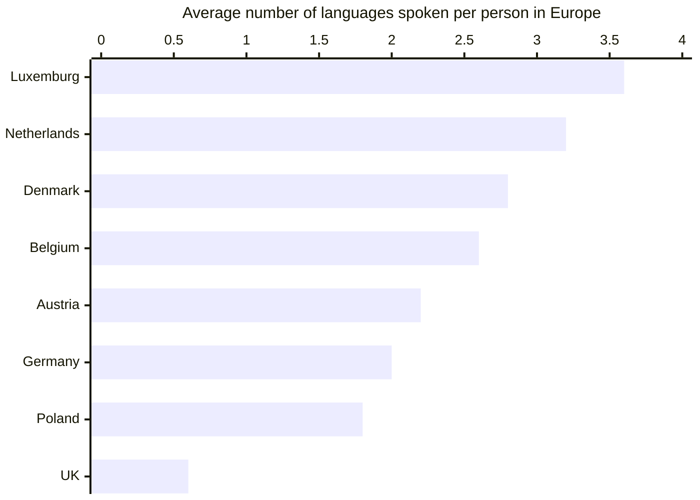

footer: ashdavies.dev
slide-transition: fade(0.5)
theme: Simple, 2

[.text: line-height(2)]

# [fit] Crafting Idiomatic APIs with Kotlin and Compose

## Droidcon Berlin - September '25 🇩🇪


---

# What is an API?

```shell
curl --request GET \
  --url "https://api.github.com/octocat" \
  --header "Authorization: Bearer YOUR-TOKEN" \
  --header "X-GitHub-Api-Version: 2022-11-28"
```

^ May think API are exclusively about retrieving data from rest services online

^ Anything that uses a programming language to interface with another application

---

## Protocols

### SOAP / Rest / GraphQL / gRPC

^ Protocols define a mechanism for communication, wire protocols

^ Slightly nuanced, still include specification for APIs

---

## SDKs 📦

^ SDKs often built upon existing public APIs to aid developers

^ Help introduce language features across protocols

^ Firebase, Google Services, etc

---

## "Ordinary" Code

^ Code that you might produce in your day job

^ That mundane feature, bug fix, etc

---


# Everything is an API
### Droidcon Berlin - Oct 21'

---

## Unit Tests

^ Unit tests are production code that doesn't ship

^ Tests verify Production code, need to be understandable

---

## Temporary Code

^ Under pressure, time constraints, should temporary code by considered an API?

---

> There is nothing more permanent than a temporary solution

^ Perhaps short lived code doesn't need to be perfect?

---

# Who is your API for?

^ API design is fundamentally a consideration to the consumer

^ What tools do they have at their disposal?

---

## Consumers

^ Maybe you're an SDK or framework developer

^ Your code is used by other developers

^ Consider their requirements

---

## Colleagues

^ Your code will likely be peer-reviewed

^ Once you push, your code is no longer yours

---

## Future Self

^ No scenario where your code will not be used by someone else

^ Even if that somebody else is you

---

## Consequences

^ Consequences of poorly designed APIs

---


## Consequences

### Job security

---

## Consequences

### Increased learning curve 🤔

^ Revisiting your code might take longer to understand requirements

^ Takes longer for new developers to understand, can be misleading

---


## Consequences

### Longer peer review

---

## Consequences

### Slowed feature delivery 💰

^ Slow feature delivery increases your time to market

^ Actual fiscal effect on running a business

---

> Every existing thing is born without reason, prolongs itself out of weakness, and dies by chance
> -- Jean-Paul Sartre

---

[.footer: programmingisterrible.com/post/139222674273/write-code-that-is-easy-to-delete-not-easy-to]

> Every line of code is written without reason, maintained out of weakness, and deleted by chance
> -- Jean-Paul Sartre’s Programming in ANSI C.

^ Code has a continued maintenance cost

---

# Idiomatic

^ What does it mean to be idiomatic?

---

## Idioms
### kotlinlang.org/docs/idioms.html

^ Might be familiar with idioms in spoken language

^ Break a leg, bite the bullet, have your cake and eat it too

^ Carry meaning not obvious from the use of words

^ Scope functions, immutability, destructuring, when statements

^ Really just about using language features appropriately

---

# Language 🗣️

^ Over 7k languages being spoken today, with dialects, hundreds of thousands

^ Countless languages to program with, kindly the Americans have offered theirs...

---

# 🇺🇸


^ Worlds first programming languages written by American mathematicians and scientists, in English.

^ Grace Hopper, arguably the mother of modern programming languages.

---

# colo~~u~~r

^ To this day programming is written in Simplified English, much to my chagrin

---

[.background-color: #fff]
[.footer-style: #000]



^ Average European speaks two or more languages

^ Not to mention business-specific terminology

---


```kotlin
fun showCancelBookingAndBackToVerbindungsuebersichtDialog()

fun handleLoadBuchungskundenDatenOrOpenRechnungFailure()

fun getAngebotsKonditionIconAndContentDescription()
```

^ Not uncommon for code to include words from other languages

^ eg. "Bahnhof", "Betriebstelle", "Zug storniert wegen Signalstörung"

---

[.footer: fiber-space.de/EasyExtend/doc/teuton/teuton.htm]

# Teuton: Eine Deutsche Programmiersprache

```python
# -*- coding: iso-8859-1 -*-

schön = Wahr
häßlich = Falsch

für bäh in [schön, häßlich]:
    drucke bäh

def sovielwiemöglich():
    "gib"
    zurück "was mir gehört"
```

^ Not to say that all programming languages should be English

^ Best to reduce the number of languages

^ TODO Number of native German speaking programmers in Germany

---

## Business Specific Terminology

^ You might find business specific terminology in your code

^ Because this relates to the domain, inherent to business

---

## Stornierung, Ersatzverkehr, Signalstörung...

### Business Specific Terminology

^ AKA I've been living here too long

---

[.text: line-height(2), text-scale(0.5)]


# Thank You!
