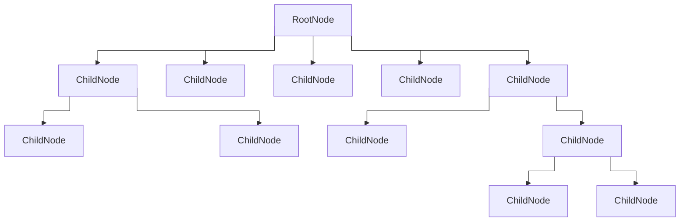

footer: ashdavies.dev
slide-transition: fade(0.5)
slidenumber: true
theme: Simple, 2

[.text: line-height(2)]

# [fit] Crafting Idiomatic APIs with Kotlin and Compose

## Droidcon Berlin - September '25 🇩🇪


---

# What is an API?

```shell
curl --request GET \
  --url "https://api.github.com/octocat" \
  --header "Authorization: Bearer YOUR-TOKEN" \
  --header "X-GitHub-Api-Version: 2022-11-28"
```

^ May think API are exclusively about retrieving data from rest services online

^ Anything that uses a programming language to interface with another application

---

## Protocols

### SOAP / Rest / GraphQL / gRPC

^ Protocols define a mechanism for communication, wire protocols

^ Slightly nuanced, still include specification for APIs

---

## SDKs 📦

^ SDKs often built upon existing public APIs to aid developers

^ Help introduce language features across protocols

^ Firebase, Google Services, etc

---

## "Ordinary" Code

^ Code that you might produce in your day job

^ That mundane feature, bug fix, etc

---

[.footer: ashdavies.dev/talks/everything-is-an-api-berlin-droidcon/]


# Everything is an API

### Droidcon Berlin - Oct '21

---

## Unit Tests

^ Unit tests are production code that doesn't ship

^ Tests verify Production code, need to be understandable

---

## Temporary Code

^ Under pressure, time constraints, should temporary code by considered an API?

---

> There is nothing more permanent than a temporary solution

^ Perhaps short lived code doesn't need to be perfect?

---

# Who is your API for?

^ API design is fundamentally a consideration to the consumer

^ What tools do they have at their disposal?

---

## Consumers

^ Maybe you're an SDK or framework developer

^ Your code is used by other developers

^ Consider their requirements

---

## Colleagues

^ Your code will likely be peer-reviewed

^ Once you push, your code is no longer yours

---

## Future Self

^ No scenario where your code will not be used by someone else

^ Even if that somebody else is you

---

## Consequences

^ Consequences of poorly designed APIs

---


## Consequences

### Job security

---

## Consequences

### Increased learning curve 🤔

^ Revisiting your code might take longer to understand requirements

^ Takes longer for new developers to understand, can be misleading

---


## Consequences

### Longer peer review

---

## Consequences

### Slowed feature delivery 💰

^ Slow feature delivery increases your time to market

^ Actual fiscal effect on running a business

---

> Every existing thing is born without reason, prolongs itself out of weakness, and dies by chance
> -- Jean-Paul Sartre

---

[.footer: programmingisterrible.com/post/139222674273/write-code-that-is-easy-to-delete-not-easy-to]

> Every line of code is written without reason, maintained out of weakness, and deleted by chance
> -- Jean-Paul Sartre’s Programming in ANSI C.

^ Code has a continued maintenance cost

---

[.footer: kotlinlang.org/docs/idioms.html]

## Idioms

^ Might be familiar with idioms in spoken language

^ Break a leg, bite the bullet, have your cake and eat it too

^ Carry meaning not obvious from the use of words

^ Scope functions, immutability, destructuring, when statements

^ Really just about using language features appropriately

---

## Idioms

### Default Parameters

```kotlin
fun foo(a: Int = 0, b: String = "") { /* ... */ }
```

^ Some idioms are well-known and widely used

^ Like allowing the caller to omit parameters

^ Reduces complexity of method overloads

---

## Idioms

### Lazy Properties

```kotlin
val property: String by lazy { /* ... */ }
```

^ Defer computation until first access for expensive instances

^ Lazy calculation not so simple, threading complications

---

## Idioms

### Null Coalescing

```kotlin
val fileSize = files?.size ?: run {
    val someSize = getSomeSize()
    someSize * 2
}
```

^ Elvis operator, everybody's favourite null coalescing operator

^ Reduces null checking boilerplate, value expressions

---

[.footer: kotlinlang.org/docs/whatsnew2220.html]

## Idioms

### Expression `return` statements

```kotlin
fun getDisplayNameOrDefault(userId: String?): String = getDisplayName(userId ?: return "default")
```

^ Fairly new convention, permitted to call return in the expression body

^ Only compiles if the function has a declared return type

---

[.code-highlight: 4]

## Idioms

### Guard Conditions

```kotlin
fun feedAnimal(animal: Animal) {
    when (animal) {
        is Animal.Dog -> feedDog()
        is Animal.Cat if !animal.mouseHunter -> feedCat()
        else -> println("Unknown animal")
    }
}
```

^ Guard conditions can be applied to when condition

^ Subtle improvement for concise control flows

---

[.footer: kotlinlang.org/docs/coding-conventions.html]

## Kotlin

### Coding Conventions

^ Kotlin has a number of conventions to help you write idiomatic code

---

## 

^ Idioms revolve around the language features

---


^ Can be challenging to keep up with the latest language features

^ Some smaller changes can go by unnoticed

---

# Coroutines

^ Coroutines introduced a significant overhaul to the language

---

## Reactive / Imperative

^ Early on, apps conuld be considered imperative

^ Sequential operations, configuring UI, setting listeners

---

[.footer: jakewharton.com/the-state-of-managing-state-with-rxjava/]


^ With multiple input sources, data can become asynchronous

^ Data asynchronicity required reactive programming

---

```kotlin
@Suppress("DEPRECATION")
class CallbackLoginPresenter(val service: SessionService, val goTo: (Screen) -> Unit) {

  var onModel: (LoginUiModel) -> Unit = {}
  var task: AsyncTask<Submit,Void,LoginResult>? = null

  fun start() = onModel(Content)

  fun stop() = task?.cancel(true)

  fun onEvent(event: LoginUiEvent) = when (event) {
    is Submit -> task = LoginAsyncTask().also {
      it.execute(event)
    }
  }

  inner class LoginAsyncTask : AsyncTask<Submit, Void, LoginResult>() {
    private var username: String = ""

    override fun doInBackground(vararg events: Submit?): LoginResult {
      val event = events[0]!!
      username = event.username
      return runBlocking { service.login(event.username, event.password) }
    }

    override fun onPostExecute(result: LoginResult?) = when (result) {
        is Success -> goTo(LoggedInScreen(username))
        is Failure -> goTo(ErrorScreen(result.throwable?.message ?: ""))
        else -> Unit
    }
  }
}
```

^ We went from some hideous callback-based code...

---

[.footer: proandroiddev.com/how-rxjava-chain-actually-works-2800692f7e13]

```kotlin
Observable.just("Hey")
    .subscribeOn(Schedulers.io())
    .map(String::length)
    .subscribeOn(Schedulers.computation())
    .observeOn(AndroidSchedulers.mainThread())
    .doOnSubscribe { doAction() }
    .flatMap {
        doAction()

        Observable.timer(1, TimeUnit.SECONDS)
            .subscribeOn(Schedulers.single())
            .doOnSubscribe { doAction() }
    }
    .subscribe { doAction() }
```

^ To some pretty hideous reactive java code

^ Mapping operations increases cognitive load

^ Requires intimate knowledge of the framework

---

## Coroutines

### Structured Concurrency

^ Involving idiomatic DSL language features

^ Introduced structured scope through compiler behaviour

---

## Declarative Architecture

^ Slowly introduced declarative architecture patterns

^ Thinking about the "what" instead of the "how"

---

## Declarative Architecture

### Immutability

^ Principle tenet of functional programming

^ Assigned objects cannot be changed

^ Easier and more predictable testing

---

## Declarative Architecture

### Idempotency / Determinism

^ AKA pure functions, or deterministic, replayable event sequencing

^ Operations can be repeated without side effects

^ Resulting in a reliable and predictable system

---

## Declarative Architecture

### Unidirectional Data Flow

^ Ensuring the flow of data is always in one direction

^ Easier to find the source of truth

---

# Jetpack, Compose, & Multiplatform


^ Compose, mostly falling under the androidx umbrella

^ Collaborated with Jetbrains on Kotlin compiler plugin APIs

^ Many parts later adopted into the Kotlin repository

---

[.background-color: #fff]
[.footer-style: #000]


^ Compose leans into the hierarchical tree node structure

^ Allows for structured scope manipulation

---

```kotlin
fun Counter($composer: Composer) { 
    $composer.startRestartGroup(-1913267612)
    
    /* ... */
    
    $composer.endRestartGroup()
}
```

^ Compose achieves this through a Kotlin compiler plugin

^ Method signatures are rewritten to provide a composer

^ Node groups are created to represent the composition tree

^ Nodes can then be recomposed when they become dirty

---

[.footer: chrisbanes.me/posts/slotting-in-with-compose-ui]

# Compose

## Higher-Order Functions

```kotlin
@Composable
fun TopAppBar(
    navigationIcon: @Composable (() -> Unit)? = null,
    title: @Composable () -> Unit,
    actions: @Composable (RowScope.() -> Unit)? = null,
    // ...
)

TopAppBar(
    navigationIcon = {
        Image(/* ... */)
    },
    // ...
)
```

^ Compose uses higher-order functions to provide slot APIs

^ Allowing for composition of arbitrary content

^ Avoiding rigid method signatures

---

[.footer: android.googlesource.com/platform/frameworks/support/+/androidx-main/compose/docs/compose-api-guidelines.md#layout_scoped-modifiers]

# Compose

## Scopes

```kotlin
@Stable
interface WeightScope {
    fun Modifier.weight(weight: Float): Modifier
}

@Composable
fun WeightedRow(
    modifier: Modifier = Modifier,
    content: @Composable WeightScope.() -> Unit
) {
// ...

// Usage:
WeightedRow {
    Text("Hello", Modifier.weight(1f))
    Text("World", Modifier.weight(2f))
}
```

^ Compose makes use of scope interfaces to provide functionality within a lambda

^ Can also be used to restrict components to a specific parent

---

# Compose

## Scopes

[.code-highlight: 1-5]
[.code-highlight: 9-11]
[.code-highlight: 13-15]

```kotlin
@Composable
fun TopAppBar(
    actions: @Composable (RowScope.() -> Unit)? = null,
    // ...
)

TopAppBar(
    actions = {
        ImageButton(onClick = { /* ... */ }) {
            Image(/* ... */)
        }
        
        ImageButton(onClick = { /* ... */ }) {
            Image(/* ... */)
        }
    },
)
```

^ TopAppBar also uses scopes on function parameters

^ Tells us that these items will be composed in a row

---

# Compose

## Property Delegates

```kotlin
inline operator fun <T> State<T>.getValue(thisObj: Any?, property: KProperty<*>): T = value

val conference by remember { mutableStateOf("Droidcon Berlin") }
```

^ Modification of state will cause recomposition

^ More complex implementation is required

^ Property delegates can be used to provide a simpler API

---

# Compose

## Architecture


```kotlin
downloadManager
    .downloadFile("https://.../")
    .flatMapLatest { state ->
        when (state) {
            is State.Loaded -> stateFileManager.saveFile(
                name = "storage/file", 
                value = state.value,
            )
            
          else -> state
        }
    }
    .onEach { state ->
        when (state) {
          is State.Saved -> println("Downloaded file successfully")
          is State.Loading -> /* ... */
        }
    }
    .launchIn(coroutineScope)
```

^ Traditionally coroutine one shot operations can make nice inline code

^ But often we'll need the UI to update as a result of an ongoing operation

---



^ Remembering that Compose is a tree of nodes means we can restructure our architecture

---

```kotlin
val downloadState = downloadManager
    .downloadFile("https://.../")
    .collectAsState(State.Downloading)

val fileState = when(downloadState) {
    is State.Loaded -> 
        stateFileManager
            .saveFile("storage/file", downloadState.value)
    else -> downloadState
}

when (fileState) {
    is State.Loading -> /* ... */
        
    is State.Saved -> LaunchedEffect(fileState) {
        println("Downloaded file successfully")
    }
}
```


^ Now we've done the same as with coroutines one shot operators

^ Operations are idiomatic, readable, low cognitive load

---


```kotlin
fun CoroutineScope.launchCounter(): StateFlow<Int> {
  return launchMolecule(mode = ContextClock) {
    var count by remember { mutableStateOf(0) }

    LaunchedEffect(Unit) {
      while (true) {
        delay(1_000)
        count++
      }
    }

    count
  }
}
```

^ Molecule built by the folks at Square explores this further

^ Being able to use Compose runtime to build a state

^ Utilising Compose Runtime to build state flow

---

[.footer: ashdavies.dev/talks/beyond-the-ui-prague/]


# Beyond the UI

### mDevCamp Prague - Jun '25

---

# Language 🗣️

^ Over 7k languages being spoken today, with dialects, hundreds of thousands

^ Countless languages to program with, kindly the Americans have offered theirs...

---

# 🇺🇸


^ Worlds first programming languages written by American mathematicians and scientists, in English.

^ Grace Hopper, arguably the mother of modern programming languages.

---

# colo~~u~~r

^ To this day programming is written in Simplified English, much to my chagrin

---

[.background-color: #fff]
[.footer-style: #000]


^ Average European speaks two or more languages

^ Not to mention business-specific terminology

---


```kotlin
fun showCancelBookingAndBackToVerbindungsuebersichtDialog()

fun handleLoadBuchungskundenDatenOrOpenRechnungFailure()

fun getAngebotsKonditionIconAndContentDescription()
```

^ Not uncommon for code to include words from other languages

^ eg. "Bahnhof", "Betriebstelle", "Zug storniert wegen Signalstörung"

---

[.footer: fiber-space.de/EasyExtend/doc/teuton/teuton.htm]

# Teuton: Eine Deutsche Programmiersprache

```python
# -*- coding: iso-8859-1 -*-

schön = Wahr
häßlich = Falsch

für bäh in [schön, häßlich]:
    drucke bäh

def sovielwiemöglich():
    "gib"
    zurück "was mir gehört"
```

^ Not to say that all programming languages should be English

^ Best to reduce the number of languages

^ TODO Number of native German speaking programmers in Germany

---

## Business Specific Terminology

^ You might find business specific terminology in your code

^ Because this relates to the domain, inherent to business

---

## Stornierung, Ersatzverkehr, Signalstörung...

### Business Specific Terminology

^ AKA I've been living here too long

---

### Business Specific Terminology

^ Cross language domain terminology is actually a real problem

^ Translating terms into English can lose context

^ Writing code bases in German is not a great idea

---

### Business Specific Terminology

^ At the same time, API design allows you to reflect business requirements

^ Strong typing, clear class declarations, etc

---

# Tooling

^ Tooling is a huge part of the developer experience

^ Many bike-shedding arguments rendered moot by linters

^ Tooling can be used to encourage idiomatic code

---

[.footer: kotlinlang.org/docs/whatsnew14.html#explicit-api-mode-for-library-authors]

# Tooling

## `explicitApiMode()`

^ Kotlin is public by default, easy to leak internal implementation

^ Forces explicit use of `public` and `internal` declarations

---

[.footer: slackhq.github.io/compose-lints/]

# Tooling

### `com.slack.lint.compose:compose-lint-checks`

^ Lint rules for Compose to enforce idiomatic code

^ Originally from twitter, now maintained by Slack

---

[.footer: mrmans0n.github.io/compose-rules/ktlint/]

# Tooling

### `io.nlopez.compose.rules:ktlint`

^ Same rulesets for ktlint and detekt

---

[.text: line-height(2), text-scale(0.5)]


# Thank You!
