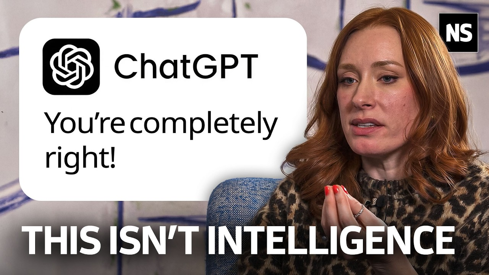

footer: ashdavies.dev
build-lists: notFirst
code-language: Kotlin
slide-transition: fade(0.5)
theme: Libre, 6
time-budget: 40

[.text: line-height(2)]

# Coding for Fun - Not Profit

## Berlindroid - August '26 🇩🇪

---

# [fit] Hype Driven Development

## "How I learned to stop worrying and love the failures"

^ Last year I gave a talk named hype driven development

^ The idea was a celebration of playing with technology

---

# Solutions Looking for a Problem

^ Specific to your sector, some solutions do actually fit

- Augmented / Virtual Reality

- Blockchain

- LLM / NLP

- Wear OS Companion Apps

^ The idea was by diving into gratuitous development

^ Something we've all at some point

---

# CEO Driven Development 💡

^ Many have experienced the pure terror of a CEO rushing into the room

^ I have a great new idea we have to work on right away!

^ Overly micro-managed teams

^ Rarely succeed based on personal sentiment of one user

---

# Familiarity / Risk Aversion

- Dependency discomfort

- Lack of maturity

- Learning curve

^ Novel solutions can carry risk, investing time and energy is scary

^ Its all too tempting to run on personal sentiment

^ Leading to relying on familiar tooling

---

# Decision Fatigue 😫

^ Sometimes without even knowing it we make hundreds of decisions a day

^ It can be easy to become overwhelmed with making the right one

^ Leading to choosing something more familiar, you have more confidence with

---

# Law of the Instrument

> “I suppose it is tempting, if the only tool you have is a hammer, to treat everything as if it were a nail.”

> -- Abraham Maslow

^ Law of the instrument is the over-reliance of a familiar tool

^ There may be other, better, more appropriate tooling available

---

# Developmental Development

- Novel solutions require creativity

- Training through experimentation

^ Finding novel solutions allows us to keep our reflexes sharp

^ There was a point to that

---

# Knowledge Sharing

^ Just one case study of a clusterfuck of difficulties with very unusual attempted solutions

^ Provides numerous opportunities for knowledge sharing with talks or blog articles

^ Story telling is a universally useful skill

---

# Berlindroid  

-

##   

^ The very community that has been built here today stands on the shoulders of nerds

^ The hacking, code diving, experimentation, and discovery

^ Driven by the people who seek knowledge

---

# Understanding the Journey 

^ Sometimes our best revelations don't just come to us in an instant

^ They take time to think about

^ It's a journey of discovery and fuck ups

---

# "Today I Fucked Up" 🤦

^ "Today I Fucked Up" is a wonderful celebration of mistake making

^ We are all fallible, and understanding that it's ok to make mistakes allows you to grow

^ Just be sure to learn from those mistakes

---

^ If you think I'm just an aging developer angry and technology

^ You're damn right I'm angry

^ The skills I've spent years honing are now being devalued by tech bros who by no ethical means should be running a company

---

# "Good Enough"

^ When did the ideals we shared for great, understandable code become replaced with slop that is just "good enough" to compile

---

# Idiomacy / Predictability

^ Why did we start substituting idiomacy for idiocy?

^ Predictability used to be a core foundation of our systems

^ Now we're lucky if it compiles

---

[.footer: futurism.com/future-society/college-critical-thinking-ai]

# "AI Native" College Graduates

^ The problem isn't just in tech, massive numbers of college graduates considered as "AI Natives" entering the workforce

^ Many have significantly declining literacy rates, social skills and critical thinking abilities

^ AI is robbing a generation of meaningful progress

---

# "AI" isn't intelligent

^ Remember that AI is just a prediction engine, giving the most probable word after word

^ AI is not your friend, doctor, colleague or anything anthropomorphised

^ LLMs are just the successors to NLPs

---

[.footer: youtube.com/watch?v=iitq4Zrphdk]

^ I recommend this video from Hannah Fry (well renowned British mathematician, professor at Cambridge) interview with New Scientist

^ She speaks about how systems can trick our brain like fast food being an abundant source of calories, AI is anthropomorphised

---

# What Can We Do?

^ AI has become so widespread, it's hard to escape it, but there are some ways to refresh your palette

---

# Open Source / Playground Projects

^ Say you don't feel you can remain competitive on professional life

^ Try open source or playground projects without AI

---

[.background-color: #181820]

^ If you're not familiar the projects previously hosted on CashApp GitHub have a new home

^ The projects authors have decide for a no-ai policy

---

# Work / Life Balance

- Build for disposability
- Open Source contribution

^ Not everybody can, or should build in their free time

^ We all have other obligations, or hobbies

---

[.background-color: #000000]
[.header: #4285f4]
[.footer-style: #ffffff]
[.footer: jamescullimore.dev/5-minute-bedtime-stories-for-android-devs.html]

·

·

### Story Time

# "Terraform"

---

# Understanding the Machine

^ But if you're in the pro AI camp that's OK too

^ LLMs are undoubtedly a very complicated piece of technology that can be useful for data aggregation

^ Despite my position and all the counter arguments, you can use AI to produce results

---

# Owning Your Code

^ There's never been a more important time to have an increased level of scrutiny

^ Be responsible for your code, understand what it's down

^ Stay answerable

---

# [fit] "Claude wrote it, so it should be fine right?"

^ Don't be that person, using AI so prolifically in the workplace is dangerous

^ Reducing the amount of input humans have on the product

---

[.footer: ky.fyi/posts/ai-burnout]

# AI Burnout 🔥

^ Increasing number of people becoming exasperated with AI in the workplace

^ Non-consenting AI recordings, overuse of AI agent reviews, loss of meaningful communication

---

# Guardrails

^ I've seen it suggested that we need to pull the guard rails, be it PR reviews, required checks to allow AI to become more "productive"

^ Now is the time for even more checks and restrictions, guardrails and apprehension

---

^ You've probably started to notice the increasing frequency of GitHub outage

^ This graph is remarkably optimistic, more and more code is being pushed, and it's pushing our infrastructure to it's limits

^ This isn't a coincidence, there are an increasing number of outages, leaks, and software vulnerabilities 

---

# 🇺🇸

^ Because I can guarantee, the people making the decision on where this technology goes, do not have your best interests in mind

---

[.footer: jonas.do/writing/2026-08-01-stop-lending-your-credibility-to-ai/]

# [fit] Stop trading away your personal credibility

^ It can be tempting to let a robot do all your work for you

^ and if you're completely disillusioned I understand it

^ If you must use AI as a research tool, do the legwork to be able to stand behind the output

---

# Stay Curious, Stay Creative

^ Keep the spark of imagination, keep your own creative ability sharp

---

[.text: line-height(2), text-scale(0.5)]

# [fit] Thank You!

---

[.text: line-height(2), text-scale(0.5)]

# [fit] Thank You!

-

-

## - We are all Fucked
### An Android Developer’s Guide to the Post-AI Apocalypse

-

-

### next.app · Berlin '26

#### Thu - 14:50 · droidCon Stage 3