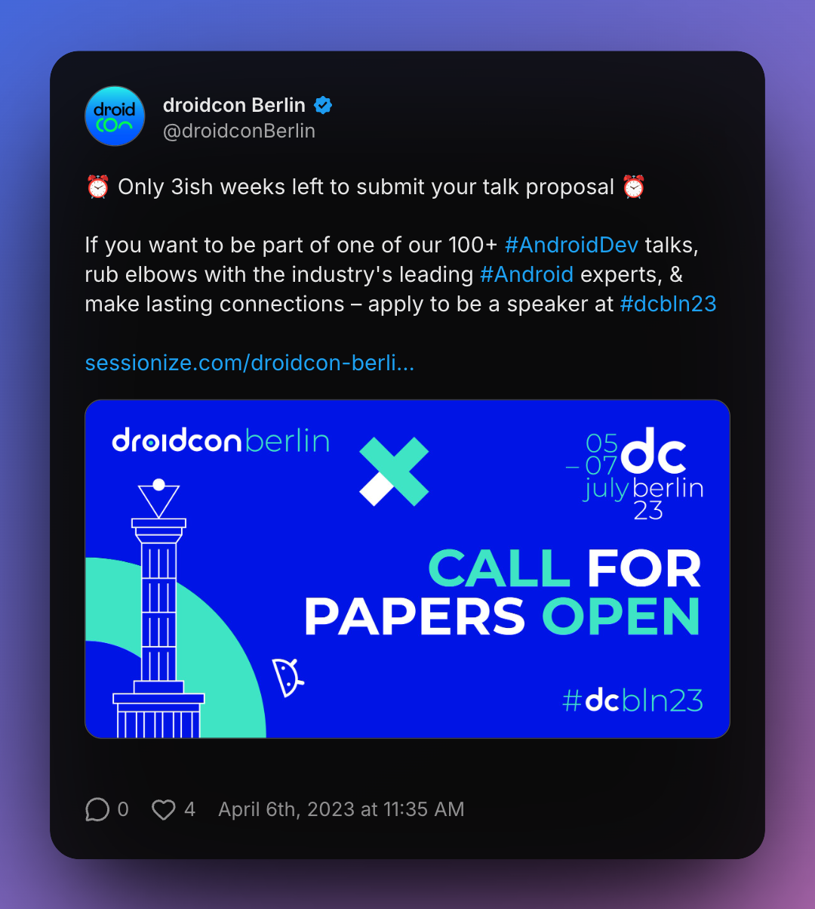
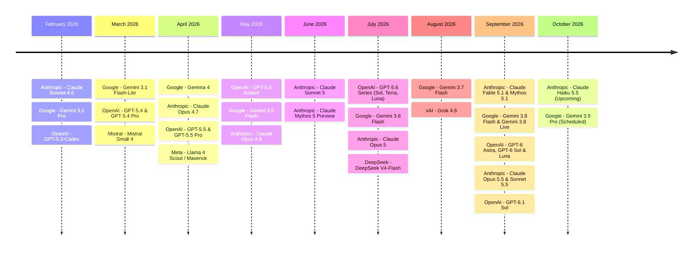
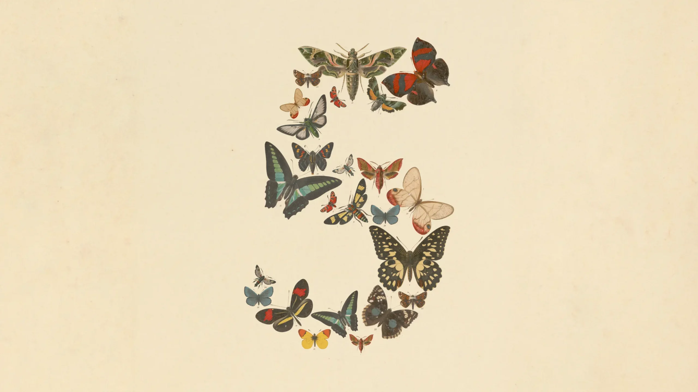
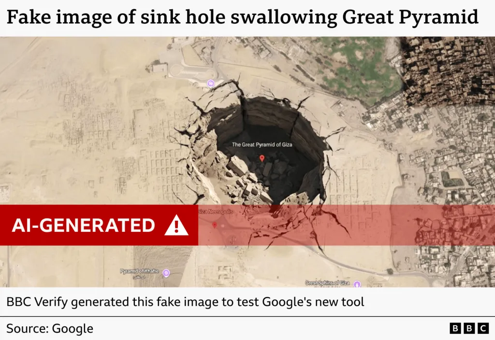
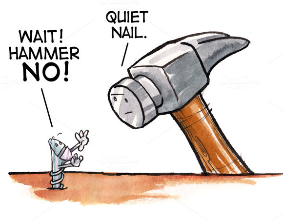
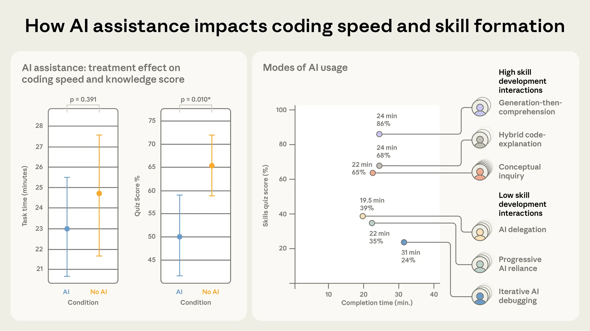
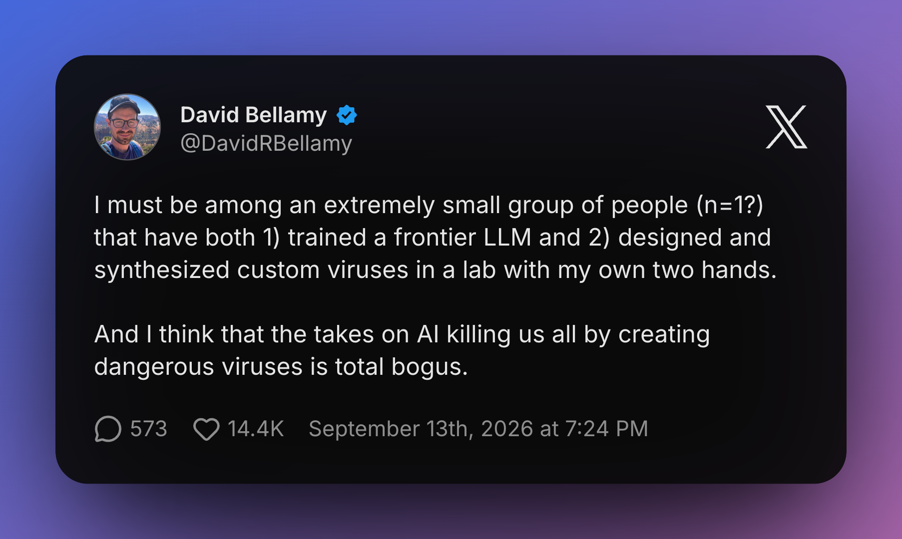
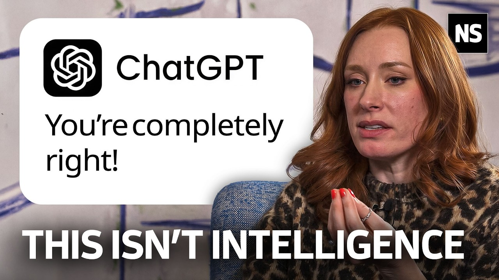

footer: ashdavies.dev
build-lists: true
code-language: Kotlin
slidenumbers: true
slide-transition: fade(0.5)
theme: Plex, 2
time-budget: 40

[.text: line-height(2)]

# We are all Fucked

## [fit] An Android Developer’s Guide to the Post-AI Apocalypse

### Droidcon Berlin - October '26 🇩🇪

^ I didn't expect this talk to be accepted

---

[.footer-style: #ffffff, Avenir Next Bold]
[.footer: 20th Television Animation]

^ Is the apocalypse near?

---

[.footer-style: #ffffff, Avenir Next Bold]
[.footer: 20th Television Animation]

^ Or maybe not?

---

^ I thought about this talk back in April

^ LLMs and machine learning have accelerated the pace of an already accelerated environment

^ Much has changed since April

---

---

^ The supposed hugging face hack

---

[.footer-style: #ffffff, Avenir Next Bold]
[.footer: Anthropic]

---

# Google Earth 🍌

---

# [fit] Hype Driven Development

## "How I learned to stop worrying and love the failures"

^ Last year I gave a talk named hype driven development

^ The idea was a celebration of playing with technology

^ After having spent countless hours playing on project

^ Putting compose in places it wasn't introduced to yet

---

# Solutions Looking for a Problem

- Augmented / Virtual Reality

- Blockchain

- LLM / NLP

- Wear OS Companion Apps

^ Specific to your sector, some solutions do actually fit

^ The idea was by diving into gratuitous development

^ Something we've all done at some point

---

# CEO Driven Development 💡

^ Many have experienced the pure terror of a CEO rushing into the room

^ I have a great new idea we have to work on right away!

^ Overly micro-managed teams

^ Rarely succeed based on personal sentiment of one user

---

# Familiarity / Risk Aversion

- Dependency discomfort

- Lack of maturity

- Learning curve

^ Novel solutions can carry risk, investing time and energy is scary

^ Its all too tempting to run on personal sentiment

^ Leading to relying on familiar tooling

---

# Decision Fatigue 😫

^ Sometimes without even realising it we make hundreds of decisions a day

^ It can be easy to become overwhelmed with making the right one

^ Leading to choosing something more familiar, you have more confidence with

---

# Law of the Instrument

> “I suppose it is tempting, if the only tool you have is a hammer, to treat everything as if it were a nail.”

> -- Abraham Maslow

^ Law of the instrument is the over-reliance of a familiar tool

^ There may be other, better, more appropriate tooling available

---

# Developmental Development

- Novel solutions require creativity

- Training through experimentation

^ Finding novel solutions allows us to keep our reflexes sharp

^ There was a point to that

---

# Knowledge Sharing

^ Just one case study of a clusterfuck of difficulties with very unusual attempted solutions

^ Provides numerous opportunities for knowledge sharing with talks or blog articles

^ Story telling is a universally useful skill

---

# Berlindroid  

-

##   

^ The very community that has been built here today stands on the shoulders of nerds

^ The hacking, code diving, experimentation, and discovery

^ Driven by the people who seek knowledge

---

[.background-color: #000000]
[.header: #4285f4]
[.footer-style: #ffffff]
[.footer: jamescullimore.dev/5-minute-bedtime-stories-for-android-devs.html]

·

·

### Story Time

# "Terraform"

---

# "Today I Fucked Up" 🤦

^ "Today I Fucked Up" is a wonderful celebration of mistake making

^ We are all fallible, and understanding that it's ok to make mistakes allows you to grow

^ Just be sure to learn from those mistakes

---

# Understanding the Journey 

^ Sometimes our best revelations don't just come to us in an instant

^ They take time to think about

^ It's a journey of discovery and fuck ups

---

# Understanding the Process

^ The reason I bring this up is because understanding is fundamental to the process

^ We reason about things in a human way, a way we view as logical

---

[.footer-style: #ffffff, Avenir Next Bold]
[.footer: anthropic.com/research/AI-assistance-coding-skills | addyosmani.com/blog/comprehension-debt]

# Comprehension Debt

^ Technical debt is actually easier to measure through mounting friction, slower builds, and tangled dependencies

^ Comprehension debt breeds false confidence, but no human genuinely understands

^ Over reliance of AI assistance inhibits follow-up comprehension skills

---

# 🤬

^ But it's much harder to understand your code, if you didn't fucking write it.

---

# AI "Reasoning"

^ LLMs have become incredibly large and complicated and have found new and terrifying ways to reason about things

^ But ultimately, they don't reason, and we can rarely follow the pattern of thoughts that end up in the solution

---

[.background-color: #000]

^ Remember when an AI paused a game of Tetris so that it would never lose?

^ Any human demonstrating this behaviour would have their sanity questioned

^ Because this is not normal behaviour

---

[.footer-style: #ffffff, Avenir Next Bold]
[.footer: Terminator Genisys]

# How fucked are we?

^ I'm often questioned by friends or family if AI will destroy us all

---

# Paperclip Maximiser 🖇️

^ We're closer to the paperclip maximiser than we are to SkyNet, an example of instrumental convergence theory

^ Given a seemingly straightforward task, the machine would exhaust all of Earths natural resources to meet its goal

---

[.footer-style: #ffffff, Avenir Next Bold]
[.footer: Getty Images]

---

[.footer-style: #ffffff, Avenir Next Bold]
[.footer: x.com/DavidRBellamy/status/2099187370407112758]

---

^ If you think I'm just an aging developer angry and technology

^ You're damn right I'm angry

^ The skills I've spent years honing are now being devalued by tech bros who by no ethical means should be running a company

---

# "Good Enough"

^ When did the ideals we shared for great, understandable code become replaced with slop that is just "good enough" to compile

---

# Idempotency / Predictability

^ Why did we start substituting predictability for hallucinations?

^ Predictability used to be a core foundation of our systems

^ Now we're lucky if it compiles

---

# Hallucination Testing 🤯

^ So many projects now have additional guard rails, separated agents, and the like

^ Just to prove that their tooling didn't lie to them

^ How did this even become a thing?

---

[.footer: futurism.com/future-society/college-critical-thinking-ai]

# "AI Native" College Graduates

^ The problem isn't just in tech, massive numbers of college graduates considered as "AI Natives" entering the workforce

^ Many have significantly declining literacy rates, social skills and critical thinking abilities

^ AI is robbing a generation of meaningful progress

---

# "AI" isn't intelligent

^ Remember that AI is just a prediction engine, giving the most probable word after word

^ AI is not your friend, doctor, colleague or anything anthropomorphised

^ LLMs are just the successors to NLPs

---

# Anthropomorphism 🚶

^ Anthropomorphism is the act of giving human traits to non human things.

^ One of the weirdest things is that this tech is being used with English (or human language) as it's primary communication

^ I like computers because I don't use English, it's predictable, unlike humans.

---

[.footer: youtube.com/watch?v=iitq4Zrphdk]

^ I recommend this video from Hannah Fry (well renowned British mathematician, professor at Cambridge) interview with New Scientist

^ She speaks about how systems can trick our brain like fast food being an abundant source of calories, AI is anthropomorphised

---

# What Can We Do?

^ AI has become so widespread, it's hard to escape it, but there are some ways to refresh your palette

---

# Agentur für Arbeit 🇩🇪📚

## Bildungsgutschein / Umschulung

- Elektrofachkraft

- Sanitärfachkraft

- Bauwerkfachkraft

- Malerfachkraft

^ The German job centre will often assist with the cost of retraining and perhaps living costs

^ Skilled trade workers are in severely short supply, jobs like electricians are less likely to be threatened by AI

---

[.footer-style: #ffffff, Avenir Next Bold]
[.footer: © Thünen-Institut/Johan Schütte]

^ Alternatively there is always livestock farming

---

[.footer-style: #ffffff, Avenir Next Bold]
[.footer: Getty Images]

^ and once a year you get to drive your tractor around the Berlin city centre

---

# Open Source / Playground Projects

^ Say you don't feel you can remain competitive on professional life

^ Try open source or playground projects without AI

---

[.background-color: #181820]

^ If you're not familiar the projects previously hosted on CashApp GitHub have a new home

^ The projects authors have decide for a no-ai policy

---

# Work / Life Balance

- Build for disposability
- Open Source contribution

^ Not everybody can, or should build in their free time

^ We all have other obligations, or hobbies

---

# Understanding the Machine

^ But if you're in the pro AI camp that's OK too

^ LLMs are undoubtedly a very complicated piece of technology that can be useful for data aggregation

^ Despite my position and all the counter arguments, you can use AI to produce results

---

# Owning Your Code

^ There's never been a more important time to have an increased level of scrutiny

^ Be responsible for your code, understand what it's down

^ Stay answerable

---

# [fit] "Claude wrote it, so it should be fine right?"

^ Don't be that person, using AI so prolifically in the workplace is dangerous

^ Reducing the amount of input humans have on the product

---

[.footer: ky.fyi/posts/ai-burnout]

# AI Burnout 🔥

^ Increasing number of people becoming exasperated with AI in the workplace

^ Non-consenting AI recordings, overuse of AI agent reviews, loss of meaningful communication

---

# Guardrails

^ I've seen it suggested that we need to pull the guard rails, be it PR reviews, required checks to allow AI to become more "productive"

^ Now is the time for even more checks and restrictions, guardrails and apprehension

---

^ You've probably started to notice the increasing frequency of GitHub outage

^ This graph is remarkably optimistic, more and more code is being pushed, and it's pushing our infrastructure to it's limits

^ This isn't a coincidence, there are an increasing number of outages, leaks, and software vulnerabilities 

---

# 🇺🇸

^ Because I can guarantee, the people making the decision on where this technology goes, do not have your best interests in mind

---

# 🫧

^ Its hard to say for certain if this is a bubble, and what will happen when it pops

^ But if the 2008 financial crisis, or the .com bubble are anything to go by

---

^ It won't be the shareholders who pay the price

^ But in the meantime...

---

# IKEA 🪑

^ What's certainly observable is that despite IKEA offering low cost furniture whose quality can be best described as "good enough"

^ There still exists a demand for hand built wood-working craftsmanship, albeit on a much smaller scale

---

# Data Sovereignty 🇪🇺

^ There's also the argument for data sovereignty, where the data must be trained upon locally

^ This excludes the use of hosted frontier models that shares data with hostile governments

---

[.footer: jonas.do/writing/2026-08-01-stop-lending-your-credibility-to-ai/]

# [fit] Stop trading away your personal credibility

^ It can be tempting to let a robot do all your work for you

^ and if you're completely disillusioned I understand it

^ If you must use AI as a research tool, do the legwork to be able to stand behind the output

---

[.footer-style: #ffffff, Avenir Next Bold]
[.footer: aleckazakova.com/posts/please-stop-authoring-with-ai/]

# Stop Authoring With Ai

^ Alec Kazakova compares technical documentation to story telling around a campfire

^ Somebody felt it, so that's why it exists

^ To read words is to understand what was felt when they were written

---

# Stay Curious, Stay Creative

^ Keep the spark of imagination, keep your own creative ability sharp

---

[.text: line-height(2), text-scale(0.5)]

# [fit] Thank You!

---

# References

- androiddev.social/@ff3@fosstodon.org/116992366377372995
- androiddev.social/@foone@digipres.club/116964826484032703
- androiddev.social/@foone@digipres.club/117038826695537081
- youtube.com/watch?v=iitq4Zrphdk
- youtube.com/watch?v=j4P8fXcKiHM
- youtube.com/watch?v=CirtZBfLVRc
- theverge.com/ai-artificial-intelligence/984923/bill-gates-is-deeply-worried-about-ai-and-hes-no-longer-staying-quiet
- androidessence.com/leave-me-behind/
- autonomousapps.com/blog/cowards-silicon-valley/post/
- blog.jim-nielsen.com/2026/intelligence-isnt-enough/
- brettcodes.com/im-done-using-ai/
- bsky.app/profile/dandouglas.bsky.social/post/3mn3wzr7r7s2x
- functional.computer/blog/llms-cant-program
- futurism.com/future-society/college-critical-thinking-ai
- jonas.do/writing/2026-06-06-your-tech-job/
- jonas.do/writing/2026-08-01-stop-lending-your-credibility-to-ai/
- ky.fyi/posts/ai-burnout
- lifehacker.com/tech/vibe-coding-apps-dont-have-to-be-a-security-nightmare
- lockwood.dev/ai/2026/07/27/how-is-the-bun-rewrite-in-rust-going.html
- ludic.mataroa.blog/blog/ai-mania-is-eviscerating-global-decision-making/
- procreate.com/ai
- sophiebits.com/2026/06/25/there-are-no-lossless-transformations-of-natural-language-text
- surfingcomplexity.blog/2026/08/22/wild-ai-related-reliability-incidents-are-coming/
- timdettmers.com/2025/12/10/why-agi-will-not-happen/
- 404media.co/luddite-events-nyc-off-tech-summer-of-ludd/?ref=daily-stories-newsletter
- bbc.com/news/articles/c235n47g8g8o
- geeksaresexy.net/2026/08/05/openais-answer-to-ai-cheating-more-ai-for-schools/
- hardresetmedia.com/p/the-ai-productivity-illusion
- smashingmagazine.com/2026/07/people-dont-want-more-ai/
- theguardian.com/technology/2026/jul/25/ai-jobs-apocalypse-human-labor
- zuzai.org/
- youtube.com/watch?v=JvTJTTUK8cg
- pluralistic.net/2026/09/03/broken-arrows/#things-get-worse
- en.wikipedia.org/wiki/Chinese_room
- 8thlight.com/insights/harness-engineering-in-practice
- lucumr.pocoo.org/2026/9/7/astra-why/
- youtube.com/watch?v=9WjPdgOK-68
- theverge.com/ai-artificial-intelligence/996923/ai-safety-slow-openai-anthropic
- theverge.com/podcast/996412/microsoft-ai-ceo-mustafa-suleyman-regulation-safety-anthropic-claude
- bsky.app/profile/brettcodes.bsky.social/post/3mvsuyyg2r22f
- youtube.com/watch?v=F91uY7QiZUs&t=2s
- androiddev.social/@martincrownover@mastodon.gamedev.place/117358923826556621
- theverge.com/ai-artificial-intelligence/1002584/trump-us-ai-safety-deal-self-regulation-tech-execs
- theverge.com/ai-artificial-intelligence/1001838/anthropic-ipo-prospectus-ai-safety-threat
- pluralistic.net/2026/09/12/god-in-the-box/
- techcrunch.com/2026/09/08/openai-fought-dirty-on-career-making-math-problem-says-nyu-mathematician/
- openai.com/index/navier-stokes-solution/
- x.com/DavidRBellamy/status/2099187370407112758
- darioamodei.com/post/we-must-pace-the-frontier
- time.com/article/2026/09/09/ai-anthropic-openai-jacob-coxon/