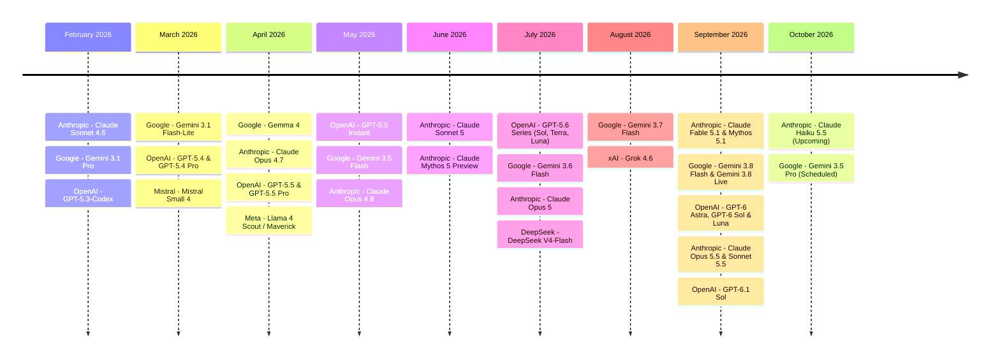
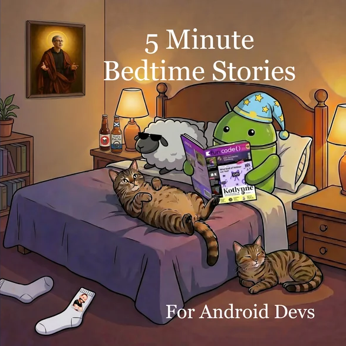
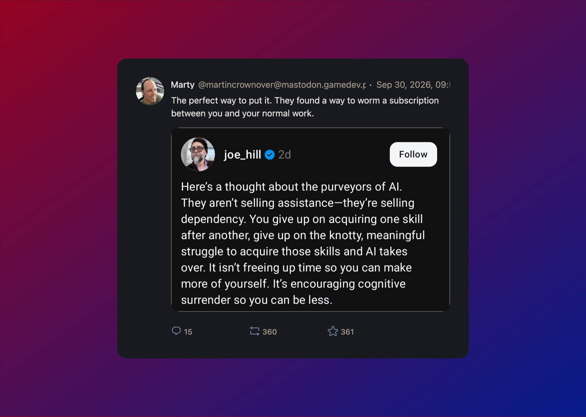
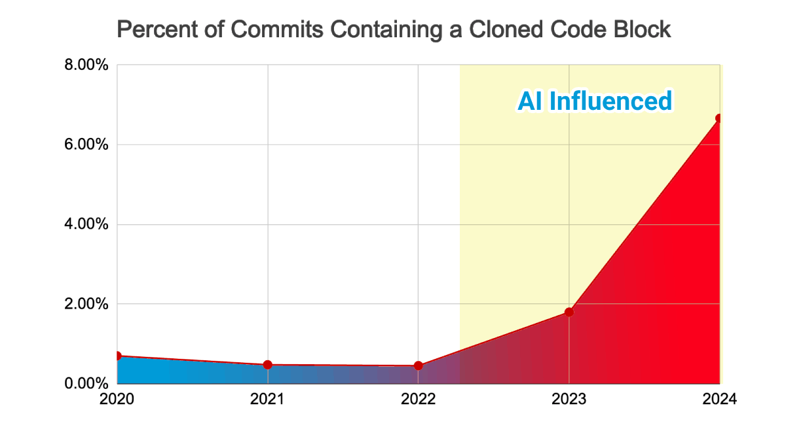
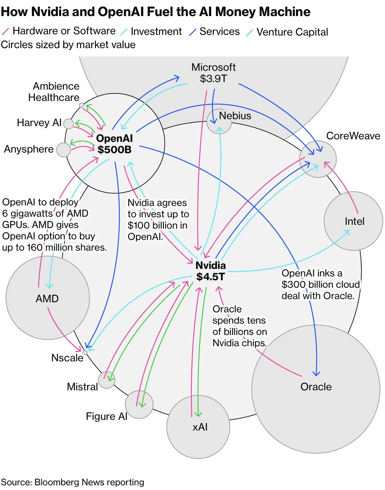
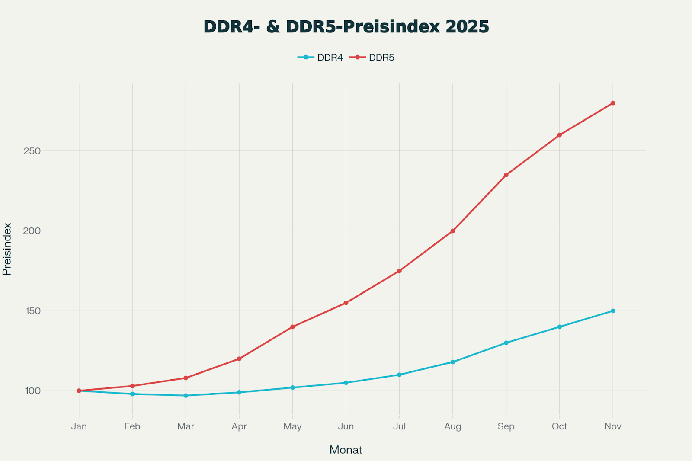
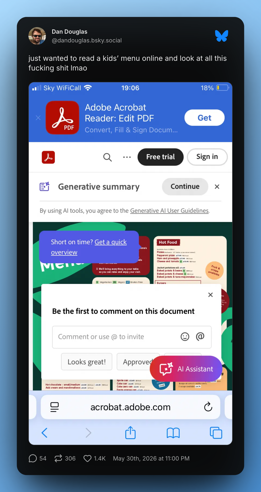
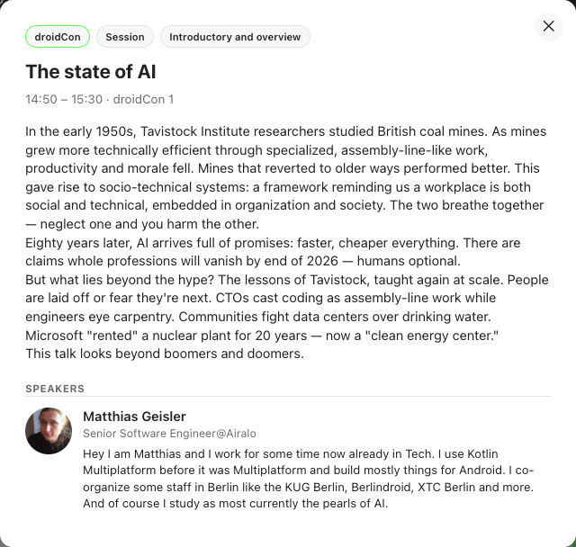

footer: ashdavies.dev
build-lists: true
code-language: Kotlin
slide-transition: fade(0.5)
theme: Plex, 2
time-budget: 40

[.text: line-height(2)]

# We are all Fucked

## [fit] An Android Developer’s Guide to the Post-AI Apocalypse

### Droidcon Berlin - October '26 🇩🇪

^ I didn't expect this talk to be accepted

^ A lot of references to articles

^ Trying to capture the community sentiment

---

[.footer-style: #ffffff, Avenir Next Bold]
[.footer: 20th Television Animation]

^ Is the apocalypse near?

---

^ I thought about this talk back in April

^ LLMs and machine learning have accelerated the pace of an already accelerated environment

^ Much has changed since April

---

---

^ The supposed hugging face hack

---

[.footer-style: #ffffff, Avenir Next Bold]
[.footer: Anthropic]

---

## Google Earth 🍌

---

[.footer-style: #ffffff, Avenir Next Bold]
[.footer: reuters.com/business/retail-consumer/anthropic-tells-investors-it-will-be-profitable-second-straight-quarter-ft-2026-09-13/]

^ Last month Anthropic told its investors it will have been profitable for the second straight quarter

^ Which works very well in their favour for their $2 trillion IPO valuation aim

---

[.footer-style: #ffffff, Avenir Next Bold]
[.footer: wheresyoured.at/anthropics-profitability-swindle/]

> WeWork claimed to be profitable ... and it turned out that it was only “profitable” if you removed things like “some of the costs of doing business.”

^ Which comes with a very big asterisk given the extremely creative accounting

---

^ We've seen this level of creative accounting before...

---

# Why are we fucked?

---

## [fit] Hype Driven Development

### "How I learned to stop worrying and love the failures"

^ Last year I gave a talk named hype driven development

^ The idea was a celebration of playing with technology

^ After having spent countless hours playing on project

^ Putting compose in places it wasn't introduced to yet

---

# Solutions Looking for a Problem

  

^ Specific to your sector, some solutions do actually fit

^ The idea was by diving into gratuitous development

^ Something we've all done at some point

---

## CEO Driven Development 💡

^ Many have experienced the pure terror of a CEO rushing into the room

^ I have a great new idea we have to work on right away!

^ Overly micro-managed teams

^ Rarely succeed based on personal sentiment of one user

---

## Familiarity / Risk Aversion

- Dependency discomfort

- Lack of maturity

- Learning curve

^ Novel solutions can carry risk, investing time and energy is scary

^ Its all too tempting to run on personal sentiment

^ Leading to relying on familiar tooling

---

## Decision Fatigue 😫

^ Sometimes without even realising it we make hundreds of decisions a day

^ It can be easy to become overwhelmed with making the right one

^ Leading to choosing something more familiar, you have more confidence with

---

## Law of the Instrument

> “I suppose it is tempting, if the only tool you have is a hammer, to treat everything as if it were a nail.”

> -- Abraham Maslow

^ Law of the instrument is the over-reliance of a familiar tool

^ There may be other, better, more appropriate tooling available

---

## Developmental Development

- Novel solutions require creativity

- Training through experimentation

^ Finding novel solutions allows us to keep our reflexes sharp

^ There was a point to that

---

## Knowledge Sharing

^ Just one case study of a clusterfuck of difficulties with very unusual attempted solutions

^ Provides numerous opportunities for knowledge sharing with talks or blog articles

^ Story telling is a universally useful skill

---

##  

### 🇩🇪 Berlindroid @ c-base

#### 🇬🇧 Londroid

#### DevFest

#### GDG

^ The very community that has been built here today stands on the shoulders of nerds

^ The hacking, code diving, experimentation, and discovery

^ Driven by the people who seek knowledge

---

[.background-color: #000000]
[.header: #4285f4]
[.footer-style: #ffffff]
[.footer: jamescullimore.dev/5-minute-bedtime-stories-for-android-devs.html]

### Story Time

## "Terraform"

---

## "Today I Fucked Up" 🤦

^ "Today I Fucked Up" is a wonderful celebration of mistake making

^ We are all fallible, and understanding that it's ok to make mistakes allows you to grow

^ Just be sure to learn from those mistakes

---

## Understanding the Journey 

^ Sometimes our best revelations don't just come to us in an instant

^ They take time to think about

^ It's a journey of discovery and fuck ups

---

## Understanding the Process

^ The reason I bring this up is because understanding is fundamental to the process

^ We reason about things in a human way, a way we view as logical

---

## 🤬

^ But it's much harder to understand your code, if you didn't fucking write it.

---

[.footer-style: #ffffff, Avenir Next Bold]
[.footer: anthropic.com/research/AI-assistance-coding-skills | addyosmani.com/blog/comprehension-debt]

## Comprehension Debt

^ Technical debt is actually easier to measure through mounting friction, slower builds, and tangled dependencies

^ Comprehension debt breeds false confidence, but no human genuinely understands

^ Over reliance of AI assistance inhibits follow-up comprehension skills

---

---

## AI "Reasoning"

^ LLMs have become incredibly large and complicated and have found new and terrifying ways to reason about things

^ But ultimately, they don't reason, and we can rarely follow the pattern of thoughts that end up in the solution

---

[.background-color: #000]

^ Remember when an AI paused a game of Tetris so that it would never lose?

^ Any human demonstrating this behaviour would have their sanity questioned

^ Because this is not normal behaviour

---

[.footer-style: #ffffff, Avenir Next Bold]
[.footer: Terminator Genisys]

# How fucked are we?

^ I'm often questioned by friends or family if AI will destroy us all

---

## Paperclip Maximiser 🖇️

^ We're closer to the paperclip maximiser than we are to SkyNet, an example of instrumental convergence theory

^ Given a seemingly straightforward task, the machine would exhaust all of Earths natural resources to meet its goal

---

[.footer-style: #ffffff, Avenir Next Bold]
[.footer: Getty Images]

---

[.footer-style: #ffffff, Avenir Next Bold]
[.footer: x.com/DavidRBellamy/status/2099187370407112758]

---

^ If you think I'm just an aging developer angry and technology

^ You're damn right I'm angry

^ The skills I've spent years honing are now being devalued by tech bros who by no ethical means should be running a company

---

[.footer-style: #ffffff, Avenir Next Bold]
[.footer: gitclear.com/ai_assistant_code_quality_2025_research]

^ A 2025 GitClear analysis of 211 mio LoC assessed quantifiable code metrics

^ Huge increase in code churn, copy-pasted code, and a reduction of refactoring (changed code)

---

## "Good Enough"

### 🤷‍♂️

^ This means that the acceptable level of code quality for production code is decreasing

^ The ideals we used to stand for, understandable code, is being replaced with slop that is just "good enough" to compile

---

## Idempotency

### Predictability

^ Why did we start substituting predictability for hallucinations?

^ Predictability used to be a core foundation of our systems

^ Now we're lucky if it compiles

---

## Hallucination Testing 🤯

^ So many projects now have additional guard rails, separated agents, and the like

^ Just to prove that their tooling didn't lie to them

^ How did this even become a thing?

---

[.footer-style: #ffffff, Avenir Next Bold]
[.footer: getdx.com/blog/ai-productivity-gains-more-modest-than-expected/]

> AI productivity gains: More modest than expected

^ AI intelligence agencies themselves report that AI productivity is exaggerated

---

[.footer-style: #ffffff, Avenir Next Bold]
[.footer: veracode.com/blog/genai-code-security-report/]

> 45% of code samples failed security tests and introduced OWASP Top 10 security vulnerabilities into the code

^ Not only does AI generated code barely good enough to compile, but often introduces security vulnerabilities

^ With Java having the biggest difference between "it compiles" and "its secure" of the measured languages

---

## We have been sold a lie

### again...

^ The very same systems promised to make our lives easier

^ Result in harder to predict, difficult to maintain systems

---

[.background-color: #ffffff]

[.footer-style: #000, Avenir Next Bold]
[.footer: bloomberg.com/news/features/2025-10-07/openai-s-nvidia-amd-deals-boost-1-trillion-ai-boom-with-circular-deals]

^ With many deals happening between major AI players 

^ Much of the money is moving from one hand to the other

---

[.background-color: #ffffff]

[.footer-style: #000, Avenir Next Bold]
[.footer: www.wsj.com/tech/ai/is-the-flurry-of-circular-ai-deals-a-win-winor-sign-of-a-bubble-8a2d70c5]

^ This results in many of the funds and resources being limited to a few key areas

^ Greatly increasing exposure risk and potential fall-out in case of a bubble burst

---

[.footer-style: #000, Avenir Next Bold]
[.footer: ipc2u.com/articles/knowledge-base/ram-prices-2026/]

[.background-color: #f3f3ee]

^ We've seen insane increases in ram costs

---

[.footer-style: #ffffff, Avenir Next Bold]
[.footer: android-developers.googleblog.com/2026/08/app-broader-memory-limits.html]

##  

> Across the ecosystem, new devices are maintaining or even decreasing their physical memory capacity in response to memory price increases

^ Which has led to Google applying restrictions to Android apps on their RAM usage

^ Though I can't help but feel they may have had a part in causing it

---

[.footer-style: #fff, Avenir Next Bold]
[.footer: futurism.com/future-society/college-critical-thinking-ai]

> Bosses Horrified as “AI Native” College Graduates Hit the Workplace

^ The problem isn't just in tech, massive numbers of college graduates considered as "AI Natives" entering the workforce

^ Many have significantly declining literacy rates, social skills and critical thinking abilities

^ AI is robbing a generation of meaningful progress

---

## "AI" isn't intelligent

^ Remember that AI is just a prediction engine, giving the most probable word after word

^ AI is not your friend, doctor, colleague or anything anthropomorphised

^ LLMs are just the successors to NLPs

---

## Anthropomorphism 🚶

^ Anthropomorphism is the act of giving human traits to non human things.

^ One of the weirdest things is that this tech is being used with English (or human language) as it's primary communication

^ I like computers because I don't use English, it's predictable, unlike humans.

---

[.footer: youtube.com/watch?v=iitq4Zrphdk]

^ I recommend this video from Hannah Fry (well renowned British mathematician, professor at Cambridge) interview with New Scientist

^ She speaks about how systems can trick our brain like fast food being an abundant source of calories, AI is anthropomorphised

---

[.footer-style: #ffffff, Avenir Next Bold]
[.footer: pluralistic.net/2023/01/21/potemkin-ai/#hey-guysti]

## Enshittification

### aka Platform Decay

^ Services entice users with a value offering being good to consumers

^ They then degrade that service in favour of "premium" or enterprise paid customers

^ Then they degrade that in favour of their shareholders

^ Then they die

---

^ Adobe acrobat mobile website

^ Very little screen real estate offered for actual content

---

^ If you were able to catch Matthias' talk yesterday

^ Great example of corporate abuse

---

## "Claude wrote it, so it should be fine right?"

- No

^ Don't be that person, using AI so prolifically in the workplace is dangerous

^ Reducing the amount of input humans have on the product

---

## "I'm out of tokens!"

^ If you cant work without AI then you shouldn't be using AI

---

## AI Burnout 🔥

^ Increasing number of people becoming exasperated with AI in the workplace

^ Non-consenting AI recordings, overuse of AI agent reviews, loss of meaningful communication

---

[.footer-style: #ffffff, Avenir Next Bold]
[.footer: ky.fyi/posts/ai-burnout]

> Do I belong in tech anymore?

> -- Ky Decker

^ Tech workers are quitting their roles, despite numerous benefits, good salaries, healthcare

^ Citing reasons of unsolicited use of AI in meetings, PR reviews

^ Loss of ideals, or where the work no longer aligns with their principles

---

[.footer-style: #ffffff, Avenir Next Bold]
[.footer: androidessence.com/leave-me-behind/]

> Leave Me Behind

> -- Adam McNeilly

^ People not wanting to be part of this dramatic shift

^ Longing for the days of genuine human interaction

^ Adam wrote a moving piece on this which deeply resonates

---

## Guardrails

^ I've seen it suggested that we need to pull the guard rails, be it PR reviews, required checks to allow AI to become more "productive"

^ Now is the time for even more checks and restrictions, guardrails and apprehension

---

^ You've probably started to notice the increasing frequency of GitHub outage

^ This graph is remarkably optimistic, more and more code is being pushed, and it's pushing our infrastructure to it's limits

^ This isn't a coincidence, there are an increasing number of outages, leaks, and software vulnerabilities 

---

## 🇺🇸

^ Because I can guarantee, the people making the decision on where this technology goes, do not have your best interests in mind

---

[.footer-style: #ffffff, Avenir Next Bold]
[.footer: Photo by Braedon McLeod on Unsplash]

^ Its hard to say for certain if this is a bubble, and what will happen when it pops

^ But if the 2008 financial crisis, or the .com bubble are anything to go by

---

[.footer-style: #ffffff, Avenir Next Bold]
[.footer: 20th Television Animation]

^ It won't be the shareholders who pay the price

^ But in the meantime...

---

# What Can We Do?

^ AI has become so widespread, it's hard to escape it, but there are some ways to refresh your palette

---

## Agentur für Arbeit 🇩🇪📚

### Bildungsgutschein / Umschulung

- Elektrofachkraft

- Sanitärfachkraft

- Bauwerkfachkraft

- Malerfachkraft

^ The German job centre will often assist with the cost of retraining and perhaps living costs

^ Skilled trade workers are in severely short supply, jobs like electricians are less likely to be threatened by AI

---

[.footer-style: #ffffff, Avenir Next Bold]
[.footer: © Thünen-Institut/Johan Schütte]

^ Alternatively there is always livestock farming

---

[.footer-style: #ffffff, Avenir Next Bold]
[.footer: Getty Images]

^ and once a year you get to drive your tractor around the Berlin city centre

---

## OSS to the rescue!

^ Say you don't feel you can remain competitive on professional life

^ Most OSS projects are maintained out of love for coding

^ Maintained by people often in their free time

^ 

---

[.background-color: #181820]

^ If you're not familiar the projects previously hosted on CashApp GitHub have a new home

^ The projects authors have decide for a no-ai policy

---

## Work / Life Balance

^ Not everybody can, or should build in their free time

^ We all have other obligations, or hobbies

---

## Build for disposability 🗑️

^ Highly coupled AI influenced code will increase your dependence

^ Good code is code that is most easily deleted

---

## Understanding the Machine

^ But if you're in the pro AI camp that's OK too

^ LLMs are undoubtedly a very complicated piece of technology that can be useful for data aggregation

^ Despite my position and all the counter arguments, you can use AI to produce results

---

## Owning Your Code

^ There's never been a more important time to have an increased level of scrutiny

^ Be responsible for your code, understand what it's down

^ Stay answerable

---

[.footer: Photo by benjamin lehman on Unsplash]

## IKEA 🪑

^ What's certainly observable is that despite IKEA offering low cost furniture whose quality can be best described as "good enough"

^ There still exists a demand for hand built wood-working craftsmanship, albeit on a much smaller scale

---

## Vendor Lock-In 🔒

^ One hopeful aspect we can keep our minds on is that we've yet to experience vendor lock-in

^ Much like the early phases of enshittification, we can expect this to happen

---

[.footer-style: #ffffff, Avenir Next Bold]
[.footer: Photo by Ash Davies]

^ There's also the argument for data sovereignty, where the data must be trained upon locally

^ This excludes the use of hosted frontier models that shares data with hostile governments

---

[.footer: digital-strategy.ec.europa.eu/en/policies/cloud-and-ai-development-act]

## Cloud and AI Development Act

### EU AI Act (Regulation (EU) 2024/1689)

#### General Data Protection Regulation

^ Acts introduced by the European Commission put safeguards in place for sensitive data

^ Quality controls, bias monitoring, data transparency, fines up to €35 million or 6% of global annual turnover.

---

[.footer-style: #ffffff, Avenir Next Bold]
[.footer: aleckazakova.com/posts/please-stop-authoring-with-ai/]

> Please Stop Authoring With Ai

> -- Alec Kazakova

^ Technical documentation is like story telling around a campfire, somebody felt it, so that's why it exists

^ To read words is to understand what was felt when they were written

^ If you must use AI as a research tool, do the legwork to be able to stand behind the output

---

## Stay Curious, Stay Creative

^ Keep the spark of imagination, keep your own creative ability sharp

^ Because...

---

[.footer-style: #ffffff, Avenir Next Bold]
[.footer: 20th Television Animation]

^ I might be wrong, much is speculative, local models may prove useful

^ The damage may not come to pass, we may be at the start of an economic boom

^ I'd like to be wrong, I still have a mortgage and three ungrateful cats to support

---

[.footer-style: #ffffff, Avenir Next Bold]
[.footer: jonas.do/writing/2026-06-06-your-tech-job/]

> It's hard to be good at your tech job right now

> -- Jonas Downey

^ Another article closed with something a bit more optimistic

^ Like the Metaverse, or NFTs, tech movements are not inevitable because some hype bros said so

^ The only way out is through, we pushed for health and safety in social platforms, we figured out the mobile revolution

^ We made progress by speaking up and doing the work

---

[.footer: ]

# [fit] Thank You!

## ashdavies.dev

^ --- Should Include as New ---
^ theverge.com/ai-artificial-intelligence/1002584/trump-us-ai-safety-deal-self-regulation-tech-execs
^ darioamodei.com/post/we-must-pace-the-frontier
^ asia.nikkei.com/business/technology/five-us-tech-giants-hidden-debts-soar-to-1.65tn-on-opaque-ai-funding
^ lifehacker.com/tech/vibe-coding-apps-dont-have-to-be-a-security-nightmare
^ lockwood.dev/ai/2026/07/27/how-is-the-bun-rewrite-in-rust-going.html
^ euronews.com/business/2026/06/29/the-ai-boom-propping-up-markets-could-trigger-the-next-crash-central-banks-warn

^ --- Might Include ---
^ hiringlab.indeed.com/2026/07/23/the-labor-market-is-tilting-toward-seniority/
^ sophiebits.com/2026/06/25/there-are-no-lossless-transformations-of-natural-language-text
^ pluralistic.net/2026/09/12/god-in-the-box/
^ en.wikipedia.org/wiki/Chinese_room

^ --- Related to Existing Points ---
^ codebridge.tech/articles/the-hidden-costs-of-ai-generated-software-why-it-works-isnt-enough
^ timdettmers.com/2025/12/10/why-agi-will-not-happen/
^ surfingcomplexity.blog/2026/08/22/wild-ai-related-reliability-incidents-are-coming/
^ smashingmagazine.com/2026/07/people-dont-want-more-ai/

^ --- Social ---
^ bsky.app/profile/dryad.technology/post/3mx3fssnies2m
^ androiddev.social/@felipeB@hachyderm.io/117384183999453266

^ autonomousapps.com/blog/cowards-silicon-valley/post/
^ blog.jim-nielsen.com/2026/intelligence-isnt-enough/
^ brettcodes.com/im-done-using-ai/
^ functional.computer/blog/llms-cant-program
^ ludic.mataroa.blog/blog/ai-mania-is-eviscerating-global-decision-making/
^ 404media.co/luddite-events-nyc-off-tech-summer-of-ludd/?ref=daily-stories-newsletter
^ bbc.com/news/articles/c235n47g8g8o
^ geeksaresexy.net/2026/08/05/openais-answer-to-ai-cheating-more-ai-for-schools/
^ hardresetmedia.com/p/the-ai-productivity-illusion
^ theguardian.com/technology/2026/jul/25/ai-jobs-apocalypse-human-labor
^ pluralistic.net/2026/09/03/broken-arrows/#things-get-worse
^ 8thlight.com/insights/harness-engineering-in-practice
^ lucumr.pocoo.org/2026/9/7/astra-why/
^ techcrunch.com/2026/09/08/openai-fought-dirty-on-career-making-math-problem-says-nyu-mathematician/
^ openai.com/index/navier-stokes-solution/
^ time.com/article/2026/09/09/ai-anthropic-openai-jacob-coxon/
^ theverge.com/ai-artificial-intelligence/984923/bill-gates-is-deeply-worried-about-ai-and-hes-no-longer-staying-quiet
^ theverge.com/ai-artificial-intelligence/996923/ai-safety-slow-openai-anthropic
^ theverge.com/podcast/996412/microsoft-ai-ceo-mustafa-suleyman-regulation-safety-anthropic-claude
^ theverge.com/ai-artificial-intelligence/1001838/anthropic-ipo-prospectus-ai-safety-threat
^ youtube.com/watch?v=j4P8fXcKiHM
^ youtube.com/watch?v=JvTJTTUK8cg
^ youtube.com/watch?v=9WjPdgOK-68
^ techradar.com/pro/nearly-half-of-all-code-generated-by-ai-found-to-contain-security-flaws-even-big-llms-affected
^ blog.theinterviewguys.com/how-29-fewer-starting-positions-are-forcing-gen-z-into-career-workarounds/
^ blog.theinterviewguys.com/tech-jobs-have-plummeted-50/
^ bivashvlog.com/hidden-ai-debt-1-65-trillion-big-tech-off-balance/
^ claritx.ai/blog/sp-500-concentration-magnificent-7-risk-2026
^ apnews.com/article/amazon-jassy-ai-alexa-workforce-7eea6387e97b84f1f239af2538de5ee9
^ finance.yahoo.com/markets/article/ai-disruption-is-the-hot-topic-of-earnings-calls-130609913.html
^ serrarigroup.com/goldman-sachs-ais-hidden-trillion-dollar-spending-wave/
^ softwareseni.com/why-95-percent-of-enterprise-ai-projects-fail-mit-research-breakdown-and-implementation-reality-check/
^ deadsimpletech.com/blog/no-such-thing-as-just-a-tool
^ theverge.com/ai-artificial-intelligence/1004655/openai-chatgpt-visual-ads
^ tomshardware.com/tech-industry/artificial-intelligence/google-suspends-part-of-the-oss-vrp-bug-bounty-program-due-to-an-influx-of-invalid-ai-submissions-product-vulnerability-submissions-ended-october-1
^ theverge.com/ai-artificial-intelligence/1004655/openai-chatgpt-visual-ads
^ bbc.com/news/articles/cm4gjy9lr551o

^ forbes.com/sites/jonathanponciano/2023/01/23/spotify-alphabet-and-meta-lead-tech-stock-surge-after-massive-layoff-announcements/?streamIndex=0
^ rezi.ai/posts/ai-mentions-and-layoffs-correlation
^ techbuzz.ai/articles/tech-giants-cite-ai-as-layoff-driver-in-2026-wave
^ fxleaders.com/news/2026/06/10/salesforce-erases-30-billion-in-value-as-ai-fears-and-layoffs-pressure-shares-despite-1-billion-agentforce-run-rate/
^ levelfields.ai/news/tech-sector-mass-layoffs-in-may-2026
^ thenextweb.com/news/meta-layoffs-may-2026-ai-restructuring-thousands
^ thenextweb.com/news/oracle-21000-layoffs-ai-data-centres
^ businessinsider.com/challenger-ai-layoffs-economy-jobs-2026-6