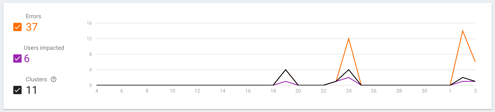
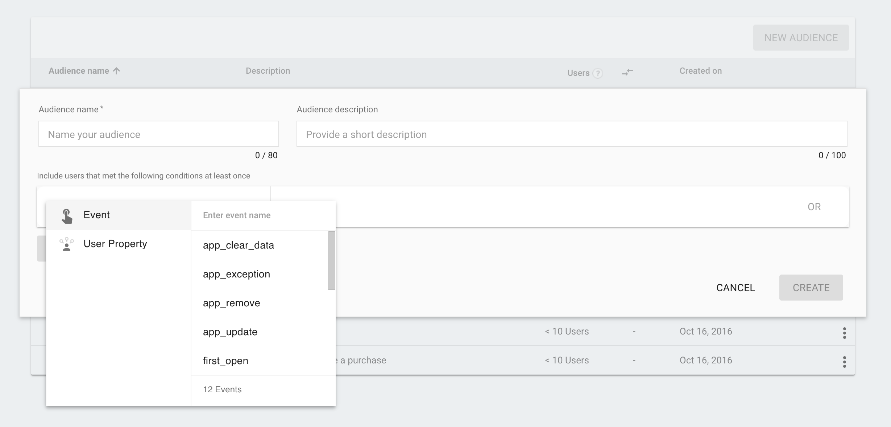
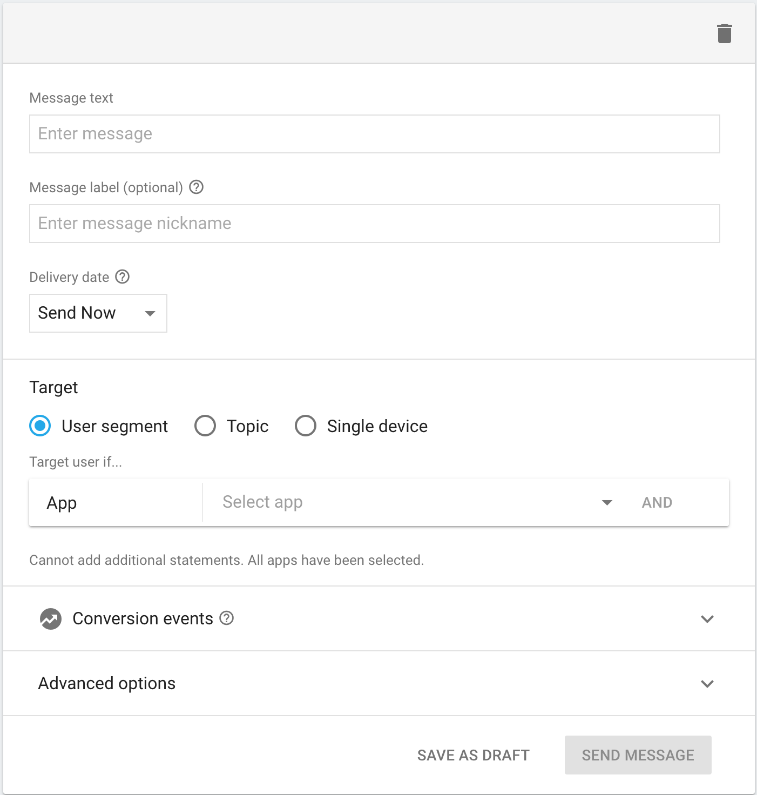

# What's New in Firebase!
### Ash Davies


---

## What's Firebase?

^
- What is Firebase?
- This is how Google describes Firebase

---


## Developing is Hard

^
- Developing modern apps is difficult

---


^
- Need infrastructure that can scale
- Users expect high level compliancy

---


^
- Collaboration and synchronisation across platforms
- Web, iOS, Android form factors
- Increasing number of platforms

---


^
- Social media integration
- Just to be considered

---


^
- Firebase allows you to move quickly
- Without having to worry about the simple infrastructure
- Series of tools to develop your apps
- Bring users to your app
- Grow your user base
- Earn money

---


^
- Set of 15 features
- Built around analytics
- Seamlessly communicate

---


## [fit] Authentication
- Authentication & account management
- Email & password authentication
- Google, Facebook, Twitter, GitHub
- Custom OAuth2 redirect domains

^
- Firebase has long been able to assist your application with additional login methods
- Skip the difficulties of setting up 3rd party login options
- Now runs on the same technology Google users for its own authentication server
- Provided an open source authentication UI that you can use to power your projects with

---


## [fit] Realtime Database

^
- When Firebase first started out, it was mostly just a realtime database
- Despite Firebase now describing a collective toolset of the suite of services provided now
- the real power of using Firebase when first starting out is still that
- The Firebase Realtime Database is a cloud hosted NoSQL utilising the strength of Google's infrastructure to power your application
- Firebase Realtime Database allows developers to implement fully functioning application interfaces across multiple platforms
- Without having to worry about things like realtime synchronisation and conflict resolution

---


## [fit] Data Synchronisation
- Graceful Connectivity Loss

^
- When your app loses connectivity, you would normally have to compose extensive amounts of logic to handle this failure gracefully

---


## [fit] Data Synchronisation
- Graceful Connectivity Loss
- Application Data Cache

^
- Considerable thought must be put into how data is cached and evaluated
- This is all handled for you and you can treat your application as though connectivity wasn't an issue
- Firebase will remain responsive regardless of network latency or internet connectivity
- Firebase will synchronise on its own after data connectivity returns
- Users authentication tokens will be persisted across restarts allowing a seamless user experience
- If the token expires, database writes will be resumed until the user has been re-authenticated

---


## [fit] Data Synchronisation
- Graceful Connectivity Loss
- Application Data Cache
- Client Synchronisation

^
- Synchronisation remains central to core principles of the Firebase Realtime Database
- Data is not just synchronised on the one device but across every connected client
- This is massively beneficial when developing cross platform applications
- All of your clients are sharing the same realtime database and will automatically received updates with the newest data

---


## [fit] Data Synchronisation
- Graceful Connectivity Loss
- Application Data Cache
- Client Synchronisation
- Conflict Resolution

^
- Whilst Firebase doesn't yet support the ability to resolve complex conflicts
- Most conflicts will be automatically merged without any intervention required

---

## 10MB Cache

^
- Firebase will reserve up to 10MB by default to cache query results
- Will purge this data once it reaches the configured size.
- Data that is kept in sync however will not be cached.

---

## Can I still change the configured cache size?

^
- You might ask, can I still increase the configured cache size to greater than 10MB?

---

## [fit] No!

^
- Legacy version offered `setPersistenceCacheSizeBytes` to override the configuration cache
- no longer available and it would generally be unwise to do so since this can cause application out of memory errors

---

## [fit] Cloud Hosted
## [fit] NoSql Database

^
- Your data is stored in a cloud hosted NoSql database powered by Google
- NoSql data structures can provide huge increases to speed and performance
- Require a different way of thinking when it comes to relational data structures.

---

```json
{
  "users": {
    "alovelace": {
      "name": "Ada Lovelace",
      "contacts": {
        "ghopper": true
      },
    },
    "ghopper": { ... },
    "eclarke": { ... }
  }
}
```

^
- One of the most important things to remember about Firebase is how to structure your data
- The Firebase Realtime Database does not offer a feasible environment for relational data
- Data must be de-normalized
- Data is structured as a Json tree of key, value parameters
- Use uuid as keys rather than using arrays since these are easier to use when calling `setValue` on your data

---

## What's New?

^
- So what's new with Firebase? and how can you include it in your application?
- One of the key difference to Firebase then and Firebase now is the set up process
- It is now fully integrated into Google Services
- Meaning it can effortlessly interleave with the other aspects of your set up

---

## Set Up

```java
// Legacy SDK
compile "com.firebase:firebase-client-android:2.5.2"

// Distributed SDK
compile "com.google.firebase:firebase-core:9.8.0"
compile "com.google.firebase:firebase-auth:9.8.0"
compile "com.google.firebase:firebase-config:9.8.0"
compile "com.google.firebase:firebase-crash:9.8.0"
compile "com.google.firebase:firebase-database:9.8.0"
```

^
- All the functionality was provided with a single SDK
- Google have broken these down into individual modular components
- The original Firebase SDK only provides auth and database
- tightly coupled to each other, now you specify each of the components you want to include
- Configuration provided by google-play-services.json

---

## The Tasks API[^1]

```java
Task<AuthResult> task = FirebaseAuth.getInstance().signInAnonymously();

task.addOnSuccessListener(new OnSuccessListener<AuthResult>() {
  @Override public void onSuccess(AuthResult result) { /* ... */ }
});

task.addOnFailureListener(new OnFailureListener() {
  @Override public void onFailure(@NonNull Exception exception) { /* ... */ }
});
```

[^1]: https://developers.google.com/android/guides/tasks

^
- Since Firebase is now tied in with Google Play Services, many of its API operations use the Tasks API
- The Tasks API provides a meaningful semantic interface for asynchronous operations
- Which by themselves are more than enough to allow your application to follow a logical data flow

---


## [fit] Analytics
- Free & Unlimited

^
- Free and unlimited
- No limit on the volume of events
- 500 distinct events
- 25 event parameters

---


## [fit] Analytics
- Free and Unlimited
- Automatic Reporting

^
- Firebase Analytics comes baked after you have integrated it into your application
- Over a dozen of key analytic events logged automatically
- Device properties automatically logged
- In addition to all of this Google overlays their demographic data to give you more context on your data,
- showing countries, age ranges and user interests without you having to do any additional integration.

---


## [fit] Analytics
- Free and Unlimited
- Automatic Reporting
- Seamlessly Integrated

^
- Runs at the core of Firebase integrating with all other services
- Augments other features through seamless integration

---


## [fit] Analytics
- Free and Unlimited
- Automatic Reporting
- Seamlessly Integrated
- Cross Platform

^
- Runs on all platforms

---

## Where's my Data?

^
- Firebase Analytics updates every 4 - 5 hours
- Developers complain that they need instant data
- Analytic events can be marked as conversion events


---


^
- Conversion events are reported in real time
- realtime export of conversion events to BigQuery
- events available in seconds

---

##  Google Data Studio
### Firebase Templates

^
- Firebase real time events can be viewed in Google Data Studio
- Firebase dev summit Google announced Firebase templates

---


^
- This allows you to drill down on your data to produce useful visuals

---


^
- You can easily change the dimension used for your reported
- Create reports good enough for any product manager

---

## Firebase Analytics
### Debug View

---

## Firebase Analytics
### Stream View

---


^
- Remote config is probably one of the most exciting features from this years Firebase announcements
- Firebase remote config allows you to update your application remotely without deploying a new version

---

## [fit] Remote Config
- Audience Customisation

^
- What brings power to Firebase remote config is being able to target your audience groups
- Services integrate seamlessly with each other you can create an audience based upon analytic metrics
- and then deliver features only to them.
- This can be useful for promotions by demographic.

---

## [fit] Remote Config
- Audience Customisation
- Staged Roll Out

^
- Remote config can be used to deliver a staged roll out to your users after deploying to the Play store,
- You can even tweak your configuration to roll out to different countries based on your market strategy.

---

## [fit] Remote Config
- Audience Customisation
- Staged Roll Out
- Feature Flags

^
- If you use feature flags for internal or public feature toggling then this can also be manipulated to the same strengths.

---

## [fit] Remote Config
- Audience Customisation
- Staged Roll Out
- Feature Flags
- A/B Testing

^
- Finally this could also be used for AB testing to deliver different variants.

---

## Crash Reporting



^
- Firebase Analytics is integrated into your application as soon as you add the Gradle plugin,
- Much like other crash reporting frameworks you might be used to Firebase will track fatal crashes by default,
- Showing you instance statistics, cluster summaries and stack traces allowing you to easily identify and resolve the problem.

---

# Audiences


^
- One of the core concepts of the Firebase console is being able to define your audiences based upon your analytics events.
- This not only allows you to provide reporting and dashboard filtering based upon these audiences,
- But allows you to target this audience directly with seemless integration across other Firebase features,
- such as delivering custom notifications and promotions to particular audiences.
- In addition you can set additional user properties to examine the habits of your users.

---

## [fit] Hosting
- Serve Static Assets
- SSL by default
- Custom domains

^
- Firebase Hosting allows you to host static assets such as Jekyll and Angular built front end sites for free,
- Zero configuration SSL is built into Firebase hosting so you don't have to set anything up to be completely secure,
- With the new Firebase you can transfer custom domains for free.

---

## [fit] Storage
- Robust Operations
- Strong Security
- High Scalability

^
- Firebase storage benefits from the same infrastructure that makes the realtime database so powerful,
- With Firebase storage you can store your assets and resources backed by Google Cloud Storage,
- caching and resuming your downloads, protected by Firebase authentication and with high scalability.

---

## [fit] Cloud Messaging


^
- Google Cloud Messaging is the most popular method for delivering notifications but it often leaves a lot to be desired for its UI,
- Now Google Cloud Messaging is now available through Firebase Cloud Messaging across all platforms so it works for iOS, Chrome, Android, and web push.
- Additionally Firebase Notification allows you to use the UI to compose a notification to your users via Google Cloud Messaging,
- As mentioned previously you can couple this with the Audience feature available in Firebase to directly target your users.

---

## [fit] But wait, there's more!
- App Invites
- App Indexing
- Dynamic Links
- Test Lab
- AdWords

^
- Firebase also offers a ton of other features that I simply don't have enough time to go into,
- all seamlessly integrated with the core components allowing you to empower your mobile app.

---

## [fit] 🌿 Android Peppermint
### [fit] Realtime Chat
### [fit] [github.com/ashdavies/peppermint](https://github.com/ashdavies/peppermint)


---

## QR, SRSLY?!

^
QR codes are so 2012 right?

---

## [fit] 🌿 Android Peppermint
###  Google Nearby API
### ...
### [fit] [github.com/ashdavies/peppermint](https://github.com/ashdavies/peppermint)

^
- The sample application demonstrates usage of the Google Nearby API for Android.
- So that messages you send will be broadcast to everybody in the area,
- and the message history you are seeing is *your* personal history,
- stored using Firebase Realtime Database.

---

## [fit] Twitterers

- Doug Stevenson - [CodingDoug](https://twitter.com/CodingDoug)
- Laurence Moroney - [lmoroney](https://twitter.com/lmoroney)

---

## [fit] Twitterers

- Doug Stevenson - [CodingDoug](https://twitter.com/CodingDoug)
- Laurence Moroney - [lmoroney](https://twitter.com/lmoroney)

**Shameless...**

- Ash Davies - [DogmaticCoder](https://twitter.com/DogmaticCoder)

---

## [fit] Resources

### GitHub - [github.com/firebase](https://github.com/firebase)
### YouTube - [youtube.com/firebase](http://www.youtube.com/firebase)
### Slack - [firebase-community.appspot.com](https://firebase-community.appspot.com/)
### Slides - [github.com/ashdavies/talks](https://github.com/ashdavies/talks)

---

Thank You.
