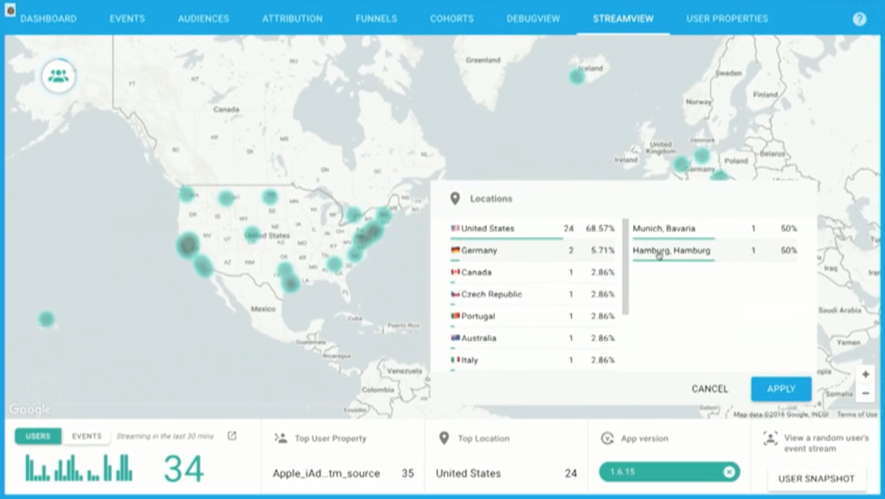
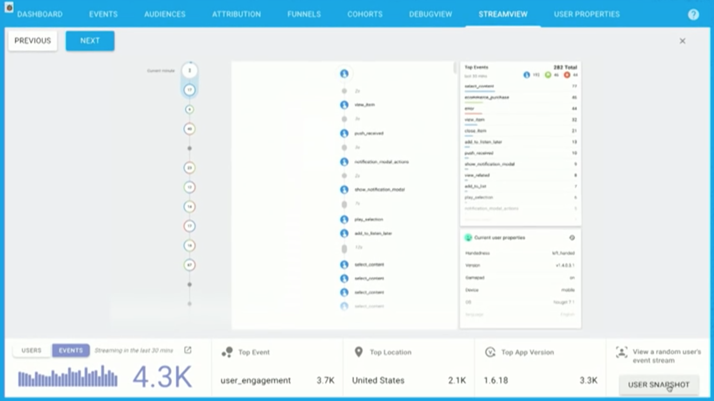
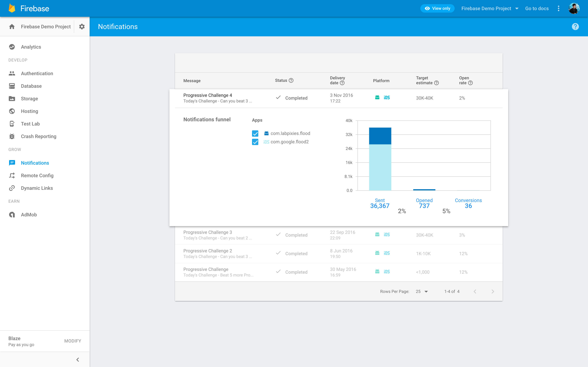

# What's New in Firebase!
### Ash Davies


---

## What's Firebase?

^
- What is Firebase?
- This is how Google describes Firebase

---


## Developing is Hard

^
- Developing modern apps is difficult

---


^
- Need infrastructure that can scale
- Users expect high level compliancy

---


^
- Cross platform collaboration
- Web, iOS, Android form factors
- Increasing number of platforms

---


^
- Social media integration
- Just to be considered

---


^
- Firebase allows you to move quickly
- Without the worry of building infrastructure
- Series of tools to develop your apps
- Bring users to your app
- Grow your user base
- Earn money

---


^
- Set of 15 features
- Built around analytics
- Seamlessly communicate

---


## [fit] Authentication
- Authentication & account management
- Email & password authentication
- Google, Facebook, Twitter, GitHub
- Custom OAuth2 redirect domains

^
- Allows login with third party accounts
- Now runs with Google own authentication servers
- Firebase UI provides prepared environment set up

---


## [fit] Realtime
## [fit] Database

^
- Firebase started as real time database
- Now a suite of development services
- Power still in Firebase Realtime Database

---


## [fit] Data Synchronisation
- Graceful Connectivity Loss

^
- Would normally need lots of logic
- Handles poor connectivity gracefully

---


## [fit] Data Synchronisation
- Graceful Connectivity Loss
- Application Data Cache

^
- Application data cached automatically
- Forget about connectivity issues
- Firebase will remain responsive
- Will synchronise when connectivity returns
- User auth tokens persisted
- Data writes resumed after token re-authentication

---


## [fit] Data Synchronisation
- Graceful Connectivity Loss
- Application Data Cache
- Client Synchronisation

^
- Data is synchronised across all connected clients across platforms
- All clients share same realtime database with newest data
- Data freshness synchronised in real time

---


## [fit] Data Synchronisation
- Graceful Connectivity Loss
- Application Data Cache
- Client Synchronisation
- Conflict Resolution

^
- Whilst Firebase doesn't yet support the ability to resolve complex conflicts
- Most conflicts will be automatically merged without any intervention required

---

## 10MB Cache

^
- Firebase will reserve up to 10MB by default to cache query results
- Will purge this data once it reaches the configured size.
- Data that is kept in sync however will not be cached.

---

## Can I still change the configured cache size?

---

## [fit] No!

^
- Legacy version used `setPersistenceCacheSizeBytes()`
- Too much memory usage causes out of memory errors

---

## [fit] Cloud Hosted
## [fit] NoSql Database

^
- Your data is stored in a cloud hosted NoSql database powered by Google
- NoSql data structures can provide huge increases to speed and performance
- Require a different way of thinking when it comes to relational data structures

---

```json
{
  "users": {
    "alovelace": {
      "name": "Ada Lovelace",
      "contacts": {
        "ghopper": true
      },
    },
    "ghopper": { ... },
    "eclarke": { ... }
  }
}
```

^
- Data is structured as a Json tree of key, value parameters
- Data must be de-normalized and some data might need to be repeated
- Structures do not really support relational data
- UUID keys easier to index when calling setValue

---

## What's New?

^
- Major changes to how Firebase is included in your project
- It is now fully integrated into Google Services
- Effortlessly interleave with the other aspects of your set up

---

## Set Up

```java
// Legacy SDK
compile "com.firebase:firebase-client-android:2.5.2"

// Distributed SDK
compile "com.google.firebase:firebase-core:9.8.0"
compile "com.google.firebase:firebase-auth:9.8.0"
compile "com.google.firebase:firebase-database:9.8.0"
compile "com.google.firebase:firebase-crash:9.8.0"
compile "com.google.firebase:firebase-config:9.8.0"
```

^
- The original Firebase SDK only provides auth and database
- Broken these down into individual modular components
- Choose which you want to include in your project
- Analytics not included separately but in core (2k)

---


^
- Google Play Services file in the Firebase console

---

```groovy
dependencies {
  // ...
}

apply plugin: 'com.google.gms.google-services'
```

^
- Google play services after dependencies
- Will result in conflicts otherwise

---

## The Tasks API[^1]

```java
Task<AuthResult> task = FirebaseAuth.getInstance().signInAnonymously();

task.addOnSuccessListener(new OnSuccessListener<AuthResult>() {
  @Override public void onSuccess(AuthResult result) {
    /* ... */
  }
});

task.addOnFailureListener(new OnFailureListener() {
  @Override public void onFailure(@NonNull Exception exception) {
    /* ... */
  }
});
```

[^1]: https://developers.google.com/android/guides/tasks

^
- Since Firebase is now tied in with Google Play Services, many of its API operations use the Tasks API
- The Tasks API provides a meaningful semantic interface for asynchronous operations
- Which by themselves are more than enough to allow your application to follow a logical data flow

---


## [fit] Analytics
- Free and Unlimited

^
- Free and unlimited
- No limit on the volume of events
- 500 distinct events
- 25 event parameters

---


## [fit] Analytics
- Free and Unlimited
- Automatic Reporting

^
- Analytics baked in after integration
- Over a dozen of key analytic events automatically
- Device properties automatically logged
- Google powered user demographic properties
- Countries, age ranges, interests

---


## [fit] Analytics
- Free and Unlimited
- Automatic Reporting
- Seamlessly Integrated

^
- Runs at the core of Firebase integrating with all other services
- Augments other features through seamless integration

---


## [fit] Analytics
- Free and Unlimited
- Automatic Reporting
- Seamlessly Integrated
- Cross Platform

^
- Runs on all platforms

---


## [fit] Audiences

^
- Create audiences from our analytics events
- Further drill down reporting and dashboard filtering
- Seemlessly integrates with other Firebase features
- Set additional user properties to examine user habits

---

## Where's my Data?

^
- Firebase Analytics updates every 4 - 5 hours
- Developers complain that they need instant data
- Analytic events can be marked as conversion events

---


^
- Conversion events are reported in real time
- realtime export of conversion events to BigQuery
- events available in seconds

---

##  Google Data Studio
### Firebase Templates


^
- Real time events can be viewed in Google Data Studio
- Dev summit Google announced Firebase templates
- Drill down on your data to produce useful visuals

---


## Firebase Analytics
### Debug View

^
- Latency pain points for development
- Is my app correctly set up
- Am I reporting events properly

---


## Firebase Analytics
### Stream View

^
- Analytics dashboard
- Inspiring user insights

---



^
- Immediate feedback on your user engagement efforts
- Live stream of user events as they happen

---

## Crash Reporting


^
- Integrated automatically
- Instance statistics, cluster summaries, and stack traces
- Fully integrated with analytics

---

## Crash Reporting
### Detailed Insights with Analytics


^
- Includes events leading up to a crash

---


^
- Update application values without deploying a new version

---

## [fit] Remote Config
- Audience Customisation

^
- Target audience groups from analytic metrics
- Delivery features to your different demographics

---

## [fit] Remote Config
- Audience Customisation
- Staged Roll Out

^
- Deliver staged feature roll out
- Roll out to countries based on market strategy

---

## [fit] Remote Config
- Audience Customisation
- Staged Roll Out
- Feature Flags

^
- Use feature flags for internal or public deployment

---

## [fit] Remote Config
- Audience Customisation
- Staged Roll Out
- Feature Flags
- A/B Testing

^
- AB testing to deliver different variants
- Test variants based on analytics data

---

## [fit] Hosting
- Serve static assets

^
- Similar to GitHub pages
- Host static sites built with Jeykll

---

## [fit] Hosting
- Serve static assets
- SSL by default

^
- Zero configuration SSL setup

---

## [fit] Hosting
- Serve static assets
- SSL by default
- Custom domains

^
- With the new Firebase you can transfer custom domains for free.

---

## [fit] Hosting
- Serve static assets
- SSL by default
- Custom domains
- Available free

^
- Available on the free spark tier
- 5GB storage
- 30GB download
- 50k up and down

---

## [fit] Storage
- Robust Operations
- Strong Security
- High Scalability

^
- Same powerful infrastructure with high scalability
- Store assets backed by Google Cloud Storage
- Caching and resuming downloads
- Protected by Firebase Auth

---


## [fit] Cloud Messaging

^
- Cloud Messaging supported for mobile and web push
- Send messages via Firebase HTTP API

---


^
- Debug notification compose UI
- Target audiences from your Analytics data

---

## [fit] Admin SDK
- Integrate with CI systems
- Import users into Firebase Auth
- Manage Users, Database

^
- Create custom tokens for legacy auth systems
- Support third party login which Firebase doesn't support
- ID token verification

---

## [fit] But wait, there's more!
- App Invites
- App Indexing
- Dynamic Links
- Test Lab
- AdWords

^
- Lots of other stuff
- No more time

---

## [fit] 🌿 Android Peppermint
### [fit] Realtime Chat
### [fit] [github.com/ashdavies/peppermint](https://github.com/ashdavies/peppermint)


---

## QR, SRSLY?!

^
- QR codes are so 2012?

---

## [fit] 🌿 Android Peppermint
###  Google Nearby API
### ...
### [fit] [github.com/ashdavies/peppermint](https://github.com/ashdavies/peppermint)

^
- Sample chat application with Firebase Realtime Database and Google Nearby
- Firebase Analytics, Auth, Database, Crash, Config

---

## [fit] Twitterers

- Doug Stevenson - [CodingDoug](https://twitter.com/CodingDoug)
- Laurence Moroney - [lmoroney](https://twitter.com/lmoroney)

---

## [fit] Twitterers

- Doug Stevenson - [CodingDoug](https://twitter.com/CodingDoug)
- Laurence Moroney - [lmoroney](https://twitter.com/lmoroney)

**Shameless...**

- Ash Davies - [DogmaticCoder](https://twitter.com/DogmaticCoder)

---

## [fit] Resources

### GitHub - [github.com/firebase](https://github.com/firebase)
### YouTube - [youtube.com/firebase](http://www.youtube.com/firebase)
### Slack - [firebase-community.appspot.com](https://firebase-community.appspot.com/)
### Slides - [github.com/ashdavies/talks](https://github.com/ashdavies/talks)

---

Thank You.
